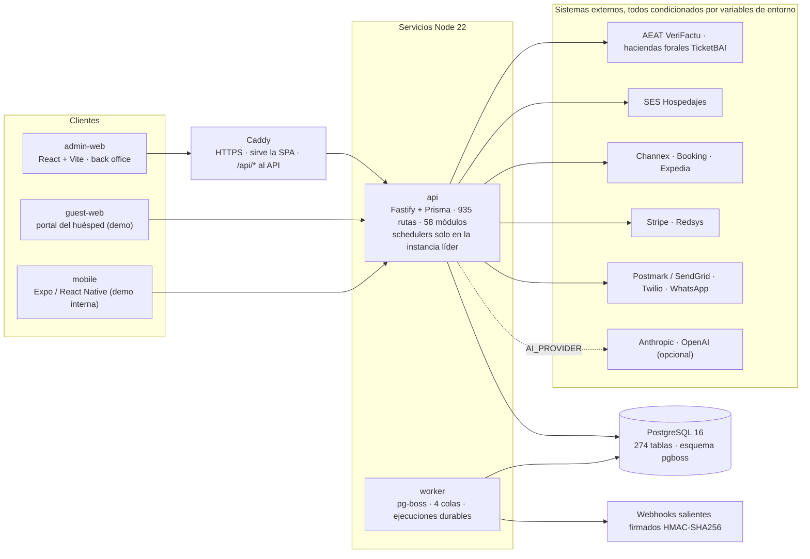

# ehotelOS

## Summary (English)

- **What it is.** ehotelOS is a property management system (PMS) and ERP for Spanish hotel groups: one legal entity with several hotels, run from a single back office.
- **Domains.** Front desk (priority queue, live timeline, bulk reservation import from CSV/XLSX), operations (housekeeping, maintenance, point of sale with persisted cash closure), distribution and revenue (rate plans, Rate Grid v2 with a channel outbox, cancellation policies, explainable pricing recommendations that never apply without approval).
- **Finance.** Invoicing with VeriFactu fingerprint and QR, double-entry ledger on the Spanish SME chart of accounts (PGC de Pymes), treasury, bank reconciliation with CSB-43 statements and SEPA files, imported labour cost, USALI statements, AEAT forms 303/390/347/111/115/180.
- **Compliance.** SES Hospedajes guest register, GDPR requests, TicketBAI for the Basque and Navarre territories, IGIC for the Canary Islands, tourist tax by region.
- **Access control.** By department, level and scope (hotel, group, legal entity, organization), with 24 role templates, segregation of duties and maker/checker approvals.
- **Governed AI.** AI interprets and proposes, typed tools execute, sensitive actions wait for human confirmation, and everything lands in a hash-chained audit trail. Without an LLM provider configured, every AI surface falls back to rules and says so on screen.
- **Stack.** A pnpm monorepo: a Fastify + Prisma + PostgreSQL API, a React + Vite back office, a pg-boss worker with durable job runs, and a design system of its own, Cocoa 22.
- **Key limitation.** No external service (LLM, payment gateway, OTA channels, tax authorities, messaging) is connected by default; each one is enabled by environment variables and, until then, behaves as a simulated or explicitly disabled integration.

The rest of this README is in Spanish.

---

PMS + ERP para grupos hoteleros españoles: una sociedad con varios hoteles gestionada desde un único back office, con contabilidad PGC de Pymes, fiscalidad española, registro de viajeros, USALI por departamento, control de acceso por departamento y nivel e inteligencia artificial gobernada.

Este documento describe el código tal como está en el commit `99dc3c3` (18 de septiembre de 2026). `main` ya incluye la Tanda L3 · Dinero y fiscal (`f54ea32`) y el importador Sage 200 en formato real (`776782a`); el apartado 5 lo refleja. El apartado 5 separa con claridad lo que está operativo de lo que es diseño o está en construcción. El código vive en [`hotelos/`](hotelos/): `hotelos/` y el prefijo `@hotelos/` son los nombres técnicos del workspace y de los paquetes; la marca del producto es ehotelOS. La guía de instalación en servidor es [`hotelos/deploy/README-INSTALL.md`](hotelos/deploy/README-INSTALL.md).

## 1. Qué es ehotelOS

Regla de producto, presente desde el primer commit y aplicada en el código:

> La IA interpreta, propone y orquesta. Las herramientas del backend ejecutan. Las personas aprueban las acciones sensibles. Todo queda registrado.

| Pilar | Qué significa en el producto |
|---|---|
| Grupo hotelero | Organización → Sociedad (datos fiscales, régimen SII, variante PGC) → Centro de trabajo (hotel, oficina u otro). Instalaciones VeriFactu inmutables por centro y series de facturación por sociedad. |
| Back office único | 9 categorías de menú (Hoy · Recepción · Operaciones · Comercial · Revenue · Finanzas · Cumplimiento · Informes · Configuración), 68 ítems y 101 pestañas generados desde un árbol único; cada entrada declara los roles y los módulos que la muestran u ocultan. |
| Contabilidad PGC de Pymes | Motor único de asientos (suma del debe = suma del haber al céntimo, numeración por ejercicio, idempotencia por documento origen), plan hotelero de 239 cuentas provisionable, ejercicios y periodos con cierre (regularización + cierre + apertura) y reapertura por reverso: nada se borra. |
| Fiscalidad española | VeriFactu (alta y anulación, huella encadenada por instalación, QR en la factura), TicketBAI (Bizkaia, Gipuzkoa, Álava, Navarra), IGIC e IPSI en el catálogo de tipos por región, modelos 303, 390, 347, 111, 115 y 180, libros y liquidación de IVA, tasa turística por comunidad autónoma. |
| Registro de viajeros | Partes de entrada según el RD 933/2021 y conector SES Hospedajes con altas, modificaciones y bajas derivadas, plazo de 24 h y retención de 3 años. La imagen del documento de identidad nunca se almacena. |
| USALI | Undécima edición con mapeo por organización, cobertura, cuenta de explotación por departamento, comparativa y ratios por habitación disponible y ocupada; cuentas anuales PGC de Pymes (balance, PyG, ECPN, memoria) con instantáneas descargables. |
| Acceso por departamento | 250 claves de permiso, 24 plantillas de rol, 7 niveles, 4 ámbitos (hotel, grupo, sociedad, organización), 34 pares de separación de funciones, aprobaciones maker/checker con umbrales por sociedad, PIN de supervisor y cuentas de emergencia (break glass) con sesión de 4 h. Una sola decisión de acceso compartida por API, menú y router. |
| IA gobernada | Catálogo de herramientas tipadas, políticas y versiones de prompt persistidas, confirmación humana (HITL) para acciones de riesgo, registro de cada llamada a herramienta y auditoría encadenada. Sin proveedor LLM, el sistema responde con reglas y lo declara en pantalla. |
| Cocoa 22 | Sistema de diseño propio: 40 primitivas, un solo acento, tipografía Inter, ritmo de 4 pt, tokens sin literales de color, estados vacío/error/carga/degradado explícitos y un contrato automático cuya lista de excepciones solo puede decrecer. |

## 2. Funcionalidades por dominio

Las nueve categorías siguen el menú del back office. Las rutas son las del navegador; una pantalla solo aparece si el rol y el módulo lo permiten.

### Hoy

| Pantalla | Ruta | Qué hace |
|---|---|---|
| Mi día | `/hoy` | Cola priorizada de recepción: llegadas, salidas, alojados, llegadas sin asignar, walk-ins y habitaciones fuera de servicio; check-in guiado y check-out desde el panel. Pestañas por rol: Operaciones (vista consolidada entre departamentos), Dirección (cuadro de mando del director, canon visual de Cocoa 22) y Propietario (valor de cartera, KPIs y alertas en una página). |
| Asistente ehotelOS | `/asistente` | Chat sobre los datos del PMS con catálogo de herramientas tipadas de lectura; enrutador determinista por reglas y tool-calling con LLM cuando hay proveedor configurado. |
| Turno · Cierre del día | `/hoy/turno` · `/hoy/cierre-del-dia` | Vista del jefe de recepción y cierre nocturno guiado en 8 pasos: folios abiertos, instantánea de habitaciones, cargo de alojamiento idempotente por fecha de negocio, no-shows, instantánea de ingresos, resumen de cobros, cierres de caja del día y avance de la fecha de negocio. |
| Pendientes de aprobación | `/hoy/pendientes` | Bandeja maker/checker de 10 tipos de solicitud (ajustes de folio, reembolsos, descuentos, anulaciones, reapertura de día, cambios de tarifa, facturas de proveedor, pedidos, nóminas e inversiones) con umbrales por importe para 11 acciones (las anteriores más la exportación contable) y caducidad a 7 días. |
| Informe IA del día · Pendientes de la IA | `/hoy/informe-ia` · `/hoy/pendientes-ia` | Resumen en lenguaje llano para dirección y propiedad, y cola de revisión humana de acciones de IA de alto riesgo o baja confianza. |

### Recepción

| Pantalla | Ruta | Qué hace |
|---|---|---|
| Reservas | `/recepcion/reservas` | Lista con filtros y estados; Cronograma (calendario por habitación con ventanas de 7, 14 y 30 días, filtros por estado y canal, tarjeta rápida y acciones: check-in/out, cancelar, no-show y asignar; el arrastre para mover y redimensionar estancias está en construcción en la pantalla Live Timeline, ver §5); tablero de habitaciones; detalle con folio y actividad; recorrido del huésped; Importar (asistente de 4 pasos CSV/XLSX con previsualización, resultado por fila y lote reversible identificado por hash; límites 5 MiB / 5.000 filas / 200 columnas). |
| Nueva reserva | `/recepcion/reservas/nueva` | Alta manual (fechas, tipo, plan, titular, garantía) y pestaña Dictar (IA) que produce un borrador revisable. |
| Huéspedes | `/recepcion/huespedes` | Listado, ficha y cronología; los datos personales se guardan cifrados (AES-256-GCM) con hashes de búsqueda. |
| Mensajes de huéspedes | `/recepcion/mensajes` | Bandeja de mensajería y conserjería con KPIs y aviso explícito cuando responde la IA. |
| Grupos y eventos | `/recepcion/grupos` | Grupos con bloqueo de habitaciones, fecha límite, rooming list y eventos; calendario Gantt con liberación automática al vencer; cupos de turoperadores con comisión y liberación diaria de los vencidos. |

### Operaciones

| Pantalla | Ruta | Qué hace |
|---|---|---|
| Pisos | `/operaciones/pisos` | Tablero de limpieza priorizado por salida prevista, asignación e inspección; vista táctil «Mi turno» para el personal. |
| Mantenimiento | `/operaciones/mantenimiento` | Partes de avería: crear, asignar técnico, bloquear habitación, resolver, cerrar y adjuntar evidencia fotográfica; vista táctil del técnico. |
| Punto de venta | `/operaciones/tpv` | Comandas por outlet, cartas (restaurante, bar, room service, spa), existencias en vivo y cierre de caja: el cierre del ticket ocurre en una sola transacción (a habitación → líneas de folio por grupo de IVA; efectivo o tarjeta → factura simplificada de serie propia hasta 400 € más asiento), arqueo reproducible y cierres de caja persistidos con aprobación. |
| Personal y turnos · Seguridad e incidentes · Compras e inventario | `/operaciones/personal` · `/operaciones/seguridad` · `/operaciones/compras` | Cuadrantes y turnos, registro de incidentes, pedidos de compra e inventario (lectura). Corren sobre el motor genérico de módulos avanzados y solo aparecen con su módulo activado. |
| Activos · Energía y agua | `/operaciones/activos` · `/operaciones/energia` | Dashboards de activos (garantías, certificados, conservación) y de consumos. |

### Comercial

| Pantalla | Ruta | Qué hace |
|---|---|---|
| Clientes y fidelización | `/comercial/clientes` | CRM, segmentos, fidelización, programa y campañas. |
| Reputación y calidad | `/comercial/reputacion` | Reseñas, encuestas y casos de calidad sobre datos propios (los conectores de portales de reseñas son diseño, ver §5). |
| Ventas adicionales | `/comercial/ventas-adicionales` | Upsells, catálogo de ofertas (upgrade, early check-in, late check-out, parking…) y ajustes del portal del huésped (marca, idiomas, ventanas de pre-check-in y check-out). |
| Ventas a empresas | `/comercial/ventas-empresas` | Pipeline B2B de cuentas y oportunidades. |
| Canales de venta | `/comercial/canales` | Hub de canales: estado por canal, monitor de paridad de precios (alertas a partir del 3 %), log de entregas del outbox y correspondencias de tipos y planes a los códigos de cada canal. |

### Revenue

| Pantalla | Ruta | Qué hace |
|---|---|---|
| Panel de revenue | `/revenue` | Señales calculadas solo desde reservas reales (noches a 30 días, ritmo a 90, captación a 7 días, precisión de la previsión) y recomendaciones pendientes. |
| Parrilla de tarifas | `/revenue/parrilla` | Rate Grid v2: precios y restricciones por día y tipo, actualización masiva en una sola transacción por propiedad con concurrencia optimista por celda, journal con revert, envío al outbox de canales y planes derivados de un nivel. |
| Planes de tarifas · Políticas de cancelación | `/revenue/planes` · `/revenue/politicas-cancelacion` | Planes con derivación validada; ventana de cancelación gratuita, penalización (primera noche, porcentaje, importe fijo, estancia completa o ninguna) y no-show. |
| Reglas y recomendaciones | `/revenue/reglas` | Recomendaciones de precio explicables por día y tipo; devuelven parches y nada se aplica sin aprobación. |
| Histórico y previsión · Comparativa · Reunión de revenue · Calendario de demanda | `/revenue/historico-prevision` … | Cuadro histórico/forecast hasta 190 días con informe diario y explorador, comparativa de KPIs entre periodos, pack de la reunión semanal en una pantalla y calendario de demanda. |
| Competencia | `/revenue/competencia` | Rate shopper con proveedor determinista etiquetado como tal (no hay scraper real). |

### Finanzas

| Pantalla | Ruta | Qué hace |
|---|---|---|
| Facturación y cobros | `/finanzas/facturacion` | Folios, borradores con categoría fiscal, emisión por serie de la sociedad, huella VeriFactu y QR, PDF generado desde la instantánea congelada, envío por correo, anulación y rectificativas; reglas que enrutan cargos al folio de empresa o agencia; cobros idempotentes (efectivo, datáfono y transferencia capturan en el acto; tarjeta en línea y enlaces de pago solo a través de un PSP). |
| Tesorería | `/finanzas/tesoreria` | Posición calculada desde el libro y los extractos, cobros y pagos pendientes, previsión 0-30/31-60/61-90/>90 días y tipos de cambio. |
| Conciliación bancaria | `/finanzas/conciliacion` | Extractos CSB-43 / Norma 43 con deduplicación, sugerencias por importe, fecha y referencia, auto-conciliación de confianza alta y media, deshacer que revierte el asiento; remesas SEPA Norma 19 (adeudos) y Norma 34 (transferencias). |
| Contabilidad | `/finanzas/contabilidad` | Diario, mayor, plan de cuentas, ajustes, cierre de ejercicio, exportación a gestoría (CSV universal, libros de IVA, formato compatible ContaPlus/Sage 50) e importación desde Sage 200 (plan, ejercicios, diario, libros de IVA, terceros y saldos; idempotente por hash del fichero; reconciliación con tolerancias contra sumas y saldos). |
| Estados contables | `/finanzas/estados-contables` | Sumas y saldos, balance de situación, pérdidas y ganancias, flujos de efectivo, cuentas anuales PGC de Pymes con instantáneas y USALI 11.ª con cobertura, comparativa y ratios. |
| Proveedores y gastos | `/finanzas/proveedores` | Facturas recibidas por líneas con separación de funciones (registrar, aprobar y pagar son personas distintas), gastos, directorio de proveedores con NIF e IBAN validados e inmovilizado con amortización mensual sin huecos (tablas del art. 12 LIS). |
| Comisiones · Nóminas | `/finanzas/comisiones` · `/finanzas/nominas` | Devengo, liquidación y reverso de comisiones de canal y agencia; periodos de nómina (RRHH calcula, dirección aprueba, finanzas paga) y coste de personal importado agregado por centro, mes, grupo y departamento (nunca por persona) con su línea USALI de coste laboral. |

### Cumplimiento

| Pantalla | Ruta | Qué hace |
|---|---|---|
| Bandeja · Centro de cumplimiento | `/cumplimiento/bandeja` · `/cumplimiento/centro` | Tareas y alertas; matriz de controles con semáforo (VeriFactu, SES, TicketBAI, IGIC, RGPD), archivo documental (vault), filtro por comunidad autónoma y carpeta de inspección. |
| VeriFactu · Envíos a autoridades | `/cumplimiento/verifactu` · `/cumplimiento/envios` | Registros de alta y anulación, errores, reintentos y auditoría; TicketBAI por territorio foral; historial de envíos a AEAT, haciendas forales y SES. |
| Modelos AEAT | `/cumplimiento/modelos-aeat` | 303 (desde los libros de IVA, con cotejo contra el diario), 390, 347 (umbral 3.005,06 €), 111, 115 y 180; libros de IVA y liquidación; PDF del modelo; presentación manual, sin fichero BOE. |
| Impuestos | `/cumplimiento/impuestos` | Tipos IVA/IGIC/IPSI por concepto de folio con vigencia (la facturación se bloquea si faltan) y tasa turística por comunidad autónoma con informe trimestral. |
| Registro de viajeros | `/cumplimiento/registro-viajeros` | Partes de entrada, conector SES Hospedajes, enrutamiento a autoridades y política de conservación. |
| Protección de datos · Sostenibilidad | `/cumplimiento/proteccion-datos` · `/cumplimiento/sostenibilidad` | Solicitudes RGPD (acceso, supresión, rectificación, portabilidad) con plazo de 30 días y supresión que seudonimiza, borra o retiene por obligación legal; dashboard e informe ESRS (CSRD). |

### Informes

| Pantalla | Ruta | Qué hace |
|---|---|---|
| Centro de informes | `/informes` | Catálogo de informes (PDF, CSV, XLSX, JSON) y exportaciones de revenue bajo demanda. |
| Analítica · Rentabilidad por habitación · Cartera de propiedades · Rendimiento de canales | `/informes/analitica` … | Analítica del módulo de inteligencia, rentabilidad por habitación, portfolio multi-hotel con detalle por propiedad y rendimiento de canales. |

### Configuración

| Pantalla | Ruta | Qué hace |
|---|---|---|
| Puesta en marcha | `/configuracion/puesta-en-marcha` | Hub único de configuración con lista de comprobación de preparación (readiness) real, puesta en producción (go-live) e importación de la estructura desde documentos. |
| Propiedad · Habitaciones y espacios | `/configuracion/propiedad` · `/configuracion/habitaciones` | Perfil, edificios, plantas, zonas, departamentos, categorías y campos personalizados; habitaciones, tipos, espacios y recursos. |
| Estructura societaria | `/configuracion/estructura-societaria` | Sociedad (datos fiscales, régimen, variante PGC), centros, series e instalaciones VeriFactu, IVA y ejercicio, reparto corporativo (solo informativo, nunca genera asiento). Cambiar NIF, razón social o régimen es una acción de alto riesgo con confirmación explícita. |
| Usuarios y roles | `/configuracion/usuarios` | Invitación con ámbito, cambio de rol, hoteles y grupos por usuario, comparador de plantillas; 24 plantillas (22 provisionadas por organización, más administración de sistema y emergencia). |
| Comunicaciones · Facturación y pagos | `/configuracion/comunicaciones` · `/configuracion/facturacion-pagos` | Plantillas y envíos, correo entrante convertido en reservas; ajustes de facturación y adaptadores de pago (Redsys y Stripe). |
| Contabilidad y fiscal | `/configuracion/contabilidad-fiscal` | País, región fiscal, foral, tasa turística, conectores SES/VeriFactu/TicketBAI, datos del establecimiento y categorías de ingresos. |
| Módulos e integraciones | `/configuracion/modulos` | Gestor de 33 módulos con dependencias (9 activos por defecto; solo el núcleo PMS no se puede desactivar), salud, marketplace de integraciones y OPERA Cloud en modo sombra (perfil, cortes diarios, alertas, reconciliación; el fichero de origen nunca se persiste). |
| Inteligencia artificial | `/configuracion/ia` | Ajustes, catálogo de herramientas, actividad del pipeline y gobernanza (políticas, versiones de prompt, evaluaciones, incidentes y coste). |
| Sistema | `/configuracion/sistema` | Visor de auditoría con verificación de integridad de la cadena SHA-256, webhooks firmados, aplicaciones OAuth2, referencia de API generada del manifiesto de rutas y consola de organizaciones. |

Sin capturas por ahora; las pantallas se recorren con el dataset de demo del apartado 6.

## 3. Arquitectura



### Monorepo pnpm

| Workspace | Paquete | Qué es |
|---|---|---|
| `apps/api` | `@hotelos/api` | Fastify 5 + Prisma 6 + zod + Sentry. 58 módulos de dominio y 935 rutas registradas contra un manifiesto de permisos por ruta (nivel de riesgo público, autenticado, bajo, medio, alto o crítico) que un test de contrato mantiene igual al servidor. 20 CLI (`rbac:sync`, `reservations:import`, `sage200:import`, `pms-shadow:pull`, `payroll:import-cost`, `accounting:*`, `demo:refresh`…). Runtime oficial `node --import tsx`, sin `dist`. |
| `apps/admin-web` | `@hotelos/admin-web` | React 19 + Vite 6. 226 pantallas Cocoa 22 (93.251 líneas), búsqueda global, ayuda integrada (primeros pasos, glosario, atajos, cumplimiento español, resolución de problemas) y 9 guías por persona. |
| `apps/worker` | `@hotelos/worker` | pg-boss 10 sobre el mismo PostgreSQL. Exactamente 4 colas (`notifications.scheduled`, `notifications.retry`, `notifications.sending-sweep`, `webhooks.deliver`); cada ejecución escribe una fila `WorkerJobRun` con retención de 7 días, consultable desde el API. |
| `apps/guest-web` | `@hotelos/guest-web` | Portal del huésped React + Vite: acceso por enlace, resumen de estancia, pre-check-in y solicitudes de servicio. Demo interna (ver §5). |
| `apps/mobile` | `@hotelos/mobile` | Expo 53 / React Native 0.79 con pestañas Hoy, Timeline, IA, Operaciones y Más y flujo de check-in por IA (escaneo, revisión OCR, cruce con la reserva, firma). Demo interna (ver §5). |
| `packages/*` | `shared` · `database` · `compliance` · `product` · `revenue` · `ai-tools` · `integrations` · `ui` · `config` · `onboarding` | Permisos y tipos RBAC (`shared`); esquema Prisma con 274 modelos, 38 enums y 14 migraciones versionadas más los seeds (`database`); constructores VeriFactu, TicketBAI, SES y políticas de retención (`compliance`); manifiesto de 33 módulos y navegación móvil (`product`); agregador del cuadro histórico y previsión (History & Forecast) (`revenue`); contratos de herramientas IA (`ai-tools`). |

### Decisiones que atraviesan todo el sistema

- **Multi-tenencia por organización y ámbito.** Organización → Sociedad → Centro; las asignaciones de rol llevan ámbito `property`, `property_group`, `legal_entity` u `organization`, y la revocación es una actualización, nunca un borrado. La decisión de acceso es una sola función compartida por el API, el menú y el router del front; `RBAC_STRICT` cierra por defecto en producción.
- **Persistencia Prisma-first (Tanda L2).** El motor genérico de módulos avanzados escribe en 25 tablas propias con validación zod estricta, máquina de estados y auditoría; las listas paginadas devuelven un sobre `{items, total, nextCursor}` al pedir `?cursor=` o `?envelope=1` (y siempre las cabeceras `X-Total-Count` / `X-Next-Cursor`); los KPIs marcan `degraded[]` cuando una fuente falla para que la interfaz muestre «—» y no un cero. Queda un espejo en memoria para algunos lectores heredados (`lib/demo-store.ts`), en retirada.
- **Auditoría encadenada.** `audit_events` y `event_stream` forman una cadena SHA-256 global (cada registro hashea su contenido más el hash anterior) con verificación de integridad por API. Limitación: la punta de la cadena vive en memoria por proceso, por lo que en producción escribe una sola instancia.
- **Dinero al céntimo.** Un único motor de asientos; cobros idempotentes por identificador de cliente; la captura de un pago en línea solo ocurre al recibir el webhook firmado del PSP; los reembolsos y las anulaciones son reversos, nunca borrados.
- **Schedulers y worker.** Los procesos periódicos del API (SES cada 5 min, reintentos y reconciliación VeriFactu, drenaje del outbox de canales, ritmo diario e instantánea del cierre nocturno, liberación de cupos, fecha límite de grupos, sondeo de buzones, OPERA sombra cada 15 min) corren solo en la instancia con `RUN_SCHEDULERS=true` y un lease en base de datos; el worker cubre webhooks y notificaciones con cron y reintentos con backoff.
- **Integraciones activadas por variables de entorno.** Canales OTA (adaptadores Booking OTA XML y Expedia EQC contra un simulador local; Channex como vía real, con Airbnb, Vrbo y Hotelbeds enrutados a través de Channex), PSP (Stripe, Redsys), correo (Postmark, SendGrid), SMS (Twilio), WhatsApp (Meta Cloud API) y LLM (Anthropic, OpenAI) existen en el código y se activan con credenciales; sin ellas el comportamiento es simulado en desarrollo y explícitamente deshabilitado en producción. Redis figura como reservado: hoy ningún código lo exige.

### Despliegue

`hotelos/deploy/` contiene la vía oficial y una secundaria. Oficial: PostgreSQL 16 y Caddy 2 nativos, unidades systemd para el API (`RUN_SCHEDULERS=true`, escucha solo en `127.0.0.1:3000`) y el worker, y Caddy sirviendo la SPA desde disco y reenviando `/api/*` al API como proxy inverso en el mismo origen. Scripts idempotentes `install-from-scratch.sh` (`--demo`, `--real`, `--adopt`), `deploy.sh` (pull → entorno → instalación → generación Prisma → copia de seguridad → adopción de baseline → migraciones y drift → build web → reinicio → smoke) y `smoke.sh`. Secundaria: `Dockerfile.api`, `Dockerfile.worker`, `Dockerfile.admin-web` y `docker-compose.production.yml`. El esquema solo cambia por migraciones versionadas; nunca `prisma db push` sobre una base compartida. La guía completa, con requisitos, variables por rol, adopción de un servidor existente, actualización, backup y qué no usar, es [`hotelos/deploy/README-INSTALL.md`](hotelos/deploy/README-INSTALL.md). La CI (`.github/workflows/ci.yml`) ejecuta typecheck, contratos, unitarios, integración con PostgreSQL 16, instalación desde cero con smoke, build del front, lint de shell e imágenes Docker; `deploy.yml` despliega por SSH de forma manual o tras una CI verde en `main`.

## 4. Calidad

Cada tanda de trabajo se cierra con implementación, verificación adversarial (API en vivo, navegador con usuarios de departamento, tests) e informe en `hotelos/docs/audits/`. Las puertas se ejecutan en el hook de pre-commit (`discoverability` + typecheck de todos los workspaces) y en la CI. Cifras a `99dc3c3`: las marcadas «ejecutado» se han reejecutado en este árbol; el resto son las del informe de cierre de la Tanda L2 ([TANDA-L2-PERSISTENCIA-2026-09-18.md](hotelos/docs/audits/TANDA-L2-PERSISTENCIA-2026-09-18.md)). Los resultados se dan en español: «superados», «fallidos» y «omitidos» corresponden a `pass`, `fail` y `skipped` de `node --test`.

| Puerta | Comando | Resultado |
|---|---|---|
| Typecheck de todos los workspaces | `pnpm typecheck:all` | 16 workspaces: 15 superados · 0 fallidos · 1 omitido explícito (`apps/guest-web`) — ejecutado |
| Contratos raíz (árbol de navegación, rutas ↔ manifiesto, Cocoa 22, seeds, entorno…) | `pnpm test` | 61 ficheros; 525 tests · 523 superados · 2 omitidos en este árbol (los dos exigen CSV de trabajo fuera del repositorio; 532/532 con ellos, informe L2) — ejecutado |
| Unitarios del API | `pnpm test:unit` | 165 ficheros; 2.244 tests · 2.243 superados · 1 omitido — ejecutado |
| Unitarios del front | `node --test` sobre `apps/admin-web/src/**/__tests__` | 97 ficheros; 1.219 tests · 1.218 superados · 1 omitido — ejecutado |
| Worker · paquete compliance | `pnpm --filter @hotelos/worker test` · `pnpm --filter @hotelos/compliance test` | 20/20 · 104 tests (103 superados · 1 omitido) — ejecutado |
| Integración (necesita PostgreSQL migrado) | `pnpm test:integration` | 46 suites; 633 tests · 626 superados · 0 fallidos · 7 omitidos conocidos — informe L2, no reejecutada para este documento |
| Contrato Cocoa 22 | `tests/cocoa-22-contract.test.mjs` + `node scripts/cocoa-22-inventory.mjs --summary` | 15 reglas (18 comprobaciones del contrato, 18/18); 226 pantallas · 0 botones ni inputs crudos · 2 tablas crudas · 0 literales de color · 193 puntos de deuda aceptada (`style={}` de layout contados a 0,25 y las 2 parrillas; lista de pantallas sin migrar vacía y techo de excepciones 0) · 0 olas pendientes — ejecutado |
| Discoverability | `pnpm discoverability:check` | 0 enlaces rotos · 24 alias · placeholders 16/20 — ejecutado |
| Árbol de navegación | `node scripts/build-nav-tree.mjs --check` | 68 ítems · 101 pestañas · 205 redirecciones heredadas (necesita el CSV de trabajo) — informe L2 |
| Acceso por rol × router | `node scripts/check-route-access.mjs` | 15 tokens de rol × 192 URL — ejecutado |
| Migraciones ↔ esquema | `pnpm db:migrations:check` · `pnpm db:migrate:status` · `pnpm db:drift:check` | 14 migraciones · 274 tablas / 38 enums — ejecutado; estado 14/14 y drift 0 — informe L2 |
| Instalación desde cero | `pnpm db:install:check` | Base temporal: migraciones → drift → seed → `rbac:sync` en seco → 274 tablas — informe L2 |
| Contrato de entorno | `pnpm validate:env .env.example` | 144 variables en 19 secciones — ejecutado |

En `main`, el informe de cierre de la Tanda L3 (`hotelos/docs/audits/TANDA-L3-DINERO-FISCAL-2026-09-18.md`, posterior a `99dc3c3`) recoge las puertas tras `f54ea32`: unitarios del API 2.302 (2.301 superados · 1 omitido), front 1.276/1.276, contratos raíz 532/532, integración 661 tests (654 superados · 7 omitidos conocidos, 49 ficheros), migraciones 15/15 con drift 0, Cocoa 226 pantallas · 193 puntos · contrato 18/18 y `rbac:sync` 250 · +0. Son cifras del informe L3, no reejecutadas para este documento.

Existen además 5 especificaciones Playwright en `apps/admin-web/e2e/` (login, check-in rápido, alta de reserva, cockpit de recepción, centro de cumplimiento); no forman parte todavía de las puertas de CI.

## 5. Estado y hoja de ruta

### Operativo hoy (cerrado con informe)

| Bloque | Qué incluye | Informe |
|---|---|---|
| Tandas 0-4 | Seguridad multi-tenant, recepción y dinero fiables, cumplimiento sin atrezzo, baseline única de migraciones y contrato de entorno | [AUDITORIA-360-2026-09-13.md](hotelos/docs/audits/AUDITORIA-360-2026-09-13.md) |
| Rate Grid v2 | Parrilla, actualización masiva transaccional con journal y revert, planes derivados, outbox de canales con drenaje atómico, adaptadores Booking / Expedia / Channex contra simulador | [RATE-GRID-V2-CIERRE-2026-09-15.md](hotelos/docs/audits/RATE-GRID-V2-CIERRE-2026-09-15.md) |
| Tanda 5 · L1 navegación | Árbol de 9 categorías, gating por rol y módulo, búsqueda global, glosario en español | runbook [navegacion-tanda-5.md](hotelos/docs/runbooks/navegacion-tanda-5.md) |
| Tanda 6 · Finanzas | PGC de Pymes, diario/mayor/plan/ajustes/cierre, libros y modelos de IVA, facturación con PDF y QR VeriFactu, cobros por PSP, TPV con cierre de caja, cierre nocturno, proveedores, inmovilizado, tesorería CSB-43 y SEPA, comisiones, USALI, cuentas anuales, exportación a gestoría | [TANDA-6-FINANZAS-BACKEND-2026-09-15.md](hotelos/docs/audits/TANDA-6-FINANZAS-BACKEND-2026-09-15.md) y [TANDA-6-FINANZAS-FRONT-2026-09-16.md](hotelos/docs/audits/TANDA-6-FINANZAS-FRONT-2026-09-16.md) |
| Tanda 6b · Estructura societaria | Organización → Sociedad → Centro, instalaciones VeriFactu, series por sociedad, selector de ámbito | [TANDA-6B-ESTRUCTURA-BACKEND-2026-09-16.md](hotelos/docs/audits/TANDA-6B-ESTRUCTURA-BACKEND-2026-09-16.md) y [TANDA-6B-ESTRUCTURA-FRONT-2026-09-16.md](hotelos/docs/audits/TANDA-6B-ESTRUCTURA-FRONT-2026-09-16.md) |
| Tanda 6c · Coste de personal | Nómina agregada importada → asientos y línea USALI por centro de coste | [TANDA-6C-COSTE-PERSONAL-2026-09-16.md](hotelos/docs/audits/TANDA-6C-COSTE-PERSONAL-2026-09-16.md) |
| Tanda 7 · 7b · 7c | Importación masiva de reservas CSV/XLSX; OPERA Cloud en modo sombra; importación Sage 200 con reconciliación (en `main`, formato real confirmado en `776782a`) | [TANDA-7-RESERVAS-IMPORT-2026-09-16.md](hotelos/docs/audits/TANDA-7-RESERVAS-IMPORT-2026-09-16.md), [TANDA-7B-OPERA-MODO-SOMBRA-2026-09-17.md](hotelos/docs/audits/TANDA-7B-OPERA-MODO-SOMBRA-2026-09-17.md) y [TANDA-7C-SAGE200-2026-09-17.md](hotelos/docs/audits/TANDA-7C-SAGE200-2026-09-17.md) |
| Tanda 8a · RBAC | 250 claves, 24 plantillas, ámbitos, separación de funciones, aprobaciones, PIN de supervisor, break glass | [TANDA-8A-RBAC-2026-09-18.md](hotelos/docs/audits/TANDA-8A-RBAC-2026-09-18.md) |
| Tanda L2 · Persistencia y API | Motor genérico Prisma-first, notificaciones/offline/HITL/setup persistidos, 82 rutas duplicadas y 18 tablas muertas retiradas, paginación, worker honesto | [TANDA-L2-PERSISTENCIA-2026-09-18.md](hotelos/docs/audits/TANDA-L2-PERSISTENCIA-2026-09-18.md) |
| Cocoa 22 y rebrand | Sistema de diseño migrado en olas hasta deuda heredada 0 (solo queda deuda aceptada por las reglas, ver §4); marca ehotelOS con fuente única y contrato | [COCOA-22.md](hotelos/docs/design/COCOA-22.md), [COCOA-22-MIGRACION.md](hotelos/docs/design/COCOA-22-MIGRACION.md) y [REBRAND-EHOTELOS-2026-09-17.md](hotelos/docs/audits/REBRAND-EHOTELOS-2026-09-17.md) |

### Diseñado o en construcción (y lo cerrado después de `99dc3c3`)

| Bloque | Estado a `99dc3c3` | Documento |
|---|---|---|
| L3 · Dinero y fiscal | Cerrada en `f54ea32` (posterior a `99dc3c3`, ya en `main`): precio desde tarifa al crear e importar, políticas de cancelación con penalización y cierre de folio, categoría fiscal inferida, Modelo 303 con libros importados sin doble cómputo, PDF de factura, cobro desde la reserva, TPV con estado y arqueo persistido | `hotelos/docs/audits/TANDA-L3-DINERO-FISCAL-2026-09-18.md` (en `main`) |
| Live Timeline | En construcción: pantalla nueva con Cocoa 22 que recupera el Live Timeline original (día/semana/mes, arrastrar para cambiar de habitación, mover o alargar la estancia con confirmación y deshacer, crear reserva desde celdas, alerta de overbooking, fila de disponibilidad, inspector con folio y actividad) y que será la primera entrada del menú para todos los perfiles; hoy existe el Cronograma sin arrastre | — |
| L4 · Grupos, eventos y CRM | Pendiente: folio maestro real, control de sobreventa del bloque, pipeline y CRM sobre Prisma | [TANDA-5-PLAN-2026-09-15.md](hotelos/docs/audits/TANDA-5-PLAN-2026-09-15.md) |
| L5 · Operaciones y puesta en marcha | En construcción: estado de habitación unificado, preparación (readiness) recalculada, puesta en producción (go-live) que cambia estado | [TANDA-5-PLAN-2026-09-15.md](hotelos/docs/audits/TANDA-5-PLAN-2026-09-15.md) |
| L6 · Núcleo de IA | En construcción (L6a): `packages/ai-core` (cliente propio sobre HTTP, sin SDK), ejecución real de herramientas con confirmación, un único asistente, enmascaramiento de datos personales antes de enviarlos al proveedor, presupuesto por propiedad | [TANDA-5-PLAN-2026-09-15.md](hotelos/docs/audits/TANDA-5-PLAN-2026-09-15.md) |
| L7 · Huésped y móvil · L8 · Integraciones honestas | Pendientes: sesión verificada en el portal, `AuthProvider` en móvil, proveedores reales en el worker, webhook de entrada de WhatsApp | [TANDA-5-PLAN-2026-09-15.md](hotelos/docs/audits/TANDA-5-PLAN-2026-09-15.md) |
| Reputación y reseñas (T8) | En construcción: bot diario de portales e índice de reputación; hoy existen reseñas y encuestas sobre datos propios | [REPUTACION-REVIEWS.md](hotelos/docs/design/REPUTACION-REVIEWS.md) |
| Documentos y digitalización (T9) | Solo diseño: facturas, albaranes y correspondencia con IA, contabilización y archivo | [DOCUMENTOS-DIGITALIZACION.md](hotelos/docs/design/DOCUMENTOS-DIGITALIZACION.md) |
| RRHH · plantilla, previsión y nómina | Solo diseño; hoy existen perfiles de personal, turnos y la nómina agregada de la Tanda 6c | [RRHH-PLANTILLA-NOMINA.md](hotelos/docs/design/RRHH-PLANTILLA-NOMINA.md) |
| Activo inmobiliario (T10) | Solo diseño: finca, tenencia, tributos, obras, inspecciones y seguros; hoy solo edificios, activos, inversiones e inmovilizado | [ASSET-MANAGEMENT-INMOBILIARIO.md](hotelos/docs/design/ASSET-MANAGEMENT-INMOBILIARIO.md) |
| Check-in automatizado con IA | Solo diseño: pre-llegada, asignación explicable, kiosco y recepcionista IA; hoy pre-check-in del portal y OCR del documento si hay LLM | [CHECKIN-AUTOMATIZADO-IA.md](hotelos/docs/design/CHECKIN-AUTOMATIZADO-IA.md) |
| Panel de costes de dirección | Solo diseño; el panel del director operativo es el de `/hoy/direccion` más la posición de tesorería | [PANEL-COSTES-DIRECCION.md](hotelos/docs/design/PANEL-COSTES-DIRECCION.md) |

### Limitaciones actuales (verificables en el código)

| Área | Limitación |
|---|---|
| IA | Sin proveedor por defecto (`AI_PROVIDER` vacío): el asistente, el copiloto y la narrativa de cumplimiento responden con reglas y lo indican en pantalla; el OCR del documento de identidad se desactiva (`configured:false`) y la interfaz pide la entrada manual. Con clave, el API llama a Anthropic u OpenAI por HTTP directo, sin SDK y sin enmascarar ni anonimizar los datos personales antes de enviarlos. |
| Pagos | Sin PSP configurado, los cobros con tarjeta en línea y los enlaces de pago responden `409 PSP_NOT_CONFIGURED`; efectivo, datáfono y transferencia funcionan siempre. Stripe exige el secreto del webhook para capturar. |
| Fiscal | VeriFactu y SES Hospedajes arrancan en modo sandbox (stub local que responde `stub://`). TicketBAI arranca en `TBAI_MODE=sandbox`, que no es un stub: genera el XML y la cadena de huellas y deja la remisión en estado `submitting`, porque la cola `tbai.retry` que la enviaba se retiró en L2. Preproducción y producción de VeriFactu/SES exigen certificado y datos del sistema declarados; ninguno se ha ejercitado todavía contra los servicios reales. No existen los modelos 190, 200 ni 202; la presentación de los modelos es manual, sin fichero BOE. La exportación oficial A3 no está implementada. |
| Canales | `CHANNEL_MAX_MODE=sandbox` por defecto: nada sale a Internet; los adaptadores están validados contra un simulador estructural, no certificados. |
| Mensajería | Correo, SMS y WhatsApp envían de verdad solo con credenciales; los proveedores del worker siguen siendo stubs que marcan «enviado» sin enviar (pendiente de L8). No hay webhook de entrada de WhatsApp ni conectores de portales de reseñas. |
| Portal del huésped y móvil | `guest-web` acepta cualquier código y correo en esta vista previa, está en inglés y excluido del typecheck; `mobile` no monta su proveedor de autenticación y apunta a un API local fijo. Ambos son demo interna hasta L7. |
| Retención de datos | Existe el catálogo de 10 políticas de retención y el modelo persistido, pero no hay tarea de purga automática. |
| Plataforma | La punta de la cadena de auditoría vive en memoria por proceso (una sola instancia escritora). Las remesas SEPA se persisten como ejecuciones de trabajo, sin modelo propio. Los PDF y XLSX se generan con escritores propios sin librerías. |

## 6. Puesta en marcha para desarrolladores

Requisitos: Node 22.x (≥ 22.9, la versión de la CI, las imágenes y la guía de instalación), pnpm 9.15.0 vía corepack, PostgreSQL 16. Redis 7 es opcional (reservado; ningún código lo exige hoy). Todo se ejecuta desde `hotelos/`.

```sh
corepack enable && corepack prepare pnpm@9.15.0 --activate
cd hotelos
pnpm install                                   # nunca npm install ni pnpm install --prod
cp .env.example .env                           # rellena DATABASE_URL y JWT_SECRET (openssl rand -base64 48) y descomenta
                                               # ENCRYPTION_KEY (base64 de 32 bytes: openssl rand -base64 32;
                                               # opcional en desarrollo, obligatoria en producción)
pnpm validate:env .env
pnpm db:generate
pnpm db:migrate:deploy && pnpm db:drift:check  # el esquema solo cambia por migraciones
(cd packages/database && node --env-file=../../.env --import tsx prisma/seed.ts)   # organización y propiedad de demo
pnpm db:seed:commercial && pnpm db:seed:rbac-demo                                   # tarifas, reservas y usuarios de departamento ficticios
pnpm --filter @hotelos/api rbac:sync
pnpm dev:api        # http://localhost:3000
pnpm dev:web        # http://localhost:5173 (VITE_API_URL apunta por defecto a :3000)
pnpm --filter @hotelos/worker dev   # opcional: webhooks y notificaciones
```

Los seeds pasan por un guard que solo acepta los identificadores de demo; cualquier otro objetivo exige confirmación explícita. El usuario de demo que crea el seed tiene una credencial pública documentada en la guía de instalación: no lo uses en una instalación real, que se inicializa con `POST /onboarding/bootstrap` y un `BOOTSTRAP_TOKEN` de un solo uso. Puertas antes de un commit: `pnpm typecheck:all`, `pnpm test`, `pnpm test:unit`, `pnpm discoverability:check` y, con base de datos, `pnpm test:integration` y `pnpm db:install:check`; el hook se activa con `git config core.hooksPath .husky` y nunca se salta. Los seeds adicionales (`db:seed:snapshots`, `db:seed:compliance`, `db:seed:operations`, `db:seed:cancellation`, `db:seed:allotments`, `db:seed:fnb`) y el refresco del dataset (`demo:refresh`) están descritos en `hotelos/CLAUDE.md`. Instalación en servidor: [`hotelos/deploy/README-INSTALL.md`](hotelos/deploy/README-INSTALL.md).

## 7. Índice de documentación

| Carpeta | Contenido |
|---|---|
| [`hotelos/CLAUDE.md`](hotelos/CLAUDE.md) | Guía de trabajo del repositorio: producto, marca, áreas funcionales, sistema de calidad con el estado verificado de cada tanda, comandos, seeds, convenciones (código en inglés, interfaz y commits en español, conventional commits, hook obligatorio) y deuda técnica conocida. |
| [`hotelos/docs/design/`](hotelos/docs/design/) | Diseños. [`COCOA-22.md`](hotelos/docs/design/COCOA-22.md) y [`COCOA-22-MIGRACION.md`](hotelos/docs/design/COCOA-22-MIGRACION.md) (sistema de diseño y migración por olas, con inventario y API generados); construidos: `RBAC-DEPARTAMENTOS`, `FINANZAS-ESTRUCTURA-SOCIETARIA`, `FINANZAS-COSTE-PERSONAL`, `RESERVAS-IMPORTACION-MASIVA`, `OPERA-CLOUD-MODO-SOMBRA`, `FINANZAS-IMPORTACION-SAGE200`; solo diseño: `REPUTACION-REVIEWS`, `DOCUMENTOS-DIGITALIZACION`, `RRHH-PLANTILLA-NOMINA`, `ASSET-MANAGEMENT-INMOBILIARIO`, `CHECKIN-AUTOMATIZADO-IA`, `PANEL-COSTES-DIRECCION`; informes de olas en `olas/`. |
| [`hotelos/docs/runbooks/`](hotelos/docs/runbooks/) | Operación: accesos por departamento (RBAC), finanzas y contabilidad (PGC de Pymes + USALI), importación Sage 200, navegación, OPERA en modo sombra, alta de hotel y carga de histórico y previsión, Rate Grid v2, `rbac:sync`, importación masiva de reservas, actualización del servidor de demo. |
| [`hotelos/docs/audits/`](hotelos/docs/audits/) | Informes de cierre y verificación adversarial: auditoría 360 (Tandas 0-4), plan de la Tanda 5 (lotes L1-L8), Rate Grid v2, Tanda 6 (finanzas backend y front), 6b (estructura societaria), 6c (coste de personal), 7 (reservas), 7b (OPERA), 7c (Sage 200), 8a (RBAC), L2 (persistencia), L3 (dinero y fiscal, en `main`), rebrand, dataset de demo, discoverability y placeholders. |
| [`hotelos/docs/compliance/`](hotelos/docs/compliance/) | Impuestos indirectos en España 2026 y declaración responsable VeriFactu. |
| [`hotelos/docs/api-contracts.md`](hotelos/docs/api-contracts.md) | Contratos del API: permisos por ruta, sobres de paginación, códigos de error. |
| [`hotelos/deploy/README-INSTALL.md`](hotelos/deploy/README-INSTALL.md) | Guía única de instalación, adopción, actualización, smoke, backup y modo demo frente a modo real. |
