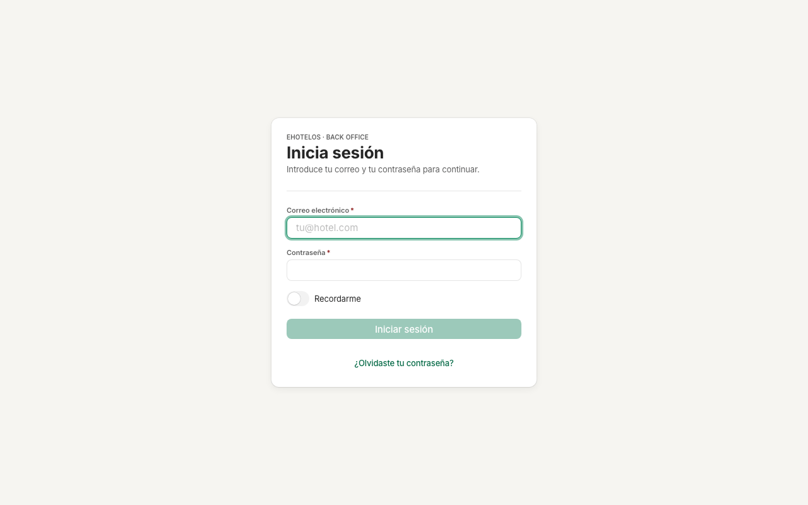
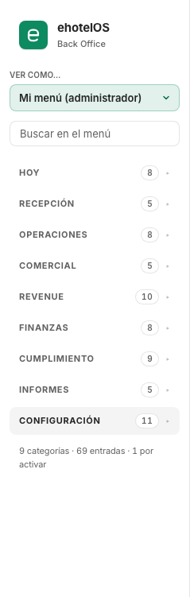
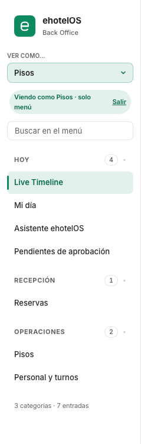
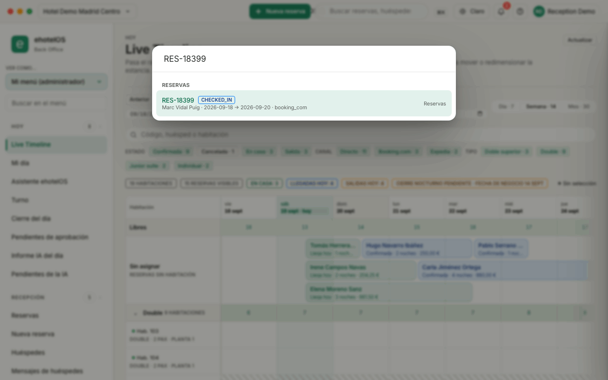
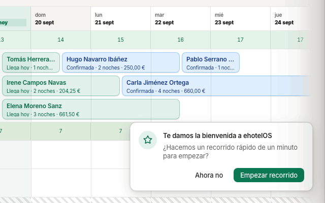

# Primeros pasos · ehotelOS

Esta guía te enseña lo que necesitas el primer día con ehotelOS, sea cual sea tu puesto: cómo entrar, cómo está organizada la pantalla, cómo buscar cualquier cosa con ⌘K, qué es el Live Timeline, cómo cambiar de hotel, dónde está la ayuda, qué te avisa la campana y qué significan los estados de una reserva y de una habitación. Cuando termines, sigue con la guía de tu perfil (las tienes al final, en «Ver también»).

## Para quién

Para todo el personal del hotel, antes de abrir la guía de su perfil. Necesitas tres cosas: la dirección de tu ehotelOS (en la demostración es `http://localhost:5173`), un usuario con contraseña y un navegador actual (Chrome, Edge, Safari o Firefox). El usuario y la contraseña los crea la persona que administra ehotelOS en tu hotel o en el grupo (dirección o administración de sistema): pídeselos si no los tienes; cómo se dan de alta se explica en [60 · Sistemas](60-sistemas.md).

## Cómo están hechas las capturas

- Todas las capturas son del hotel de demostración «Hotel Demo Madrid Centro» (organización «Grupo Hotelero Demo»), con la cuenta de demostración `reception@example.com` / `hotelos-demo`. Los huéspedes, reservas, empresas y avisos que ves son ficticios.
- Esa cuenta es administradora: su menú es «Mi menú (administrador)», con «9 categorías · 69 entradas · 1 por activar». Tu menú tendrá menos entradas: verás solo lo que corresponde a tu plantilla de usuario.
- Dos capturas usan el selector «Ver como…» para enseñarte lo que ve otro perfil; lo reconoces por el aviso «Viendo como Pisos · solo menú» o «Viendo como RRHH y nóminas · solo menú». Ese selector solo cambia el menú, no los permisos (lo explica el apartado 3).
- Tema claro, ventana de 1280 × 800 píxeles, español. En la captura de la pantalla completa se ha dejado a la vista el aviso «Falta 1 comprobación para poner la propiedad en marcha.» porque en la demostración está siempre; en el resto está oculto con «Ahora no».
- Las capturas son del 19 de septiembre de 2026. La demostración tiene la fecha de negocio en el 14 de septiembre (sin cierres del día desde entonces), por eso el Live Timeline muestra «Cierre nocturno pendiente · fecha de negocio 14 sept». Es un estado de la demo, no un error tuyo.

## 1. Entrar en ehotelOS

Ruta: pantalla pública «Inicia sesión» (`/acceso`). Si abres cualquier dirección de ehotelOS sin haber entrado, verás esta pantalla.

*Pantalla de acceso: no hay nada más que rellenar.*

1. Abre la dirección de tu ehotelOS en el navegador. Aparece la tarjeta «Inicia sesión» con el texto «Introduce tu correo y tu contraseña para continuar.».
2. Escribe tu «Correo electrónico» (el que te dieron al darte de alta) y tu «Contraseña». Los dos campos son obligatorios.
3. Si trabajas siempre en el mismo ordenador, activa «Recordarme»: la próxima vez el correo vendrá ya escrito. La contraseña no se guarda nunca.
4. Haz clic en «Iniciar sesión».

**Resultado esperado.** Entras en tu página de inicio, que depende de tu perfil (recepción y dirección aterrizan en «Mi día»; otros perfiles, en su pantalla principal: lo detalla la guía de cada perfil). Arriba a la izquierda ves el nombre de tu hotel y arriba a la derecha tu nombre.

**Si algo falla.**

- «No se pudo iniciar sesión · Email o contraseña incorrectos.»: revisa mayúsculas y espacios. Si no recuerdas la contraseña, haz clic en «¿Olvidaste tu contraseña?»: pasas a la pantalla «Recuperar contraseña» (`/acceso/recuperar-contrasena`), que dice «Indica el email de tu cuenta y te enviaremos un enlace para elegir una contraseña nueva.». Escribe tu correo y pulsa «Enviar enlace de recuperación»; con «Volver a iniciar sesión» regresas a la pantalla de acceso.
- Si repites muchos intentos seguidos, ehotelOS te frena con «Demasiadas peticiones. Reintenta en unos segundos.»: espera un minuto y vuelve a probar.
- Tu sesión caduca sola pasado un tiempo o si cierras el navegador sin «Recordarme». Cuando caduca, ehotelOS te vuelve a enseñar «Inicia sesión» en la misma dirección en la que estabas; entra de nuevo y sigues donde lo dejaste.
- Cuando termines el turno en un ordenador compartido, cierra la sesión: haz clic en tu nombre (arriba a la derecha, botón «Menú de usuario») y después en «Cerrar sesión».

> **En construcción:** en la demostración no hay correo saliente configurado, así que el enlace de «Recuperar contraseña» no llega. Si te pasa en tu hotel, pide a quien administra el sistema que te restablezca la contraseña ([60 · Sistemas](60-sistemas.md)).

## 2. La pantalla

Ruta de la captura: «Menú › Hoy › Live Timeline» (`/hoy/live-timeline`). Todas las pantallas de ehotelOS tienen la misma estructura: barra superior, menú lateral y área de contenido.

*La pantalla de ehotelOS con el Live Timeline abierto. El aviso amarillo de puesta en marcha es propio de la demostración.*

### Barra superior (de izquierda a derecha)

| Control | Qué es |
|---|---|
| **Nombre del hotel** («Hotel Demo Madrid Centro») | El hotel activo. Es un botón: abre la lista «Cambiar propiedad» para trabajar con otro hotel (apartado 6). Compruébalo siempre antes de un check-in o de una reserva. |
| **«+ Nueva reserva»** (botón verde) | Abre «Recepción › Nueva reserva» desde cualquier pantalla. Solo lo ven los perfiles que pueden crear reservas (recepción, dirección, comercial); RRHH, pisos o mantenimiento no lo tienen. |
| **Cuadro «Buscar reservas, huéspedes…»** y botón **«⌘K»** | La búsqueda global y los comandos de la pantalla (apartado 4). Al escribir en el cuadro o pulsar el botón «⌘K» («Abrir la búsqueda (⌘K)») se abre la paleta «Buscar en la aplicación». |
| **Botón del tema** («Claro») | «Cambiar tema (claro/oscuro)». Cada clic pasa de «Claro» a «Oscuro», de «Oscuro» a «Auto» (sigue el ajuste de tu sistema) y de «Auto» a «Claro». Se recuerda en ese navegador. |
| **Campana** («Avisos») | Los avisos que necesitan tu atención (apartado 8). El número rojo es la cantidad sin leer: en la demo, «Avisos (2 sin leer)». |
| **«?»** («Centro de ayuda») | Recorridos guiados, guía de tu puesto y artículos de ayuda (apartado 7). |
| **Tu nombre** («Menú de usuario») | Menú con «Mi PIN de supervisor» (un PIN de 4 a 8 dígitos con el que autorizas acciones de otros compañeros sin cederles tu sesión, si tu plantilla lo permite) y «Cerrar sesión». |

### Menú lateral

- Arriba, la marca «ehotelOS · Back Office». Es un botón («Ir a mi página de inicio»): te lleva a tu pantalla de inicio desde cualquier sitio.
- «Ver como…»: solo aparece si tu cuenta puede gestionar otros perfiles (apartado 3).
- «Buscar en el menú»: filtra las entradas del menú según escribes. Escribe «parrilla» y solo queda «Revenue › Parrilla de tarifas»; si nada coincide, el menú dice «Sin resultados · Ninguna entrada del menú coincide con «…».». Solo filtra el menú: para buscar reservas o huéspedes usa ⌘K.
- Las **categorías**, cada una con el número de entradas y una flecha (▾). Haz clic en el nombre de la categoría para plegarla (▸) o desplegarla; así puedes dejar a la vista solo las que uses.
- La entrada activa se marca en verde a la izquierda.
- Una entrada atenuada con el botón «Activar módulo» (en la demo, «Operaciones › Punto de venta») pertenece a un módulo que la propiedad no ha activado: al pasar el ratón lees «Módulo no activado: Esta función pertenece a un módulo que no está activo en la propiedad.». Solo la ven quienes pueden activar módulos; para el resto, la entrada no existe.
- Al pie, el recuento «N categorías · M entradas»: con la cuenta de demostración, «9 categorías · 69 entradas · 1 por activar». Es una forma rápida de saber qué menú tienes delante.

*Las nueve categorías plegadas, con el número de entradas de cada una para la cuenta de demostración.*

| Categoría | Para qué sirve | Entradas (cuenta de demo) |
|---|---|---|
| **Hoy** | Lo que pasa hoy: Live Timeline, Mi día, Asistente ehotelOS, Turno, Cierre del día, Pendientes de aprobación, Informe IA del día, Pendientes de la IA | 8 |
| **Recepción** | Reservas, Nueva reserva, Huéspedes, Mensajes de huéspedes, Grupos y eventos | 5 |
| **Operaciones** | Pisos, Mantenimiento, Punto de venta (por activar), Personal y turnos, Seguridad e incidentes, Compras e inventario, Activos, Energía y agua | 8 |
| **Comercial** | Clientes y fidelización, Reputación y calidad, Ventas adicionales, Ventas a empresas, Canales de venta | 5 |
| **Revenue** | Panel de revenue, Parrilla de tarifas, Planes de tarifas, Reglas y recomendaciones, Histórico y previsión, Comparativa, Reunión de revenue, Competencia, Calendario de demanda, Políticas de cancelación | 10 |
| **Finanzas** | Facturación y cobros, Tesorería, Conciliación bancaria, Contabilidad, Estados contables, Proveedores y gastos, Comisiones, Nóminas | 8 |
| **Cumplimiento** | Bandeja de cumplimiento, Centro de cumplimiento, VeriFactu, Envíos a autoridades, Modelos AEAT, Impuestos, Registro de viajeros, Protección de datos, Sostenibilidad | 9 |
| **Informes** | Centro de informes, Analítica, Rentabilidad por habitación, Cartera de propiedades, Rendimiento de canales | 5 |
| **Configuración** | Puesta en marcha, Propiedad, Estructura societaria, Habitaciones y espacios, Usuarios y roles, Comunicaciones, Facturación y pagos, Contabilidad y fiscal, Módulos e integraciones, Inteligencia artificial, Sistema | 11 |

### Área de contenido

Cada pantalla empieza con la categoría en pequeño («HOY»), el título («Live Timeline») y una frase que explica para qué sirve. Muchas tienen un botón «Actualizar» arriba a la derecha para recargar los datos sin salir. Algunas se dividen en pestañas (por ejemplo, «Reservas» tiene «Lista · Tablero de habitaciones · Detalle · Recorrido · Importar»): están justo debajo del título.

> **Nota:** el aviso «Falta 1 comprobación para poner la propiedad en marcha.», con los botones «Ver qué falta» y «Ahora no», aparece mientras la propiedad tenga comprobaciones de puesta en marcha pendientes. En la demostración es permanente (el registro de viajeros está en modo de pruebas); «Ahora no» lo oculta hasta que vuelvas a entrar. Qué falta y cómo resolverlo se explica en [10 · Dirección](10-direccion.md) y [60 · Sistemas](60-sistemas.md).

## 3. «Ver como…»: simular el menú de otro perfil

Ruta: selector «Ver como…» del menú lateral, disponible en cualquier pantalla.

Es un selector para quien administra ehotelOS o forma a otros: enseña el menú tal y como lo ve otra plantilla de usuario, sin cambiar de cuenta. Sirve para comprobar qué ve un compañero, para hacer capturas de formación o para seguir esta documentación desde la cuenta de demostración.

1. En el menú lateral, abre el selector «Ver como…». La primera opción es tu propio menú («Mi menú (administrador)» para la cuenta de demostración; «Mi menú» para el resto). Debajo, en este orden, los 14 **perfiles de menú** (vistas): **Administración de sistema · Dirección · Propiedad · Auditoría interna · Finanzas · RRHH y nóminas · Gestión del activo · Revenue · Comercial · Administración de hotel · Recepción · Punto de venta y F&B · Mantenimiento · Pisos**. Un perfil de menú agrupa varias plantillas de usuario que ven las mismas pantallas: «Dirección» reúne las tres plantillas de dirección y «Finanzas» las de contabilidad, dirección financiera y cumplimiento. La tabla de las plantillas está en [60 · Sistemas](60-sistemas.md#12-las-plantillas-que-puedes-invitar).
2. Elige una, por ejemplo «Pisos».

**Resultado esperado.** El menú se reduce al de ese perfil y aparece el aviso verde «Viendo como Pisos · solo menú» con el botón «Salir». El pie cambia a «3 categorías · 7 entradas». También cambian la lista de pantallas que ofrece ⌘K y tu página de inicio. Para volver a tu menú, haz clic en «Salir» o vuelve a elegir «Mi menú».

*El menú de Pisos simulado desde la cuenta de demostración.*

Ten en cuenta tres cosas:

- **No cambia tus permisos.** Ni te da ni te quita nada: solo cambia lo que se muestra. Por eso el aviso dice «solo menú».
- **Se pierde al recargar.** Si pulsas F5, escribes una dirección en el navegador o vuelves a entrar, regresas a tu menú. Mientras simulas, muévete por el menú o con ⌘K, no escribiendo direcciones.
- **Las pantallas fuera del menú simulado responden «Sin acceso».** Si mientras simulas «RRHH y nóminas» intentas abrir «Mi día» (`/hoy`), verás la pantalla «Sin acceso» con el texto «Tu perfil no tiene permiso para ver esta pantalla. Pide acceso a dirección.» y el botón «Ir a mi página de inicio». Es exactamente lo que ve un compañero con esa plantilla al abrir una dirección que no le corresponde.

*«Sin acceso»: la pantalla existe, pero no está en el menú de ese perfil.*

Hay una segunda pantalla parecida, «Módulo no activado», con el texto «Esta función pertenece a un módulo que no está activo en la propiedad.» y el botón «Activar módulo». La verás si abres una función de un módulo apagado, como «Operaciones › Punto de venta» (`/operaciones/tpv`) en la demostración. «Activar módulo» te lleva a «Menú › Configuración › Módulos e integraciones» con ese módulo preseleccionado; activar módulos es cosa de dirección o de administración de sistema ([60 · Sistemas](60-sistemas.md)).

## 4. Buscar cualquier cosa con ⌘K

Ruta: desde cualquier pantalla, pulsa **⌘K** (Ctrl+K en Windows y Linux), haz clic en el botón «⌘K» de la barra superior («Abrir la búsqueda (⌘K)») o empieza a escribir en el cuadro «Buscar reservas, huéspedes…».

1. Pulsa ⌘K. Se abre el diálogo «Buscar en la aplicación» con el cuadro «Buscar reserva, huésped, habitación, factura, pantalla o comando…». Antes de escribir, la lista «Resultados de búsqueda» empieza por la sección **«Esta pantalla»**, con los comandos de la pantalla en la que estás (en Mi día: «Actualizar recepción», «Walk-in», «Crear reserva», «Buscar por nombre o habitación» y «Abrir Live Timeline»; en el Live Timeline: «Actualizar Live Timeline», «Live Timeline: ir a hoy», «Nueva reserva desde el timeline», «Mover un día la reserva seleccionada» y «Mover un día antes la reserva seleccionada»); siguen las pantallas de tu menú agrupadas por categoría («Hoy», «Recepción»…) y, al final, las «Acciones»: «Abrir el centro de ayuda», «Ver avisos» y «Cambiar de propiedad».
2. Escribe al menos dos letras. Prueba con el código de una reserva de la demo, `RES-18399`: aparece el grupo «Reservas» con «RES-18399 · En el hotel · Marc Vidal Puig · 18 sept → 20 sept · Booking com» y, debajo, la acción «Cobrar RES-18399 · Acción». Escribe ahora el nombre, `Marc Vidal`: encuentras la misma reserva. Escribe `Parrilla`: aparecen las pantallas «Revenue › Parrilla de tarifas» y «Parrilla de tarifas · Historial».
3. Muévete con ↑ y ↓, abre el resultado (o ejecuta el comando) con Intro o con un clic, y cierra con Esc.

*La paleta ⌘K encuentra reservas por código o por nombre del huésped, pantallas por su nombre y los comandos de la pantalla en la que estás; el estado sale con el vocabulario de ehotelOS («En el hotel»).*

**Resultado esperado.** Con Intro sobre la reserva se abre su detalle («Recepción › Reservas › Detalle», con las pestañas «Resumen · Folio (2) · Actividad · Huéspedes (1) · Documentos»; los números son los folios y huéspedes de esa reserva); con Intro sobre una pantalla, se abre esa pantalla; con Intro sobre un comando de «Esta pantalla», se ejecuta (por ejemplo, «Walk-in» abre el cajón de walk-in de Mi día).

**Si algo falla.** Si no aparece nada, comprueba que has escrito dos letras o más y que el hotel activo es el correcto: ⌘K busca solo en el hotel que tienes seleccionado arriba a la izquierda. Con «Ver como…» activo, la paleta solo ofrece las pantallas del menú simulado.

## 5. Live Timeline: la primera entrada del menú

Ruta: «Menú › Hoy › Live Timeline» (`/hoy/live-timeline`, atajo **⌥T**). Es la primera entrada de «Hoy» y la ven casi todos los perfiles (RRHH y administración de sistema, solo en lectura).

El Live Timeline es el calendario de ocupación: cada fila es una habitación (agrupadas por tipo, por ejemplo «Double · 9 habitaciones»), cada barra una estancia, y la fila superior «Libres» dice cuántas habitaciones quedan libres cada día. Su subtítulo resume lo que puedes hacer: «Pasa el ratón por un bloque para ver su ficha rápida, haz clic para abrir el detalle con folio y actividad, y arrastra (o usa ⌥ con las flechas) para mover o redimensionar la estancia: el cambio se aplica al momento y se puede deshacer durante 8 segundos. Solo el check-in, el check-out, cancelar y el no-show piden confirmación.». Te mueves con «Anterior», «Hoy» y «Siguiente» o eligiendo una fecha en el selector; cambias la escala con «Día · 7», «Semana · 14» o «Mes · 30» (el número es la cantidad de días que se ven). El buscador «Código, huésped o habitación» y los filtros «Estado», «Canal» y «Tipo» reducen lo que ves: cada filtro es un chip con su recuento (en la demo, «Confirmada · 9», «Cancelada · 1», «En el hotel · 3» y «Salida hecha · 3»; el de «Cancelada» está apagado al entrar). El color de cada barra es su estado, con la leyenda al pie de la parrilla: «Llega hoy · En el hotel · Sale hoy · Confirmada · Borrador · Salida hecha · No-show · Cancelada · Bloqueada · Mantenimiento» (las canceladas solo se ven si activas su chip; una habitación bloqueada por mantenimiento lleva la etiqueta «Bloqueada» y su carril va rayado: en la demo, la 108). Los contadores de encima del calendario resumen el día («19 habitaciones · 15 reservas visibles · En el hotel: 3 · Llegadas hoy: 4 · Salidas hoy: 4») y el amarillo «Cierre nocturno pendiente · fecha de negocio 14 sept» te recuerda que la demo lleva días sin ejecutar el cierre del día. Pasa el ratón por una barra para ver su ficha rápida («Ficha rápida de la reserva»: iniciales, nombre, código, estado, canal, habitación, entrada, salida, noches, ocupación, importe y segmento) y haz clic (o selecciónala y pulsa Intro) para abrir su detalle en un panel a la derecha: cabecera con el código y «<nombre> · Hab. 201», «Huéspedes», «Estancia y folio» (estado, entrada, salida, noches, tipo, habitación, canal, importe total, saldo pendiente, cobros y actividad abierta), «Actividad reciente», los accesos «Ir a» («Recorrido del huésped», «Folio y facturación», «Limpieza», «Mantenimiento», «Mensajes») y las «Acciones» («Check-in», «Check-out», «Cambiar habitación», «Cancelar reserva», «Marcar no-show» y «Abrir reserva»; las que no aplican al estado de esa reserva salen deshabilitadas: con el huésped en el hotel solo puedes «Check-out», «Cambiar habitación» y «Abrir reserva»). El panel se cierra con «Cerrar» o Esc. Arrastrar una barra (o mover la seleccionada con ⌥ y las flechas) cambia la habitación o las fechas sin diálogo y deja un aviso con «Deshacer» durante 8 segundos. El grupo «Sin asignar · Reservas sin habitación» agrupa las reservas que todavía no tienen habitación.

*Los controles del Live Timeline, con la tarjeta de instrucciones de la pantalla todavía abierta. El calendario completo se ve en la captura del apartado 2.*

El capítulo completo (la pantalla de arriba abajo, mover y redimensionar estancias, crear una reserva desde celdas vacías, sobreventa, teclado y errores) está en [70 · Recepción](70-recepcion.md#live-timeline).

## 6. Cambiar de hotel

Ruta: botón con el nombre del hotel, arriba a la izquierda de la barra superior («Propiedad activa: … Cambiar propiedad»).

Si tu cuenta trabaja en más de un hotel, haz clic en el nombre del hotel activo y elige otro en la lista «Cambiar propiedad» (la lista agrupa los hoteles por sociedad). ehotelOS recarga la pantalla con el nuevo hotel: todo lo que veas y hagas a partir de ahí (reservas, cobros, tareas) es de ese hotel, así que comprueba el nombre antes de cada check-in o reserva. También puedes cambiar desde ⌘K con la acción «Cambiar de propiedad». Si solo tienes un hotel, el botón te muestra ese único hotel.

> **Nota:** la demostración tiene dos propiedades, «Hotel Demo Madrid Centro» (con la que están hechas todas las capturas) y «Hotel Demo Tenerife Sur», que está vacía: sin habitaciones ni reservas. Con la cuenta de demostración, que es administradora de la plataforma, la lista puede mostrar además hoteles de otras organizaciones: no los abras ni los captures.

## 7. Ayuda dentro de la aplicación

Tienes tres ayudas sin salir de ehotelOS: el Centro de ayuda («?», que incluye un resumen de este manual), el recorrido de bienvenida y las tarjetas de instrucciones de cada pantalla.

### El Centro de ayuda («?»)

1. Haz clic en «?» («Centro de ayuda») en la barra superior (o pulsa ⌘K y elige «Abrir el centro de ayuda»).
2. Se abre el panel «Centro de ayuda» con un buscador («Buscar en la ayuda»), la entrada suelta **«Primeros pasos»** (el recorrido de bienvenida, «Un minuto para conocer lo esencial de la aplicación.», sin rótulo de sección) y estas secciones, en este orden: **«Recorridos para <tu perfil>»** (un recorrido guiado por cada categoría de tu menú, con su número de pasos: con la cuenta de demostración dice «Recorridos para Administrador de plataforma» y ofrece «Configuración · Recomendado · 12 pasos», «Hoy · 9 pasos», «Recepción · 7 pasos», «Operaciones · 9 pasos», «Comercial · 6 pasos», «Revenue · 11 pasos», «Finanzas · 9 pasos», «Cumplimiento · 10 pasos» e «Informes · 6 pasos»); **«Cómo hacer cada tarea»** («Hacer un check-in», «Crear una reserva», «Asignar una habitación», «Cobrar y hacer el check-out», «Cerrar el día», «Buscar un huésped o una reserva»); **«Guía de tu puesto»** (una guía por perfil: dirección, propietario, cumplimiento y fiscal, revenue, comercial, recepción, restauración, mantenimiento y pisos); **«Primeros pasos»** (seis artículos: «Cómo hacer mi primer check-in», «Cómo crear una reserva nueva», «Cómo gestionar un grupo», «Cómo dividir un folio», «Cómo conectar un canal de venta (Booking.com, Expedia…)» y «Cómo activar VeriFactu»); **«Manual de uso»** (este manual, resumido dentro de la aplicación: una entrada por guía, «Manual de uso · 00 · Primeros pasos», «… 10 · Dirección», «… 20 · Administración y contabilidad», «… 30 · RRHH y nóminas», «… 40 · Pisos y mantenimiento», «… 50 · Comercial y revenue», «… 60 · Sistemas», «… 70 · Recepción», más «Preguntas frecuentes», «Plan de formación» y «Fichas rápidas»; cada guía se despliega con «Para quién», «Qué cubre» (los apartados de la guía), «Tareas clave», «Qué no hace todavía» y «Dónde está», con la guía y el fichero del manual que amplían el tema; las entradas «Preguntas frecuentes», «Plan de formación» y «Fichas rápidas» tienen sus propios apartados: «Qué cubre», «Cómo usarlas» / «Cómo se usa» / «Las dieciséis fichas» y «Cómo usar una ficha», «Qué no hace todavía» solo en el plan, y «Dónde está»); **«Qué hago si…»** (seis: «No puedo crear una reserva», «El folio no muestra un cargo o un cobro», «Un canal de venta aparece desconectado», «La AEAT ha rechazado una factura (VeriFactu)», «Una habitación está bloqueada por mantenimiento» y «Tengo una reserva duplicada»); **«Cumplimiento»** (seis: «Qué es VeriFactu y cómo funciona», «SES.Hospedajes: el parte de viajeros, explicado», «TicketBAI en los territorios forales», «IGIC e IVA en Canarias», «Protección de datos: qué datos personales se protegen» y «Registro Especial de Agencias de Viajes (REAV)»); **«Atajos de teclado»** (abre la misma hoja que ⌘/, apartado 10), **«Glosario»** (ADR, RevPAR…, apartado 9) y, al final, una segunda sección **«Atajos de teclado»** con el artículo del mismo nombre (es un duplicado de la pantalla, no un error tuyo).
3. Cierra con Esc o con «Cerrar ayuda».

### El recorrido de bienvenida

La primera vez que entras, ehotelOS te propone un recorrido de un minuto: «Te damos la bienvenida a ehotelOS · ¿Hacemos un recorrido rápido de un minuto para empezar?», con «Ahora no» y «Empezar recorrido».

*El aviso de bienvenida aparece abajo a la derecha la primera vez que entras.*

1. Haz clic en «Empezar recorrido». Son seis pasos que van señalando la pantalla: «Te damos la bienvenida», «Tu hotel activo», «Encuentra cualquier cosa», «Tu menú, por áreas», «Avisos» y «Tu guía, siempre a mano».
2. Avanza con «Siguiente» (o la tecla →), vuelve con «Atrás» (←) y sal cuando quieras con Esc. El último paso termina con «Entendido».

**Resultado esperado.** Al terminar o al pulsar «Ahora no», el aviso no vuelve a aparecer en ese navegador. Puedes repetir el recorrido desde «?» › «Primeros pasos», y desde ahí abrir también el recorrido de tu área.

### Las tarjetas de instrucciones

Algunas pantallas abren con una tarjeta de instrucciones bajo el título: qué es la pantalla, cómo se usa en pasos numerados y un «Tip». Con la cuenta de demostración la tienen Live Timeline, Mi día («Mi día en recepción»), Reservas, Panel de revenue, Canales de venta, Facturación y cobros («Centro de facturación»), Centro de cumplimiento, la pestaña «Cupos» de Grupos y eventos («Cupos de tour operadores») e Impuestos («Impuestos de la propiedad»). La ves en la captura del apartado 5. Cuando ya no la necesites, ciérrala con el botón «×» («Cerrar instrucciones») de su esquina.

> **Nota:** una tarjeta cerrada no vuelve a aparecer en ese navegador y hoy no hay botón para recuperarla. Si quieres releerla, la misma información está en «?» › «Guía de tu puesto», en «?» › «Manual de uso» y en la guía de tu perfil de este manual.

## 8. Notificaciones

Ruta: campana «Avisos» de la barra superior (o ⌘K › «Ver avisos»).

1. Haz clic en la campana. El número rojo sobre ella es la cantidad de avisos sin leer.
2. Se despliega por la derecha el panel «Notificaciones», con el botón «Marcar todas como leídas» y una «✕» para cerrar («Cerrar notificaciones»). Los avisos van agrupados por fecha (por ejemplo, «Anteriores»); cada uno tiene título, fecha, una línea de explicación y su propio «Marcar como leída».
3. Cierra con la «✕» o con Esc.

**Resultado esperado.** En la demostración hay dos avisos, ambos con fecha del 14 de mayo de 2026: uno sobre un parte de viajeros al que le falta el teléfono del huésped (reserva RES-18392) y otro sobre la habitación 108, bloqueada por una avería abierta en el baño. Según el recorrido de bienvenida, la campana reúne «envíos rechazados, averías, mensajes de huéspedes y cobros».

> **En construcción:** los dos avisos de la demostración están escritos en inglés («Missing guest phone», «Room 108 blocked») y no enlazan a la reserva ni a la avería. No hay más tipos de aviso que comprobar en la demo; lo que haga la campana con envíos rechazados o cobros hay que verlo en tu hotel.

## 9. Vocabulario: estados de una reserva y de una habitación

ehotelOS usa el mismo vocabulario de estados en todas las pantallas: Mi día, la lista de reservas, la ficha, el Live Timeline y ⌘K. La tabla te dice qué significa cada estado y en qué pantallas se lee tal cual; solo queda un resto del vocabulario antiguo, que te indicamos debajo.

| Estado de la reserva | Qué significa | Dónde lo ves así |
|---|---|---|
| **Llega hoy** | Reserva confirmada cuya entrada es hoy y aún no ha hecho el check-in | En el Live Timeline: la barra («Llega hoy · 1 noche…»), la ficha rápida y el contador «Llegadas hoy». En Mi día y en la lista la reserva sigue marcada «Confirmada»; que llega hoy lo dice la tabla («Llegadas de hoy») o la vista («Llegan hoy») en la que está |
| **En el hotel** | El huésped ha hecho el check-in y está en el hotel | Igual en todas partes: Mi día, lista, ficha, Live Timeline (chip «En el hotel · 3», contador «En el hotel: 3») y ⌘K («RES-18399 · En el hotel · …») |
| **Sale hoy** | En el hotel, con salida hoy y sin check-out todavía | En el Live Timeline: la barra y el contador «Salidas hoy». En Mi día y en la lista sigue «En el hotel», dentro de «Salidas de hoy» / «Salen hoy» |
| **Salida hecha** | Ha hecho el check-out; la estancia está cerrada | Igual en todas partes (en Mi día, la pestaña «Salen hoy» cuenta las hechas: «Salen hoy (1 · 3 hechas)») |
| **Confirmada** | Reserva confirmada que todavía no ha hecho el check-in | Mi día y lista, sea cual sea el día de llegada; en el Live Timeline, solo las que llegan otro día (las de hoy van «Llega hoy») |
| **No-show** | No se presentó y se marcó como tal | Igual en todas partes |
| **Cancelada** | Anulada | Igual en todas partes; en el Live Timeline solo se ve con su chip «Cancelada» activo y en la lista tiene su vista «Canceladas» |

> **Nota:** el único resto del vocabulario antiguo está en la ficha rápida del Live Timeline: al pasar el ratón por una reserva en el hotel, su última línea dice «UNA RESERVA EN CASA SOLO PUEDE CAMBIAR DE HABITACIÓN». Lee «En el hotel» donde pone «en casa».

| Estado de la habitación | Qué significa |
|---|---|
| **Limpia** | Limpiada por pisos, pendiente de inspección |
| **Inspeccionada** | Revisada por la gobernanta; lista para vender (cuenta como vendible) |
| **Sucia** | Pendiente de limpiar (tras una salida o una estancia) |
| **Ocupada** | Con un huésped en el hotel (tras su check-in) |
| **Bloqueada** | Retirada de la venta temporalmente (por ejemplo, por una avería con parte abierto); en el Live Timeline lleva la etiqueta «Bloqueada» |
| **Fuera de servicio** | Retirada del inventario durante más tiempo (reforma, daño); no vendible |

Los detalles de cada estado y cómo se cambia (marcar limpia, inspeccionar, bloquear) están en [40 · Pisos y mantenimiento](40-pisos-mantenimiento.md) y [70 · Recepción](70-recepcion.md).

### Glosario de indicadores y términos

Las guías de [dirección](10-direccion.md) y [comercial y revenue](50-comercial-revenue.md) usan estos términos tal como aparecen en las pantallas. Dentro de la aplicación tienes además las entradas «Glosario» del Centro de ayuda («?»: ADR, RevPAR, GOPPAR, BAR, Allotment, Cut-off, Attrition, Rooming list, OOO, Folio, VeriFactu, SES Hospedajes…), que se abren desde su lista.

| Término | Qué significa |
|---|---|
| **Ocupación** | Habitaciones vendidas entre habitaciones disponibles (las fuera de servicio no cuentan como disponibles), en porcentaje. |
| **ADR** | Precio medio por habitación vendida (*average daily rate*): ingresos de alojamiento entre noches vendidas. |
| **RevPAR** | Ingreso de alojamiento por habitación disponible: ADR × ocupación. Sirve para comparar hoteles de distinto tamaño. |
| **TRevPAR** | Como el RevPAR, pero con todos los ingresos (alojamiento, restauración, servicios), no solo alojamiento. |
| **GOP / GOPPAR** | Resultado operativo bruto (ingresos menos gastos de los departamentos y gastos no distribuidos, según USALI) y ese resultado por habitación disponible. Cuando la pantalla lo marca «proxy» es una estimación, no un dato contable. |
| **USALI** | Sistema uniforme de cuentas para hoteles: la forma estándar de presentar ingresos y gastos por departamento (Habitaciones, Alimentos y bebidas…) que usa «Estados contables › USALI». |
| **OTB** (*on the books*) | Reservas ya confirmadas para una fecha futura, contadas hoy. «Próximos 7 días (OTB)» es lo que ya tienes vendido para esa semana. |
| **Pickup** | Reservas nuevas captadas en un periodo (por ejemplo, los últimos 7 días) para fechas futuras; puede ser neto de cancelaciones. |
| **Pace** (ritmo) | Comparación de lo que llevas vendido para una fecha frente a lo que llevabas el año pasado a la misma distancia de esa fecha. |
| **Forecast** (previsión) | Ocupación e ingresos que la aplicación espera para una fecha, calculados desde las reservas y el histórico. |
| **MTD / STLY / vs LY** | Acumulado del mes hasta hoy (*month to date*); el mismo periodo del año anterior (*same time last year*); variación frente al año anterior. |
| **BAR** | Tarifa base pública (*best available rate*) de cada tipo de habitación y día; los demás planes se derivan de ella. |
| **Comp-set** (competencia) | Conjunto de hoteles con los que te comparas en «Revenue › Competencia». |
| **CTA / CTD** | Restricciones de la parrilla: cerrado a la llegada (*closed to arrival*) y cerrado a la salida (*closed to departure*) en una fecha. |
| **Cut-off** (fecha límite) | Día a partir del cual las habitaciones bloqueadas para un grupo que no se hayan confirmado vuelven a la venta libre. |
| **Rooming list** | Lista de huéspedes que el organizador de un grupo entrega para repartir las habitaciones bloqueadas. |
| **Attrition** | Penalización pactada con un grupo si consume menos habitaciones de las contratadas (umbral y porcentaje en la ficha del grupo). |
| **Cupo** (*allotment*) | Habitaciones reservadas por contrato a un tour operador, con una fecha de liberación (*release*) antes de la cual debe confirmarlas. |
| **Paridad** | Que un mismo producto se venda al mismo precio en todos los canales; las «alertas de paridad» avisan de diferencias. |
| **NPS** | Índice de recomendación de los huéspedes (promotores menos detractores, de −100 a 100), calculado desde las encuestas. |
| **SLA** | Plazo comprometido para atender algo (una avería, una reseña); «SLA vencido» es que ya ha pasado. |
| **MTTR** | Tiempo medio de resolución de las órdenes de mantenimiento (*mean time to repair*), en horas. |
| **OOO** | Fuera de servicio (*out of order*): habitación retirada del inventario vendible. |
| **No-show** | Reserva cuyo huésped no se presentó; se marca como tal y puede aplicar penalización. |

## 10. Atajos de teclado

Pulsa **⌘/** en cualquier pantalla y se abre la hoja «Atajos de teclado», con un buscador («Buscar») y ocho secciones plegables: «Global», «Navegación con ⌥», «Teclas de acceso», «Cobro», «Paleta de comandos», «Pestañas de una pantalla», «Recorrido guiado» y «Modo prueba». Se cierra con Esc o con «Cerrar», y también se abre desde «?» › «Atajos de teclado». La tabla reproduce sus literales; la última fila, la del Live Timeline, no está en esa hoja ni en ninguna otra de la aplicación (el Live Timeline no tiene ayuda «?» propia: sus atajos solo figuran en el subtítulo de la pantalla y en el manual), y se explica en [70 · Recepción](70-recepcion.md#atajos-de-teclado-del-live-timeline). En Windows y Linux, ⌘ es **Ctrl** y ⌥ es **Alt**. Los atajos globales y ⌥ + letra no actúan mientras escribes en un campo de texto (sal de él con Tab o Esc); con una casilla de selección enfocada sí actúan.

| Sección de la hoja | Atajo | Qué hace |
|---|---|---|
| Global | **⌘K** | «Buscar reservas, huéspedes, habitaciones, facturas y pantallas, y ejecutar los comandos de la pantalla (paleta de comandos)» (apartado 4) |
| Global | **⌘/** | «Ver esta lista de atajos» |
| Global | **⌘,** | «Abrir las preferencias de apariencia»: el diálogo «Preferencias» («General · Apariencia · Notificaciones · Privacidad · Avanzado»), con el tema «Claro · Oscuro · Automático» y la accesibilidad («Reducir movimiento», «Alto contraste») |
| Global | **Intro** | «En un campo de una línea de un diálogo o panel, confirmar la acción principal» (check-in, check-out, walk-in, nueva reserva, cambiar habitación…) |
| Global | **Esc** | «Cerrar el panel, diálogo o menú abierto» |
| Navegación con ⌥ | **⌥H** · **⌥R** · **⌥N** · **⌥T** · **⌥B** | «Ir a Mi día» (`/hoy`) · «Ir a Reservas» (la lista, `/recepcion/reservas/lista`) · «Abrir Nueva reserva» (`/recepcion/reservas/nueva`) · «Abrir el Live Timeline» (`/hoy/live-timeline`) · «Abrir el tablero de habitaciones» (`/recepcion/reservas/tablero`) |
| Navegación con ⌥ | **⌥F** | «Ir al buscador de la pantalla (si no tiene, abre la paleta)»: en Reservas o Huéspedes pone el cursor en su buscador; en Turno, que no tiene, abre ⌘K |
| Navegación con ⌥ | **⌥W** | «Alta de walk-in (llegada sin reserva)»: en Mi día abre el cajón «Walk-in»; en cualquier otra pantalla abre Nueva reserva |
| Teclas de acceso | **⌥ (mantener)** | «Mostrar la letra de cada acción visible; ⌥ + esa letra la ejecuta». Las letras aparecen junto a los botones que las tienen: por ejemplo, en el panel de detalle de Mi día, C = «Hacer check-in» y O = «Abrir ficha completa» |
| Cobro | **⌥1** · **⌥2** · **⌥3** · **Intro** | «Método efectivo en el cobro» · «Método tarjeta (datáfono) en el cobro» · «Método transferencia en el cobro» · «Cobrar (con el foco en el importe o la referencia)» |
| Paleta de comandos | **↑ ↓** · **Intro** · **Esc** | «Moverse por los resultados» · «Abrir el resultado o ejecutar el comando seleccionado» · «Cerrar la paleta» |
| Pestañas de una pantalla | **← →** · **Inicio / Fin** · **Intro / Espacio** | «Moverse entre pestañas» · «Primera / última pestaña» · «Abrir la pestaña seleccionada» |
| Recorrido guiado | **→** · **←** · **Esc** | «Paso siguiente» · «Paso anterior» · «Salir del recorrido» |
| Modo prueba | **⌘⇧T** · **⌘⇧E** | «Pasar a la tarea siguiente de la sesión de prueba» · «Exportar la sesión de prueba» («solo con el modo prueba activo»: lo usan las sesiones de prueba con usuarios, no el trabajo diario) |
| Live Timeline (con una barra seleccionada) | **← → ↑ ↓** · **Intro** · **Esc** · **⌥← ⌥→** · **⌥⇧← ⌥⇧→** · **⌥↑ ⌥↓** · **⌘Z** | Moverse entre reservas · abrir el detalle · cerrar el detalle o cancelar el arrastre · mover la estancia un día · acortarla o alargarla un día · cambiarla de habitación · deshacer el último cambio mientras dura el aviso «Deshacer» |

**⌘Z** también deshace, en cualquier pantalla, la última acción cuyo aviso todavía muestre «Deshacer» (un cambio de habitación, un cargo añadido, una estancia movida en el Live Timeline): el aviso dura 8 segundos y no figura en la hoja ⌘/. Los atajos de recepción (⌘K con comandos, teclas de acceso de cada pantalla y cobro) se explican con ejemplos en [70 · Recepción](70-recepcion.md#atajos-de-teclado).

## Errores frecuentes

| Qué ves | Qué pasa | Qué hacer |
|---|---|---|
| «No se pudo iniciar sesión · Email o contraseña incorrectos.» | Correo o contraseña mal escritos | Revisa mayúsculas y espacios; si no la recuerdas, «¿Olvidaste tu contraseña?» o pide ayuda a administración de sistema |
| «Demasiadas peticiones. Reintenta en unos segundos.» | Has repetido demasiadas veces una acción (por ejemplo, intentos de entrar) en poco tiempo | Espera un minuto y repite |
| Vuelve a salir «Inicia sesión» mientras trabajabas | La sesión ha caducado | Entra de nuevo: sigues en la misma dirección |
| «Sin acceso · Tu perfil no tiene permiso para ver esta pantalla. Pide acceso a dirección.» | La dirección que has abierto no está en tu menú | Pulsa «Ir a mi página de inicio». Si crees que deberías verla, pídelo a dirección ([60 · Sistemas](60-sistemas.md)) |
| «Módulo no activado · Esta función pertenece a un módulo que no está activo en la propiedad.» | La función depende de un módulo apagado en ese hotel | Pídelo a dirección o administración de sistema; quien puede activarlo ve el botón «Activar módulo» |
| «Sin resultados · Ninguna entrada del menú coincide con «…».» | «Buscar en el menú» no ha encontrado esa palabra | Prueba con otra palabra; para buscar reservas o huéspedes usa ⌘K |
| ⌘K no encuentra lo que buscas | Menos de dos letras escritas (con menos, la paleta solo lista los comandos de la pantalla, tu menú y las «Acciones»), o el dato es de otro hotel | Escribe dos letras o más y comprueba el hotel activo |
| Tenías «Ver como…» activo y ha desaparecido | Has recargado la página o escrito una dirección | Vuelve a elegir el perfil en «Ver como…» y navega por el menú o con ⌘K |
| «Falta 1 comprobación para poner la propiedad en marcha.» vuelve a aparecer | «Ahora no» solo lo oculta durante la sesión | Es normal; desaparece cuando la propiedad complete la puesta en marcha |

## Qué no hace todavía

- **La IA responde por reglas.** No hay proveedor de modelo de lenguaje configurado: el «Asistente ehotelOS» (`/asistente`) lo indica con la etiqueta «Sin modelo de lenguaje» y contesta con reglas sobre tus datos; lo mismo pasa con «Dictar (IA)», los borradores de mensajes y «Pendientes de la IA».
- **Los avisos de la demostración están en inglés** y no enlazan a la reserva o a la avería (apartado 8).
- **Un resto del vocabulario antiguo en el Live Timeline.** La ficha rápida de una reserva en el hotel termina con la línea «UNA RESERVA EN CASA SOLO PUEDE CAMBIAR DE HABITACIÓN» (el mismo texto va en el nombre accesible de la barra). «En casa» es «En el hotel»; el resto de la aplicación ya usa el vocabulario del apartado 9.
- **Booking.com sale como «Booking com»,** sin el punto, en los resultados de ⌘K y en la columna «Origen» de la lista de reservas (en los chips y el panel del Live Timeline sí se lee «Booking.com»).
- **Una tarjeta de instrucciones cerrada no se puede volver a mostrar** desde la pantalla (apartado 7).
- **El recorrido de bienvenida es el mismo para todos los perfiles**; los recorridos por área sí dependen de tu menú.
- **El aviso de puesta en marcha es permanente en la demostración** porque VeriFactu y el registro de viajeros (SES.Hospedajes) están en modo de pruebas, y la fecha de negocio sigue en el 14 de septiembre de 2026 porque no se ha ejecutado «Cierre del día» desde entonces.
- **Escribir directamente en el cuadro «Buscar reservas, huéspedes…»** abre la paleta, pero si tecleas muy rápido puede perderse la primera letra: es más seguro pulsar ⌘K o el botón «⌘K».

## Ver también

- [Índice del manual](README.md) · [Preguntas frecuentes](faq.md)
- Guías por perfil: [10 · Dirección](10-direccion.md) · [20 · Administración y contabilidad](20-administracion.md) · [30 · RRHH y nóminas](30-rrhh.md) · [40 · Pisos y mantenimiento](40-pisos-mantenimiento.md) · [50 · Comercial y revenue](50-comercial-revenue.md) · [60 · Sistemas](60-sistemas.md) · [70 · Recepción](70-recepcion.md)
- Formación: [Plan de formación](formacion/plan-de-formacion.md) · [Fichas rápidas](formacion/fichas/README.md)
