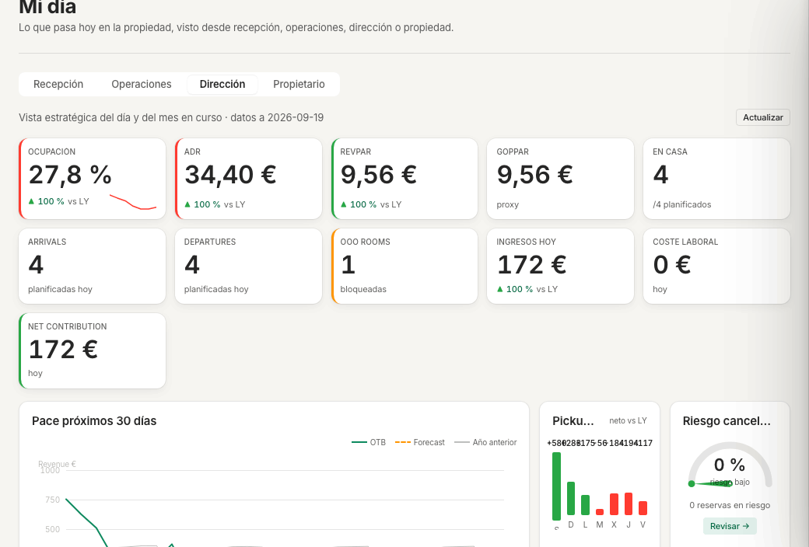
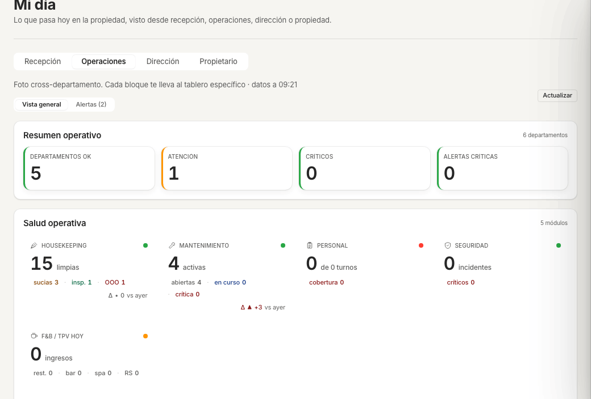
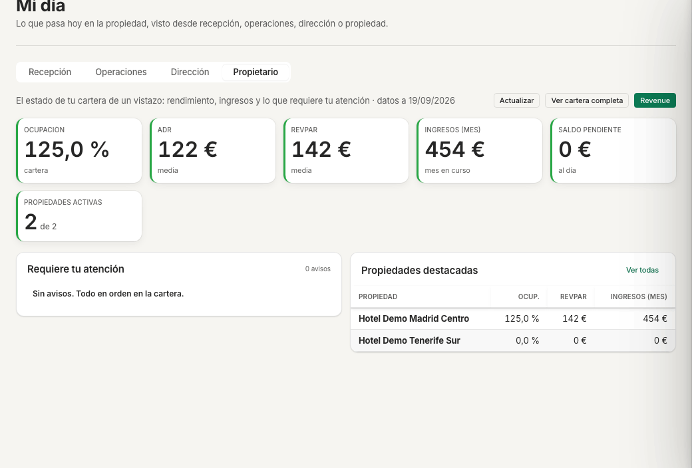
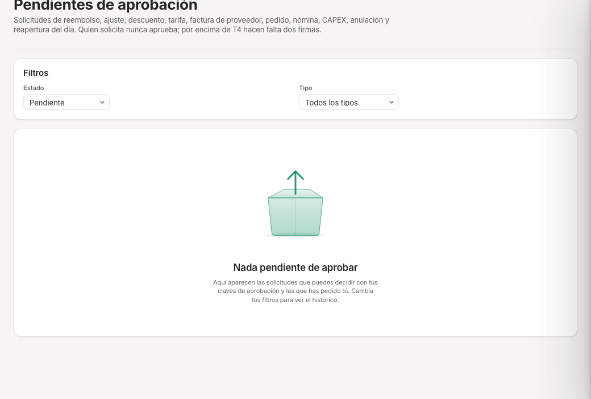
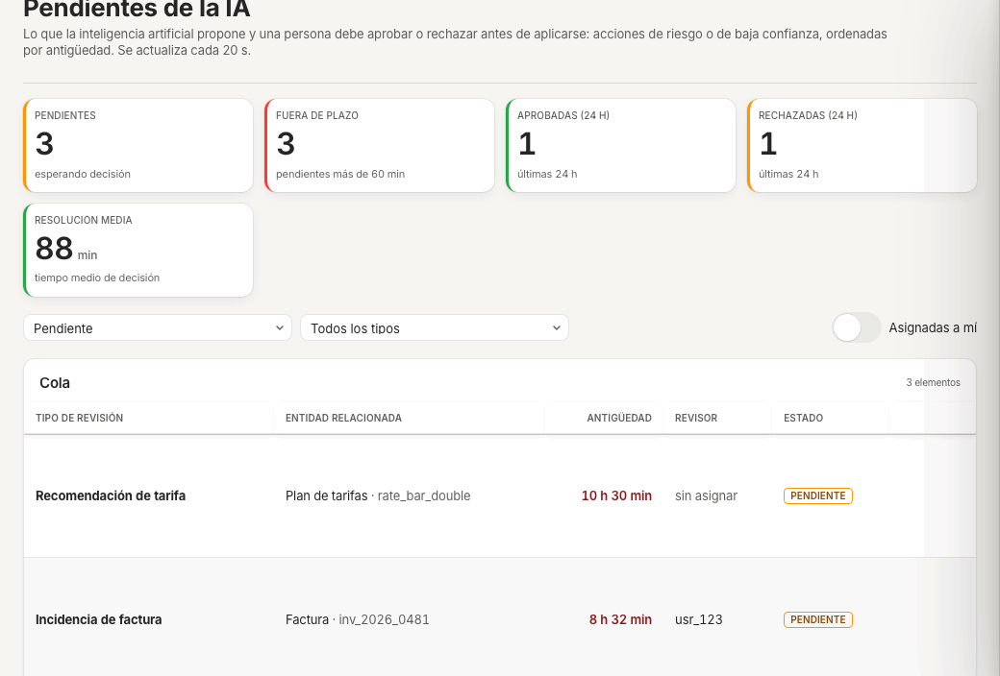
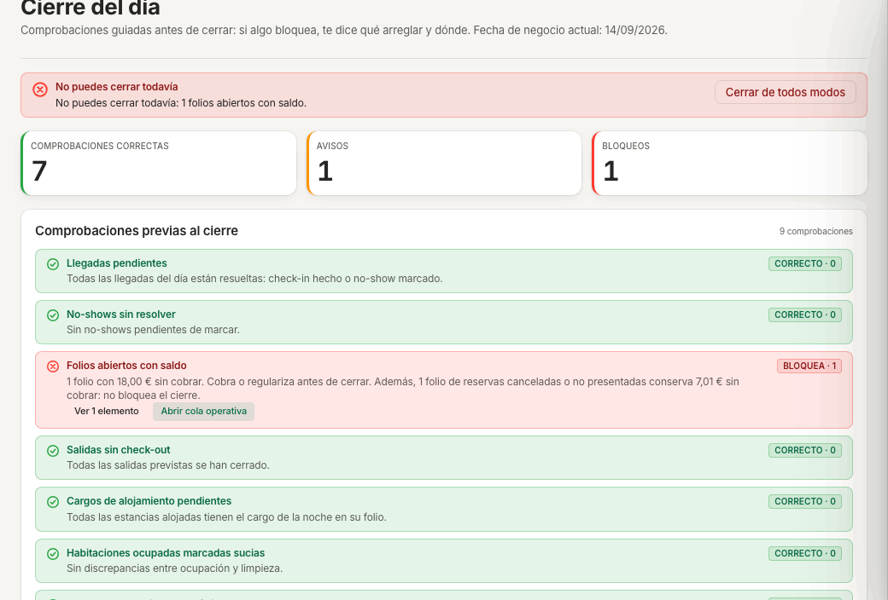
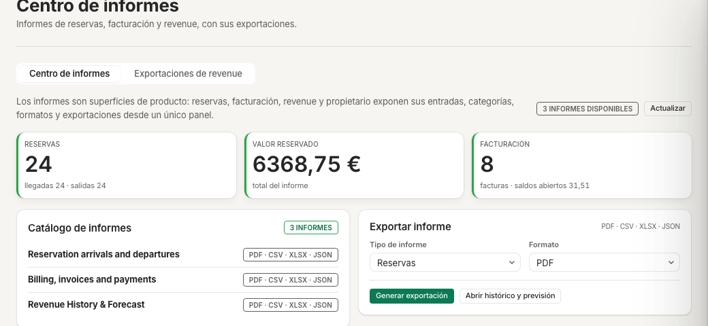
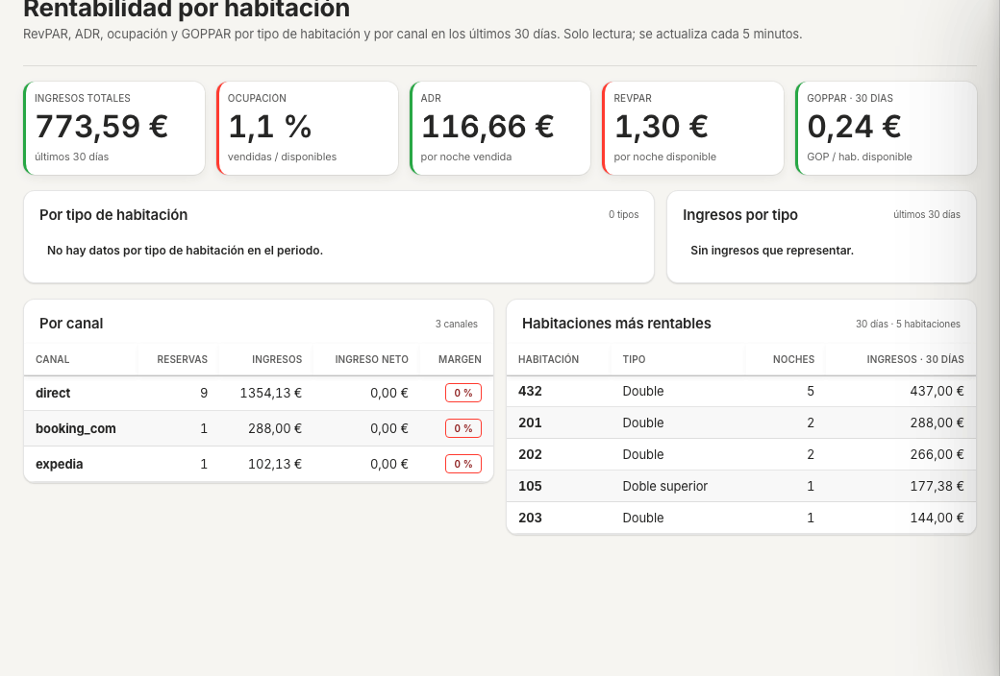
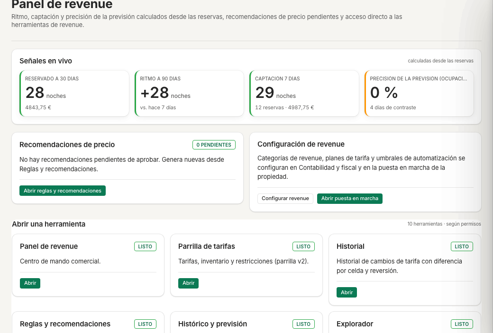

# Guía de dirección · ehotelOS

Guía de uso de ehotelOS para quien dirige el hotel: qué ves al entrar, cómo leer el día y el mes, cómo decidir sobre lo que otros te piden (aprobaciones y propuestas de la IA), cómo se cierra el día, qué informes tienes y qué puedes configurar. Cada paso está comprobado en la aplicación el 19/09/2026 sobre el hotel de demostración «Hotel Demo Madrid Centro».

## Para quién

- Director o directora de hotel (plantilla «Dirección de hotel»).
- Dirección de operaciones (plantilla «Dirección de operaciones»).
- Dirección general del grupo (plantilla «Dirección general»).
- Propietario o sociedad inversora (plantilla «Propiedad»): solo las tareas 3, 4 y 7; su menú de 6 entradas se describe en «Si tu plantilla es «Propiedad»».

Las tres plantillas de dirección comparten el mismo menú. Si tu cuenta tiene otra plantilla verás menos entradas: consulta la guía de tu perfil en el [índice del manual](README.md).

> **Nota:** en la demo no existe una cuenta con plantilla de dirección. Las capturas se han hecho con la cuenta de demostración y el selector «Ver como…» de la barra lateral puesto en «Dirección». Ese selector solo cambia el menú, no los permisos, y se pierde al recargar la página (F5): si lo usas para formarte, navega siempre desde el menú.

## Cómo están hechas las capturas

- Navegador Chromium controlado con Playwright, ventana de 1280×800, tema claro, idioma español.
- Sesión de la cuenta de demostración con «Ver como…» = «Dirección» (aparece el aviso «Viendo como Dirección · solo menú» en la barra lateral) y el hotel «Hotel Demo Madrid Centro».
- Datos: solo el hotel de demostración, con reservas, huéspedes, tareas y partes ficticios creados para este manual (referencia «MANUAL-»). No hay nombres de personas reales.
- Recorte al área de contenido (1040×704 píxeles; 1040×480 en la del Centro de informes), sin barra lateral ni cabecera. El aviso «Faltan 1 comprobación para poner la propiedad en marcha.» y las tarjetas de instrucciones de cada pantalla están ocultos en las capturas.
- Se regeneran con la receta de capturas del manual (ver [README.md](README.md)) y el lote `img/direccion/capturas.json`.

## Qué verás en tu menú

Al entrar aterrizas en **Hoy › Mi día › pestaña «Dirección»** (`/hoy/direccion`). El pie de la barra lateral dice «9 categorías · 68 entradas». En la barra superior tienes el botón «Nueva reserva».

| Categoría | Entradas |
| --- | --- |
| Hoy (8) | Live Timeline · Mi día · Asistente ehotelOS · Turno · Cierre del día · Pendientes de aprobación · Informe IA del día · Pendientes de la IA |
| Recepción (5) | Reservas · Nueva reserva · Huéspedes · Mensajes de huéspedes · Grupos y eventos |
| Operaciones (7) | Pisos · Mantenimiento · Personal y turnos · Seguridad e incidentes · Compras e inventario · Activos · Energía y agua |
| Comercial (5) | Clientes y fidelización · Reputación y calidad · Ventas adicionales · Ventas a empresas · Canales de venta |
| Revenue (10) | Panel de revenue · Parrilla de tarifas · Planes de tarifas · Reglas y recomendaciones · Histórico y previsión · Comparativa · Reunión de revenue · Competencia · Calendario de demanda · Políticas de cancelación |
| Finanzas (8) | Facturación y cobros · Tesorería · Conciliación bancaria · Contabilidad · Estados contables · Proveedores y gastos · Comisiones · Nóminas |
| Cumplimiento (9) | Bandeja de cumplimiento · Centro de cumplimiento · VeriFactu · Envíos a autoridades · Modelos AEAT · Impuestos · Registro de viajeros · Protección de datos · Sostenibilidad |
| Informes (5) | Centro de informes · Analítica · Rentabilidad por habitación · Cartera de propiedades · Rendimiento de canales |
| Configuración (11) | Puesta en marcha · Propiedad · Estructura societaria · Habitaciones y espacios · Usuarios y roles · Comunicaciones · Facturación y pagos · Contabilidad y fiscal · Módulos e integraciones · Inteligencia artificial · Sistema |

> **Módulo a activar:** la entrada «Punto de venta» (Operaciones) pertenece al módulo `outlet_pos`, apagado en el hotel de demostración; por eso el menú muestra 68 entradas y no 69. Si abres una pantalla del TPV por su dirección verás «Módulo no activado · Esta función pertenece a un módulo que no está activo en la propiedad.» con el botón «Ir a mi página de inicio». Los módulos se activan en Configuración › Módulos e integraciones (guía [60-sistemas.md](60-sistemas.md)).

En Mi día, dirección ve las cuatro pestañas «Recepción · Operaciones · Dirección · Propietario». Las pestañas «Recepción» (cola operativa de llegadas y salidas) y «Operaciones» las usan también recepción y los departamentos; «Dirección» y «Propietario» son tuyas.

### Si tu plantilla es «Propiedad»

La plantilla «Propiedad» (nivel N6, ámbito organización) es la del propietario o la sociedad inversora: lectura y aprobaciones, sin operativa. Al elegirla en «Ver como…» aterriza en **Hoy › Mi día › pestaña «Propietario»** (`/hoy/propietario`, tarea 3) y el pie de la barra lateral dice «3 categorías · 6 entradas»:

| Categoría | Entradas |
|---|---|
| Hoy (3) | Live Timeline (solo lectura) · Mi día (pestañas «Recepción» y «Propietario») · Pendientes de aprobación |
| Finanzas (1) | Estados contables |
| Informes (2) | Centro de informes · Cartera de propiedades |

Con esa plantilla, de esta guía te sirven las tareas 3 (Propietario), 4 (Pendientes de aprobación: el propietario decide las solicitudes que superan el tramo de dirección) y 7 (Centro de informes y Cartera de propiedades); los estados contables están en [20-administracion.md](20-administracion.md) §9. No ves Pisos, Mantenimiento, Revenue ni Configuración: si abres una de esas direcciones verás «Sin acceso».

## Tareas

### 1. Leer el día y el mes: Mi día de dirección

**Menú › Hoy › Mi día › pestaña «Dirección»** · `/hoy/direccion`

*Pestaña «Dirección» de Mi día con los indicadores del día y del mes, el pace de los próximos 30 días, el pickup de 7 días y el riesgo de cancelación (captura del 19/09/2026 por la tarde, tras cargar las 8 reseñas ficticias de la guía comercial). Los términos ADR, RevPAR, GOPPAR, pace, pickup y OTB están en el [glosario de Primeros pasos](00-primeros-pasos.md#glosario-de-indicadores-y-términos).*

1. Abre **Hoy › Mi día**. Bajo el título «Mi día» lees «Lo que pasa hoy en la propiedad, visto desde recepción, operaciones, dirección o propiedad.» y las pestañas «Recepción · Operaciones · Dirección · Propietario». Con plantilla de dirección entras ya en «Dirección»; el subtítulo dice «Vista estratégica del día y del mes en curso · datos a <fecha>». A la derecha del subtítulo está «Actualizar», que recarga todos los bloques.
2. Lee la fila de indicadores. Cada tarjeta lleva el valor y, cuando existe comparación, la variación «vs LY» (frente al año anterior): «OCUPACIÓN», «ADR», «REVPAR», «GOPPAR» (marcado «proxy»: estimación, no dato contable), «EN CASA» (alojados «/n planificados»), «ARRIVALS» y «DEPARTURES» («planificadas hoy»), «OOO ROOMS» («bloqueadas»), «INGRESOS HOY», «COSTE LABORAL» y «NET CONTRIBUTION». Un guion «—» en vez de un número significa que ese dato no se ha podido calcular.
3. Baja al gráfico «Pace próximos 30 días» (líneas «OTB», «Forecast» y «Año anterior», con la tabla «Fecha · OTB · Forecast · Año anterior» debajo), al bloque «Pickup 7d» («neto vs LY», barras por día de la semana) y al indicador «Riesgo cancelación» («n reservas en riesgo»). El botón «Revisar →» te lleva a **Recepción › Reservas › Lista**.
4. En «Segments» ves el reparto «ADR / MIX» por segmento (en la demo: transient, booking_com, expedia) y en «BAR Recommendations IA» las propuestas de tarifa base pendientes; hoy muestra «Sin recomendaciones nuevas».
5. Las tarjetas por departamento resumen el estado y abren su tablero al hacer clic:
   - «HK» (habitaciones «OOO») → **Operaciones › Pisos**.
   - «MANTENIMIENTO» (órdenes «abiertas») → **Operaciones › Mantenimiento**.
   - «WORKFORCE» («movimientos hoy») → **Hoy › Turno**.
   - «SAFETY» («incidentes urgentes») → **Operaciones › Seguridad e incidentes**.
   - «POS» («ingresos hoy €») → Punto de venta; en la demo responde «Módulo no activado» (ver arriba).
6. En la fila siguiente: la tarjeta «NPS 30d» / «Índice de reputación (30 d)» resume la reputación. Depende de lo que haya en **Comercial › Reputación y calidad**: en la demo, con la fuente de importación CSV que creó la guía comercial y 8 reseñas cargadas, dice «8 reseñas», «NPS —», «ÍNDICE —» y «8 reseñas · insuficiente (mínimo 10) · 1 fuente conectada · Insuficiente» (el índice necesita al menos 10 reseñas en 30 días). Si tu hotel no tiene ninguna fuente de reseñas, la tarjeta lo indica y ofrece configurarla; la operativa está en [50-comercial-revenue.md](50-comercial-revenue.md). «Peticiones de servicio» («Abiertas» y «Urgentes») con «Ver detalle», que abre **Operaciones › Pisos**. «VIPs in-house» lista los VIP alojados (hoy «Sin VIPs in-house ahora»).
7. Las tarjetas de cumplimiento «VERIFACTU», «SES», «TBAI» y «GDPR» muestran los envíos «pendientes» y el último envío; su «Ver detalle →» abre, respectivamente, **Cumplimiento › VeriFactu**, **Cumplimiento › Registro de viajeros › SES.Hospedajes**, **VeriFactu › TicketBAI (forales)** y **Cumplimiento › Centro de cumplimiento**.
8. Al final, «Anomalías hoy» («n detectadas») lista las desviaciones frente al año anterior con su severidad (por ejemplo «adr drop vs ly · HIGH · ADR hoy 34.40 € — 74.6% por debajo del mismo día del año pasado (135.18 €).»). Las tres primeras se repiten como tarjetas con «Aplicar» y «Descartar»: «Aplicar» te lleva al **Panel de revenue** para decidir sobre tarifas. «Demand spikes 14d» enumera los días con demanda muy por encima del año anterior («+335 % frente al año anterior»).

**Resultado esperado.** Una sola pantalla con ocupación, ADR, RevPAR, ingresos y coste del día, el pace del mes, el pulso de cada departamento, el estado de los envíos fiscales y las anomalías. Nada de lo que hay en esta pestaña escribe datos: es lectura.

**Si algo falla.**
- Los indicadores de «hoy» salen a 0 o muy bajos: la fecha de negocio de la demo es el 14/09/2026 y no se ha ejecutado ningún cierre del día (tarea 6); los cargos de alojamiento de las noches no cerradas no existen todavía.
- Una tarjeta muestra «—»: ese dato no se ha podido calcular y la pantalla lo marca como degradado en vez de enseñar un cero. Pulsa «Actualizar»; si persiste, avisa a sistemas.
- Aparece «No se pudieron cargar los avisos: Demasiadas peticiones. Reintenta en unos segundos.» en el panel de notificaciones: has superado el límite de peticiones por minuto; espera medio minuto y vuelve a intentarlo.

> **En construcción:** varias etiquetas de esta pestaña siguen en inglés («ARRIVALS», «DEPARTURES», «OOO ROOMS», «WORKFORCE», «SAFETY», «POS», «Segments», «Pace», «Pickup», «Demand spikes», «vs LY»). El botón «Descartar» de las tarjetas de anomalía no hace nada todavía (la tarjeta no desaparece). Las «BAR Recommendations IA» y las anomalías se calculan por reglas, sin modelo de lenguaje (ver tarea 5).

### 2. Ver la foto de operaciones

**Menú › Hoy › Mi día › pestaña «Operaciones»** · `/hoy/operaciones`

*Pestaña «Operaciones»: «Resumen operativo» y «Salud operativa» por departamento; debajo, el detalle por tablero.*

1. En Mi día pulsa la pestaña «Operaciones». El subtítulo dice «Foto cross-departamento. Cada bloque te lleva al tablero específico · datos a <hora>». Tienes dos subpestañas: «Vista general» y «Alertas (n)».
2. En «Vista general», el bloque «Resumen operativo» («6 departamentos») muestra «DEPARTAMENTOS OK», «ATENCIÓN», «CRÍTICOS» y «ALERTAS CRÍTICAS». Debajo, «Salud operativa» («5 módulos») tiene una tarjeta por departamento con su semáforo y sus cifras: «HOUSEKEEPING» (limpias, «sucias», «insp.», «OOO» y variación «vs ayer»), «MANTENIMIENTO» (activas, «abiertas», «en curso», «crítica»), «PERSONAL» («de n turnos», «cobertura»), «SEGURIDAD» («incidentes», «críticos») y «F&B / TPV HOY» («ingresos», «rest.», «bar», «spa», «RS»). Cada tarjeta abre su tablero.
3. Más abajo, «Detalle operativo» tiene las pestañas «Tareas HK (n)», «Órdenes de trabajo (n)», «Turnos (n)» e «Incidentes (n)». «Tareas HK» lista las tareas de limpieza de hoy con las columnas «HABITACIÓN · TAREA · PRIORIDAD · ESTADO · ASIGNADO · VENCE». Cierra la pantalla con tres gráficos de 7 días: «HK · habitaciones (7 días)» (limpiadas frente a programadas), «Mantenimiento · MTTR (7 días)» (horas medias de resolución) y «Personal · cobertura (7 días)».
4. Pulsa «Alertas (n)» para ver solo lo que requiere acción. El bloque «Atender ahora» lista cada alerta con su departamento y la acción sugerida; hoy en la demo: «3 llegadas sin habitación · FRONT_DESK · Asignar habitación antes de la llegada del huésped.» y «1 tareas HK retrasadas (>2h) · HOUSEKEEPING · Revisar planificación del turno.».

**Resultado esperado.** Sabes en un vistazo qué departamento necesita atención y llegas a su tablero en un clic. Para actuar sobre una tarea o un parte usa las guías de [pisos y mantenimiento](40-pisos-mantenimiento.md).

**Si algo falla.** «PERSONAL» sale «0 de 0 turnos» y «F&B / TPV HOY» a 0 en la demo porque no hay plantilla ni turnos cargados y el TPV está apagado; no es un error.

> **En construcción:** en la tabla «Tareas HK» la columna «HABITACIÓN» muestra hoy el identificador interno de la habitación en vez de su número, y «TAREA» y «ESTADO» aparecen en inglés («departure_clean», «IN_PROGRESS»). El nombre de los departamentos en las alertas también sale como código («FRONT_DESK», «HOUSEKEEPING»).

### 3. Mirar la cartera: panel del propietario

**Menú › Hoy › Mi día › pestaña «Propietario»** · `/hoy/propietario`

*Pestaña «Propietario»: indicadores de la cartera, «Requiere tu atención» y «Propiedades destacadas».*

1. En Mi día pulsa «Propietario». Subtítulo: «El estado de tu cartera de un vistazo: rendimiento, ingresos y lo que requiere tu atención · datos a <fecha>». Arriba a la derecha tienes «Actualizar», «Ver cartera completa» y «Revenue».
2. Lee las tarjetas «OCUPACIÓN» (cartera), «ADR» (media), «REVPAR» (media), «INGRESOS (MES)», «SALDO PENDIENTE» y «PROPIEDADES ACTIVAS» («n de n»).
3. «Requiere tu atención» agrupa los avisos de todas las propiedades («Sin avisos. Todo en orden en la cartera.» cuando no hay ninguno).
4. «Propiedades destacadas» es una tabla «PROPIEDAD · OCUP. · REVPAR · INGRESOS (MES)» ordenada por ingresos del mes. «Ver todas» y «Ver cartera completa» abren **Informes › Cartera de propiedades** (tarea 7); «Revenue» abre el **Panel de revenue** (tarea 8).

**Resultado esperado.** En la demo la tabla lista las dos propiedades del grupo de demostración, «Hotel Demo Madrid Centro» y «Hotel Demo Tenerife Sur» (esta última sin habitaciones ni reservas).

**Si algo falla.** La «OCUPACIÓN» de cartera de la demo muestra «125,0 %», un valor imposible: tómalo como un dato de demostración, no como referencia del cálculo. La tarjeta se alimenta de los datos del hotel de demostración, que no tiene ni cierres del día ni histórico real.

### 4. Decidir lo que otros piden: Pendientes de aprobación

**Menú › Hoy › Pendientes de aprobación** · `/hoy/pendientes`

*«Pendientes de aprobación» con los filtros «Estado» y «Tipo». Hoy la demo no tiene ninguna solicitud.*

1. Abre **Hoy › Pendientes de aprobación**. El texto de cabecera explica el alcance: «Solicitudes de reembolso, ajuste, descuento, tarifa, factura de proveedor, pedido, nómina, CAPEX, anulación y reapertura del día. Quien solicita nunca aprueba; por encima de T4 hacen falta dos firmas.». El contador «n pendientes que puedes decidir» y el botón «Actualizar» están justo debajo. El mismo contador aparece como chip «Pendientes de aprobación n» en la cabecera de Mi día y te trae aquí.
2. Filtra con «Estado» («Todos los estados · Pendiente · Aprobada · Rechazada · Caducada») y «Tipo» («Todos los tipos · Reembolso · Ajuste de folio · Descuento en reserva · Cambio de tarifa · Factura de proveedor · Pedido de compra · Nómina · CAPEX · Anulación de factura · Reapertura del día»). Por defecto ves las pendientes; cambia «Estado» para consultar el histórico.
3. Cuando no hay nada, la pantalla dice «Nada pendiente de aprobar» y «Aquí aparecen las solicitudes que puedes decidir con tus claves de aprobación y las que has pedido tú. Cambia los filtros para ver el histórico.».

**De dónde salen las solicitudes.** No se crean desde esta pantalla: nacen en la pantalla del departamento cuando una acción supera el umbral de quien la pide, y llegan aquí para que las decida alguien con claves de aprobación de nivel superior. Según el tipo:
- «Reembolso», «Ajuste de folio», «Descuento en reserva» y «Anulación de factura»: desde Finanzas › Facturación y cobros y el detalle de la reserva (guías [70-recepcion.md](70-recepcion.md) y [20-administracion.md](20-administracion.md)).
- «Cambio de tarifa»: desde Revenue (guía [50-comercial-revenue.md](50-comercial-revenue.md)).
- «Factura de proveedor», «Pedido de compra» y «CAPEX»: desde Proveedores y gastos y Compras e inventario (guía [20-administracion.md](20-administracion.md)).
- «Nómina»: desde Finanzas › Nóminas (guía [30-rrhh.md](30-rrhh.md)).
- «Reapertura del día»: desde Cierre del día (tarea 6).

**Resultado esperado.** Cada solicitud que puedas decidir aparece en la lista con sus acciones; las que has pedido tú se ven pero no puedes aprobarlas (separación de funciones). Hoy la demo muestra «0 pendientes que puedes decidir».

**Si algo falla.** Si una solicitud que esperas no aparece, comprueba primero el filtro «Estado» (puede estar ya «Aprobada», «Rechazada» o «Caducada») y después que tu plantilla tenga claves de aprobación para ese tipo (Configuración › Usuarios y roles, tarea 9).

### 5. Supervisar la IA: Informe IA del día y Pendientes de la IA

**Menú › Hoy › Informe IA del día** · `/hoy/informe-ia` — **Menú › Hoy › Pendientes de la IA** · `/hoy/pendientes-ia`

> **En construcción:** el hotel de demostración no tiene proveedor de modelo de lenguaje configurado (en Configuración › Inteligencia artificial: «Sin modelo configurado: la IA responde por reglas y las funciones de modelo quedan omitidas.»). Todo lo que ves como «propuesta de la IA» se genera por reglas deterministas, sin coste real. Las pantallas y el circuito de aprobación son los mismos que con un modelo conectado.

**Informe IA del día**

1. Abre **Hoy › Informe IA del día**. Subtítulo: «Qué hace la inteligencia artificial en tu hotel, cómo está configurada, cuánto cuesta y con qué controles trabaja. Sin tecnicismos, para dirección y propiedad.». Botones «Actualizar» y «Ajustes de IA» (abre Configuración › Inteligencia artificial, tarea 9).
2. «Cómo trabaja la IA en este hotel» muestra el estado «ACTIVADA» y el modo «La IA propone y una persona confirma», con la explicación «La IA prepara tareas (por ejemplo, clasificar un documento o sugerir una acción) y solo se ejecutan cuando alguien de tu equipo las aprueba. Siempre hay una persona en el medio.».
3. «Seguridad y control» resume tus garantías: «Revisión humana» (Activa · Una persona aprueba), «Aviso de IA al huésped» (Configurado · Cumple transparencia) y «Estado de la IA» (Encendida · En uso).
4. «Qué ha propuesto y quién lo ha decidido» («Decisiones de la IA · últimas 24 horas») da «ESPERANDO TU VISTO BUENO», «APROBADAS (24 H)» y «RECHAZADAS (24 H)»; el botón «Ver detalle» abre Pendientes de la IA.
5. «Coste de la IA» muestra «GASTO EN IA (30 DÍAS)» y «PROYECCIÓN MENSUAL» (0,00 € en la demo: sin proveedor no hay coste). «Qué hace y qué no hace la IA» cierra con dos listas: «La IA te ayuda con» (dar de alta el hotel desde ficheros, sugerir acciones revisables, comprobar la calidad de los datos) y «La IA no hace» («No cobra ni factura por su cuenta.», «No cancela ni modifica reservas sin aprobación.», «No toma decisiones de alto riesgo sin que una persona las confirme.»).

**Pendientes de la IA**

*«Pendientes de la IA»: «PENDIENTES», «FUERA DE PLAZO», aprobadas y rechazadas en 24 h, y la «Cola de revisión» con las acciones por fila.*

1. Abre **Hoy › Pendientes de la IA**. Subtítulo: «Lo que la inteligencia artificial propone y una persona debe aprobar o rechazar antes de aplicarse: acciones de riesgo o de baja confianza, ordenadas por antigüedad. Se actualiza cada 20 s.».
2. Indicadores: «PENDIENTES» («esperando decisión»), «FUERA DE PLAZO» («pendientes más de 60 min»), «APROBADAS (24 H)», «RECHAZADAS (24 H)» y «RESOLUCIÓN MEDIA» (minutos).
3. Filtra por estado («Todos los estados · Pendiente · Aprobada · Rechazada · Escalada»), por tipo («Todos los tipos · Envío del registro de viajeros · Incidencia de factura · Recomendación de tarifa») o activa el interruptor «Asignadas a mí».
4. La «Cola de revisión» («n elementos») tiene las columnas «TIPO DE REVISIÓN · ENTIDAD RELACIONADA · ANTIGÜEDAD · REVISOR · ESTADO · ACCIONES». En cada fila puedes «Asignar», «Aprobar», «Rechazar» o «Escalar». «Asignar» te pone como revisor **al instante, sin confirmación** (la columna «REVISOR» pasa de «sin asignar» a tu usuario); «Aprobar» y «Escalar» también actúan directamente. «Rechazar», en cambio, abre el detalle lateral de la propuesta con la sección «Decisión» y el campo «Motivo del rechazo» («Obligatorio para rechazar.»): el rechazo solo se confirma desde ahí. Hacer clic en la fila abre ese mismo detalle. Las filas con más de 60 minutos marcan su antigüedad en rojo.

> **Nota:** el detalle lateral es un cajón con el título del tipo de revisión (por ejemplo «Recomendación de tarifa»), el subtítulo «Pendiente · creada <fecha y hora>» y las secciones «Datos», «Contenido», «Historial de la revisión» y «Decisión» («Notas de aprobación», «Motivo del rechazo» y «Escalar a rol»); al pie, «Asignar a mí», «Escalar», «Rechazar» y «Aprobar». «Rechazar» está apagado hasta que escribes el motivo. Ciérralo con «Cerrar», la × o Esc. Ten en cuenta que «Asignar» en la fila no pide confirmación: no lo pulses por probar.

**Resultado esperado.** Hoy la demo tiene 3 propuestas pendientes (una «Recomendación de tarifa», una «Incidencia de factura» y un «Envío del registro de viajeros»), las tres «FUERA DE PLAZO». En esta guía no se ha aprobado ni rechazado ninguna: son datos de demostración.

**Si algo falla.** Si «Informe IA del día» muestra la IA como desactivada, el interruptor está en Configuración › Inteligencia artificial › «Ajustes» («IA activada para esta propiedad»); no lo cambies sin acordarlo con sistemas.

> **En construcción:** «Aprobar» en Pendientes de la IA registra tu confirmación, pero hoy no ejecuta la acción propuesta; la ejecución real de las herramientas de escritura llegará con el proveedor de modelo conectado. Con la IA sin proveedor, el «Asistente ehotelOS» del menú Hoy avisa «Sin modelo de lenguaje» y responde por reglas.

### 6. Cierre del día y Turno

**Menú › Hoy › Cierre del día** · `/hoy/cierre-del-dia` — **Menú › Hoy › Turno** · `/hoy/turno`

> **Nota:** esta tarea describe el cierre sin ejecutarlo. El cierre mueve la fecha de negocio y contabiliza los cargos de alojamiento: en el hotel de demostración no lo lances durante la formación. La demo lleva cinco días sin cerrar (fecha de negocio 14/09/2026 a 19/09/2026) y el «Historial de cierres» dice «Todavía no se ha ejecutado ningún cierre del día en esta propiedad.».

*«Cierre del día» en la demo (19/09/2026 por la tarde): «No puedes cerrar todavía» por «Folios abiertos con saldo» («BLOQUEA · 1»), un aviso en «Facturas pendientes» («ATENCIÓN · 1», por el borrador de factura que creó la guía de administración) y las otras siete comprobaciones en «CORRECTO · 0».*

**Cierre del día**

1. Abre **Hoy › Cierre del día**. Subtítulo: «Comprobaciones guiadas antes de cerrar: si algo bloquea, te dice qué arreglar y dónde. Fecha de negocio actual: 14/09/2026.». Botón «Actualizar» para recalcular.
2. Lee el aviso de estado. Hoy dice «No puedes cerrar todavía» y «No puedes cerrar todavía: 1 folios abiertos con saldo.», con el botón «Cerrar de todos modos» (solo para quien tiene permiso de ejecutar el cierre; abre una confirmación y pide motivo). Cuando todas las comprobaciones pasan, el aviso cambia a «Puedes cerrar el día» y el botón a «Cerrar día».
3. Los contadores «COMPROBACIONES CORRECTAS», «AVISOS» y «BLOQUEOS» resumen la lista «Comprobaciones previas al cierre» («9 comprobaciones»): «Llegadas pendientes», «No-shows sin resolver», «Folios abiertos con saldo», «Salidas sin check-out», «Cargos de alojamiento pendientes», «Habitaciones ocupadas marcadas sucias», «Cargos del TPV sin pasar a folio», «Facturas pendientes» y «Preautorizaciones sin capturar». Cada una lleva su etiqueta «CORRECTO · n», «AVISO · n» o «BLOQUEA · n» y una frase con lo que hay que hacer.
4. En una comprobación que bloquea, «Ver n elementos» despliega la lista afectada en la propia pantalla y «Abrir cola operativa» lleva a **Hoy › Mi día › «Recepción»** para resolverla. En la demo el bloqueo es «1 folio con 18,00 € sin cobrar. Cobra o regulariza antes de cerrar.» (el folio de la reserva ficticia RES-18399: 24,50 € de minibar y aparcamiento menos un cobro parcial de 6,50 € registrado por la guía de administración; el importe exacto cambiará si alguien vuelve a tocar ese folio), y el texto añade «Además, 1 folio de reservas canceladas o no presentadas conserva 7,01 € sin cobrar: no bloquea el cierre.». La comprobación «Facturas pendientes» muestra el aviso «1 factura en borrador. Emítela antes del cierre para que entre en la producción del día.» con «Ver facturas» y la etiqueta «ATENCIÓN · 1»: un aviso no bloquea, pero conviene resolverlo. Los contadores quedan en «7 · 1 · 1» (correctas, avisos, bloqueos).
5. Quien cierra es recepción o auditoría nocturna, según la guía [70-recepcion.md](70-recepcion.md); dirección revisa el resultado en «Historial de cierres» y decide sobre las solicitudes de «Reapertura del día» en Pendientes de aprobación (tarea 4).

**Turno**

1. Abre **Hoy › Turno**. Subtítulo: «Productividad del equipo de recepción, caja del día y bloqueos críticos.». Botón «Actualizar».
2. «Productividad del turno» («n movimientos pendientes») muestra «CHECK-INS HECHOS» («de n», porcentaje y pendientes), «CHECK-OUTS HECHOS», «NO-SHOWS» y «CANCELACIONES». Hoy en la demo: 4 check-ins de 7 y 1 check-out de 2.
3. «Caja del día» da «COBRADO HOY», «REEMBOLSADO», «NETO» y «SALDO ABIERTO»; su «Ver detalle» abre **Finanzas › Tesorería**.
4. «Estado operativo» («5 comprobaciones») repasa «Conflictos de reserva», «Llegadas sin habitación», «Incidencias críticas», «Saldo abierto» y «Llegadas pendientes». «Eventos del turno» lista cronológicamente los check-ins, check-outs e incidencias del día con hora.

**Resultado esperado.** Sabes si el día puede cerrarse y, si no, qué bloquea y quién debe resolverlo; y ves cuánto lleva hecho recepción y qué queda pendiente.

**Si algo falla.**
- «CHECK-INS HECHOS» o los indicadores de Mi día salen a 0 en un hotel real: comprueba la «Fecha de negocio actual»; las cifras de «hoy» se calculan sobre la fecha real, y los cargos de alojamiento sobre la fecha de negocio, que solo avanza con el cierre.
- El «Saldo abierto» del turno muestra el importe con el símbolo delante («€31.51 sin cobrar») mientras «Caja del día» lo muestra en formato español («31,51 €»): es solo presentación.

### 7. Informes

**Menú › Informes** · `/informes` · `/informes/analitica` · `/informes/rentabilidad-habitacion` · `/informes/cartera` · `/informes/canales`

*«Centro de informes»: «RESERVAS», «VALOR RESERVADO» y «FACTURACIÓN», el «Catálogo de informes» y el bloque «Exportar informe».*

**Centro de informes**

1. Abre **Informes › Centro de informes**. Pestañas «Centro de informes» y «Exportaciones de revenue». Subtítulo: «Informes de reservas, facturación y revenue, con sus exportaciones.».
2. Los indicadores «RESERVAS» («llegadas n · salidas n»), «VALOR RESERVADO» («total del informe») y «FACTURACIÓN» («facturas · saldos abiertos n») resumen el hotel. El «Catálogo de informes» («3 INFORMES») lista «Reservation arrivals and departures», «Billing, invoices and payments» y «Revenue History & Forecast», cada uno disponible en «PDF · CSV · XLSX · JSON».
3. El bloque «Exportar informe» ofrece «Tipo de informe» («Reservas · Facturación · Revenue · Propietario»), «Formato» («PDF · CSV · XLSX · JSON») y el botón «Generar exportación»; «Abrir histórico y previsión» te lleva a **Revenue › Histórico y previsión**.

   > **En construcción:** «Generar exportación» **no descarga nada** hoy: termina con el aviso «Exportación lista: undefined» y un enlace «Descargar exportación» que no lleva a ningún fichero (comprobado el 19/09/2026 con «Reservas» en «CSV» y con «Facturación» en «XLSX»). Para descargar informes usa la pestaña «Exportaciones de revenue» (paso 5), cuyos botones sí bajan el fichero, o los «Exportar CSV / Exportar Excel» de **Revenue › Histórico y previsión**; el diario y los estados contables tienen sus propias descargas en la guía [20-administracion.md](20-administracion.md).
4. Debajo, «Informe de reservas» (código, huésped, importe) e «Informe de facturación» (folio, estado, saldo) muestran los datos que alimentan las exportaciones.
5. La pestaña «Exportaciones de revenue» (`/informes/exportaciones-revenue`, «6 INFORMES») ordena los informes del ritual de revenue por frecuencia: «Ritual diario» («Informe diario History & Forecast», «Pickup diario (Δ 1/7/28)» y «Flash de dirección (1 página)»), «Ritual semanal» («Pace por segmento», «Meeting pack de revenue») y «Cierre mensual» («Cierre mensual día a día»). Cada uno tiene su rango o mes y los botones «Descargar CSV», «Descargar Excel» o «PDF (imprimir)»; el bloque «Convenciones de los ficheros» explica el formato (CSV con separador «;» y coma decimal, fechas ISO, importes en EUR sin símbolo). Lo que descargues queda en «Generados en esta sesión» para volver a bajarlo. Comprobado con «Ver como…» = «Dirección» el 19/09/2026: «Descargar CSV» del «Informe diario History & Forecast» descarga `ehotelos_hotel-demo-madrid-centro_hf_daily_2026-09-19.csv` (9,6 KB) y la fila aparece en «Generados en esta sesión».

**Analítica** (`/informes/analitica`; módulo `hotel_intelligence_platform`, activo en la demo). Subtítulo: «Indicadores personalizados, anomalías detectadas e informes programados de los últimos 30 días. Solo lectura; se actualiza cada 5 minutos.». Indicadores «INDICADORES», «REGISTROS · 24 H», «ANOMALÍAS · 30 DÍAS», «ANOMALÍAS CRÍTICAS» e «INFORMES PROGRAMADOS». En la demo todo está a 0: «No hay registros de indicadores.», «No hay anomalías recientes.», «No hay informes programados activos.».

**Rentabilidad por habitación** (`/informes/rentabilidad-habitacion`)

*«Rentabilidad por habitación»: ingresos, ocupación, ADR, RevPAR y GOPPAR de 30 días, reparto por canal y «Habitaciones más rentables».*

1. Subtítulo: «RevPAR, ADR, ocupación y GOPPAR por tipo de habitación y por canal en los últimos 30 días. Solo lectura; se actualiza cada 5 minutos.». Tarjetas «INGRESOS TOTALES», «OCUPACIÓN» («vendidas / disponibles»), «ADR» («por noche vendida»), «REVPAR» («por noche disponible») y «GOPPAR · 30 DÍAS» («GOP / hab. disponible»).
2. «Por tipo de habitación» e «Ingresos por tipo» desglosan por categoría; «Por canal» («CANAL · RESERVAS · INGRESOS · INGRESO NETO · MARGEN») y «Habitaciones más rentables» («HABITACIÓN · TIPO · NOCHES · INGRESOS · 30 DÍAS») cierran la pantalla.

**Cartera de propiedades** (`/informes/cartera`)

1. Subtítulo: «Vista consolidada del grupo hotelero: KPIs agregados con media ponderada por habitaciones y detalle por propiedad, para cadenas con 3–50+ hoteles · datos a <hora>». Tarjetas «PROPIEDADES», «ACTIVAS», «HABITACIONES», «LLEGADAS HOY», «SALIDAS HOY», «EN CASA», «OCUPACIÓN CARTERA», «ADR CARTERA», «REVPAR CARTERA», «INGRESOS DEL MES», «ENVÍOS FISCALES PENDIENTES» («VeriFactu · TBAI · IGIC · SES»), «SALDO PENDIENTE (HOY)», «RESERVAS SIN ATENDER», «MENSAJES SIN ATENDER» y «TAREAS SIN ATENDER».
2. La tabla «Propiedades» («n propiedades · una fila abre el detalle») tiene «PROPIEDAD · ESTADO · HABITACIONES · OCUPACIÓN · ADR · REVPAR · INGRESOS DEL MES · FISCAL PENDIENTE · SALDO PENDIENTE · SALUD». Haz clic en una fila para abrir la pestaña «Detalle» (`/informes/cartera/<propiedad>`): «Actividad de hoy, finanzas, operaciones y cumplimiento de la propiedad. Se actualiza cada minuto.», con los bloques «Operaciones» («Abrir pisos», «Abrir mantenimiento», «Abrir seguridad»), «Experiencia del huésped» («Abrir bandeja», «Abrir reputación», «Responder»), «Cumplimiento» («Abrir centro fiscal», estado de «SES Hospedajes» y «VeriFactu») y «Reservas recientes». «Volver a la cartera» regresa a la lista.
3. «Alertas críticas» al pie lista las propiedades que cruzan un umbral («No hay alertas críticas.» en la demo).

En la demo la cartera lista solo «Hotel Demo Madrid Centro» y «Hotel Demo Tenerife Sur».

**Rendimiento de canales** (`/informes/canales`). Subtítulo: «Reparto de ventas por canal, rentabilidad, alertas de paridad y estado de las sincronizaciones de los últimos 30 días. Solo lectura; se actualiza cada 2 minutos.». Tarjetas «CANALES ACTIVOS», «ALERTAS DE PARIDAD ABIERTAS», «COMISIÓN MEDIA», «RESERVAS · 30 DÍAS» e «INGRESOS · 30 DÍAS»; bloques «Reparto por canal», «Cuota de ventas», «Canales más rentables», «Estado de las sincronizaciones» («SUCCESS» / «FAILED») y «Alertas de paridad recientes». La operativa de canales está en [50-comercial-revenue.md](50-comercial-revenue.md).

**Resultado esperado.** Tienes descarga inmediata de los informes de revenue (pestaña «Exportaciones de revenue»), la lectura en pantalla de los informes de reservas y facturación, la rentabilidad de 30 días y, si diriges varios hoteles, la cartera consolidada con el detalle de cada uno. La exportación a fichero del bloque «Exportar informe» está en construcción (paso 3).

**Si algo falla.**
- «Generar exportación» termina en «Exportación lista: undefined» y no descarga: es el defecto conocido del paso 3, no un bloqueo de descargas de tu navegador; usa «Exportaciones de revenue».
- «Por tipo de habitación» dice «No hay datos por tipo de habitación en el periodo.» en la demo porque los tipos de habitación se crearon hoy: solo las noches vendidas en los últimos 30 días cuentan.
- «Rendimiento de canales» muestra «FAILED» en algunas sincronizaciones: los canales de la demo trabajan en modo de pruebas contra un simulador.

> **En construcción:** los nombres del catálogo del Centro de informes están en inglés («Reservation arrivals and departures», «Billing, invoices and payments», «Revenue History & Forecast»). El detalle de la cartera muestra en «Envíos fiscales pendientes» una cifra que no coincide con el «0» de la lista: no la tomes como referencia hasta que se corrija.

### 8. Revenue básico

**Menú › Revenue › Panel de revenue** · `/revenue` — **Reglas y recomendaciones** · `/revenue/reglas` — **Parrilla de tarifas** · `/revenue/parrilla`

*«Panel de revenue» con las «Señales en vivo», «Recomendaciones de precio», «Configuración de revenue» y «Abrir una herramienta».*

Esta tarea cubre lo que dirección necesita para leer y decidir; la operativa completa de tarifas, canales y publicación está en [50-comercial-revenue.md](50-comercial-revenue.md).

**Panel de revenue**

1. Abre **Revenue › Panel de revenue**. Subtítulo: «Ritmo, captación y precisión de la previsión calculados desde las reservas, recomendaciones de precio pendientes y acceso directo a las herramientas de revenue.». La tarjeta de instrucciones de la pantalla (cerrable) resume los pasos y el consejo «Las recomendaciones de tarifa base se generan a partir de la demanda y de los precios de la competencia; nada se aplica sin aprobación.».
2. «Señales en vivo» («calculadas desde las reservas»): «RESERVADO A 30 DÍAS» (noches e importe), «RITMO A 90 DÍAS» («vs. hace 7 días»), «CAPTACIÓN 7 DÍAS» («n reservas · importe») y «PRECISIÓN DE LA PREVISIÓN (OCUPACIÓN)» («n días de contraste»). Por debajo del 80 % de precisión conviene revisar el histórico importado.
3. «Recomendaciones de precio» («n PENDIENTES») enlaza con «Abrir reglas y recomendaciones». «Configuración de revenue» explica que «Categorías de revenue, planes de tarifa y umbrales de automatización se configuran en Contabilidad y fiscal y en la puesta en marcha de la propiedad.»: «Configurar revenue» abre **Configuración › Contabilidad y fiscal › Categorías de ingresos** y «Abrir puesta en marcha» abre **Configuración › Puesta en marcha**.
4. «Abrir una herramienta» («10 herramientas · según permisos») lista cada pantalla del módulo con su estado («LISTO») y un botón «Abrir»: Panel de revenue, Parrilla de tarifas, Historial, Reglas y recomendaciones, Histórico y previsión, Explorador, Comparativa, Reunión de revenue, Competencia y Calendario de demanda.

**Reglas y recomendaciones** (`/revenue/reglas`)

1. Subtítulo: «El motor combina la ocupación real, los precios de la competencia y tus reglas para recomendar la tarifa base por fecha. Cada recomendación explica sus factores y nada se aplica sin aprobación; al aplicarla, la tarifa se escribe en la parrilla.». Botones «Actualizar», «Generar recomendaciones» y, en el formulario inferior, «Añadir regla».
2. Indicadores «PENDIENTES» («por decidir»), «APLICADAS» («escritas en la parrilla») y «REGLAS ACTIVAS» («de n reglas»). «Recomendaciones de BAR» lista lo pendiente de decidir; sin recomendaciones dice «Pulsa «Generar recomendaciones» para calcular el BAR sugerido por fecha.».
3. «Reglas de precio» permite crear una regla con «Nombre*», «Ocupación mínima (%)», «Ocupación máxima (%)» y «Ajuste (%)*» («Positivo sube la BAR; negativo la baja.»); el motor las aplica por orden de prioridad. Esta guía no crea reglas en la demo.

**Parrilla de tarifas** (`/revenue/parrilla`, solo lectura para dirección)

1. Subtítulo: «Tarifas por fecha, tipo de habitación y plan, con el historial de cada cambio.». Pestañas «Parrilla de tarifas» e «Historial». La cabecera dice el hotel y el rango («Hotel Demo Madrid Centro · 19 sep – 2 oct · 14 noches»).
2. Cambia el «RANGO» con «7 d · 14 d · 30 d · 90 d · Trimestre», navega con «‹ › Hoy» o fija «Desde / Hasta» («hasta 365 noches»). Las vistas son «Tarifas · Restricciones · Canales · Recomendaciones»; «Filtros» acota tipos y planes; las «CAPAS» («Demanda», «Recomendaciones», «Estado de envío») superponen información.
3. La cuadrícula muestra una fila por tipo de habitación y plan (en la demo, cuatro tipos con el plan «BAR · Solo alojamiento») y un precio por noche. Hoy en la demo: Individual 95 €, Double 144 € (con variaciones), Doble superior 165 € y Junior suite 210 €, con recargo en fines de semana.
4. La barra inferior («Sin cambios pendientes» cuando no has editado) tiene «Edición masiva…», «Deshacer», «Rehacer», «Descartar», «Guardar sin enviar a canales» y «Revisar y publicar». Si llegas a editar: «Guardar sin enviar a canales» escribe las tarifas en ehotelOS (el hotel ya vende al precio nuevo) sin mandarlas a los canales; «Revisar y publicar» abre el resumen y encola el envío a los canales conectados. Ninguna tarifa cambia sin pulsar uno de los dos.

**Resultado esperado.** Sabes cuántas noches hay reservadas, si el ritmo va por delante o por detrás, qué recomendaciones esperan decisión y a qué precio se vende cada tipo por fecha.

**Si algo falla.**
- «PRECISIÓN DE LA PREVISIÓN» sale «0 %» con pocos «días de contraste»: en la demo apenas hay histórico; no es un fallo del cálculo.
- Una fecha sin precio en la parrilla no se vende a ese precio: sin tarifa BAR por día no hay precio para la reserva. Revisa el rango y el plan con revenue.
- Si sales de la parrilla con cambios sin guardar, la aplicación avisa «Tienes cambios sin guardar»; decide antes de cambiar de pantalla.

### 9. Personas y puesta en marcha (visión de dirección)

**Menú › Configuración › Usuarios y roles** · `/configuracion/usuarios` — **Puesta en marcha** · `/configuracion/puesta-en-marcha` — **Inteligencia artificial** · `/configuracion/ia`

El detalle de alta de usuarios, módulos, integraciones y auditoría está en [60-sistemas.md](60-sistemas.md). Aquí solo lo que dirección debe saber mirar.

**Usuarios y roles**

1. Abre **Configuración › Usuarios y roles**. Subtítulo: «Quién trabaja en cada hotel y con qué plantilla: asignaciones por hotel, grupo, sociedad u organización; invitaciones con ámbito; separación de funciones. Todo cambio queda en el registro de auditoría.». Botones «Comparar plantillas», «Actualizar» e «Invitar con ámbito»; pestañas «Este hotel» y «Sociedad».
2. La tabla «Usuarios de este hotel» muestra «USUARIO · PLANTILLA RBAC · NIVEL · ÁMBITO · HOTELES · ÚLTIMO ACCESO · ESTADO · 2FA · ACCIONES». En la demo hay un único usuario (la cuenta de demostración, plantilla «Local Super Admin»).
3. «Invitar con ámbito» abre un cajón lateral con «Persona» («Nombre completo*», «Correo electrónico*», «Teléfono», «Exigir doble factor (2FA)») y «Rol y ámbito» («Rol (plantilla)*», «Ámbito*» con «Hotel · Grupo de hoteles · Sociedad · Organización», «Hotel*», «Motivo» y «Caduca el» para asignaciones temporales). La explicación del cajón lo resume: «La persona recibirá un enlace de un solo uso y quedará asignada al ámbito elegido al aceptarlo.» y «Solo puedes asignar roles de nivel igual o inferior al tuyo y dentro de tu ámbito; la API lo comprueba de nuevo.». En esta guía no se envía ninguna invitación; el paso a paso está en [60-sistemas.md](60-sistemas.md).

> **Nota:** al pulsar la fila de una persona se abre su ficha en un cajón lateral: nombre y correo, «Datos del usuario» (estado, plantilla principal, nivel, 2FA, último acceso e identificador), «Asignaciones» (una línea por asignación con su ámbito y su estado) y «PIN de supervisor» con el botón «Restablecer PIN»; se cierra con «Cerrar» o Esc. Sobre tu propio usuario la ficha avisa «Nadie se concede permisos a sí mismo»: los cambios de asignación los hace otra persona de dirección o de sistemas.

> **En construcción:** «Comparar plantillas» falla con «Algo ha fallado en la interfaz · El error ya ha sido reportado al equipo. Puedes intentarlo de nuevo.» («b is not iterable») y el botón «Reintentar»: usa la tabla de plantillas de [60-sistemas.md](60-sistemas.md) y pide al proveedor la tabla de accesos por departamento. El interruptor «Exigir doble factor (2FA)» deja hoy solo la marca «2FA: Activo» en la ficha; la verificación del segundo factor al entrar no está activada todavía.

**Puesta en marcha**

*«Puesta en marcha» › «Resumen»: «Estado de la configuración» y «Preparación y salida en vivo» con «1 COMPROBACIÓN BLOQUEANTE».*

1. Abre **Configuración › Puesta en marcha**. Pestañas «Resumen», «Salida en vivo» e «Importar desde documentos». Subtítulo: «Estado de la configuración de la propiedad, lista de comprobación para salir en vivo e importación asistida desde documentos.».
2. En «Resumen» tienes las subpestañas «Resumen» y «Todos los ajustes» y los accesos «Propiedad» y «Categorías». «Estado de la configuración» muestra «ELEMENTOS CONFIGURADOS» (porcentaje), «CONFIGURADOS» («de 32»), «PENDIENTES» y «REQUIEREN ATENCIÓN». «Preparación y salida en vivo» da «PASOS COMPLETADOS» («de 15»), «COMPROBACIONES SUPERADAS» («de 17»), «BLOQUEANTES» y «ÚLTIMA COMPROBACIÓN», lista los «PASOS DE PUESTA EN MARCHA» (de «Datos de la organización» a «Salida en vivo») y el bloqueo vigente. «Abrir la lista de comprobación» lleva a la pestaña «Salida en vivo».
3. «Preparación por área» («10 áreas») enumera «Propiedad», «Configuración», «Operaciones», «Módulos e integraciones», «Revenue», «Canales de venta», «Finanzas», «Cumplimiento», «Inteligencia artificial» y «Huéspedes» con «n/n» y «Ver elementos». «Herramientas guiadas» («5 herramientas») abre «Propiedad», «Habitaciones y espacios», «Categorías», «Importar desde documentos» y «Salida en vivo».
4. «Todos los ajustes» es el índice manual completo: cada ajuste (por ejemplo «Propiedad», «Edificios, plantas y zonas», «Habitaciones y tipos», «Espacios y recursos») muestra su estado («PENDIENTE»), las vías disponibles («Formulario manual», «Asistente guiado», «Importación CSV/XLSX», «Sugerencia de IA»…) y los botones «Configurar» y «Rellenar aquí».
5. En «Salida en vivo» ves la «Lista de comprobación» («n de 17 correctas») con el botón «Recalcular preparación». Cada comprobación lleva su estado («Correcto», «Atención» o «Bloqueante»), la frase de detalle y «Revisar» o «Ver estado». En la demo el único bloqueo es «Modo de envío y certificado de SES.HOSPEDAJES»: «SES.HOSPEDAJES en modo de pruebas: los partes van a un simulador, no al Ministerio del Interior. Configura el modo de preproducción o producción con certificado antes de la puesta en marcha.». Además hay dos avisos: «Certificado de firma para la AEAT y el Ministerio del Interior» (firma de pruebas, válida solo en modo de pruebas) y «Datos del software VeriFactu (productor, versión, instalación)» («Declaración del sistema informático de VeriFactu incompleta»).

**Resultado esperado.** Sabes qué falta para que el hotel salga en vivo y quién debe hacerlo. Estos bloqueos son los que producen el aviso «Faltan 1 comprobación para poner la propiedad en marcha.» que ves en la cabecera de todas las pantallas; «Ahora no» lo oculta solo durante la sesión.

**Si algo falla.** «CONFIGURADOS 0 de 32» en la demo no significa que el hotel esté vacío: la puesta en marcha solo cuenta lo que se ha marcado como configurado desde esta pantalla, y el hotel de demostración se creó por otros medios.

**Inteligencia artificial**

1. Abre **Configuración › Inteligencia artificial**. Pestañas «Ajustes», «Herramientas», «Actividad», «Gobernanza» y «Alta de IA». Subtítulo: «Interruptor y valores por defecto de la IA en esta propiedad, catálogo de herramientas, actividad, gobernanza y alta inicial.».
2. «Preparación de la IA» («n de 6 comprobaciones correctas», hoy «5 de 6» y la etiqueta «REQUIERE ATENCIÓN») repasa «IA activada», «Aviso de IA al huésped», «Idiomas de voz», «Nivel de automatización», «Proveedor de IA» (en la demo, «aviso»: «Sin modelo configurado: la IA responde por reglas y las funciones de modelo quedan omitidas.») y «Presupuesto de IA» («Presupuesto mensual: 25,00 € (gastado 0,00 €).»).
3. «Interruptor principal» («IA activada para esta propiedad») enciende o apaga toda la IA del hotel. «Nivel de automatización por defecto» ofrece «Desactivado», «Sugerir», «Sugerir y confirmar» y «Autónomo»; el recomendado y activo en la demo es «Sugerir y confirmar» («La IA prepara las acciones y solo las ejecuta después de que una persona las confirme. Opción recomendada por defecto.»). «Aviso de IA al huésped» (obligatorio por ley, aviso bilingüe) e «Idiomas de voz» completan los ajustes; «Configuración de IA de toda la organización» muestra la tabla por propiedad.
4. En «Gobernanza» (subpestañas «Políticas · Prompts · Evaluaciones · Incidencias · Coste») ves las políticas activas, entre ellas «Aviso de IA al huésped obligatorio», «Revisión humana para acciones de alto riesgo», «Nivel máximo de riesgo autónomo» y «Ocultación de datos personales (PII)», cada una con «Editar» y «Desactivar».
5. Los cambios solo se aplican con «Guardar configuración de IA» («Descartar cambios» los anula). En esta guía no se guarda nada: acuerda cualquier cambio de nivel con sistemas.

**Resultado esperado.** Dirección conoce el nivel de autonomía de la IA, quién confirma, cuánto cuesta y qué políticas la limitan.

### 10. Configurar el hotel: Propiedad, Habitaciones, Facturación y ajustes

**Menú › Configuración › Propiedad** · `/configuracion/propiedad` — **Habitaciones y espacios** · `/configuracion/habitaciones` — **Facturación y pagos** · `/configuracion/facturacion-pagos` — **Contabilidad y fiscal** · `/configuracion/contabilidad-fiscal` — **Operaciones › Pisos › Ajustes** · `/operaciones/pisos/ajustes` — **Operaciones › Mantenimiento › Ajustes** · `/operaciones/mantenimiento/ajustes`

Estas seis pantallas son las que dan de alta el hotel y solo las ven las plantillas de dirección (Propiedad y Habitaciones y espacios), dirección y finanzas (Facturación y pagos, Contabilidad y fiscal) o dirección (los dos «Ajustes»); ni «Administración de sistema» ni los departamentos las tienen en su menú. Se han recorrido en la demo el 19/09/2026 **sin guardar nada**: el hotel de demostración ya está configurado y estas pantallas escriben en su ficha, así que aquí solo se describe cómo se leen y qué campos piden. Todas tienen la misma estructura: una pestaña por bloque, un formulario «Datos de configuración requeridos» («n campos · n obligatorios») con «Guardar» y «Guardar y añadir otro», un «Resumen de validación» con las reglas que se comprueban («REVISAR» hasta que se cumplan), un bloque «Calidad de los datos» y, al pie, «Valores actuales · Solo lectura · guardado en la base de datos» con lo que ya existe. La cabecera «SIN INICIAR · 0 ENVÍOS ANTERIORES» solo cuenta lo guardado desde estas pantallas: la demo se cargó por otros medios, por eso sale así aunque la tabla «Valores actuales» esté llena.

**Propiedad.** Pestañas «Perfil · Edificios · Plantas · Zonas · Departamentos · Categorías · Campos personalizados». «Perfil» («23 campos · 7 obligatorios») pide «Nombre de la propiedad*», «Nombre comercial (en factura)», «Código del centro» (2 a 6 letras o dígitos; identifica el centro en las series cuando la sociedad factura desde varios), «Dirección*», «País*», «Localidad*», «Código INE del municipio» y código postal (los exige SES.Hospedajes), «Zona horaria*», «Moneda*», «Región fiscal*» («Península y Baleares (IVA)», «Canarias (IGIC)», «Ceuta» / «Melilla (IPSI)»: determina la figura del impuesto y provisiona los tipos al guardar), «Territorio foral (ruta de envío de facturas)» («Territorio común (AEAT · VeriFactu)», Bizkaia, Gipuzkoa, Araba/Álava, Navarra), «Región de tasa turística» y las «Reglas de fecha de negocio» (con la zona horaria, fijan la hora del cierre nocturno). El aviso «Factura como Grupo Hotelero Demo SL · B12345674 · El NIF y la razón social son de la sociedad y se editan en Configuración › Estructura societaria › Datos fiscales» y el botón «Se gestiona en Estructura societaria» te recuerdan que la identidad fiscal no se cambia aquí. «Edificios» («Nombre del edificio*», «Código del edificio*», «Descripción», «Orden», «Activo»; en la demo, «Main Building · MAIN»), «Plantas» y «Zonas» dibujan el mapa físico al que se vinculan las habitaciones; «Departamentos» y «Categorías» son los catálogos que usan pisos, mantenimiento y las fichas; «Campos personalizados» añade campos propios a reservas y huéspedes.

**Habitaciones y espacios.** Pestañas «Habitaciones · Tipos · Espacios y recursos». Para dar de alta una habitación, en «Habitaciones» («16 campos · 5 obligatorios») rellena «Número de habitación*», «Nombre visible», «Tipo de habitación*», «Edificio*», «Planta*», «Zona*», «Ocupación estándar» y «Ocupación máxima», las «Características» (pulsa cada opción para activarla), «Tipo de vista», «Metros cuadrados», «Vendible», «Activo» y «Status» (el estado inicial: «clean», «dirty», «inspected», «occupied», «out_of_order», «out_of_service») y pulsa «Guardar» (o «Guardar y añadir otro» para encadenar altas). Las reglas: «Las habitaciones vendibles requieren tipo, edificio, planta y zona.» y «El número de habitación debe ser único.». En «Valores actuales» la demo lista sus 19 habitaciones con «STATUS» y «ESTADO DE LIMPIEZA». Antes de las habitaciones crea sus tipos en «Tipos» («Nombre del tipo de habitación*», «Código del tipo de habitación*», «Categoría*» —«Standard», «Superior», «Suite», «Apartment»—, «Ocupación base*», «Ocupación máxima*», adultos y niños máximo, camas supletorias, «Configuración de camas por defecto», «Características por defecto», «Categoría de limpieza por defecto», «Política de fumadores», «Tarifa base (€)», «Vendible», «Orden de visualización»); la demo tiene «Double · DBL», «Individual · IND», «Doble superior · DSUP» y «Junior suite · JSU». «Espacios y recursos» da de alta salas y recursos reservables.

**Facturación y pagos.** Pestañas «Facturación» y «Pagos». En «Facturación» ves «Series de facturación» («3 ACTIVAS» en la demo: «FAC · FAC-2026- · Completa (F1)», «REC · REC-2026- · Rectificativa» y «SIM · SIM-2026- · Simplificada (F2)», con su «PRÓXIMO Nº» y «Editar»), el botón «Nueva serie» («Cada tipo de factura (completa, simplificada, rectificativa) necesita su serie. Con ejercicio, la numeración se reinicia cada año y el número se asigna al emitir (nunca al crear el borrador).»), el enlace «Series de toda la sociedad» (a Estructura societaria) y la tarjeta «VeriFactu · ACTIVADO · Conector en modo pruebas · certificado sin configurar» con «Centro fiscal» y «Ajustes fiscales». En «Pagos», la tabla «Proveedores de pago de la propiedad» (en la demo, «Demo Payment Gateway · mock_payments · CONECTADO · api_key», un proveedor de pruebas que no cobra: por eso «Cobrar» avisa «pasarela no configurada» para tarjeta en línea y enlace de pago) y los bloques «Política de reembolsos» («Los reembolsos requieren aprobación de un responsable y nunca almacenan datos de tarjeta en claro…») y «Cobros y conciliación». La pasarela real la conecta dirección financiera o dirección desde aquí con los datos que aporte el proveedor de pagos; «Catálogo de integraciones» lleva a Módulos e integraciones.

**Contabilidad y fiscal.** Pestañas «Contabilidad · Fiscal · Perfil inicial · Categorías de ingresos». «Contabilidad» muestra el «Plan contable» («SPAIN_PGC_HOSPITALITY», «Inicio del ejercicio: enero»), los «Centros de coste» de la propiedad (en la demo «rooms · Rooms · operating» y «maintenance · Maintenance · cost») y los «Periodos fiscales» («0 periodos» en la demo: «Los periodos se abren y cierran desde Cierre de ejercicio»), con accesos a «Balance de sumas y saldos», «Modelo 303», «Posición financiera» y «Cierre de ejercicio». El NIF, la razón social y el régimen de IVA «son de la sociedad: se consultan en Configuración › Estructura societaria y aquí solo se enlazan». «Fiscal» y «Categorías de ingresos» son las mismas pantallas que abre el Panel de revenue («Configurar revenue», tarea 8); su operativa es de [20-administracion.md](20-administracion.md).

**Pisos › Ajustes** («10 campos · 1 obligatorio»): «Sección de limpieza*», «Tipos de tarea» («Departure clean», «Stayover», «Inspection», «Deep clean»), «Duración por defecto (min)», «Inspección obligatoria», «Política de estancias» («daily», «on_request», «every_two_days», «eco_opt_out»), «Reglas de lencería», esquemas de limpieza, política de salida, frecuencia de limpieza a fondo y reglas de minibar. Reglas: «Las secciones de limpieza deben cubrir las habitaciones vendibles.» y «La política de inspección debe estar configurada.». **Mantenimiento › Ajustes** («8 campos · 1 obligatorio»): «Área de mantenimiento*», «Tipos de incidencia» («HVAC», «Plumbing», «Electric», «Furniture», «Lock»), «Niveles de prioridad» («Low», «Normal», «High», «Blocking»), «Reglas de SLA», «Reglas de bloqueo de habitaciones» («Las reglas de bloqueo requieren confirmación.») y las categorías de activos, contratistas y mantenimiento preventivo. En la demo cada uno tiene «SECTIONS 1 · RULES 1» y «AREAS 1 · RULES 1» en «Valores actuales».

**Resultado esperado.** Sabes en qué pantalla se da de alta cada cosa del hotel (tipos y habitaciones, series de factura, pasarela, plan contable y periodos, secciones y áreas) y quién puede hacerlo. En un hotel nuevo el orden es: Propiedad › Perfil y Edificios/Plantas/Zonas → Habitaciones y espacios › Tipos → Habitaciones → Facturación y pagos › series → Pisos y Mantenimiento › Ajustes; la lista «Salida en vivo» de Puesta en marcha comprueba lo que falta.

> **En construcción:** varias etiquetas y valores de estas pantallas siguen en inglés («Status», «Description», «Departure clean», «HVAC», «Language», «Cleaning schemas»…), y la cabecera «SIN INICIAR» no refleja lo cargado por otros medios. No guardes nada en el hotel de demostración desde estas pantallas: cambian la ficha del hotel para todas las guías.

## Errores frecuentes

| Mensaje o situación | Qué significa | Qué hacer |
| --- | --- | --- |
| «Viendo como Dirección · solo menú» desaparece | Has recargado la página (F5) y el selector «Ver como…» se ha reiniciado | Vuelve a elegirlo en la barra lateral; con una cuenta real de dirección no hace falta |
| «Módulo no activado · Esta función pertenece a un módulo que no está activo en la propiedad.» | La pantalla depende de un módulo apagado (en la demo, «Punto de venta») | «Ir a mi página de inicio»; pide a sistemas activar el módulo en Configuración › Módulos e integraciones |
| «Sin acceso» | Tu plantilla no incluye esa pantalla | Comprueba el menú de tu perfil; si la necesitas, pide un cambio de plantilla |
| «Demasiadas peticiones. Reintenta en unos segundos.» | Límite de peticiones por minuto superado (varias pestañas o recargas seguidas) | Espera unos segundos y pulsa «Actualizar» |
| «Algo ha fallado en la interfaz · El error ya ha sido reportado al equipo. Puedes intentarlo de nuevo.» | Error de pantalla (hoy ocurre con «Comparar plantillas») | «Reintentar»; si se repite, anota la pantalla y avisa a sistemas |
| «No puedes cerrar todavía: n folios abiertos con saldo.» | El cierre del día está bloqueado por saldos sin cobrar | «Ver n elementos» y «Abrir cola operativa»; recepción cobra o regulariza |
| «Faltan 1 comprobación para poner la propiedad en marcha.» | La lista de «Salida en vivo» tiene un bloqueante (en la demo, SES.Hospedajes en modo de pruebas) | «Ahora no» para ocultarlo en esta sesión; resuélvelo desde Puesta en marcha › «Salida en vivo» |
| Un indicador muestra «—» | El dato no se ha podido calcular y la pantalla lo marca como degradado | «Actualizar»; si persiste, avisa a sistemas |
| «No hay recomendaciones pendientes de aprobar.» | El motor no ha generado recomendaciones | «Generar recomendaciones» en Reglas y recomendaciones |

## Qué no hace todavía

- **IA sin proveedor.** No hay modelo de lenguaje configurado: el Asistente ehotelOS avisa «Sin modelo de lenguaje», los borradores y propuestas salen por reglas, las evaluaciones se omiten y el coste es 0,00 €. «Aprobar» en Pendientes de la IA registra la confirmación pero no ejecuta la acción.
- **Punto de venta.** Módulo `outlet_pos` apagado en la demo: la tarjeta «POS» de Mi día y «Cierre de caja» responden «Módulo no activado». Módulo a activar desde Módulos e integraciones.
- **Aviso de puesta en marcha.** «Faltan 1 comprobación para poner la propiedad en marcha.» no se puede cerrar en la demo (SES.Hospedajes seguirá en modo de pruebas); solo se oculta por sesión con «Ahora no». VeriFactu y SES.Hospedajes trabajan en modo de pruebas, con firma de pruebas y declaración del software incompleta.
- **Indicadores a 0 por la fecha de negocio.** Con la fecha de negocio en 14/09/2026 y sin ningún cierre ejecutado, los cargos de alojamiento de las noches posteriores no existen y varios indicadores de «hoy» salen a 0 o descuadrados (por ejemplo la «OCUPACIÓN» de cartera al 125,0 %).
- **Modo sombra OPERA.** La pestaña «Modo sombra OPERA» de Módulos e integraciones no tiene cortes cargados en la demo («ÚLTIMO CORTE —»); su operativa se documenta en [60-sistemas.md](60-sistemas.md).
- **Cartera con dos propiedades.** La demo solo tiene «Hotel Demo Madrid Centro» y «Hotel Demo Tenerife Sur» (sin habitaciones): los agregados de cartera no son representativos.
- **Textos en inglés y códigos internos.** Varias etiquetas de Mi día de dirección, del catálogo del Centro de informes y de la tabla «Tareas HK» siguen en inglés o muestran identificadores en lugar de nombres.
- **«Descartar» en anomalías** y **«Comparar plantillas»** no funcionan hoy (ver tareas 1 y 9).
- **«Generar exportación» del Centro de informes** no descarga nada («Exportación lista: undefined»; tarea 7). Las descargas que funcionan son las de «Exportaciones de revenue» y las de Histórico y previsión.
- **Asistente ehotelOS.** Sin modelo de lenguaje responde por reglas: la pregunta sugerida «¿Cuál es la ocupación ahora mismo?» contesta («Ocupación hoy: 11,1 % (2/18 habitaciones)» en la demo, citando la fuente `get_occupancy_today`), pero «¿Cuántas llegadas tengo hoy?» devuelve «No he sabido enrutar tu pregunta a una herramienta concreta…»: es un defecto conocido, no un fallo tuyo.
- **Doble factor (2FA).** «Exigir doble factor (2FA)» solo marca la ficha de la persona; la aplicación no pide todavía un segundo factor al iniciar sesión.

## Ver también

- [00-primeros-pasos.md](00-primeros-pasos.md) — acceso, menú, «Ver como…», búsqueda ⌘K, Live Timeline, vocabulario de estados.
- [20-administracion.md](20-administracion.md) — facturación, cobros, VeriFactu, contabilidad y modelos AEAT.
- [50-comercial-revenue.md](50-comercial-revenue.md) — parrilla de tarifas, canales, grupos y cupos, reputación.
- [60-sistemas.md](60-sistemas.md) — usuarios y plantillas, módulos, integraciones, auditoría.
- [70-recepcion.md](70-recepcion.md) — Live Timeline, cola operativa, cierre del día desde recepción.
- [faq.md](faq.md) — preguntas frecuentes y mensajes de error.
- [formacion/plan-de-formacion.md](formacion/plan-de-formacion.md) — itinerario de formación por perfil.
