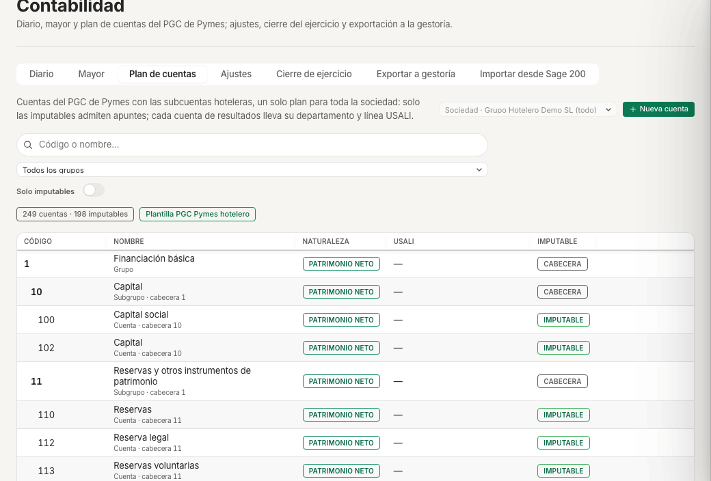
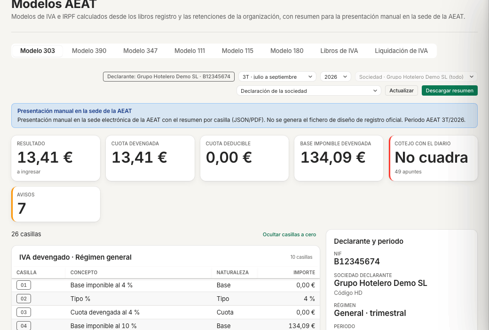
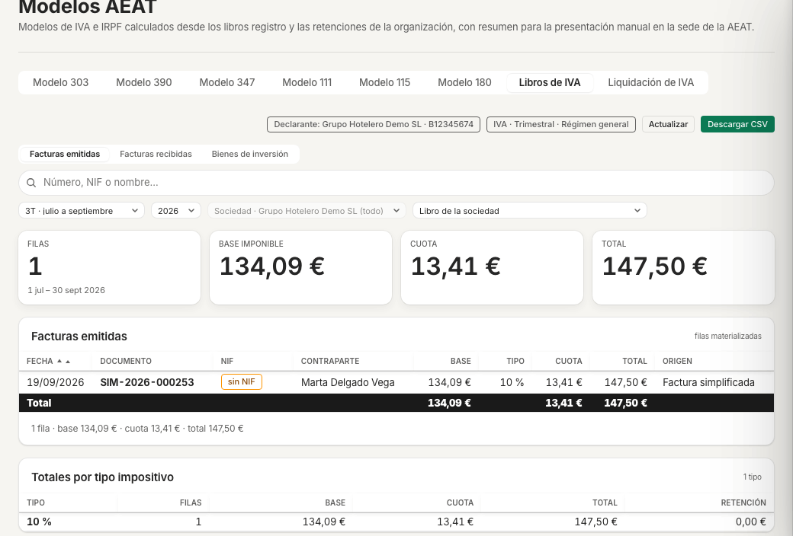
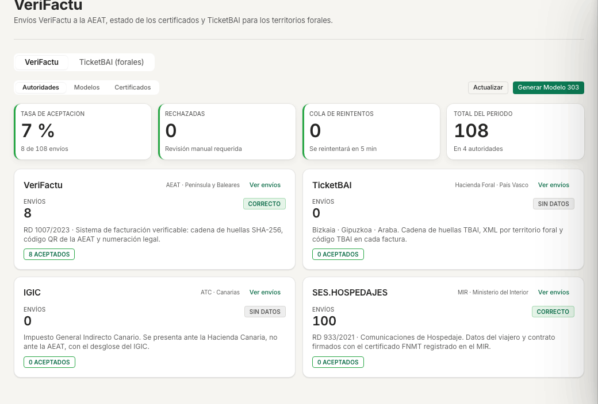
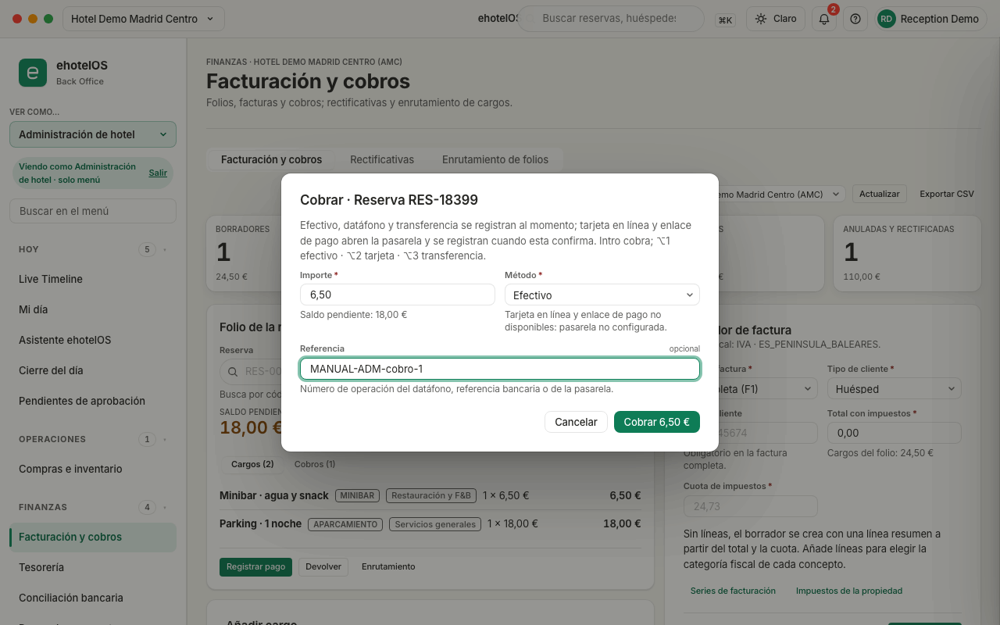
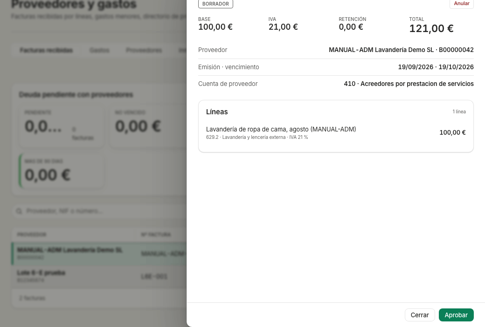
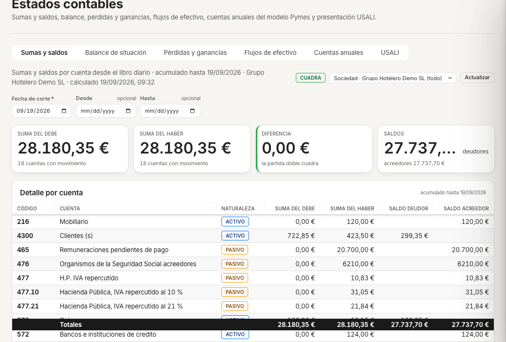

# Guía de administración y contabilidad · ehotelOS

Esta guía explica cómo llevar en ehotelOS la contabilidad, la facturación, los cobros, los impuestos y las obligaciones con la Administración: desde el plan de cuentas y el diario hasta el Modelo 303, VeriFactu, los partes de viajeros, la tesorería, los proveedores y los estados contables. Cada tarea está recorrida en la aplicación tal como está hoy; cuando algo está en construcción o funciona en modo de pruebas, se dice.

## Para quién

| Plantilla de usuario | Qué hace con esta guía |
|---|---|
| **Administración de hotel** | Caja y cobros, facturas y rectificativas, proveedores y gastos, partes de viajeros, cierre del día. Ve el menú «Administración de hotel» (13 entradas). |
| **Contabilidad** | Todo lo anterior más el plan contable, el diario y el mayor, la importación desde Sage 200, los libros de IVA y los modelos de la AEAT, los estados contables y la exportación a la gestoría. |
| **Dirección financiera** | Lo mismo que Contabilidad, con la vista de toda la sociedad: tesorería y previsión, cuentas anuales, USALI por centro y estructura societaria. |
| **Cumplimiento** | VeriFactu, envíos a autoridades, modelos AEAT, impuestos, registro de viajeros y protección de datos. |

Las tres últimas plantillas comparten el menú «Finanzas» (32 entradas). Si tu menú tiene 13 entradas, tienes la plantilla «Administración de hotel»: la tabla «Qué apartado exige qué plantilla» te dice qué capítulos no podrás abrir.

## Cómo están hechas las capturas

- Todas las capturas son del hotel de demostración «Hotel Demo Madrid Centro» (código AMC) de la sociedad «Grupo Hotelero Demo SL» (NIF de demostración B12345674), con su segundo centro «Hotel Demo Tenerife Sur» (ATS). Los huéspedes, proveedores, facturas, asientos y partes son ficticios; los datos que creamos al recorrer esta guía llevan el prefijo «MANUAL-ADM».
- Se han tomado con la cuenta de demostración y el selector «Ver como…» de la barra lateral puesto en «Finanzas» (aparece el aviso «Viendo como Finanzas · solo menú») o en «Administración de hotel» («Viendo como Administración de hotel · solo menú»), según el capítulo. «Ver como…» solo cambia el menú y se pierde al recargar la página (F5).
- Tema claro, ventana de 1280 × 800, español, septiembre de 2026. Están recortadas al área de contenido (sin barra lateral ni cabecera) y, en «Facturación y cobros», con la tarjeta de instrucciones de la pantalla cerrada.
- La fecha de negocio de la demo es el 14/09/2026 (no se ha ejecutado ningún cierre del día); las cifras de tesorería y del Modelo 303 son las de ese estado y no sirven de referencia para tu hotel.

> **Nota:** los formularios de alta que se abren por el lado derecho (los «cajones»: «Nuevo asiento», «Nueva cuenta», «Nuevo proveedor», «Nueva factura recibida», «Nueva cuenta bancaria», «Nueva rectificativa») y las fichas de factura («Ver detalle» y la ficha de la factura recibida con «Aprobar») se han abierto y descrito tal como son, sin pulsar su botón final salvo donde la guía dice que se hizo (el asiento manual de 2.2, el borrador de 5.3, el proveedor y la factura recibida de 8.3). Las ventanas centradas («Registrar pago» / «Cobrar», «Devolver», «Crear ejercicio» y las confirmaciones) se ven y funcionan igual; «registrar-pago.png» es una de ellas. Las doce capturas de esta guía se regeneran con el lote `img/administracion/capturas.json` (ver el [README del manual](README.md)); las de la importación de Sage (`importar-sage.png`), el centro de facturación (`facturacion.png`) y el cobro (`registrar-pago.png`) llevan en el lote los pasos previos (el fichero de ejemplo de 3.1 embebido, la reserva ficticia elegida y la ventana rellena) y nunca pulsan «Contabilizar» ni «Cobrar».

## Qué verás en tu menú

### Con la plantilla «Administración de hotel» («Ver como…» = «Administración de hotel»)

Al entrar aterrizas en «Finanzas › Facturación y cobros» (`/finanzas/facturacion`). El pie del menú dice **«5 categorías · 13 entradas»**:

- **Hoy (5):** Live Timeline · Mi día · Asistente ehotelOS · Cierre del día · Pendientes de aprobación.
- **Operaciones (1):** Compras e inventario.
- **Finanzas (4):** Facturación y cobros · Tesorería · Conciliación bancaria · Proveedores y gastos.
- **Cumplimiento (2):** Bandeja de cumplimiento · Registro de viajeros (pestañas «Partes de entrada» y «SES.Hospedajes»).
- **Informes (1):** Centro de informes.

En «Mi día» solo ves la pestaña «Recepción» y no tienes el botón «+ Nueva reserva» de la barra superior.

### Con la plantilla «Contabilidad», «Dirección financiera» o «Cumplimiento» («Ver como…» = «Finanzas»)

Aterrizas en «Hoy › Mi día › Dirección» (`/hoy/direccion`). El pie del menú dice **«6 categorías · 32 entradas»**:

- **Hoy (6):** Live Timeline · Mi día · Asistente ehotelOS · Cierre del día · Pendientes de aprobación · Informe IA del día.
- **Operaciones (2):** Compras e inventario · Activos.
- **Finanzas (8):** Facturación y cobros · Tesorería · Conciliación bancaria · Contabilidad · Estados contables · Proveedores y gastos · Comisiones · Nóminas.
- **Cumplimiento (9):** Bandeja de cumplimiento · Centro de cumplimiento · VeriFactu · Envíos a autoridades · Modelos AEAT · Impuestos · Registro de viajeros · Protección de datos · Sostenibilidad.
- **Informes (4):** Centro de informes · Analítica · Rentabilidad por habitación · Cartera de propiedades.
- **Configuración (3):** Estructura societaria · Facturación y pagos · Contabilidad y fiscal.

### Qué apartado exige qué plantilla

| Apartado | Administración de hotel | Contabilidad · Dirección financiera · Cumplimiento · Dirección |
|---|---|---|
| Facturación y cobros, folios, rectificativas, enrutamiento | Sí | Sí |
| Tesorería, Conciliación bancaria, Proveedores y gastos | Sí | Sí |
| Registro de viajeros («Partes de entrada», «SES.Hospedajes») | Sí | Sí (además «Autoridades» y «Conservación») |
| Bandeja de cumplimiento, Cierre del día | Sí | Sí |
| **Contabilidad** (diario, mayor, plan, ajustes, cierre de ejercicio, gestoría, Sage 200) | No | Sí |
| **Estados contables** (sumas y saldos, balance, PyG, flujos, cuentas anuales, USALI) | No | Sí |
| **Modelos AEAT** (303, 390, 347, 111, 115, 180, libros de IVA, liquidación) | No | Sí |
| **VeriFactu** y **Envíos a autoridades** | No | Sí |
| **Impuestos** (IVA/IGIC/IPSI por concepto, tasa turística) | No | Sí |
| **Estructura societaria** | No | Sí |
| Comisiones, Nóminas, Centro de cumplimiento, Protección de datos | No | Sí |

Si necesitas uno de los apartados marcados «No», pide a quien administra ehotelOS que te asigne la plantilla «Contabilidad» o «Dirección financiera» (guía [60 · Sistemas](60-sistemas.md)).

## Ámbito: sociedad o centro

Casi todas las pantallas de Finanzas y Cumplimiento llevan arriba un selector de ámbito con tres valores: «Sociedad · Grupo Hotelero Demo SL (todo)», «Centro · Hotel Demo Madrid Centro (AMC)» y «Centro · Hotel Demo Tenerife Sur (ATS)». La cabecera de la pantalla te lo recuerda: «FINANZAS · GRUPO HOTELERO DEMO SL» cuando miras toda la sociedad y «FINANZAS · HOTEL DEMO MADRID CENTRO (AMC)» cuando miras un centro. El plan de cuentas, los ejercicios, los modelos de la AEAT, el balance, las cuentas anuales, los flujos de efectivo y la exportación a la gestoría se llevan siempre por sociedad («agrega los 2 centros de trabajo bajo un solo NIF y no se filtra por centro»); el diario, el mayor, la tesorería, la PyG y el USALI admiten el desglose por centro.

---

## 1. Plan contable y ejercicios (plantilla Contabilidad o Dirección financiera)

### 1.1 Abrir Contabilidad

1. Ve a «Menú › Finanzas › Contabilidad» (`/finanzas/contabilidad`).
2. Comprueba la cabecera «FINANZAS · GRUPO HOTELERO DEMO SL» y el título «Contabilidad» con el subtítulo «Diario, mayor y plan de cuentas del PGC de Pymes; ajustes, cierre del ejercicio y exportación a la gestoría.».
3. Fíjate en las siete pestañas: «Diario · Mayor · Plan de cuentas · Ajustes · Cierre de ejercicio · Exportar a gestoría · Importar desde Sage 200».

**Resultado esperado:** la pestaña «Diario» abierta con la lista «Asientos del diario».

### 1.2 Revisar el plan de cuentas

1. Abre la pestaña «Plan de cuentas» (`/finanzas/contabilidad/plan-de-cuentas`). La descripción dice «Cuentas del PGC de Pymes con las subcuentas hoteleras, un solo plan para toda la sociedad: solo las imputables admiten apuntes; cada cuenta de resultados lleva su departamento y línea USALI.».
2. Usa el filtro «Todos los grupos» para quedarte con un grupo («1 · Financiación básica» … «7 · Ventas e ingresos») y la casilla «Solo imputables» para ocultar las cabeceras. El contador dice «249 cuentas · 198 imputables» y la plantilla es «PGC Pymes hotelero».
3. En cada fila verás CÓDIGO, NOMBRE, NATURALEZA (por ejemplo «PATRIMONIO NETO», «ACTIVO», «GASTOS»), USALI y la etiqueta «CABECERA» o «IMPUTABLE». Las cuentas imputables llevan las acciones «Ver mayor» y «Editar»; las cabeceras solo «Editar».


*Plan de cuentas de la sociedad: grupos, subgrupos y cuentas imputables con su naturaleza y su línea USALI.*

### 1.3 Crear una subcuenta

1. Pulsa «Nueva cuenta». Se abre el cajón «Nueva cuenta» («El código fija la posición en el plan; la naturaleza se hereda de su cabecera.»).
2. Rellena «Código*» (grupo, subgrupo, cuenta o subcuenta: `4300`, `705.1`, `477.21`), «Naturaleza*» («Activo · Pasivo · Patrimonio neto · Ingresos · Gastos») y «Nombre*». Deja marcada «Admite apuntes» salvo que sea una cabecera («Las cabeceras (grupos y subgrupos) no admiten apuntes; una cuenta con apuntes no puede convertirse en cabecera.»).
3. Si es una cuenta de resultados, en «Presentación USALI» elige «Departamento» («Habitaciones», «Alimentos y bebidas», «Administración y general»…) y después «Línea» («Ingresos», «Coste de ventas», «Costes de personal», «Otros gastos»…).
4. Pulsa «Crear cuenta».

**Resultado esperado:** la cuenta aparece en la lista bajo su cabecera con la etiqueta «IMPUTABLE». Para cambiar el nombre o el departamento de una cuenta existente usa «Editar» en su fila; nunca se borran cuentas.

**Si algo falla:** si el código ya existe o no cuelga de ninguna cabecera, el cajón te lo indica bajo el campo «Código*»; corrige el código y vuelve a pulsar «Crear cuenta».

### 1.4 Ajustes de la sociedad

1. Abre la pestaña «Ajustes» (`/finanzas/contabilidad/ajustes`): «Mes de inicio del ejercicio, periodicidad y régimen del IVA, figura impositiva y estado de la proyección contable de la sociedad.».
2. Comprueba los indicadores «PLAN DE CUENTAS · Provisionado · PGC Pymes hotelero», «CUENTAS · 249» y «PERIODICIDAD DEL IVA · Trimestral · Régimen general».
3. Revisa «Mes de inicio*» (enero para el año natural), «Régimen*» («Régimen general», «Devolución mensual (REDEME)», «Recargo de equivalencia»), «Periodicidad*» («Trimestral (régimen general)» o «Mensual (REDEME o gran empresa)»), «Figura impositiva*» («IVA (península y Baleares)», «IGIC (Canarias)», «IPSI (Ceuta y Melilla)») y, si tienes actividad exenta, «Prorrata» en porcentaje.
4. Pulsa «Guardar» solo si cambias algo. El bloque «Proyección contable» («EN COLA · CONTABILIZADOS · IGNORADOS · FALLIDOS») es informativo; «Re-proyectar…» vuelve a generar los asientos de documentos que fallaron.

> **Nota:** la periodicidad y el régimen que guardes aquí son los que usan los libros de IVA y el Modelo 303. En la demo la sociedad está en régimen general, trimestral, con figura IVA.

### 1.5 Ejercicios fiscales (describir sin cerrar)

1. Abre la pestaña «Cierre de ejercicio» (`/finanzas/contabilidad/cierre-ejercicio`). La descripción resume el proceso: «Cierre según el PGC: asiento de regularización (6xx y 7xx contra 129), asiento de cierre al último día y asiento de apertura al primer día del ejercicio siguiente. Nada se borra: reabrir genera reversos.».
2. El ejercicio se lleva por sociedad («agrega los 2 centros de trabajo bajo un solo NIF y no se filtra por centro»). En la demo el bloque «Ejercicios fiscales» dice «Aún no hay ejercicios fiscales» y avisa: «Sin ejercicio, los asientos se numeran por año natural y no se puede cerrar ni regularizar. Crea el primero con su código y sus fechas.».
3. Para dar de alta el ejercicio pulsa «Crear ejercicio»: en la ventana «Nuevo ejercicio fiscal» (una ventana centrada, que sí se ve) rellena «Código*» (normalmente el año, por ejemplo `2026`), «Inicio*» y «Fin*» y pulsa «Crear» («Cancelar» la cierra sin guardar). Con el ejercicio creado, la misma pestaña muestra sus periodos y los botones de regularización, cierre y reapertura.

> **Nota:** no crees ni cierres ejercicios en la demo: el cierre genera asientos reales de regularización y apertura que no se borran (reabrir genera reversos). Hazlo en tu sociedad solo con la gestoría delante y después de cuadrar «Sumas y saldos» (capítulo 9).

---

## 2. Diario y asientos (plantilla Contabilidad o Dirección financiera)

### 2.1 Consultar el diario

1. Abre «Menú › Finanzas › Contabilidad» (`/finanzas/contabilidad`), pestaña «Diario»: «Libro diario de la sociedad: cada asiento con su número, fecha contable, origen, centro de trabajo y estado. Nada se borra: una anulación es otro asiento.».
2. Elige el ámbito (toda la sociedad o un centro) y filtra por «Desde» / «Hasta», «Origen» («Todos los orígenes», «Cargo en folio», «Cobro», «Factura emitida», «Factura recibida», «Nómina», «Diario importado de Sage 200», «Asiento manual», «Anulación»…), «Estado» («Todos · Contabilizados · Anulados · Borradores»), «Cuenta» o el buscador «Concepto, documento…».
3. La tabla «Asientos del diario» muestra FECHA, Nº ASIENTO (por ejemplo «257 / 2026»), CONCEPTO con el documento debajo, ORIGEN, IMPORTE y ESTADO («CONTABILIZADO», «ANULADO», «ASIENTO DE ANULACIÓN»). Pulsa una fila para ver sus apuntes (cuenta, concepto, debe y haber) y «Exportar CSV» para descargar lo filtrado.


*Diario de la sociedad: el asiento de anulación «260 / 2026» y el asiento manual «259 / 2026» anulado que creamos en 2.2 y 2.3, seguidos de las facturas y cobros de la demo.*

### 2.2 Registrar un asiento manual

1. Pulsa «Nuevo asiento». Se abre el cajón «Nuevo asiento manual» («Al menos dos líneas con importes positivos en el debe o en el haber; el asiento tiene que cuadrar.»).
2. Rellena «Fecha contable*» («Fija el ejercicio y el periodo del asiento.») y «Centro de trabajo»: «Sociedad (sin centro)» solo para asientos de la propia sociedad; «Los gastos e ingresos (grupos 6 y 7) llevan siempre un hotel o la oficina central».
3. Escribe «Concepto*» (obligatorio) y, si quieres, «Documento» (número de factura, contrato o nota interna).
4. En «Líneas», elige «Cuenta 1» y «Cuenta 2» en el desplegable «Elegir cuenta…» y escribe el importe en «Debe» o en «Haber» de cada línea; «Añadir línea» añade más. Los totales «SUMA DEL DEBE», «SUMA DEL HABER» y «DIFERENCIA» se recalculan al momento; la diferencia tiene que quedar en «0,00 €».
5. Pulsa «Contabilizar…». Aparece la confirmación «¿Contabilizar el asiento?» con el aviso «Operación de alto riesgo: el asiento queda numerado en el ejercicio con fecha … por … € y solo se puede deshacer con un asiento de anulación.» y el resumen de las líneas. Pulsa «Contabilizar».

**Resultado esperado:** el asiento aparece el primero en el diario con su número («259 / 2026» en nuestro recorrido), origen «Asiento manual» y estado «CONTABILIZADO». En la demo lo hicimos con 1,00 € entre «570 · Caja, euros» (debe) y «555 · Partidas pendientes de aplicación» (haber) y concepto «MANUAL-ADM- asiento de prueba del manual (1 €)».

**Si algo falla:** si dejas el concepto vacío, el cajón muestra el bloque «Antes de contabilizar» con «El concepto del asiento es obligatorio.» y el botón «Contabilizar…» queda desactivado; lo mismo ocurre si el asiento no cuadra o una línea de los grupos 6 o 7 va sin centro.

### 2.3 Anular un asiento

1. En la fila del asiento pulsa «Anular». Se abre «¿Anular el asiento 259 / 2026?» con la explicación «Se contabiliza un asiento de anulación que invierte cada línea; el original se conserva marcado como anulado. Si el documento ya se declaró, emite una rectificativa en lugar de anular.».
2. Escribe el «Motivo*» y decide la «Fecha de la anulación» («Con la fecha del original la anulación cae en su mismo periodo; con la de hoy, en el periodo actual.»).
3. Pulsa «Anular asiento».

**Resultado esperado:** el aviso «Asiento 259 / 2026 anulado con el asiento 260 / 2026.», el original pasa a «ANULADO» y aparece un asiento nuevo «Anulación del asiento 2026/259: …» con la etiqueta «ASIENTO DE ANULACIÓN» y las líneas invertidas. Ninguno de los dos desaparece del diario.

### 2.4 Mayor de una cuenta

1. Abre la pestaña «Mayor» (`/finanzas/contabilidad/mayor`): «Apuntes de una cuenta con su saldo inicial, el saldo corrido tras cada movimiento y los totales exactos del periodo.».
2. Elige la cuenta en «Cuenta*» («Elegir cuenta…»; hay «198 cuentas imputables») o llega desde «Ver mayor» en el plan de cuentas. Acota con el ámbito y las fechas.
3. «Descargar CSV» exporta los apuntes; «Ver el plan de cuentas» vuelve al plan.

**Resultado esperado:** la lista de apuntes de la cuenta con el saldo corrido y los totales del periodo. Las parejas de anulación aparecen ambas (el original y su reverso).

---

## 3. Importar desde Sage 200 (plantilla Contabilidad o Dirección financiera)

ehotelOS puede recibir la contabilidad que hoy llevas en Sage 200: «Trae el plan, los ejercicios, el diario, los libros de IVA, los terceros y los saldos de Sage 200 a ehotelOS con un mapa de cuentas y otro analítico; reconcilia con el balance de Sage y revierte lotes enteros.». Aquí recorremos el asistente hasta la previsualización; **no confirmes la importación en la demo**.

> **Nota:** en el hotel de demostración no hay lotes importados: no contabilices el lote de ejemplo (la demo se usa en pruebas automáticas que comparan sus asientos). En tu sociedad, importa por meses y solo después de cuadrar con la gestoría.

### 3.1 Preparar el fichero

1. Abre «Menú › Finanzas › Contabilidad › Importar desde Sage 200» (`/finanzas/contabilidad/importar-sage200`). Verás las subpestañas «Importar · Reconciliación · Lotes» y, en «Importar», el asistente con los pasos «1. Fichero · 2. Cuentas · 3. Analítica · 4. Revisión · 5. Resultado».
2. En «1 · Fichero» elige el «Tipo de lote»: «Plan de cuentas», «Ejercicios y apertura», «Diario», «Libros de IVA», «Clientes y proveedores» o «Sumas y saldos por periodo». Para «Diario», la ayuda dice «Asientos completos de un rango (apuntes, analítica y bloque de factura e IVA): un asiento por asiento Sage y centro, con el número de Sage como referencia. Un lote por mes o trimestre.».
3. Pulsa «Descargar plantilla canónica» para obtener el CSV con las cabeceras exactas (separador «;», UTF-8 con BOM). Para el diario son: `empresa;ejercicio;asiento;fecha;periodo;cuenta;debe;haber;concepto;documento;canal;delegacion;departamento;seccion;proyecto;serie;factura;fecha_factura;nif;nombre;base_iva;tipo_iva;cuota_iva;tipo_factura`.
4. También se admiten el Excel o CSV que exporta Sage («En Sage 200: Diario del mes con «Enviar a Excel» y desglose analítico, o el CSV de asientos de 60 columnas (formato de importación) generado desde SQL.»). Límites que indica la pantalla: «.xlsx · .csv · .txt · .json», «Máximo 20 MB, 250.000 filas y 20.000 asientos por lote», «el XML «Datos contables» de Sage todavía no se admite» y «El fichero no se guarda: solo el lote y el resultado por asiento.».

Ejemplo ficticio que usamos en la demo (dos asientos de agosto de 2026 imputados al centro AMC, con proveedores inventados):

```
empresa;ejercicio;asiento;fecha;periodo;cuenta;debe;haber;concepto;documento;canal;delegacion;departamento;seccion;proyecto;serie;factura;fecha_factura;nif;nombre;base_iva;tipo_iva;cuota_iva;tipo_factura
1;2026;1501;2026-08-05;8;6280001;250,00;;MANUAL-ADM Electricidad agosto;F-778;;AMC;POM;;;;;;;;;;;
1;2026;1501;2026-08-05;8;4720021;52,50;;MANUAL-ADM IVA soportado 21 %;F-778;;AMC;;;;;;;;;250,00;21;52,50;R
1;2026;1501;2026-08-05;8;4000000042;;302,50;MANUAL-ADM Suministros Demo SL;F-778;;AMC;;;;;F-778;2026-08-05;B00000042;SUMINISTROS DEMO SL;;;;
1;2026;1502;2026-08-12;8;6290002;100,00;;MANUAL-ADM Lavandería agosto;L-2026-31;;AMC;ROOMS;;;;;;;;;;;
1;2026;1502;2026-08-12;8;4720021;21,00;;MANUAL-ADM IVA soportado 21 %;L-2026-31;;AMC;;;;;;;;;100,00;21;21,00;R
1;2026;1502;2026-08-12;8;4000000043;;121,00;MANUAL-ADM Lavandería Demo SL;L-2026-31;;AMC;;;;;L-2026-31;2026-08-12;B00000059;LAVANDERIA DEMO SL;;;;
```

### 3.2 Recorrer el asistente hasta la revisión

1. Con «Tipo de lote» en «Diario», pulsa «Elegir fichero de Sage 200» y selecciona el CSV. El análisis es automático y el asistente pasa solo a «Paso 2 de 5: Cuentas».
2. **2 · Cuentas.** «Resuelve cada cuenta de Sage sin mapear: cuenta existente, subcuenta nueva, agrupar el tercero o bloquear; guarda el mapa para los lotes siguientes.» El sistema propone un destino por cuenta («cuenta existente del plan (4770021 → 477.21), subcuenta nueva (623.2), agrupación del tercero en 4300 / 400 / 410 con el nombre en la descripción, o bloqueo»). Con el fichero de ejemplo dice «0 cuentas pendientes · 0 guardadas» y «Todas las cuentas del fichero resuelven con el mapa guardado»; desmarca «Solo pendientes» si quieres revisar el mapa completo. «Guardar mapa» conserva tus decisiones para los lotes siguientes; «Aplicar y continuar» vuelve a analizar el fichero con ellas y avanza.
3. **3 · Analítica.** «Elige qué dimensión de Sage identifica el hotel y cuál el departamento USALI, asigna cada código a un centro y decide qué hacer con los apuntes sin analítica.» Elige «Dimensión del centro de trabajo» («Canal · Delegación · Departamento · Sección · Proyecto»; en el ejemplo, «Delegación» = AMC), «Dimensión del centro de coste» y qué hacer con los «Apuntes de gasto o ingreso sin analítica» («Bloquear el lote hasta asignar centro», «Imputar a la oficina central», «Imputar a Hotel Demo Madrid Centro (AMC)»…). Pulsa «Aplicar y continuar».
4. **4 · Revisión.** «Comprueba asientos, apuntes, debe y haber por mes y centro, los documentos propios excluidos, los ya importados y los avisos antes de contabilizar.» Con el ejemplo verás «ASIENTOS 2 · APUNTES 6 · DEBE 423,50 € · HABER 423,50 € (Cuadra con el Debe) · EXCLUIDOS (PROPIOS) 0 · YA IMPORTADOS 0 · AVISOS 3», las tablas «Asientos por mes» y «Asientos por centro», el bloque «Antes de contabilizar» con los avisos (por ejemplo «El ejercicio ya tiene 62 asientos propios: la numeración de ehotelOS quedará intercalada; el número de Sage se conserva en la referencia de cada asiento.») y las «Opciones del lote»: la casilla «Balance de sumas y saldos de Sage del mismo periodo» (reconcilia al contabilizar) y «Notas del lote».
5. **Para en este punto.** El botón «Contabilizar 2 asientos» escribe el lote en el diario; en la demo no lo pulses. En tu sociedad, al contabilizar pasas a «5 · Resultado» con el resumen por asiento y, si marcaste el balance, la reconciliación.


*Asistente de importación en el paso «4 · Revisión»: totales que cuadran, avisos y opciones del lote antes de contabilizar.*

**Resultado esperado (tras contabilizar en tu sociedad):** los asientos aparecen en el diario con origen «Diario importado de Sage 200» y el número de Sage en su referencia; la subpestaña «Lotes» lista el lote (en la demo dice «Todavía no hay lotes importados desde Sage 200.») y permite revertirlo entero; «Reconciliación» compara Sage (nivel 0) con el diario por cuenta y periodo.

**Si algo falla:** si el paso 2 muestra cuentas pendientes, resuélvelas (cuenta existente, subcuenta nueva, agrupar o bloquear) antes de «Aplicar y continuar»; si el paso 4 avisa de documentos «EXCLUIDOS (PROPIOS)», son facturas que ehotelOS ya emitió y que el modo sombra omite para no duplicarlas; si un mes ya está importado, el lote se omite («YA IMPORTADOS»).

---

## 4. Libros de IVA y modelos de la AEAT (plantilla Contabilidad, Dirección financiera o Cumplimiento)

### 4.1 Modelo 303 del trimestre

1. Abre «Menú › Cumplimiento › Modelos AEAT» (`/cumplimiento/modelos-aeat`): «Modelos de IVA e IRPF calculados desde los libros registro y las retenciones de la organización, con resumen para la presentación manual en la sede de la AEAT.». Pestañas: «Modelo 303 · Modelo 390 · Modelo 347 · Modelo 111 · Modelo 115 · Modelo 180 · Libros de IVA · Liquidación de IVA».
2. Comprueba el declarante («Declarante: Grupo Hotelero Demo SL · B12345674»), elige el trimestre («1T · enero a marzo» … «4T · octubre a diciembre») y el año, y el ámbito («Declaración de la sociedad» o «Desglose · Hotel Demo Madrid Centro (AMC) · Hotel»).
3. Lee el resumen: «RESULTADO» (en la demo «13,41 € a ingresar»), «CUOTA DEVENGADA», «CUOTA DEDUCIBLE», «BASE IMPONIBLE DEVENGADA», «COTEJO CON EL DIARIO» («Cuadra» o «No cuadra» con el número de apuntes leídos) y «AVISOS».
4. Revisa las casillas por bloque («IVA devengado · Régimen general», «IVA deducible», «Resultado»); «Ocultar casillas a cero» acorta la lista. Debajo, «Fuentes de los importes» enlaza con «Abrir Libros de IVA» y el bloque «Cotejo con el diario (cuentas 477 y 472)» muestra las «Diferencias entre libros y diario» por tipo.
5. Pulsa «Descargar resumen» para obtener el resumen por casilla (PDF/JSON) y «Mostrar los n avisos» para leer las advertencias. «Actualizar» recalcula.


*Modelo 303 del 3T 2026 de la sociedad de demostración, con el resultado, el cotejo con el diario y las casillas.*

> **Nota:** la presentación es **manual en la sede electrónica de la AEAT**. La pantalla lo dice: «Presentación manual en la sede electrónica de la AEAT con el resumen por casilla (JSON/PDF). No se genera el fichero de diseño de registro oficial.». Copia las casillas del resumen al formulario de la sede.

**Resultado esperado:** el modelo del periodo con el resultado y el cotejo. En la demo el cotejo dice «No cuadra» porque las facturas heredadas de prueba se contabilizaron sin libros materializados (aparece el aviso «Calculado desde los documentos (libros sin materializar)»); en tu sociedad, con los libros reconstruidos, debe decir «Cuadra».

### 4.2 Otros modelos y la liquidación

- «Modelo 390», «Modelo 347», «Modelo 111», «Modelo 115» y «Modelo 180» funcionan igual: elige periodo y año, revisa las casillas y descarga el resumen. En los modelos 111 y 115 el selector va por trimestre.
- «Liquidación de IVA» (`/cumplimiento/modelos-aeat/liquidacion-iva`) propone el «Asiento de liquidación» del trimestre y lo deja listo para contabilizar. En la demo, con «3T · julio a septiembre» y «2026», verás «RESULTADO 13,41 € · A ingresar (H 4750)», el asiento propuesto «3T 2026 · 1 jul – 30 sept 2026» con la línea «477.10 · IVA repercutido al 10 % (cuota devengada del periodo) · 13,41 €» en el debe contra «4750 · Hacienda Pública, acreedora por IVA (resultado a ingresar, casilla 71) · 13,41 €» en el haber (marca «Cuadrado»), las «Casillas del Modelo 303» (27, 45, 46, 110, 78, 87 y 71), el «Cotejo del diario con los libros» (en la demo «No cuadra», con la tabla de diferencias por tipo) y los avisos. Al pie, «Ver el Modelo 303» y el botón **«Contabilizar la liquidación»**, que asienta el resultado del trimestre: la pantalla avisa «El periodo termina el 30/09/2026: la liquidación se contabiliza al cierre.». **No lo pulses en la demo**; en tu sociedad, solo con el trimestre terminado y cotejado con la gestoría.

### 4.3 Libros registro de IVA

1. Abre la pestaña «Libros de IVA» (`/cumplimiento/modelos-aeat/libros-iva`). Subpestañas: «Facturas emitidas · Facturas recibidas · Bienes de inversión».
2. Elige «Todo el ejercicio 2026» o un trimestre, el año y el ámbito («Libro de la sociedad» o el desglose por centro). Arriba verás «FILAS», «BASE IMPONIBLE», «CUOTA» y «TOTAL».
3. Cada fila trae FECHA, DOCUMENTO, NIF, CONTRAPARTE, BASE, TIPO, CUOTA, TOTAL y ORIGEN («Factura simplificada», «Factura completa», «Rectificativa»). Al pie, «Totales por tipo impositivo».
4. «Descargar CSV» exporta las filas que ves en pantalla.


*Libro de facturas emitidas del 3T 2026: la factura simplificada SIM-2026-000253 de la reserva ficticia de Marta Delgado Vega.*

> **Nota:** el CSV de esta pantalla se genera con las filas mostradas y no es un fichero oficial; el fichero para la gestoría se obtiene en «Contabilidad › Exportar a gestoría» con el formato «Libros registro de IVA (CSV)» (capítulo 9). El botón «Reconstruir libros» (cuando aparece) regenera los libros desde los documentos: no lo uses en la demo.

### 4.4 Tipos de IVA por concepto y tasa turística

1. Abre «Menú › Cumplimiento › Impuestos» (`/cumplimiento/impuestos`), pestaña «IVA, IGIC e IPSI»: «Tipos de IVA / IGIC / IPSI por concepto de folio, con su base legal y vigencia.».
2. Comprueba la región («Península y Baleares (IVA)») y la tabla «Tipos por concepto»: «Alojamiento 10 %», «Restauración y F&B 10 %», «Servicios generales 21 %», «Transporte de viajeros 10 %», «Tasa turística 10 %» y «No sujeto (no-show, cancelación) NO SUJETA», cada uno con su CALIFICACIÓN («Sujeta (S1)», «No sujeta (N1)»), FUENTE («Catálogo» o manual), BASE LEGAL y VIGENTE DESDE.
3. «Editar» en una fila permite sobrescribir el tipo con fecha de vigencia («El cambio solo afecta a cargos y facturas posteriores.»); «Restaurar catálogo» vuelve a los tipos legales; «Ajustes fiscales» y «Centro fiscal» abren la configuración de la propiedad.
4. La pestaña «Tasa turística» (`/cumplimiento/impuestos/tasa-turistica`) lista las tarifas por comunidad autónoma; en la demo está vacía («Sin tarifas catalogadas») y ofrece «Sembrar tarifas 2026» (Cataluña, Baleares y País Vasco) o «Nueva tarifa».

**Si algo falla:** «No tienes permiso para modificar la configuración fiscal (compliance.configure).» al pulsar «Editar» significa que tu plantilla no incluye ese permiso (lo tienen Cumplimiento y Dirección financiera). Sin tipos vigentes para alojamiento, restauración y servicios generales no se puede emitir factura en modo fiscal (bloqueo «TAX_NOT_CONFIGURED»).

---

## 5. Facturación y VeriFactu

### 5.1 El centro de facturación

1. Abre «Menú › Finanzas › Facturación y cobros» (`/finanzas/facturacion`). Pestañas: «Facturación y cobros · Rectificativas · Enrutamiento de folios». El selector de centro ofrece «Centro · Hotel Demo Madrid Centro (AMC)» y «Centro · Hotel Demo Tenerife Sur (ATS)»; «Exportar CSV» descarga las facturas del centro.
2. Arriba están los indicadores «BORRADORES», «EMITIDAS», «PENDIENTES DE COBRO», «PAGADAS» y «ANULADAS Y RECTIFICADAS».
3. En «Folio de la reserva», escribe en «Reserva» el código, el titular o el huésped principal (por ejemplo `RES-18399`) y elige la reserva en «Resultados» («24 reservas · llegadas más recientes»; «Más resultados» amplía la lista). El folio muestra «abierto · EUR» o «cerrado · EUR», el enlace «Abrir folio», los indicadores «SALDO PENDIENTE», «CARGOS» y «COBRADO NETO» y las listas «Cargos (n)» y «Cobros (n)», con los botones «Registrar pago», «Devolver» y «Enrutamiento».
4. «Añadir cargo» registra una línea en el folio abierto: «Tipo*» («Alojamiento», «Desayuno», «Minibar», «Aparcamiento», «Ajuste»…), «Concepto*», «Categoría fiscal*» («10 % · solo las compatibles con el tipo»), «Cantidad*» y «Precio bruto*» («Con impuestos incluidos, como las líneas del folio.»).
5. «Borrador de factura» crea la factura a partir del folio (5.3). Debajo, las listas «Borradores (n) · Emitidas (n) · Pendientes (n) · Pagadas (n) · Anuladas (n)» con el buscador «Número, cliente, NIF…» y «Ver detalle» en cada fila. Al pie, «Logo y avisos legales de la factura».


*Centro de facturación con la reserva ficticia RES-18399 (Marc Vidal Puig) elegida: folio abierto con dos cargos, un cobro y el formulario de borrador.*

### 5.2 Abrir el folio completo

1. Pulsa «Abrir folio» en el centro de facturación o entra desde el detalle de la reserva. La dirección es `/finanzas/facturacion/folios/<id del folio>` (en la demo, `/finanzas/facturacion/folios/cmu80mv9e0116fygb5s0xa5hu` es el folio de RES-18399).
2. La pestaña «Folio» muestra el estado («ABIERTO»), las subpestañas «Cargos · Cobros · Enrutamiento», los botones «Cobrar», «Devolver», «Dividir folio» y «Cerrar folio», la tabla «Cargos del folio» (DESCRIPCIÓN, TIPO, CATEGORÍA FISCAL, CANTIDAD × PRECIO, FECHA, TOTAL), el bloque «Saldo» («SALDO PENDIENTE», «CARGOS», «COBRADO NETO»), la reserva («RES-18399 · Marc Vidal Puig · 18–20 sept», «Abrir reserva») y «Otros folios de la reserva».


*Folio de RES-18399 tras el cobro parcial de 6,50 €: cargos de minibar y aparcamiento, saldo pendiente de 18,00 €.*

> **Nota:** la pestaña «Folio» exige el **identificador del folio**, no el de la reserva. Si pegas el id de la reserva verás «No se pudo cargar el folio» con el detalle «Folio no encontrado.». Entra siempre por «Abrir folio» o por el detalle de la reserva.

### 5.3 Crear el borrador de factura (sin emitir)

1. En el centro de facturación, con la reserva elegida, ve a «Borrador de factura» («Perfil fiscal: IVA · ES_PENINSULA_BALEARES.»).
2. Elige «Tipo de factura*» («Completa (F1)» o «Simplificada (F2)») y «Tipo de cliente*» («Huésped», «Empresa», «Agencia»). En la completa, «NIF del cliente» es obligatorio.
3. Si el folio mezcla tipos de IVA (en la demo, minibar al 10 % y aparcamiento al 21 %), pulsa «Añadir línea» por cada concepto y rellena «Concepto*», «Cantidad*», «Precio bruto*» y «Categoría fiscal» («Alojamiento», «Restauración y F&B», «Servicios generales»…). El pie muestra «Total 24,50 € · cuota 3,71 €». Si el folio va a un solo tipo, basta con «Total con impuestos*» y «Cuota de impuestos*» («Sin líneas, el borrador se crea con una línea resumen a partir del total y la cuota.»).
4. Pulsa «Crear borrador».

**Resultado esperado:** el aviso «Borrador creado (24,50 €). Emítelo desde su detalle.», «Borradores (1)» y la fila en estado «BORRADOR». «Ver detalle» abre la ficha con la sociedad emisora, el establecimiento, las líneas, el «Desglose de impuestos» y los botones «Cerrar» y «Emitir factura». El borrador no tiene número ni huella: sigue siendo editable.

> **Nota:** la ficha que abre «Ver detalle» es un cajón lateral. En un borrador se titula «Factura» seguido del identificador interno (el número de serie nace al emitir), indica «Simplificada (F2) · Huésped» o el tipo y cliente que elegiste, muestra «Sociedad emisora», «Establecimiento», «Cliente», la tabla «Líneas de la factura», el «Desglose de impuestos» y el «Total factura», y ofrece «Cerrar» y «Emitir factura». En una factura ya emitida el título es su número («Factura SIM-2026-000253»), lleva el estado («Pagada»), la marca «Líneas congeladas al emitir», los botones «Enviar por correo», «Rectificar» y «Anular», la «Huella VeriFactu» y, al pie, «Cerrar» y «Descargar PDF». Lo que sigue en 5.4 se describe sin emitir nada en la demo; el PDF de una factura ya emitida se descarga también desde «Rectificativas» («Descargar PDF» en cada fila).

**Si algo falla:** «El tipo impositivo implícito (17,85 %) no es un tipo de IVA válido (21 o 10 %). Indica las líneas con su tipo o categoría, o ajusta el total y los impuestos.» aparece cuando creas el borrador solo con total y cuota y el folio mezcla tipos: añade las líneas con su categoría.

### 5.4 Emitir, descargar, enviar y anular (describir)

1. Abre «Ver detalle» del borrador y pulsa «Emitir factura». La emisión asigna el número de la serie del centro («FAC-2026-» completa, «SIM-2026-» simplificada), congela las líneas del folio («LÍNEAS CONGELADAS AL EMITIR»), calcula la huella VeriFactu y contabiliza el asiento (D 4300 / H 705.x / H 477.x) en la misma operación.
2. En el detalle de una factura emitida (por ejemplo «SIM-2026-000253», en «Pagadas (1)») verás el estado («PAGADA»), la «HUELLA VERIFACTU» y los botones «Enviar por correo», «Rectificar», «Anular», «Cerrar» y «Descargar PDF». El PDF incorpora el código QR de VeriFactu.
3. Para anular indica el motivo; si la separación de funciones lo exige, un supervisor presente autoriza con su PIN. Una factura emitida es inmutable: para corregirla usa «Rectificar».

> **En construcción:** el envío por correo está simulado mientras no haya proveedor de correo configurado (la pantalla lo indica al enviar). Emitir en la demo consume un número de la serie y entra en la cadena de huellas: no lo hagas salvo que te lo pidan.

### 5.5 Rectificativas (describir sin ejecutar)

1. Abre la pestaña «Rectificativas» (`/finanzas/facturacion/rectificativas`). Verás «ESTE MES», «TOTAL EMITIDAS», «IMPORTE RECTIFICADO», «MOTIVO MÁS FRECUENTE», la tabla «Facturas rectificativas» (RECTIFICATIVA, RECTIFICA A, MOTIVO, MODALIDAD, FECHA, CLIENTE, TOTAL, ESTADO, «Descargar PDF») y el reparto «Por motivo AEAT» («R1 · Error en derecho», «R2 · Concurso», «R3 · Incobrables», «R4 · Otras causas», «R5 · Simplificadas»). En la demo hay una: «REC-2026-000001» rectifica a «FAC-2026-000006».
2. «Nueva rectificativa» abre el cajón «Factura rectificativa» («Motivo AEAT R1–R5, por diferencias (I) o por sustitución (S). La original nunca se edita.»). Elige la «Factura emitida» en el desplegable (o pega su «Identificador» y pulsa «Cargar»): el cajón carga la factura con su total, sus impuestos y la marca «LÍNEAS CONGELADAS AL EMITIR».
3. En «Motivo y modalidad» elige el «Motivo AEAT*» («R1 · Error fundado en derecho (art. 80.1 y 80.2 LIVA)», «R2 · Concurso de acreedores (art. 80.3 LIVA)», «R3 · Créditos incobrables (art. 80.4 LIVA)», «R4 · Otras causas», «R5 · Rectificativa de facturas simplificadas») y la «Modalidad*» («Anulación completa por diferencias (I)», «Ajuste de líneas por diferencias (I)», «Sustitución de la factura (S)»; «Por diferencias: la rectificativa solo recoge la variación.»). La «Vista previa» muestra el total y los impuestos de la rectificativa (por ejemplo «Total -147,50 € · impuestos -13,41 €» para una anulación completa).
4. «Emitir rectificativa» la numera en la serie «REC-2026-», la envía a VeriFactu y contabiliza el asiento inverso. También puedes empezar desde «Rectificar» en el detalle de la factura. No lo hagas en la demo.

> **En construcción:** la modalidad «Ajuste de líneas por diferencias (I)» está bloqueada con aviso en pantalla hasta que el detalle de la factura exponga el identificador de cada línea; usa la anulación completa o la sustitución.

### 5.6 Enrutamiento de folios

En la pestaña «Enrutamiento de folios» (`/finanzas/facturacion/enrutamiento`) eliges la reserva («Elige una reserva» o «Identificador de la reserva» + «Cargar folios») y defines reglas para que cada nuevo cargo vaya al folio del huésped, de la empresa pagadora o de la agencia. En el folio completo, la subpestaña «Enrutamiento» y «Dividir folio» hacen lo mismo para una reserva concreta.

### 5.7 VeriFactu y envíos a autoridades (plantilla Cumplimiento, Contabilidad o Dirección financiera)

1. Abre «Menú › Cumplimiento › VeriFactu» (`/cumplimiento/verifactu`): «Envíos VeriFactu a la AEAT, estado de los certificados y TicketBAI para los territorios forales.». Pestañas «VeriFactu · TicketBAI (forales)»; subpestañas «Autoridades · Modelos · Certificados».
2. Lee los indicadores «TASA DE ACEPTACIÓN», «RECHAZADAS» («Revisión manual requerida»), «COLA DE REINTENTOS» («Se reintentará en 5 min») y «TOTAL DEL PERIODO», y las tarjetas por autoridad: «VeriFactu · AEAT · Península y Baleares» (en la demo «ENVÍOS 8 · CORRECTO · 8 ACEPTADOS»), «TicketBAI · Hacienda Foral · País Vasco» y «IGIC · ATC · Canarias» («SIN DATOS»: no aplican a un hotel peninsular) y «SES.HOSPEDAJES · MIR · Ministerio del Interior». «Ver envíos» abre el detalle; «Generar Modelo 303» salta a Modelos AEAT.


*Panel de VeriFactu: ocho envíos aceptados en modo de pruebas y las tarjetas de TicketBAI, IGIC y SES.Hospedajes. La «TASA DE ACEPTACIÓN 7 % · 8 de 108 envíos» y la tarjeta «SES.HOSPEDAJES · ENVÍOS 100 · CORRECTO · 0 ACEPTADOS» se explican por los 100 envíos SES antiguos descartados de pruebas anteriores (ver 7.2): inflan el total y el porcentaje, y el «CORRECTO» de SES solo indica que no hay rechazos vivos, no que haya partes aceptados.*

3. Abre «Menú › Cumplimiento › Envíos a autoridades» (`/cumplimiento/envios`): «VeriFactu, SES.Hospedajes, TicketBAI e IGIC: abre una fila para ver el XML firmado, la respuesta de la autoridad y los reintentos. La tabla se actualiza sola cada 12 s mientras haya envíos pendientes.». Pestañas «VeriFactu · TicketBAI · IGIC · SES.HOSPEDAJES».
4. Cada fila muestra ESTADO («ACEPTADO» con la marca «SIMULADO · NO ENVIADO» en la demo), FACTURA, IDENTIFICADOR (con «CSV»), ENVIADO, INTENTOS y «Ver detalle».

> **En construcción:** VeriFactu está en **modo de pruebas**. La pantalla lo avisa: «Modo de pruebas · Los envíos marcados como «Simulado» no han salido del sistema: no se han remitido a la Administración. El envío real requiere configurar el modo producción y el certificado del establecimiento.». Además, la declaración del software está incompleta (faltan la razón social, el NIF y el número de instalación del productor). Hasta entonces las huellas y los QR son válidos técnicamente pero no tienen valor ante la AEAT.

---

## 6. Cobros y cierres de caja

### 6.1 Registrar un cobro en el folio

1. En «Finanzas › Facturación y cobros», elige la reserva (en la demo, `RES-18399 · Marc Vidal Puig`) y pulsa «Registrar pago». En el folio completo el mismo botón se llama «Cobrar».
2. Se abre la ventana «Cobrar · Reserva RES-18399» («Efectivo, datáfono y transferencia se registran al momento; tarjeta en línea y enlace de pago abren la pasarela y se registran cuando esta confirma.»). Es una ventana centrada: se ve y funciona sin ninguna corrección (comprobado el 19/09/2026).
3. Escribe el «Importe*» (bajo el campo se lee «Saldo pendiente: 24,50 €»; puede ser parcial), elige «Método*» («Efectivo», «Tarjeta (datáfono)», «Tarjeta en línea», «Transferencia», «Enlace de pago», «Otro») y, si lo tienes, la «Referencia» (número de operación del datáfono o referencia bancaria).
4. Pulsa «Cobrar».


*Ventana «Cobrar · Reserva RES-18399» con un cobro parcial de 6,50 € en efectivo y su referencia, antes de confirmar.*

**Resultado esperado:** el folio pasa a «SALDO PENDIENTE 18,00 €», «COBRADO NETO 6,50 €» y «Cobros (1)»; en el diario aparece un asiento «Cobro» («Cobro efectivo folio guest») y en «Tesorería › Últimos cobros» la fila «Efectivo · 6,50 €». Eso es lo que hicimos en la demo con la referencia «MANUAL-ADM-cobro-1».

**Si algo falla:** «Tarjeta en línea y enlace de pago no disponibles: pasarela no configurada.» aparece en la propia ventana: no hay proveedor de pagos conectado, así que esos dos métodos no se pueden usar todavía. «Devolver» abre la ventana «Devolver un cobro» (también visible) y registra una devolución sobre un cobro; por encima de tu tramo pide el PIN de un supervisor.

### 6.2 Cierre del día (describir, no ejecutar)

1. Abre «Menú › Hoy › Cierre del día» (`/hoy/cierre-del-dia`): «Comprobaciones guiadas antes de cerrar: si algo bloquea, te dice qué arreglar y dónde. Fecha de negocio actual: 14/09/2026.».
2. Revisa las nueve «Comprobaciones previas al cierre»: «Llegadas pendientes», «No-shows sin resolver», «Folios abiertos con saldo», «Salidas sin check-out», «Cargos de alojamiento pendientes», «Habitaciones ocupadas marcadas sucias», «Cargos del TPV sin pasar a folio», «Facturas pendientes» y «Preautorizaciones sin capturar», cada una con «CORRECTO · n» o «BLOQUEA · n» y, cuando bloquea, «Ver n elemento» y «Abrir cola operativa».
3. Cuando todo está en verde el botón es «Cerrar día»; si algo bloquea, la cabecera dice «No puedes cerrar todavía» (en la demo: «No puedes cerrar todavía: 1 folios abiertos con saldo.» por el folio de RES-18399) y solo queda «Cerrar de todos modos», que exige motivo y queda auditado. El «Historial de cierres» lista los cierres ejecutados (en la demo, «Todavía no se ha ejecutado ningún cierre del día en esta propiedad.»).

> **Nota:** no cierres el día en la demo: el cierre carga la noche de alojamiento a las reservas alojadas, marca como no-show las llegadas no resueltas y avanza la fecha de negocio. En tu hotel es tarea de auditoría nocturna o de dirección; la guía [10 · Dirección](10-direccion.md) lo describe.

### 6.3 Cierre de caja del punto de venta

> **Módulo a activar:** el «Cierre de caja» del TPV (`/operaciones/tpv/cierre-de-caja`: «Abrir caja» con el fondo, «Cerrar» con el recuento y «Aprobar») exige el módulo «Punto de venta» (`outlet_pos`), apagado en el hotel de demostración. Se activa en «Menú › Configuración › Módulos e integraciones» (guía [60 · Sistemas](60-sistemas.md)). Sin ese módulo, la caja se controla con los cobros en efectivo del folio y el saldo de «CAJA (570)» en Tesorería.

---

## 7. Partes de viajeros (plantilla Administración de hotel o superior)

### 7.1 Crear y encolar un parte

1. Abre «Menú › Cumplimiento › Registro de viajeros» (`/cumplimiento/registro-viajeros`): «Partes de entrada de viajeros (RD 933/2021), envío a SES.Hospedajes y a las autoridades, y conservación de los datos.». Pestañas «Partes de entrada · SES.Hospedajes» (con plantilla Finanzas, además «Autoridades» y «Conservación»).
2. Lee los indicadores «n PARTES», «ACEPTADOS», «DATOS INCOMPLETOS», «EN COLA» y «RECHAZADOS O FALLIDOS» y los botones «Conector SES.Hospedajes», «Bandeja de cumplimiento» y «Actualizar».
3. En «Crear parte de entrada» («Datos del viajero, residencia, contacto y contrato. Los campos marcados son obligatorios para SES.Hospedajes; el parte se crea y su envío se encola en la misma acción.») rellena «Identificador de la reserva*», «Nombre*», «Primer apellido*», «Segundo apellido», «Tipo de documento*» («DNI», «Pasaporte», «TIE»), «Número de documento*», «Número de soporte (DNI/TIE)», «Nacionalidad*» (código de dos letras), «Fecha de nacimiento*», «Dirección de residencia*», «Localidad*», «País*», «Teléfono móvil», «Correo electrónico», «Número de viajeros*», «Referencia del contrato*», «Entrada» y «Salida».
4. Pulsa «Crear y encolar el envío» («Limpiar» vacía el formulario).


*Registro de viajeros del hotel de demostración: siete partes en «DATOS INCOMPLETOS» y el formulario «Crear parte de entrada».*

**Resultado esperado:** el parte aparece en la tabla «Partes de viajeros» (HUÉSPED, DOCUMENTO, ESTADO, RESERVA, CREADO, CONSERVAR HASTA) y su envío entra en la cola. Los partes creados en el check-in de recepción aparecen aquí sin que tengas que hacer nada. En la demo hay 7 partes (los cuatro de las entradas ficticias «MANUAL» más tres antiguos), todos en «DATOS INCOMPLETOS» porque el establecimiento no tiene aún los códigos del MIR.

**Si algo falla:** «Reintentar envío» vuelve a encolar un parte fallido o incompleto una vez corregidos los datos. «CONSERVAR HASTA» es la fecha legal de retención (tres años desde la salida).

### 7.2 Conector SES.Hospedajes

1. Abre la pestaña «SES.Hospedajes» (`/cumplimiento/registro-viajeros/ses-hospedajes`). Arriba, el estado del conector (en la demo «CONFIGURACIÓN PENDIENTE»), los botones «Probar conexión» y «Generar lote de exportación» y los indicadores «CÓDIGOS DE ESTABLECIMIENTO Y ARRENDADOR» («Faltan»), «DATOS DEL ESTABLECIMIENTO» («Completos»), «WEB SERVICE» («Bloqueado») y «RECHAZADOS O FALLIDOS».
2. El bloque «Establecimiento» muestra el «Nº de registro turístico», el NIF del titular, la razón social, la dirección, el «Código INE del municipio», la provincia, el código postal y el país (se editan en «Perfil del establecimiento» y «Ajustes fiscales»).
3. En «Códigos, credenciales y política de cola» se rellenan «Código de establecimiento*», «Código de arrendador*», «Usuario del web service», «Referencia del secreto» («Nunca se almacena el secreto en claro»), «Hora del lote diario», «Aviso antes del plazo (horas)», «Retención de registros (años)» y los interruptores «Conector activo», «Actividad profesional (RD 933/2021)», «Exportación por lotes», «Envío automático (cola 24 h)», «Web service en producción» y «Esquema o plantilla oficial cargado». «Guardar configuración» aplica los cambios.
4. Debajo, el «Historial de partes enviados» (TIPO, RESERVA, ESTADO, REFERENCIA O ERROR, INTENTOS, ENVIADO) con «Ver XML» y «Reintentar» por fila y los filtros «Todos los estados · En cola · Reintentando · Aceptados · Rechazados · Fallidos».

> **En construcción:** SES.Hospedajes está en **modo de pruebas**: los partes van a un simulador y el conector de la demo está «CONFIGURACIÓN PENDIENTE» (faltan los códigos de establecimiento y arrendador del MIR). El historial de la demo conserva envíos antiguos «FALLIDO (MÁX. INTENTOS)» con el error «SES_DISCARDED» de pruebas anteriores; no los reintentes.

### 7.3 Bandeja de cumplimiento

«Menú › Cumplimiento › Bandeja de cumplimiento» (`/cumplimiento/bandeja`) reúne «Todo lo que requiere atención humana en un solo sitio: envíos rechazados, periodos fiscales a punto de cerrar y certificados que caducan, en VeriFactu, TicketBAI, IGIC y SES.Hospedajes. Se actualiza cada 15 s.». Muestra «CRÍTICAS», «AVISOS», «INFORMACIÓN» y «TOTAL DE ALERTAS»; en la demo, «Nada que atender · No hay envíos rechazados ni periodos fiscales vencidos.». Con plantilla Finanzas, las pestañas «Autoridades» y «Conservación» del registro de viajeros muestran las reglas de enrutamiento por autoridad (en España, «SES.HOSPEDAJES (Ministerio del Interior)»; en Cataluña, «Mossos d'Esquadra») y la política de retención («Partes de viajeros y acuses de la autoridad · 3 años», imágenes de documentos «no se conservan»), ambas «Política fija, no configurable todavía».

---

## 8. Cartera, tesorería y proveedores

### 8.1 Tesorería

1. Abre «Menú › Finanzas › Tesorería» (`/finanzas/tesoreria`): «Cobros, pagos y posición de tesorería; tipos de cambio para facturas en otra divisa.». Pestañas «Tesorería · Tipos de cambio».
2. Elige el ámbito («Sociedad · Grupo Hotelero Demo SL (todo)» o un centro). La etiqueta «SOLO LIBRO CONTABLE» indica que, sin cuentas bancarias con extracto, la posición sale del saldo contable de 572 («La sociedad no tiene cuentas bancarias registradas: se muestra el saldo contable de 572.»).
3. Lee «CAJA Y BANCOS», «PENDIENTE DE COBRO», «PENDIENTE DE PAGO», «DATÁFONO Y PASARELA» («pendiente de liquidar»), «% COBRADO DEL MES» y «POSICIÓN NETA»; la «Previsión de tesorería» a 30, 60 y 90 días; los bloques «Cuentas bancarias» («CAJA (570)»), «Cuentas a cobrar» (facturas emitidas y folios abiertos por vencimiento, «Documentos pendientes de cobro»), «Cuentas a pagar» (facturas recibidas, nóminas, comisiones, obligaciones fiscales), «Principales deudores» y «Últimos cobros». La previsión, las cuentas a cobrar y las cuentas a pagar llevan un enlace «Cómo se calcula».
4. «Tipos de cambio» (`/finanzas/tesoreria/tipos-de-cambio`) permite «Añadir tipo de cambio» («Divisa base*», «Divisa cotizada*», «Tipo*», «Fecha efectiva*», «Fuente», «Guardar tipo») para facturas en otra divisa; en la demo no hay ninguno.

### 8.2 Conciliación bancaria

1. Abre «Menú › Finanzas › Conciliación bancaria» (`/finanzas/conciliacion`): «Extractos bancarios frente a los pagos del hotel, con importación CSB-43 y remesas SEPA.». Pestañas «Conciliación bancaria · Extractos y remesas».
2. En la demo no hay cuentas («Sin cuentas bancarias · Crea la cuenta del hotel para importar sus extractos y conciliarlos con el libro.»). «Nueva cuenta bancaria» abre el cajón con «Nombre*», «Banco», «IBAN» («Sirve para reconocer la cuenta en los ficheros Cuaderno 43 y en las remesas SEPA.»), «Cuenta del PGC» («572 Bancos o una subcuenta 572x.») y «Saldo inicial (€)»; «Crear cuenta» la da de alta.
3. En «Extractos y remesas» (`/finanzas/conciliacion/extractos-remesas`), subpestaña «Extractos Cuaderno 43» («texto fijo de 80 columnas · los duplicados no se repiten»): elige la «Cuenta bancaria» o deja «Detectar por el IBAN del fichero», marca «Buscar coincidencias al importar» y «Crear la cuenta si el IBAN es nuevo», pulsa «Elegir fichero» (o pega el contenido) y «Importar y buscar coincidencias». Después concilias cada movimiento en «Conciliación bancaria». «Remesas SEPA (0)» y «Nueva remesa» generan los ficheros de remesa (se descargan y se suben al banco a mano).

> **En construcción:** la demo no tiene cuentas bancarias ni extractos, así que Tesorería trabaja «SOLO LIBRO CONTABLE» y la conciliación no se puede recorrer con datos. Las liquidaciones de datáfono y pasarela quedan en «DATÁFONO Y PASARELA · pendiente de liquidar» hasta que llegue el extracto.

### 8.3 Proveedores, facturas recibidas y gastos (plantilla Administración de hotel o superior)

1. Abre «Menú › Finanzas › Proveedores y gastos» (`/finanzas/proveedores`): «Facturas recibidas por líneas, gastos menores, directorio de proveedores e inmovilizado con su amortización.». Pestañas «Facturas recibidas · Gastos · Proveedores · Inmovilizado».
2. **Dar de alta el proveedor.** En «Proveedores» (`/finanzas/proveedores/directorio`; filtros «Activos · Todos · Inactivos») pulsa «Nuevo proveedor». En el cajón rellena «Nombre*», «NIF / CIF» («El NIF o CIF se comprueba con su dígito de control y no puede repetirse en la organización.»; sin él «las facturas no entran en el libro de IVA recibidas»), «País», el contacto y la dirección, «IBAN» (módulo 97), «Plazo de pago (días)», «Cuenta de gasto habitual» (por ejemplo «629.2 · Lavandería y lencería externa») y, si retiene IRPF, «Retención IRPF (%)» y «Modelo de la retención» («Profesionales · modelo 111», «Arrendamientos urbanos · modelo 115»). Pulsa «Crear proveedor». En la demo creamos «MANUAL-ADM Lavandería Demo SL» con el CIF ficticio B00000042: la fila muestra «VALIDADO», «30 días», «629.2» y «ACTIVO».
3. **Registrar la factura recibida.** En «Facturas recibidas» pulsa «Nueva factura recibida» («Se guarda como borrador; después se aprueba y se contabiliza»). Elige el «Proveedor del directorio» (o «Sin ficha: indicar nombre y NIF»), escribe «Nº de factura*», «Fecha de emisión*», «Vencimiento» y «Cuenta de proveedor» («Automática (400 compras · 410 servicios)»). En «Líneas» rellena por concepto «Descripción*», «Cuenta*» (grupo 6, o 20x/21x si marcas «Bien de inversión»), «Base imponible*», «Tipo de IVA*» («21 %», «10 %», «4 %», «0 % · exento o no sujeto», IGIC) y «Cuota impresa» si difiere en céntimos; «Añadir línea» añade más. Abajo, «Retención IRPF (%)», «Total impreso en la factura» y «Adjuntar archivo». Pulsa «Guardar borrador».
4. Se abre la ficha «Factura MANUAL-ADM-001 · MANUAL-ADM Lavandería Demo SL · Borrador» con «BASE 100,00 € · IVA 21,00 € · RETENCIÓN 0,00 € · TOTAL 121,00 €», las líneas y los botones «Anular», «Cerrar» y «Aprobar». En tu hotel el circuito sigue con «Aprobar» y «Contabilizar» (asiento D 6xx / D 472 / H 400 o 410) y «Registrar pago» al pagarla (D 400 / H 572); en la demo la dejamos en «BORRADOR».

   > **Nota:** esta ficha es un cajón lateral que se abre al guardar o al pulsar la fila en «Facturas recibidas» (título «Factura MANUAL-ADM-001», subtítulo «MANUAL-ADM Lavandería Demo SL · Borrador», bloque «Líneas» y botones «Anular», «Cerrar» y «Aprobar»). En la demo no se ha pulsado «Aprobar».


*Facturas recibidas del centro: la factura ficticia MANUAL-ADM-001 en «BORRADOR» y la deuda pendiente por vencimiento.*

5. **Gastos menores.** En «Gastos» (`/finanzas/proveedores/gastos`; filtros «Cualquier forma de pago · Efectivo · Tarjeta · Banco», «Ver anulados») «Nuevo gasto» registra tiques y gastos pagados en caja, con tarjeta o por banco («cada uno se contabiliza al momento»).
6. **Inmovilizado.** En «Inmovilizado» (`/finanzas/proveedores/inmovilizado`) verás «ELEMENTOS», «COSTE DE ADQUISICIÓN», «AMORTIZACIÓN ACUMULADA» y «VALOR NETO CONTABLE», el «Registro de inmovilizado» (ELEMENTO, ADQUISICIÓN, COEFICIENTE, COSTE, AMORTIZADO, VALOR NETO, ESTADO) y el bloque «Amortización mensual» («Las corridas van mes a mes, sin huecos.», botón «Contabilizar <mes>», «Historial de corridas»). «Nuevo elemento» da de alta un activo con su coeficiente. En la demo un elemento heredado aparece «SIN CONFIGURAR» («sin categoría, coeficiente o cuentas (completa la ficha del elemento)») y queda fuera de la corrida.

**Resultado esperado:** proveedor en el directorio, factura en «Facturas recibidas» con su estado («BORRADOR», «APROBADA», «CONTABILIZADA», «PAGADA», «ANULADA») y la «Deuda pendiente con proveedores» por vencimiento («NO VENCIDO», «1–30 DÍAS», «31–60 DÍAS», «61–90 DÍAS», «MÁS DE 90 DÍAS»). Al contabilizar, la factura entra en el libro de facturas recibidas (capítulo 4).

**Si algo falla:** «Elige un proveedor del directorio o escribe su nombre.» significa que dejaste el proveedor sin indicar; sin NIF la factura se guarda pero no se puede contabilizar («Necesario para contabilizar y deducir el IVA.»).

---

## 9. Estados contables y exportaciones (plantilla Contabilidad o Dirección financiera)

### 9.1 Sumas y saldos, balance, PyG y flujos

1. Abre «Menú › Finanzas › Estados contables» (`/finanzas/estados-contables`): «Sumas y saldos, balance, pérdidas y ganancias, flujos de efectivo, cuentas anuales del modelo Pymes y presentación USALI.». Pestañas «Sumas y saldos · Balance de situación · Pérdidas y ganancias · Flujos de efectivo · Cuentas anuales · USALI».
2. «Sumas y saldos» muestra «SUMA DEL DEBE», «SUMA DEL HABER», «DIFERENCIA» («la partida doble cuadra») y «SALDOS», con la marca «CUADRA», la «Fecha de corte*» y el «Detalle por cuenta» (CÓDIGO, CUENTA, NATURALEZA, SUMA DEL DEBE, SUMA DEL HABER, SALDO DEUDOR, SALDO ACREEDOR); pulsar una fila abre el mayor de la cuenta.


*Sumas y saldos de la sociedad de demostración: 14 cuentas con movimiento y la partida doble cuadrada.*

3. «Balance de situación» (`/finanzas/estados-contables/balance`): «Modelo de Pymes» con «TOTAL ACTIVO», «PATRIMONIO NETO», «TOTAL PASIVO», «CUADRE» y «RESULTADO DEL PERIODO», el «Periodo» («Ejercicio en curso», «Ejercicio anterior», «Trimestre en curso», «Trimestre anterior», «Mes en curso», «Fechas a medida»), «Comparar con el periodo anterior», «Partidas a cero» y la descarga en «PDF», «Hoja de cálculo (XLSX)» o «CSV» («Descargar»). Se lleva por sociedad.
4. «Pérdidas y ganancias» (`/finanzas/estados-contables/perdidas-y-ganancias`): «INGRESOS» (grupo 7), «GASTOS» (grupo 6), «RESULTADO DE EXPLOTACIÓN», «RESULTADO FINANCIERO», «ANTES DE IMPUESTOS» y «RESULTADO DEL EJERCICIO», con las vistas «Sociedad» y «Por centro» y las mismas opciones de periodo y descarga.
5. «Flujos de efectivo» (`/finanzas/estados-contables/flujos`): «TESORERÍA INICIAL», «VARIACIÓN NETA», «TESORERÍA FINAL» y el detalle por actividades (explotación, inversión, financiación) con «DESDE / HASTA» y «Recalcular»; la marca «CUADRA CON EL LIBRO» confirma la conciliación con el diario.

### 9.2 Cuentas anuales y USALI

1. «Cuentas anuales» (`/finanzas/estados-contables/cuentas-anuales`): subpestañas «Resumen · Balance · Pérdidas y ganancias · Patrimonio neto · Memoria · Instantáneas». Elige «Ejercicio fiscal» o «Por fechas» (en la demo «La sociedad no tiene ejercicios registrados: se calcula por fechas.») y «Mostrar el periodo anterior». El resumen comprueba la coherencia («Las cuentas son coherentes»: «Activo = patrimonio neto + pasivo», «Resultado del balance = resultado de la cuenta de pérdidas y ganancias», «Estado de cambios en el patrimonio neto conciliado») y la «Memoria» separa las notas «AUTOMÁTICAS» («Redactadas desde el libro») de las que «REQUIEREN TU APORTACIÓN» («1. Actividad de la empresa», «3. Aplicación de resultados», «12. Operaciones con partes vinculadas», «13. Otra información», «14. Hechos posteriores al cierre»). «Descargar PDF», «Descargar Hoja de cálculo» y «Descargar CSV» exportan el juego; «Instantáneas» guarda una copia antes de entregarla.
2. «USALI» (`/finanzas/estados-contables/usali`): subpestañas «Cuenta de explotación · Por centro · Comparar periodos · Mapeo de cuentas»; periodo «Mes en curso · Trimestre en curso · Año en curso · Personalizado». Muestra «INGRESOS OPERATIVOS», «GOP», «EBITDA», «RESULTADO NETO», «REVPAR», «TREVPAR», «GOPPAR» y «OCUPACIÓN», la tabla «Departamentos operativos» (Habitaciones, Alimentos y bebidas, Otros departamentos operados, Ingresos varios) y «Gastos no distribuidos» (Administración y general, Tecnología de la información, Ventas y marketing, Mantenimiento y operación de la propiedad, Suministros). El aviso «n cuenta del plan sin línea USALI» te lleva a «Mapeo de cuentas».

> **Nota:** las notas de la memoria que requieren tu aportación se redactan en pantalla y se guardan solo en este navegador; no entran en el PDF ni en la hoja de cálculo. Redáctalas en tu documento final.

### 9.3 Exportar a la gestoría

1. Abre «Menú › Finanzas › Contabilidad › Exportar a gestoría» (`/finanzas/contabilidad/exportar-gestoria`): «Asientos y libros de IVA de la sociedad en el formato que importa la gestoría; cada fichero queda en el historial para descargarlo de nuevo.». Se lleva por sociedad.
2. En «Nueva exportación» elige el «Formato*»: «CSV universal de asientos» («Una fila por línea de asiento; separador «;», UTF-8 con BOM, fecha DD/MM/AAAA, coma decimal. Lo importa cualquier gestoría o programa contable.», «FORMATO ESTABLE · 10 columnas: fecha · asiento · cuenta · concepto · debe · haber · documento · nif · base · iva»), «Libros registro de IVA (CSV)», «Diario compatible ContaPlus / Sage 50» (marcado «validar con la gestoría») o «A3 (enlace contable) (no disponible)».
3. Elige el «Centro de trabajo» («Toda la sociedad» o un centro; «los libros de IVA siguen siendo de la sociedad»), «Desde*» y «Hasta*», y pulsa «Generar y descargar».

**Resultado esperado:** el fichero se descarga y queda en «Historial» con su periodo, filas y formato para volver a descargarlo (en la demo, «Aún no hay exportaciones»).

**Si algo falla:** el formato A3 responde que no está disponible («EXPORT_FORMAT_NOT_IMPLEMENTED»); usa el CSV universal.

### 9.4 Estructura societaria

1. Abre «Menú › Configuración › Estructura societaria» (`/configuracion/estructura-societaria`): «Quién factura y dónde se trabaja: la sociedad (NIF, razón social, régimen) y sus centros de trabajo, series e instalaciones VeriFactu.». Pestañas «Datos fiscales · Centros · Series y VeriFactu · IVA y ejercicio · Reparto». La tarjeta «Sociedad» resume razón social, NIF («VÁLIDO»), forma jurídica, plan contable («PGC de Pymes»), IVA («Trimestral · Régimen general»), régimen y «VeriFactu · Cadena por centro»; «Centros · 2 hoteles · 0 oficinas · 0 otros».
2. **Datos fiscales:** «Identidad» («Razón social*», «NIF», «Código de la sociedad*», «Forma jurídica», «CNAE», «CCC principal de la Seguridad Social»), «Domicilio fiscal» («Se imprime en la cabecera de todas las facturas de la sociedad y es el domicilio del 036.») y «Domicilio social y Registro Mercantil»; «Guardar». Aviso: «Cambiar el NIF afecta a todas las facturas futuras de 2 centros · Las facturas ya emitidas conservan su NIF y su razón social; las series que numeraron con el NIF anterior se cierran y se abren otras. Nunca se renumera.».
3. **Centros:** «CENTROS», «HOTELES ABIERTOS», «COLISIONES DE SERIE» y la tabla «Hoteles de la sociedad» (CÓDIGO, CENTRO, TIPO, MUNICIPIO, SERIES, VERIFACTU, ESTADO); «Añadir centro» abre el asistente de alta.
4. **Series y VeriFactu:** «Series de facturación de la sociedad» (CENTRO, SERIE, PREFIJO, AÑO, SIGUIENTE Nº, TIPO, ESTADO, «Cerrar serie») e «Instalaciones VeriFactu de la sociedad» (CENTRO, Nº DE INSTALACIÓN, RUTA, ENVÍOS, ÚLTIMA FACTURA, ESTADO, «Copiar»). «Una serie cerrada nunca vuelve a numerar: para cambiar de prefijo se cierra y se abre otra. Las series nuevas se abren en Configuración › Facturación y pagos.» (el botón «Series de facturación» del centro de facturación lleva allí). En la demo la pantalla avisa de «2 colisiones»: los dos centros comparten el prefijo «FAC-2026-».
5. **IVA y ejercicio:** «PERIODICIDAD EFECTIVA», «VERIFACTU · Aplica», «MODELOS NO PRESENTADOS», la «Propuesta de régimen» según el volumen de operaciones y el «Régimen de la sociedad» («Gran empresa», «Sociedad acogida al SII», «Variante del PGC*»). «El envío de libros al SII no está construido: aquí solo se declara el régimen.».
6. **Reparto:** «Solo informativo · El reparto cambia únicamente los informes USALI y PyG por centro … no se genera ningún asiento.» con el «Método*» («Ninguno · Habitaciones · Ingresos · Plantilla · Porcentajes») y la «Vista previa por hotel». En la demo, «Sin oficina central».

> **Nota:** los cambios de NIF, razón social, régimen, PGC o ejercicio son de alto riesgo y piden confirmación; en la demo no guardes nada en esta pantalla.

---

## 10. Otras pantallas del menú de finanzas y administración

Cuatro pantallas que aparecen en las tablas de «Qué verás en tu menú» y que no tienen capítulo propio arriba. Se han recorrido en la demo el 19/09/2026 con «Ver como…» = «Finanzas» (y «Administración de hotel» para Compras); son pantallas de consulta o con un único formulario en la propia página (no usan cajones laterales).

### 10.1 Centro de cumplimiento

1. Abre «Menú › Cumplimiento › Centro de cumplimiento» (`/cumplimiento/centro`): «Qué obligaciones legales aplican a este hotel, qué documento las justifica, cuándo vencen, quién es responsable y qué riesgo hay si no se cumplen.». Botones «Carpeta de inspección» y «Actualizar».
2. Lee los indicadores «CUMPLIMIENTO» (porcentaje y «n de n obligaciones»), «CRÍTICOS ABIERTOS», «VENCIDOS», «VENCEN PRONTO» («en 30 días o menos») y «PENDIENTES O NO CUMPLEN».
3. Pestañas «Matriz · Documentos · Tareas · Alertas · Asistente IA · Ajustes». En «Matriz» tienes el bloque «Cumplimiento por área» (ÁREA, CUMPLIDOS, PENDIENTES, VENCEN PRONTO, VENCIDOS, NO CUMPLE, CRÍTICOS) y los filtros «Todas las áreas», «Cualquier riesgo» («Crítico · Alto · Medio · Bajo») y «Cualquier estado» («Cumple · No cumple · Pendiente · Vencido · Vence pronto · No aplica · En revisión») sobre la lista de controles.

**Resultado esperado:** en la demo la matriz está vacía («0 CONTROLES», «0 de 0 obligaciones», «Sin controles · No hay controles que coincidan con los filtros.»): la propiedad de demostración no tiene cargadas sus obligaciones. En tu hotel, los controles y sus documentos los da de alta Cumplimiento desde las pestañas «Documentos» y «Tareas»; esta guía no los crea. Las tarjetas «VERIFACTU · SES · TBAI · GDPR» de Mi día de dirección enlazan aquí (guía [10 · Dirección](10-direccion.md)).

### 10.2 Protección de datos (solicitudes RGPD)

1. Abre «Menú › Cumplimiento › Protección de datos» (`/cumplimiento/proteccion-datos`): «Solicitudes RGPD de los huéspedes: acceso, supresión, rectificación y portabilidad.» (etiqueta «ART. 15 / 17»). El texto de cabecera recuerda que «Los registros del libro de viajeros español se conservan tres años (RD 933/2021) salvo que se aplique una excepción de retención explícita.».
2. Indicadores: «PENDIENTES» («abiertas o en curso»), «FUERA DE PLAZO» («más de 30 días sin cerrar») y «COMPLETADAS» («cerradas en los últimos 30 días»).
3. Para registrar una solicitud usa el formulario «Nueva solicitud» de la propia página: «Tipo de solicitud*» («Acceso (DSAR)», «Supresión», «Rectificación», «Portabilidad»), «Correo del interesado*» (el huésped) y «Correo del solicitante*» («identifica a quien la tramita (por ejemplo, el delegado de protección de datos)»). Pulsa «Crear solicitud».
4. La lista «Solicitudes» muestra cada una con su tipo, estado y plazo; en la demo dice «Sin solicitudes RGPD · Todavía no hay solicitudes RGPD. Registra la primera con el formulario.».

**Resultado esperado:** la solicitud aparece en «Solicitudes» y «PENDIENTES» sube en uno; el plazo legal de respuesta es de un mes, por eso «FUERA DE PLAZO» cuenta las que superan 30 días. En la demo esta guía no crea ninguna (el ejercicio A13 del plan de formación sí, con correo ficticio).

### 10.3 Compras e inventario (módulo con datos en memoria)

1. Abre «Menú › Operaciones › Compras e inventario» (`/operaciones/compras`): «Pedidos de compra, proveedores y niveles de existencias en un mismo flujo.». Pestañas «Compras» e «Inventario» (`/operaciones/compras/inventario`); botón «Actualizar».
2. En «Compras» lee «PEDIDOS ABIERTOS» («no cerrados ni cancelados»), «PENDIENTES DE APROBACIÓN» («borrador o enviados»), «VALOR COMPROMETIDO» («aprobados u ordenados, no recibidos»), «RECIBIDO ESTE MES» y «PROVEEDORES ACTIVOS», y los bloques «Pedidos por estado», «Principales proveedores» y «Últimas órdenes de compra».

> **En construcción:** este módulo guarda sus datos **en memoria**: «Módulos e integraciones» avisa «Los datos de Clientes y fidelización y Compras e inventario se guardan por ahora en memoria: se pierden al reiniciar el servidor». En la demo está vacío («No hay órdenes de compra en el periodo», «0 proveedores») y en esta versión no hay alta de pedidos desde la pantalla; los pedidos que superan el umbral llegan a «Pendientes de aprobación» como «Pedido de compra». No lo uses todavía para datos que necesites conservar; los proveedores y sus facturas se llevan en «Proveedores y gastos» (8.3).

### 10.4 Configuración › Facturación y pagos (series y pasarela)

**Menú › Configuración › Facturación y pagos** (`/configuracion/facturacion-pagos`; plantillas de finanzas y dirección). Es la pantalla donde se dan de alta las **series de facturación** del centro y donde se conecta la **pasarela de pago**; «Administración de sistema» no la ve (no tiene claves financieras). Recorrida en la demo el 19/09/2026 sin guardar nada.

1. Pestaña «Facturación» («Series de numeración por tipo de factura y ejercicio, y estado del registro VeriFactu»). El bloque «Series de facturación» («3 ACTIVAS» en la demo) explica la regla: «Cada tipo de factura (completa, simplificada, rectificativa) necesita su serie. Con ejercicio, la numeración se reinicia cada año y el número se asigna al emitir (nunca al crear el borrador).». La tabla «Series de la propiedad» lista «CÓDIGO · PREFIJO · AÑO · PRÓXIMO Nº · TIPO · ACTIVA» («FAC · FAC-2026- · Completa (F1)», «REC · REC-2026- · Rectificativa (R1 · error fundado)», «SIM · SIM-2026- · Simplificada (F2)») con «Editar» en cada fila; «Nueva serie» abre el alta y «Series de toda la sociedad» lleva a Estructura societaria (9.4). La tarjeta «VeriFactu · ACTIVADO» resume el conector («Conector en modo pruebas · certificado sin configurar») con los accesos «Centro fiscal» y «Ajustes fiscales».
2. Pestaña «Pagos» («Pasarela de cobro en línea (PSP) de la propiedad: estado real, modo y qué falta para cobrar; política de reembolsos y conciliación»). El bloque «Pasarela de pago (PSP)» lee el estado real del API (en la demo, «Sin integración»: «Ningún PSP configurado: sin cobros con tarjeta en línea ni enlaces de pago.» y la lista «Qué falta para cobrar en real») y la tabla «Conexiones de demostración (catálogo heredado)» muestra «Demo Payment Gateway (demostración) · mock_payments · DEMOSTRACIÓN · NO COBRA · api_key»: una conexión de demostración que no cobra ni sincroniza, por eso la ventana «Cobrar» avisa «Tarjeta en línea y enlace de pago no disponibles: pasarela no configurada.». «Política de reembolsos» recuerda que «Los reembolsos requieren aprobación de un responsable y nunca almacenan datos de tarjeta en claro: solo el token del PSP y la referencia del cobro.»; «Catálogo de integraciones» lleva a Módulos e integraciones y «Centro de facturación» al capítulo 5.

**Resultado esperado:** sabes en qué pantalla se abre una serie nueva cuando la actual se cierra («SERIES_CLOSED») o cuando dos centros chocan en el prefijo («2 colisiones» en Estructura societaria), y que la pasarela real la conecta aquí dirección financiera o dirección con las credenciales del proveedor de pagos. En la demo no crees series ni cambies la pasarela.

---

## Errores frecuentes

| Mensaje | Dónde aparece | Qué hacer |
|---|---|---|
| «No se pudo cargar el folio» · «Folio no encontrado.» | Pestaña «Folio» de Facturación y cobros | Has usado el id de la reserva. Entra por «Abrir folio» o desde el detalle de la reserva: la dirección lleva el id del **folio**. |
| «El tipo impositivo implícito (17,85 %) no es un tipo de IVA válido (21 o 10 %). Indica las líneas con su tipo o categoría, o ajusta el total y los impuestos.» | «Crear borrador» | El folio mezcla tipos de IVA: pulsa «Añadir línea» y da a cada concepto su «Categoría fiscal». |
| «El concepto del asiento es obligatorio.» (bloque «Antes de contabilizar») | «Nuevo asiento manual» | Rellena «Concepto*»; el botón «Contabilizar…» se activa cuando el asiento cuadra y no falta nada. |
| «Elige un proveedor del directorio o escribe su nombre.» | «Nueva factura recibida» | Selecciona el proveedor o escribe nombre y NIF en «Sin ficha». |
| «No puedes cerrar todavía: n folios abiertos con saldo.» | Cierre del día | Cobra o regulariza los folios que lista «Ver n elemento»; «Cerrar de todos modos» exige motivo y queda auditado. |
| «Tarjeta en línea y enlace de pago no disponibles: pasarela no configurada.» | Ventana «Cobrar» | No hay proveedor de pagos conectado; usa efectivo, datáfono o transferencia. |
| «No tienes permiso para modificar la configuración fiscal (compliance.configure).» | «Impuestos» › «Editar», ajustes fiscales | Tu plantilla no tiene el permiso; pide a Cumplimiento o Dirección financiera que haga el cambio. |
| «Demasiadas peticiones. Reintenta en unos segundos.» (a veces con «Error al cargar» y «Reintentar») | Cualquier pantalla al abrir muchas pestañas seguidas | Espera unos segundos y pulsa «Reintentar» o «Actualizar»; el límite es de 600 peticiones por minuto por usuario. |
| «Modo de pruebas» · «SIMULADO · NO ENVIADO» | Envíos a autoridades | Normal en la demo y hasta activar el modo producción con certificado: nada ha salido hacia la AEAT o el MIR. |
| «DATOS INCOMPLETOS» · «CONFIGURACIÓN PENDIENTE» | Registro de viajeros | Faltan datos del viajero o los códigos de establecimiento y arrendador del MIR en «SES.Hospedajes»; complétalos y «Reintentar envío». |
| «Sin ejercicio, los asientos se numeran por año natural y no se puede cerrar ni regularizar.» | Cierre de ejercicio | Crea el ejercicio con «Crear ejercicio» (solo en tu sociedad, con la gestoría). |
| «CHART_NOT_PROVISIONED» | Ajustes de contabilidad, en una sociedad nueva | La sociedad no tiene plan de cuentas: lo provisiona quien administra ehotelOS (guía [60 · Sistemas](60-sistemas.md)). |
| «TAX_NOT_CONFIGURED» | Emitir factura en modo fiscal | Faltan tipos vigentes en «Cumplimiento › Impuestos» para alojamiento, restauración y servicios generales. |

## Qué no hace todavía

- **VeriFactu y SES.Hospedajes en modo de pruebas:** envíos simulados («SIMULADO · NO ENVIADO»), declaración del software incompleta, conector SES «CONFIGURACIÓN PENDIENTE». TicketBAI e IGIC no aplican a un hotel peninsular.
- **Modelos AEAT:** cálculo y resumen por casilla para presentación **manual** en la sede; no hay fichero de diseño de registro ni presentación telemática. Los modelos 111 y 115 solo se consultan por trimestre.
- **Pasarela de pago:** «Tarjeta en línea» y «Enlace de pago» no disponibles; los cobros se registran a mano. El envío de facturas por correo está simulado sin proveedor de correo.
- **Rectificativa «Ajuste de líneas por diferencias (I)»** bloqueada con aviso; usa anulación completa o sustitución.
- **Conciliación bancaria y tesorería:** sin cuentas bancarias ni extractos en la demo; Tesorería «SOLO LIBRO CONTABLE»; «Remesas SEPA (0)».
- **Exportación A3** no disponible; «Diario compatible ContaPlus / Sage 50» y la exportación de nóminas están marcados «validar con la gestoría».
- **Sage 200:** el XML «Datos contables» no se admite; ficheros de más de 20 MB o 20.000 asientos solo por la herramienta de línea de comandos, troceados por meses. En la demo no hay lotes.
- **Cierre de caja del TPV:** exige el módulo «Punto de venta», apagado en la demo.
- **Compras e inventario** (menú Operaciones): los datos se guardan en memoria y se pierden al reiniciar el servidor (lo avisa «Módulos e integraciones»).
- **Memoria de las cuentas anuales:** las notas que requieren tu aportación se guardan solo en tu navegador y no entran en el PDF.
- **Tasa turística:** catálogo vacío en la demo hasta pulsar «Sembrar tarifas 2026» (carga Cataluña, Baleares y País Vasco) o crear una «Nueva tarifa».
- **Fecha de negocio 14/09/2026:** hasta ejecutar cierres del día, los cargos de alojamiento de las estancias en curso y los indicadores «de hoy» no reflejan la fecha real.

## Ver también

- [00 · Primeros pasos](00-primeros-pasos.md) — acceso, menú, «Ver como…», ⌘K y vocabulario.
- [10 · Dirección](10-direccion.md) — cierre del día, aprobaciones, informes y KPIs.
- [30 · RRHH y nóminas](30-rrhh.md) — contratos, periodos y coste de personal (los asientos 640/642 que ves en el diario).
- [60 · Sistemas](60-sistemas.md) — plantillas de usuario, permisos, módulos (Punto de venta), correo saliente.
- [70 · Recepción](70-recepcion.md) — check-in con cobro, check-out con factura, partes de viajeros desde recepción y cobros en el folio.
- [Preguntas frecuentes](faq.md) — mensajes de error habituales.
- [Fichas rápidas](formacion/fichas/README.md) — «Emitir factura», «Importar Sage», «Salida y cobro», «Cierre del día».
