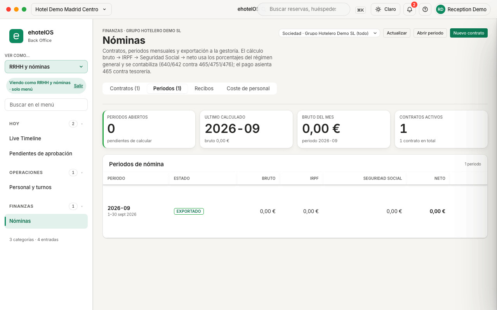
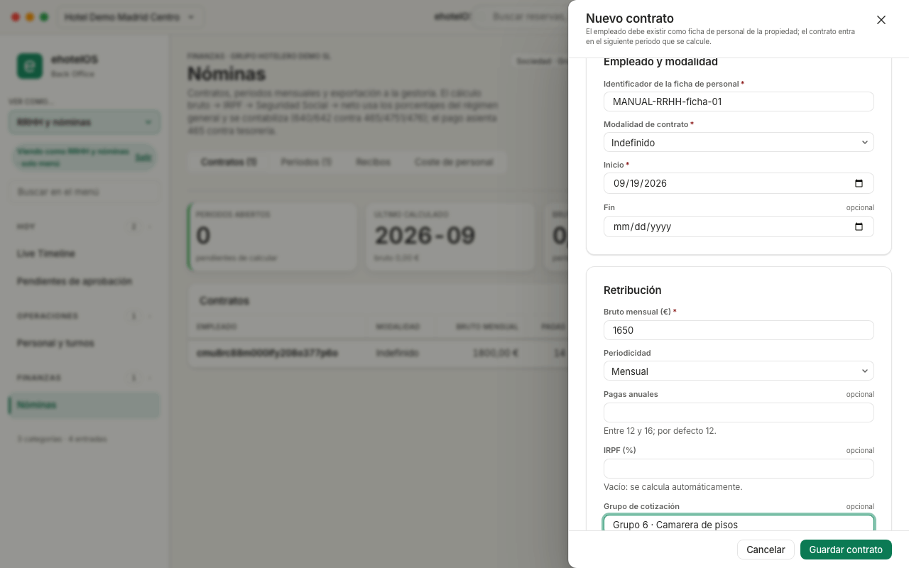
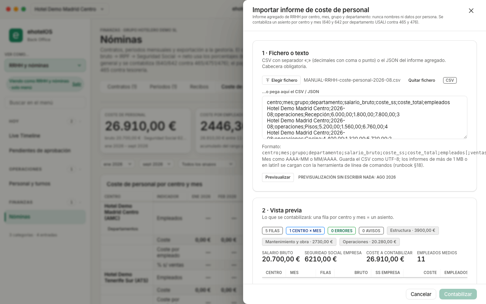
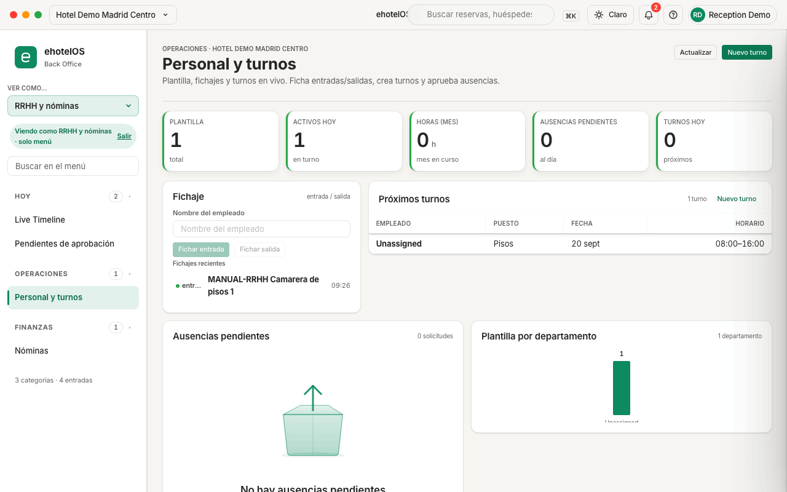

# Guía de RRHH y nóminas · ehotelOS

Esta guía te acompaña por lo que hace en ehotelOS la persona de recursos humanos: preparar la nómina mensual (contratos, periodos, recibos, exportación a la gestoría), cargar el coste de personal que te da RRHH por centro y mes, leer el informe de coste por departamento y llevar los turnos y fichajes del hotel. Cada paso se ha recorrido en la aplicación de demostración antes de escribirlo; cuando algo no funciona todavía, se dice.

## Para quién

Para quien tiene la plantilla **«RRHH y nóminas»** (en la lista de plantillas de Usuarios y roles aparece con ese nombre; su ámbito es la sociedad, no un solo hotel). Con ella puedes:

- Ver y gestionar nóminas: contratos, periodos, recibos, exportación a la gestoría e importación del coste de personal (permisos de lectura y gestión de nóminas y de exportación).
- Ver el coste de personal y la plantilla, crear turnos y registrar fichajes.
- Consultar el Live Timeline de recepción **en solo lectura** (reservas y huéspedes).
- Ver la bandeja de aprobaciones para las solicitudes de tipo «Nómina».

Lo que **no** incluye la plantilla: aprobar el registro mensual de nómina (esa clave la tienen las plantillas de dirección: Dirección de hotel, Dirección de operaciones y Dirección general), la contabilidad y los estados contables, los modelos de la AEAT y la configuración de la sociedad (NIF, centros, códigos de cuenta de cotización). Cuando en esta guía te remitimos a esas pantallas, pídeselo a administración o a dirección (ver [20-administracion.md](20-administracion.md) y [10-direccion.md](10-direccion.md)).

## Cómo están hechas las capturas

- Entorno de demostración: hotel **Hotel Demo Madrid Centro**, sociedad **Grupo Hotelero Demo SL**, tema claro, ventana de 1280 × 800. Todos los nombres, importes y ficheros son ficticios (prefijo `MANUAL-RRHH`).
- Sesión del usuario de demostración con «Ver como…» = **«RRHH y nóminas»** en la barra lateral. Verás el aviso «Viendo como RRHH y nóminas · solo menú»: cambia el menú, no los permisos, y se pierde al recargar la página (F5). Un usuario real con la plantilla ve el mismo menú sin ese aviso.
- Las cuatro capturas de esta guía están en `img/rrhh/` y su lote en `img/rrhh/capturas.json`. Dos de ellas son estados tras un clic (cajón abierto y previsualización cargada): el lote los describe con la clave `actions` (clics, campos rellenos y el fichero de ejemplo embebido), que la receta general `tools/capturas.mjs` ejecuta sin pulsar «Guardar contrato» ni «Contabilizar» (ver el índice del manual).

## Qué verás en tu menú

Tu menú tiene **3 categorías · 4 entradas** (así lo dice el pie de la barra lateral):

| Categoría | Entradas | Para qué |
|---|---|---|
| **Hoy** | Live Timeline · Pendientes de aprobación | Ver la ocupación del hotel (solo lectura) y las solicitudes de aprobación |
| **Operaciones** | Personal y turnos | Plantilla, turnos y fichajes (necesita el módulo «Personal y turnos» activo en el hotel: en la demo lo está) |
| **Finanzas** | Nóminas | Contratos, periodos, recibos, exportación a la gestoría y coste de personal |

- Al entrar aterrizas directamente en **Nóminas** (`/finanzas/nominas`).
- No tienes «Mi día»: si abres `/hoy` verás «Sin acceso · Tu perfil no tiene permiso para ver esta pantalla. Pide acceso a dirección.» con el botón «Ir a mi página de inicio». Lo mismo ocurre con Estados contables y con el resto de pantallas de Finanzas y Cumplimiento.
- No ves el botón «+ Nueva reserva» de la barra superior.
- El buscador «Buscar en el menú» de la barra lateral y la búsqueda global (⌘K) funcionan igual que para el resto de perfiles (ver [00-primeros-pasos.md](00-primeros-pasos.md)).

---

## 1. Nóminas: la pantalla

**Menú › Finanzas › Nóminas** · `/finanzas/nominas`


*Nóminas con la pestaña «Periodos (1)» activa: el periodo 2026-09 de demostración ya exportado y, arriba, los cuatro indicadores.*

Qué hay en la pantalla:

1. Cabecera «FINANZAS · GRUPO HOTELERO DEMO SL» y título **«Nóminas»**, con este texto: «Contratos, periodos mensuales y exportación a la gestoría. El cálculo bruto → IRPF → Seguridad Social → neto usa los porcentajes del régimen general y se contabiliza (640/642 contra 465/4751/476); el pago asienta 465 contra tesorería.»
2. Selector de **ámbito** a la derecha: «Sociedad · Grupo Hotelero Demo SL (todo)», «Centro · Hotel Demo Madrid Centro (AMC)» o «Centro · Hotel Demo Tenerife Sur (ATS)». La sociedad es el empleador (un solo NIF): con «(todo)» ves los contratos de todos los centros; con un centro, solo los suyos. El ámbito elegido se recuerda entre pantallas de Finanzas.
3. Botones «Actualizar», «Abrir periodo» y «Nuevo contrato».
4. Pestañas **«Contratos (n) · Periodos (n) · Recibos · Coste de personal»**.
5. Indicadores (en las tres primeras pestañas): **PERIODOS ABIERTOS** («pendientes de calcular»), **ÚLTIMO CALCULADO** (código del periodo y su bruto), **BRUTO DEL MES** («periodo AAAA-MM» del mes en curso) y **CONTRATOS ACTIVOS** («n contratos en total»).

**Resultado esperado:** con la demo recién abierta verás «Contratos (0)», «Aún no hay contratos · Da de alta el contrato de cada empleado para incluirlo en los periodos de nómina.» y, en Periodos, el periodo `2026-09` creado para esta guía.

**Si algo falla:**
- «No se pudieron cargar las nóminas» → pulsa «Reintentar» o «Actualizar»; si persiste, avisa a sistemas (el servidor no responde).
- «Sin acceso» → tu usuario no tiene la plantilla «RRHH y nóminas» en este hotel: pide a sistemas que te la asigne en Configuración › Usuarios y roles.

> **Nota:** los porcentajes del cálculo son fijos: Seguridad Social del trabajador **6,35 %** y de la empresa **30,5 %** sobre el bruto; el IRPF, si no lo fijas en el contrato, sale de una tabla orientativa por tramos del bruto anual (bruto mensual × 12): hasta 12.000 € → 0 %, hasta 20.000 € → 8 %, hasta 35.000 € → 15 %, hasta 60.000 € → 22 %, por encima → 30 %. No son las bases ni las tablas de cotización reales: la nómina oficial la sigue haciendo la gestoría (ver «Qué no hace todavía»).

---

## 2. Contratos: «Nuevo contrato»

**Menú › Finanzas › Nóminas › pestaña «Contratos»** · `/finanzas/nominas`

Un contrato dice cuánto cobra cada empleado al mes; al calcular un periodo, ehotelOS genera un recibo por cada contrato activo. Para dar de alta uno:

1. En la pestaña «Contratos» pulsa **«Nuevo contrato»** (arriba a la derecha o en el bloque vacío). Se abre el cajón «Nuevo contrato» con el aviso: «El empleado debe existir como ficha de personal de la propiedad; el contrato entra en el siguiente periodo que se calcule.»
2. Bloque **«Empleado y modalidad»**:
   - **«Identificador de la ficha de personal»** (obligatorio): el identificador de la ficha del empleado en ehotelOS (no su nombre ni su DNI). Ver la nota de abajo.
   - **«Modalidad de contrato»** (obligatorio): Indefinido · Temporal · Fijo discontinuo · Prácticas · Formación · Sustitución.
   - **«Inicio»** (obligatorio; por defecto, hoy) y **«Fin»** (opcional; no puede ser anterior al inicio).
3. Bloque **«Retribución»**:
   - **«Bruto mensual (€)»** (obligatorio): importe mayor o igual que 0, con dos decimales.
   - **«Periodicidad»**: Mensual · Quincenal · Semanal.
   - **«Pagas anuales»** (opcional): «Entre 12 y 16; por defecto 12.»
   - **«IRPF (%)»** (opcional): «Vacío: se calcula automáticamente.» (tabla orientativa del apartado 1).
   - **«Grupo de cotización»** (opcional): texto libre, por ejemplo «Grupo 5 · Oficiales administrativos».
4. Pulsa **«Guardar contrato»** («Cancelar» cierra sin guardar).


*El cajón «Nuevo contrato» con un identificador de ficha ficticio, 1.650 € de bruto mensual y grupo de cotización de ejemplo, justo antes de «Guardar contrato».*

**Resultado esperado:** aviso «Contrato guardado»; el contrato aparece en la tabla con las columnas EMPLEADO (identificador de la ficha y grupo de cotización), MODALIDAD, BRUTO MENSUAL, PAGAS, IRPF («automático» si lo dejaste vacío), VIGENCIA («desde <fecha>» o el rango) y ESTADO (Activo). El indicador CONTRATOS ACTIVOS sube en uno.

**Dar de baja un contrato:** en su fila pulsa **«Desactivar»** y confirma en «¿Desactivar el contrato de …?» («El contrato dejará de entrar en los próximos periodos de nómina. Los recibos ya calculados no cambian.»). Además de sacar al empleado de las próximas nóminas, la baja retira los accesos a ehotelOS del usuario vinculado a esa ficha.

**Si algo falla:**
- El botón «Guardar contrato» sigue gris → falta el identificador de la ficha, el bruto o el inicio, o hay un error debajo de un campo: «El identificador de la ficha de personal es obligatorio.», «Indica el bruto mensual.», «El bruto debe ser un importe mayor o igual que 0.», «La fecha de fin no puede ser anterior a la de inicio.», «El IRPF debe estar entre 0 y 100.», «Entre 12 y 16 pagas anuales.».
- «No se pudo guardar · Perfil de empleado no encontrado.» → el identificador no corresponde a ninguna ficha de personal del hotel (o de tu ámbito).

> **En construcción:** hoy **no hay pantalla para crear fichas de personal**: el identificador que pide el formulario solo existe si sistemas cargó la plantilla por importación, y en el hotel de demostración no hay ninguna. Por eso el alta de la captura termina en «No se pudo guardar · Perfil de empleado no encontrado.» y el resto de esta guía trabaja con un periodo sin contratos. En cuanto exista el alta de fichas, este apartado se completa con el paso previo.

> **Nota:** las **pagas extras** se guardan en «Pagas anuales» pero todavía no se prorratean en el recibo mensual: el recibo lleva el bruto mensual completo (o la parte proporcional a los días del contrato dentro del mes).

---

## 3. Periodos: abrir, calcular, exportar y pagar

**Menú › Finanzas › Nóminas › pestaña «Periodos»** · `/finanzas/nominas`

Un periodo es un mes natural. El ciclo es: **Abrir periodo → Calcular y contabilizar → Recibos → Exportar a la gestoría → Pagar**.

### 3.1 Abrir el periodo del mes

1. Pulsa **«Abrir periodo»** (arriba a la derecha o en el bloque vacío «Aún no hay periodos · Abre el periodo del mes en curso para calcular los recibos de los contratos activos.»).
2. En el cajón «Abrir periodo de nómina» («Un periodo por mes natural; se calcula con los contratos activos en ese mes.») revisa **«Mes (AAAA-MM)»**: viene relleno con el mes en curso (`2026-09` en la demo).
3. Pulsa **«Abrir periodo»**.

**Resultado esperado:** aviso «Periodo 2026-09 abierto» y una fila nueva en «Periodos de nómina»: PERIODO `2026-09` («1–30 sept 2026»), ESTADO **ABIERTO**, BRUTO · IRPF · SEGURIDAD SOCIAL · NETO a 0,00 € y las acciones **«Calcular · Exportar · Pagar · Recibos»** (Exportar y Pagar están desactivadas hasta calcular: «Calcula el periodo antes de exportarlo»). El indicador PERIODOS ABIERTOS pasa a 1.

**Si algo falla:**
- «El periodo debe tener el formato AAAA-MM.» → escribe año y mes con guion, por ejemplo `2026-10`.
- «No se pudo abrir el periodo · El periodo 2026-09 ya existe.» → ya estaba abierto: búscalo en la tabla.

### 3.2 Calcular y contabilizar

1. En la fila del periodo pulsa **«Calcular»**.
2. Confirma en el diálogo «Calcular el periodo 2026-09»: «Genera un recibo por cada contrato activo y contabiliza el devengo (640/642 contra 465, 4751 y 476).» con el botón **«Calcular y contabilizar»**.

**Resultado esperado:** aviso «Periodo 2026-09 calculado y contabilizado»; el estado pasa a **CALCULADO**, las columnas muestran los totales, «Calcular» pasa a ser **«Recalcular»** y se activan «Exportar» y «Pagar». El indicador ÚLTIMO CALCULADO muestra el periodo.

Qué contabiliza, por cada recibo y con fecha del último día del mes: **D 640** Sueldos y salarios (bruto), **D 642** Seguridad Social a cargo de la empresa (30,5 %), **H 4751** retención de IRPF, **H 476** Seguridad Social acreedora (trabajador + empresa) y **H 465** líquido a pagar. Ejemplo con un bruto de 1.800,00 € e IRPF del 15 %: SS trabajador 114,30 · SS empresa 549,00 · IRPF 270,00 → neto 1.415,70 (asiento D 640 1.800,00 / D 642 549,00 / H 476 663,30 / H 4751 270,00 / H 465 1.415,70). La retención queda registrada para el modelo 111 (rendimientos del trabajo), que consulta contabilidad en Cumplimiento › Modelos AEAT.

- **«Recalcular»** (periodo ya calculado): «Anula los asientos anteriores del periodo con asientos de anulación, regenera los recibos y vuelve a contabilizar. Nada se borra.» Úsalo si has añadido o desactivado contratos después de calcular. No se puede recalcular un periodo ya pagado («El periodo … ya está pagado: revierte el pago antes de recalcular.») ni cerrado.

> **Nota:** en la demo el periodo `2026-09` se calculó **sin contratos**: quedó CALCULADO con 0 recibos, 0,00 € en todas las columnas y sin asientos. Es el estado que ves en la captura del apartado 1.

### 3.3 Ver los recibos

1. Pulsa **«Recibos»** en la fila del periodo (o haz clic en la fila). La pestaña pasa a llamarse «Recibos · 2026-09» y muestra el estado del periodo.
2. La tabla lleva EMPLEADO · DÍAS · BRUTO · IRPF · SS TRABAJADOR · SS EMPRESA · NETO · ESTADO (Borrador · Emitido · Pagado), con los totales del periodo al pie. **«Cambiar de periodo»** vuelve a la lista.

**Si algo falla:** «Elige un periodo · Abre un periodo desde la pestaña «Periodos» para ver sus recibos.» (no has seleccionado ninguno) o «Aún no hay recibos · Calcula el periodo para generar un recibo por cada contrato activo.» (periodo sin calcular o sin contratos).

### 3.4 Exportar a la gestoría

1. En la fila del periodo pulsa **«Exportar»**.
2. En el diálogo «Exportar 2026-09 a la gestoría» («La exportación queda auditada y marca el periodo como exportado. Los formatos A3 y Sage son compatibles, no el diseño de registro oficial: valídalos con la gestoría.») elige el **«Formato»**: «A3 Nóminas (compatible)», «Sage (compatible)» o «CSV universal».
3. Pulsa **«Exportar y descargar»**.

**Resultado esperado:** el navegador descarga el fichero y aparece el aviso «Exportación A3 de 2026-09 descargada» con la etiqueta **«VALIDAR CON LA GESTORÍA»**, el resumen «nominas-2026-09-a3.txt · n recibos · empleador Grupo Hotelero Demo SL · NIF B12345674 · sin CCC» y los botones «Descargar» (vuelve a descargar) y «Ocultar». El estado del periodo pasa a **EXPORTADO**. Qué fichero sale:

| Formato | Fichero | Contenido |
|---|---|---|
| A3 Nóminas (compatible) | `nominas-2026-09-a3.txt` | Una línea por recibo separada por `\|`, con el NIF de la sociedad en la primera columna |
| Sage (compatible) | `nominas-2026-09-sage.csv` | Cabecera `Employee,Period,Gross,IRPF,SSEmployee,SSEmployer,Net` y una fila por recibo |
| CSV universal | `nominas-2026-09.csv` | Cabecera `periodo;empleado;codigo_empleado;nif_empleado;dias;bruto;irpf_pct;irpf;ss_trabajador;ss_empresa;neto;nif_empresa;ccc`, separador «;», decimales con coma, UTF-8 |

Avisos que verás bajo el resumen y qué significan:
- «Formato compatible, no el diseño de registro oficial: validar con la gestoría.» → la gestoría debe comprobar que su programa lo importa.
- «Sin código de cuenta de cotización (CCC) en el centro ni en la sociedad: la gestoría lo completa.» → el CCC se rellena en Configuración › Estructura societaria (centros y sociedad), que gestiona administración o sistemas; mientras falte, la columna va vacía.
- «El NIF del empleado no se almacena en ehotelOS: la columna lleva el código de empleado.» → ehotelOS no guarda el DNI del empleado; la gestoría cruza por el código.

**Si algo falla:** «Exportar» desactivado con «Calcula el periodo antes de exportarlo» → calcula primero. Un periodo sin recibos exporta un fichero vacío (en la demo, `nominas-2026-09-a3.txt` con 0 recibos).

### 3.5 Pagar las nóminas

1. En la fila del periodo pulsa **«Pagar»**.
2. En el diálogo «Pagar las nóminas de 2026-09» lee el resumen: «Asiento D 465 Remuneraciones pendientes de pago / H 572 por el neto del periodo, <importe>. Solo se deshace con un asiento de anulación.»
3. Rellena **«Fecha de pago»** (hoy por defecto), **«Cuenta de tesorería»** («572 Bancos por defecto; una subcuenta 572x o 570 Caja.») y, si quieres, **«Referencia»** («Remesa o transferencia»).
4. Pulsa **«Registrar el pago»**.

**Resultado esperado:** aviso «Nóminas de 2026-09 pagadas y contabilizadas», etiqueta **Pagado** junto al estado, recibos en estado «Pagado» y «Recalcular»/«Pagar» desactivados («Pagado el <fecha>»).

**Si algo falla:**
- «Calcula el periodo de nómina antes de exportarlo o pagarlo.» → el periodo no está calculado **o no tiene líquido a pagar** (es lo que devuelve la demo, con 0,00 € de neto).
- Con la plantilla «RRHH y nóminas» el pago exige que **dirección haya aprobado el registro del mes** y que quien paga no sea quien aprobó (separación de funciones): sin aprobación el servidor lo rechaza («El registro de nómina 2026-09 no está aprobado.»).

> **En construcción:** la **aprobación del registro mensual** existe en el servidor (clave «payroll.approve», plantillas de dirección) pero **no tiene botón en la pantalla de Nóminas**, y la pantalla no crea automáticamente una solicitud en **Pendientes de aprobación** (`/hoy/pendientes`): tras abrir, calcular y exportar el periodo de la demo, la bandeja sigue en «0 pendientes que puedes decidir». Hasta que se cablee, el pago solo lo puede registrar un administrador de plataforma; RRHH prepara y exporta, y el pago real lo hace la gestoría o tesorería fuera de ehotelOS.

---

## 4. Importar el coste de personal (informe agregado de RRHH)

**Menú › Finanzas › Nóminas › pestaña «Coste de personal»** · `/finanzas/nominas`

Cuando la nómina la hace la gestoría, el coste real de personal entra en ehotelOS como **informe agregado por centro, mes, grupo y departamento**, nunca por persona. Cada fichero es un lote; al contabilizarlo, ehotelOS asienta un apunte por centro y mes (640 y 642 por departamento USALI contra 465 y 476) y alimenta el informe del apartado 5.

### 4.1 Prepara el CSV

Cabecera obligatoria (separador «;», decimales con coma o punto, mes como `AAAA-MM` o `MM/AAAA`, guardado como UTF-8):

```
centro;mes;grupo;departamento;salario_bruto;coste_ss;coste_total;empleados
```

Columnas opcionales al final: `ventas_sin_iva`, `hab_disponibles` y `usali` (código del departamento USALI cuando el nombre no se reconoce solo). Ejemplo mínimo válido, el mismo que se importó en la demo (`MANUAL-RRHH-coste-personal-2026-08.csv`):

```
centro;mes;grupo;departamento;salario_bruto;coste_ss;coste_total;empleados
Hotel Demo Madrid Centro;2026-08;operaciones;Recepción;6.000,00;1.800,00;7.800,00;3
Hotel Demo Madrid Centro;2026-08;operaciones;Pisos;5.200,00;1.560,00;6.760,00;4
Hotel Demo Madrid Centro;2026-08;operaciones;Cocina;4.400,00;1.320,00;5.720,00;2
Hotel Demo Madrid Centro;2026-08;mantenimiento_obra;Mantenimiento;2.100,00;630,00;2.730,00;1
Hotel Demo Madrid Centro;2026-08;estructura;Administración;3.000,00;900,00;3.900,00;1
```

Reglas de cada columna:
- **centro**: el nombre o el código del centro tal como está en ehotelOS («Hotel Demo Madrid Centro» o «AMC»). Si no coincide, el cajón te pedirá el mapeo (paso 4.2).
- **mes**: un mes natural; un lote puede traer varios meses y varios centros (una fila de asiento por cada combinación).
- **grupo**: `operaciones`, `extras`, `estructura`, `mantenimiento_obra` o `familia`.
- **departamento**: etiqueta libre. ehotelOS reconoce por nombre Recepción y Pisos (→ Habitaciones), Cocina, Restaurante y Cafetería (→ Alimentos y bebidas), Mantenimiento (→ Mantenimiento y operación de la propiedad), Dirección y Administración (→ Administración y general) y Comercial (→ Ventas y marketing); cualquier otra etiqueta se mapea a mano o con la columna `usali`.
- **salario_bruto**, **coste_ss** (Seguridad Social a cargo de la empresa) y **coste_total** (= bruto + SS; si no cuadra, aviso con el número de línea). **empleados**: personas del mes en esa fila.

### 4.2 Importa y contabiliza

1. En la pestaña «Coste de personal» pulsa **«Importar informe»**. Se abre el cajón «Importar informe de coste de personal» («Informe agregado de RRHH por centro, mes, grupo y departamento: nunca nombres ni datos por persona. Se contabiliza un asiento por centro y mes (640 y 642 por departamento USALI contra 465 y 476).»).
2. Bloque **«1 · Fichero o texto»** («CSV con separador «;» (decimales con coma o punto) o el JSON del informe agregado. Cabecera obligatoria.»): pulsa **«Elegir fichero»** (CSV o JSON de hasta 1 MB) **o pega el contenido** en «…o pega aquí el CSV / JSON». Debajo tienes el recordatorio del formato. «Quitar fichero» descarta el fichero elegido.
3. Pulsa **«Previsualizar»**. Aparece «PREVISUALIZACIÓN SIN ESCRIBIR NADA: AGO 2026» (o el rango de meses).
4. Si ehotelOS no reconoce algún centro o departamento, aparece el bloque **«2 · Mapeo»**: elige el centro («Elige un centro de trabajo») o el departamento USALI («Elige un departamento USALI») de cada etiqueta; cada cambio vuelve a previsualizar.
5. Revisa el bloque **«Vista previa»** («Lo que se contabilizará: una fila por centro y mes = un asiento.»): las etiquetas «n FILAS · n CENTRO × MES · n ERRORES · n AVISOS» y el total por grupo; los importes **SALARIO BRUTO**, **SEGURIDAD SOCIAL EMPRESA**, **COSTE A CONTABILIZAR** y **EMPLEADOS MEDIOS**; y la tabla «Asientos previstos por centro y mes» (CENTRO · MES · FILAS · BRUTO · SS EMPRESA · COSTE · EMPLEADOS · EMPLEADOS DEL INFORME · DEPARTAMENTOS).
6. Pulsa **«Contabilizar»** (solo se activa cuando no hay errores, todo está mapeado y no hay conflicto con otro lote).


*El CSV de ejemplo cargado y previsualizado: 5 filas, 1 centro × mes, 0 errores, 26.910,00 € a contabilizar. Nada se escribe hasta pulsar «Contabilizar».*

**Resultado esperado:** aviso verde «1 asiento contabilizado (nº 258, ejercicio 2026)» con «Lote MANUAL-RRHH-coste-personal-2026-08.csv · ago 2026 · coste 26.910,00 €» y la lista de asientos («2026/258 · AMC · ago 2026 · 26.910,00 €»); el botón del pie pasa a «Cerrar». Al cerrar, la pestaña ya muestra el coste en los indicadores y en la tabla, y el lote aparece en **«Importaciones»** (FECHA · FICHERO · PERIODO · FILAS · COSTE · ESTADO Contabilizado · ASIENTOS) con la acción «Revertir». El asiento de la demo (2026/258, fecha 31/08/2026) lleva D 640 por departamento (Habitaciones 11.200,00 · Alimentos y bebidas 4.400,00 · Mantenimiento 2.100,00 · Administración y general 3.000,00), D 642 por departamento (3.360,00 · 1.320,00 · 630,00 · 900,00), H 465 20.700,00 y H 476 6.210,00.

**Si algo falla:**
- «No se pudo previsualizar» con «Cabecera inválida: faltan las columnas «…». Cabecera esperada: centro;mes;grupo;departamento;salario_bruto;coste_ss;coste_total;empleados[;ventas_sin_iva;hab_disponibles;usali].» → corrige la primera línea del fichero. «El fichero está vacío: falta la cabecera …» → el fichero no tiene contenido.
- «Filas que no se pueden contabilizar» con «Línea n: …» → mes no válido, importe no numérico o negativo, empleados negativos.
- «El texto supera el millón de caracteres: carga el informe con la herramienta de línea de comandos.» → pide a sistemas que lo cargue por línea de comandos.
- Aviso naranja **«Este informe ya está importado»** → el mismo contenido ya es un lote vivo («Un lote = un fichero (mismo contenido, mismo lote: no se importa dos veces).»). **«Hay centros y meses ya contabilizados»** → otro lote ya cubre alguna celda centro × mes. En ambos casos «Contabilizar» queda desactivado salvo que actives **«Sustituir los lotes anteriores (reverso + lote nuevo)»**, que revierte ENTEROS los lotes afectados y contabiliza el nuevo en la misma operación: reimporta siempre el rango completo. **«Hay nóminas reales contabilizadas en esos meses»** → ya hay un periodo de nómina calculado en ese centro y mes; comprueba que el coste no se devengue dos veces.
- «Necesitas el permiso de gestión de nóminas para previsualizar y contabilizar una importación…» → tu usuario solo tiene lectura; el informe se puede consultar igualmente.

### 4.3 Revertir un lote

1. En «Importaciones», en la fila del lote Contabilizado, pulsa **«Revertir»**.
2. El diálogo «Revertir la importación <fichero>» explica: «Se contabiliza un asiento de reverso por cada uno de los n asientos del lote (<meses>, <importe>). Los originales se conservan marcados como anulados; ningún otro asiento del diario cambia.»
3. Escribe el **«Motivo»** (obligatorio: «Obligatorio: va a la descripción de cada asiento de reverso.», por ejemplo «Informe corregido por RRHH») y, si hace falta, la **«Fecha de la anulación»** («Vacía: cada reverso lleva la fecha de su asiento (mismo mes). Con la de hoy, todos caen en el periodo actual. Si un mes del lote está cerrado, reábrelo en Contabilidad › Periodos antes de revertir: el reverso no puede fecharse fuera del mes cerrado.»).
4. Pulsa **«Revertir la importación»**.

**Resultado esperado:** aviso «Importación revertida: n asientos anulados»; el lote pasa a estado Revertido («revertido el <fecha>») y su coste desaparece del informe. El pie de «Importaciones» lo resume: «Revertir anula los asientos del lote y solo esos; el resto del diario no se toca.»

> **Nota:** en la demo el diálogo se abrió y se canceló para conservar el lote de las capturas; el texto de arriba es el literal del diálogo. Reabrir un mes cerrado es tarea de contabilidad (Contabilidad › Periodos no está en tu menú).

---

## 5. Informe de coste por departamento y centro

**Menú › Finanzas › Nóminas › pestaña «Coste de personal»** · `/finanzas/nominas`

Es la misma pestaña del apartado 4, leída como informe. Lo que puedes ajustar:

1. **Ámbito** (arriba a la derecha): «Sociedad · … (todo)» para ver todos los centros y la fila «Sociedad» de totales, o un centro concreto.
2. Selectores **«Desde»** y **«Hasta»** (meses; por defecto el año en curso, «ene 2026 – sept 2026» en la demo) y **«Grupo»**: «Todos los grupos · Operaciones · Extras · Estructura · Mantenimiento y obra · Familia».
3. «Actualizar» recarga el informe; «Importar informe» abre el cajón del apartado 4.

Qué muestra:

- Indicadores: **COSTE DE PERSONAL** (con «bruto … · Seguridad Social …» y el rango), **COSTE POR EMPLEADO** («acumulado del rango por empleado medio»), **PERSONAL S/ VENTAS** («s/ ventas del libro» o «s/ ventas de referencia del informe») y **EMPLEADOS MEDIOS** («suma de las filas importadas» o «según el informe de RRHH»).
- Tabla **«Coste de personal por centro y mes»**: por cada centro, las filas Empleados · Coste · Coste por empleado · % s/ ventas, una columna por mes y el TOTAL; el botón **«Departamentos»** bajo el nombre del centro despliega el desglose por departamento USALI («Ocultar departamentos» lo pliega). La cabecera dice cuántos centros y lotes contabilizados incluye y cuándo se generó. El pie explica cada indicador: «Empleados: referencia del informe cuando existe; si no, la suma de las filas importadas (sobrecuenta a quien figura en dos grupos). Coste por empleado en «Total»: acumulado del rango entre los empleados medios. % s/ ventas: ventas netas del libro (grupo 70) cuando cubren el mes; «(ref.)» = ventas sin IVA declaradas en el informe.»
- Gráficos **«Coste de personal por mes»** y **«Ventas netas por mes (libro o referencia)»** («Libro mayor (grupo 70 del centro y mes) cuando tiene ventas; si no, las ventas sin IVA del informe de RRHH.»).
- Lista **«Importaciones»** con los lotes y su estado.

**Resultado esperado en la demo:** COSTE DE PERSONAL 26.910,00 € (bruto 20.700,00 € · Seguridad Social 6.210,00 €), COSTE POR EMPLEADO 2.446,36 € («26.910,00 € entre 11 empleados medios»), la columna AGO 2026 rellena para Hotel Demo Madrid Centro (AMC) y «1 lote contabilizado».

> **Nota:** el porcentaje **PERSONAL S/ VENTAS** de la demo sale disparado (miles por ciento) porque el hotel de demostración apenas tiene ventas en el libro (519,98 € en septiembre) y ningún lote con `ventas_sin_iva`. En un hotel real compara el coste con las ventas netas contabilizadas del mismo centro y mes; si tu informe trae la columna `ventas_sin_iva`, el indicador la usa como referencia y lo marca «(ref.)».

> **Nota:** el informe **USALI «Por centro»** y los **Estados contables** completos (cuenta de explotación por departamento con ingresos y otros gastos) no están en tu menú: los describe [20-administracion.md](20-administracion.md) para la plantilla de contabilidad. Tu vista se limita al coste de personal.

---

## 6. Personal y turnos

**Menú › Operaciones › Personal y turnos** · `/operaciones/personal`


*Personal y turnos tras crear el turno «Pisos · 20 sept · 08:00–16:00» y fichar la entrada de «MANUAL-RRHH Camarera de pisos 1».*

La pantalla («Plantilla, fichajes y turnos en vivo. Ficha entradas/salidas, crea turnos y aprueba ausencias.») tiene los indicadores **PLANTILLA** (total), **ACTIVOS HOY** (en turno), **HORAS (MES)**, **AUSENCIAS PENDIENTES** («al día» o «por aprobar») y **TURNOS HOY**, y cuatro bloques: «Fichaje», «Próximos turnos», «Ausencias pendientes» y «Plantilla por departamento». Se actualiza sola cada 30 segundos; «Actualizar» fuerza la recarga.

### 6.1 Crear un turno

1. Pulsa **«Nuevo turno»** (arriba a la derecha o en el bloque «Próximos turnos»).
2. En el cajón «Nuevo turno» («Asigna empleado, puesto y horario.») rellena **«Empleado»** (obligatorio), **«Puesto»** (opcional, por ejemplo «Pisos»), **«Inicio»** y **«Fin»** (fecha y hora, obligatorios).
3. Pulsa **«Crear turno»**.

**Resultado esperado:** aviso «Turno creado.» y una fila en «Próximos turnos» con EMPLEADO · PUESTO · FECHA · HORARIO («Pisos · 20 sept · 08:00–16:00» en la demo).

> **Nota:** el campo «Empleado» es texto libre y, hoy, la lista de turnos lo muestra como **«Unassigned»** (sin asignar) porque no enlaza con una ficha de personal; el puesto, la fecha y el horario sí se conservan. El indicador TURNOS HOY solo cuenta turnos de hoy.

### 6.2 Fichar entrada y salida

1. En el bloque «Fichaje» escribe el **«Nombre del empleado»**.
2. Pulsa **«Fichar entrada»** o **«Fichar salida»**.

**Resultado esperado:** aviso «Entrada registrada para <nombre>.» (o «Salida registrada para …») y una línea nueva en «Fichajes recientes» con la etiqueta «entrada» o «salida», el nombre y la hora.

### 6.3 Aprobar ausencias

Las solicitudes de vacaciones, baja médica, personales, sin sueldo u otras aparecen en «Ausencias pendientes» con EMPLEADO · TIPO · PERIODO y el botón **«Aprobar»** en cada fila.

**Resultado esperado:** aviso «Ausencia de <nombre> aprobada.» y la fila desaparece de pendientes. En la demo no hay ninguna («No hay ausencias pendientes · Cuando algún empleado solicite una baja o ausencia aparecerá aquí para revisar y aprobar.»), así que este paso no se ha podido recorrer: está descrito según la pantalla.

**Si algo falla:**
- La pantalla muestra «Módulo no activado» → el módulo «Personal y turnos» no está activo en este hotel; pídeselo a sistemas (Configuración › Módulos e integraciones).
- «Crear turno» sigue gris → falta el empleado, el inicio o el fin.
- Los indicadores siguen a 0 aunque fiches → PLANTILLA, ACTIVOS HOY y HORAS (MES) se calculan sobre las fichas de personal, que en la demo no existen (ver apartado 2).

> **En construcción:** no hay formulario para **solicitar** una ausencia desde esta pantalla (las solicitudes entran por integración), ni planificación semanal: el bloque vacío lo sugiere («…o programa la planificación semanal»), pero hoy solo existe «Nuevo turno» uno a uno. Sin fichas de personal, «Plantilla por departamento» queda vacío («Sin plantilla asignada por departamento.»).

---

## 7. Live Timeline (solo lectura) y Pendientes de aprobación

### 7.1 Live Timeline

**Menú › Hoy › Live Timeline** · `/hoy/live-timeline`

La tienes para ver de un vistazo la ocupación (por ejemplo, para dimensionar turnos): reservas por habitación y día, con la navegación «Anterior · Hoy · Siguiente», la escala «Día · 7 / Semana · 14 / Mes · 30», los filtros ESTADO · CANAL · TIPO, el buscador por código, huésped o habitación y los contadores («n HABITACIONES · n RESERVAS VISIBLES · EN CASA · LLEGADAS HOY · SALIDAS HOY»). La primera vez verás la tarjeta de instrucciones de la pantalla; puedes cerrarla.

Tu plantilla solo concede **lectura** de reservas y huéspedes: mover o redimensionar una estancia, hacer check-in o cobrar son tareas de recepción y el servidor las rechaza para tu perfil. El detalle de la pantalla está en [70-recepcion.md](70-recepcion.md) y en [00-primeros-pasos.md](00-primeros-pasos.md).

### 7.2 Pendientes de aprobación

**Menú › Hoy › Pendientes de aprobación** · `/hoy/pendientes`

Bandeja de «Solicitudes de reembolso, ajuste, descuento, tarifa, factura de proveedor, pedido, nómina, CAPEX, anulación y reapertura del día. Quien solicita nunca aprueba; por encima de T4 hacen falta dos firmas.» Arriba ves «n pendientes que puedes decidir»; en «Filtros» eliges **«Estado»** (Todos los estados · Pendiente · Aprobada · Rechazada · Caducada) y **«Tipo»** (Todos los tipos · Reembolso · Ajuste de folio · Descuento en reserva · Cambio de tarifa · Factura de proveedor · Pedido de compra · Nómina · CAPEX · Anulación de factura · Reapertura del día). Quien tiene la clave de un tipo decide sus solicitudes desde la ficha de cada una (en la demo no hay solicitudes: la bandeja se ha recorrido vacía).

Para RRHH: puedes **pedir** aprobaciones de tipo «Nómina» (tu plantilla tiene la clave de solicitud) y ver las que hayas pedido; **decidirlas** corresponde a dirección (clave «payroll.approve»). Cuando no hay nada verás «Nada pendiente de aprobar · Aquí aparecen las solicitudes que puedes decidir con tus claves de aprobación y las que has pedido tú. Cambia los filtros para ver el histórico.»

> **En construcción:** hoy ninguna pantalla de Nóminas genera una solicitud de tipo «Nómina» (ver apartado 3.5), así que para RRHH esta bandeja está vacía salvo que otro proceso la use.

---

## Errores frecuentes

| Mensaje | Qué significa | Qué hacer |
|---|---|---|
| «Sin acceso · Tu perfil no tiene permiso para ver esta pantalla. Pide acceso a dirección.» | Has abierto una URL fuera de tu menú (`/hoy`, Estados contables, Modelos AEAT…) | Vuelve a tu inicio (Nóminas); si necesitas esa pantalla, pídelo a dirección |
| «No se pudo guardar · Perfil de empleado no encontrado.» | El identificador no es una ficha de personal del hotel | Pide a sistemas el identificador correcto; hoy no hay pantalla de alta de fichas |
| «El periodo debe tener el formato AAAA-MM.» | Mes mal escrito | Escribe, por ejemplo, `2026-10` |
| «No se pudo abrir el periodo · El periodo 2026-09 ya existe.» | Ya estaba abierto | Búscalo en «Periodos» |
| «Calcula el periodo de nómina antes de exportarlo o pagarlo.» | El periodo está abierto sin calcular, o no tiene líquido a pagar (0,00 €) | Calcula; si el neto es 0, no hay nada que pagar |
| «El registro de nómina 2026-09 no está aprobado.» | Pago sin aprobación de dirección (separación de funciones) | Pide la aprobación a dirección; hoy sin botón (ver 3.5) |
| «Cabecera inválida: faltan las columnas «…»» | La primera línea del CSV no es la esperada | Copia la cabecera del apartado 4.1 |
| «Este informe ya está importado» / «Hay centros y meses ya contabilizados» | Mismo fichero o mismas celdas centro × mes que un lote vivo | Si es una corrección, activa «Sustituir los lotes anteriores…» y reimporta el rango completo |
| «Necesitas el permiso de gestión de nóminas…» | Tu usuario solo tiene lectura de nóminas | Pide a sistemas la plantilla «RRHH y nóminas» completa |
| «Módulo no activado» en Personal y turnos | El módulo «Personal y turnos» está apagado en el hotel | Sistemas lo activa en Configuración › Módulos e integraciones |
| «Demasiadas peticiones» | Has pulsado «Actualizar» muchas veces seguidas (límite por minuto) | Espera medio minuto |

## Qué no hace todavía

- **Fichas de personal:** no hay pantalla de alta, edición ni baja; sin ficha no hay contrato, y sin contratos el periodo se calcula vacío. Los indicadores de Personal y turnos (PLANTILLA, ACTIVOS HOY, HORAS) también dependen de ellas.
- **Aprobación del registro de nómina:** existe en el servidor, sin botón en Nóminas y sin solicitud automática en Pendientes de aprobación; el pago exige esa aprobación para tu plantilla.
- **Cálculo simplificado:** porcentajes fijos de Seguridad Social (6,35 % / 30,5 %), IRPF orientativo por tramos, sin bases de cotización, convenio ni pagas extras prorrateadas. Los formatos A3 y Sage son «compatibles», no el diseño de registro oficial: valídalos con la gestoría.
- **Sin integración con la gestoría laboral ni con la TGSS:** solo el fichero de «Exportar y descargar». El modelo 111 se calcula en Cumplimiento › Modelos AEAT (contabilidad), sin presentación telemática.
- **Personal y turnos:** el empleado del turno es texto libre (sale «Unassigned»), no hay solicitud de ausencias desde la pantalla ni planificación semanal.
- **Informe por departamento** limitado al coste de personal; USALI «Por centro» y Estados contables solo para contabilidad y dirección.
- **Coste de personal:** ficheros de más de 1 MB o en latin1 solo por línea de comandos (sistemas).

## Ver también

- [00-primeros-pasos.md](00-primeros-pasos.md) — acceso, menú lateral y «Ver como», búsqueda ⌘K, Live Timeline, vocabulario de estados.
- [20-administracion.md](20-administracion.md) — contabilidad: diario, USALI por centro, Estados contables, Modelos AEAT (111, 303), Estructura societaria (CCC de centros y sociedad).
- [10-direccion.md](10-direccion.md) — aprobaciones y claves de dirección.
- [faq.md](faq.md) — preguntas frecuentes y mensajes de error de toda la aplicación.
- [formacion/plan-de-formacion.md](formacion/plan-de-formacion.md) — sesión de RRHH y nóminas con ejercicios sobre la demo.
