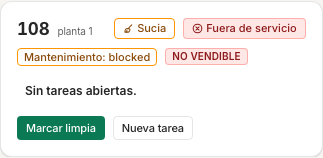
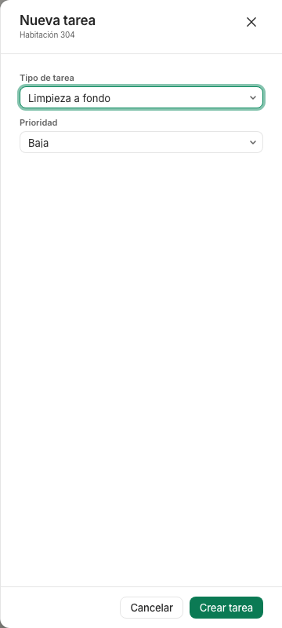
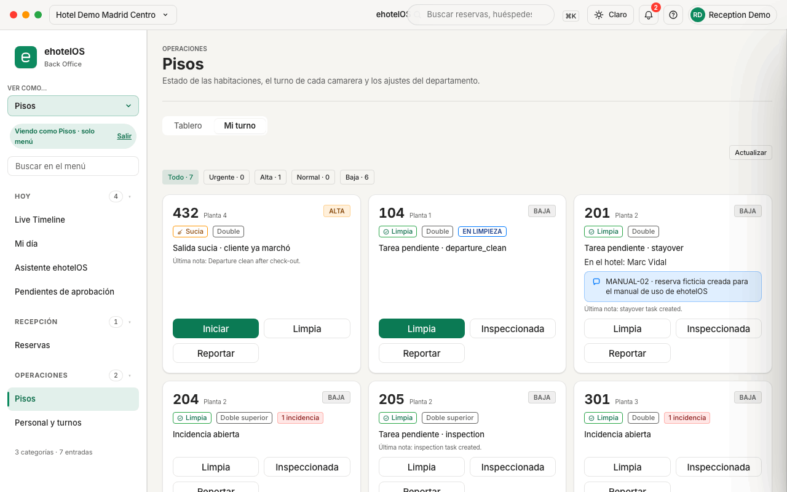
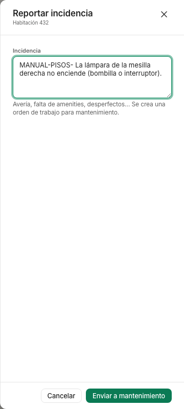
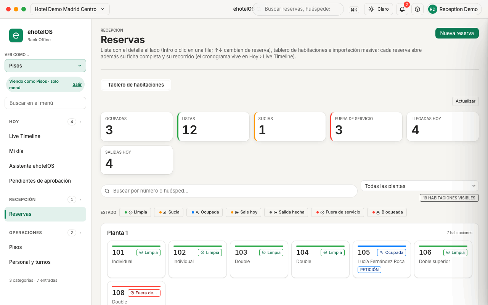
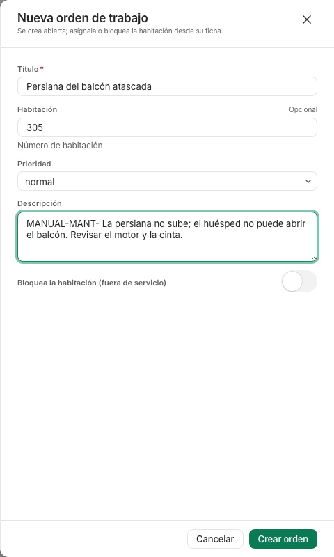
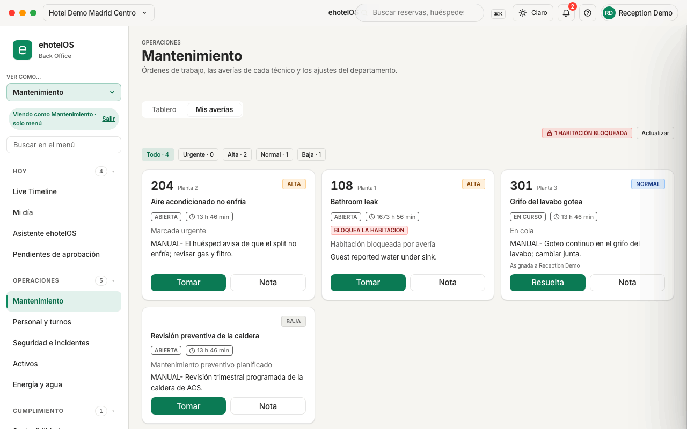
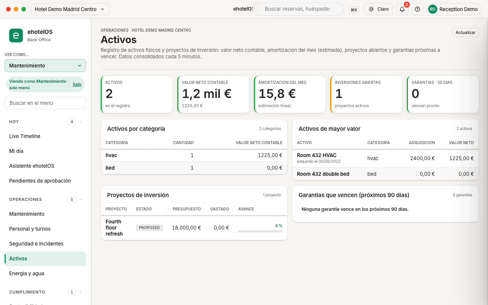

# Guía de pisos y mantenimiento · ehotelOS

Esta guía explica cómo trabajan en ehotelOS el equipo de pisos (camareras de piso y gobernanta) y el de mantenimiento (técnicos y encargado). Tiene dos partes independientes; cada una empieza por lo que verás en tu menú y sigue con las tareas del día a día, paso a paso.

Antes de seguir conviene haber leído [Primeros pasos](00-primeros-pasos.md): cómo entrar, qué es el menú lateral, la búsqueda ⌘K y el vocabulario común de estados.

## Cómo están hechas las capturas

- Todas las capturas son de la propiedad de demostración «Hotel Demo Madrid Centro» (19 habitaciones, datos ficticios); los nombres de huéspedes que aparecen son inventados.
- Se han tomado con el usuario administrador de la demo y el selector «Ver como…» de la barra lateral puesto en «Pisos» o en «Mantenimiento». Ese selector solo cambia el menú que se muestra (aparece el aviso «Viendo como Pisos · solo menú»): lo que puedas hacer dentro de cada pantalla depende de la plantilla real de tu usuario, no del selector.
- Tema claro, ventana de 1280 × 800. Las tarjetas de instrucciones que algunas pantallas muestran arriba («Housekeeping», «Mis averías») se han cerrado con la «×» antes de capturar; tú las verás la primera vez que entres.
- Tres capturas muestran un formulario lateral (un «cajón») abierto y relleno, sin pulsar su botón final («Crear tarea», «Enviar a mantenimiento», «Crear orden»): así ves qué contiene sin crear nada en la demo.

---

## Parte 1 · Pisos

### Para quién

- Plantilla **«Pisos»** (camarera o camarero de piso): estado de habitaciones, tareas de limpieza, inspección, partes de avería y fichaje.
- Plantilla **«Gobernanta»**: las mismas pantallas que «Pisos» (el menú «Pisos» de 7 entradas que se describe a continuación) y, además, la inspección y los turnos del equipo. Los permisos adicionales de lectura que lleva la plantilla (mantenimiento, seguridad, energía, compras) no abren hoy ninguna pantalla en su menú: si la gobernanta necesita ver el tablero de mantenimiento, lo consulta con el encargado o con dirección.

En la demo no existe ningún usuario con estas plantillas: las tareas y los partes salen siempre «sin asignar». Cuando tu hotel tenga usuarios de pisos, cada acción quedará registrada a nombre de quien la haga.

### Qué verás en tu menú

Con la plantilla «Pisos» el menú lateral tiene **3 categorías · 7 entradas** (lo pone al pie del menú):

| Categoría | Entradas |
|---|---|
| Hoy (4) | Live Timeline · Mi día · Asistente ehotelOS · Pendientes de aprobación |
| Recepción (1) | Reservas (solo la pestaña «Tablero de habitaciones») |
| Operaciones (2) | Pisos (pestañas «Tablero · Mi turno») · Personal y turnos |

- Al entrar aterrizas en **Mi día › Operaciones** (`/hoy/operaciones`); en un móvil (pantalla estrecha) aterrizas directamente en **Mi turno**.
- La pestaña «Ajustes» de Pisos (`/operaciones/pisos/ajustes`) es solo de dirección y administración: si escribes la dirección a mano verás «Sin acceso · Tu perfil no tiene permiso para ver esta pantalla. Pide acceso a dirección.».
- En Mi día solo ves la pestaña «Operaciones». No tienes el botón «+ Nueva reserva» de la barra superior.
- Si eliges «Reservas» en el menú, ehotelOS te lleva directamente al Tablero de habitaciones (`/recepcion/reservas/tablero`); no ves la lista de reservas ni el detalle.

### Vocabulario: estados de una habitación

ehotelOS guarda por separado tres cosas de cada habitación: la **limpieza** (sucia · limpia · inspeccionada), la **ocupación o disponibilidad** (libre · ocupada · fuera de servicio) y el **estado de mantenimiento** (ok · bloqueada · necesita atención). Por eso una tarjeta puede llevar dos etiquetas a la vez, por ejemplo «LIMPIA» y «OCUPADA».

| Estado (vocabulario común) | Etiqueta que verás | Qué significa |
|---|---|---|
| Sucia | «SUCIA» (naranja) | Hay que limpiarla. Toda salida deja la habitación sucia y crea una tarea «Salida (limpieza)». |
| Limpia | «LIMPIA» (verde) | La camarera ha terminado. Falta la inspección. |
| Inspeccionada | «INSPECCIONADA» (verde) | Revisada por la gobernanta: es la que cuenta como **vendible** en el KPI «INSPECCIONADAS». |
| Ocupada | «OCUPADA» (azul, junto a la de limpieza) | Hay un huésped alojado. Marcarla limpia no la libera. |
| Bloqueada | «Mantenimiento: blocked» + «NO VENDIBLE» | Una orden de trabajo la ha bloqueado: recepción no puede asignarla. |
| Fuera de servicio | «FUERA DE SERVICIO» (rojo) | No está en el inventario vendible: por un bloqueo de mantenimiento o por un cierre manual. |

> **Nota:** la etiqueta de mantenimiento sale en inglés tal cual («Mantenimiento: blocked»); es el valor interno y así aparece hoy en la tarjeta.

En el Tablero de habitaciones de recepción el mismo vocabulario se muestra con otras palabras («Lista», «Sale hoy», «Salida hecha», «Bloqueada»): lo explicamos en la tarea 6.

### Tarea 1 · Leer y usar el tablero de pisos

**Menú › Operaciones › Pisos** · `/operaciones/pisos` (pestaña «Tablero»).

*Tablero de pisos con los cinco indicadores, los filtros y una tarjeta por habitación.*

1. Arriba tienes cinco indicadores: **«SUCIAS» · «LIMPIAS» · «INSPECCIONADAS» (con el apunte «vendibles») · «FUERA DE SERVICIO» · «TAREAS ABIERTAS»**. Se recalculan solos cada 30 segundos; el botón «Actualizar» (arriba a la derecha) los refresca al momento.
2. Debajo, los filtros con su recuento: **«Todas · n» · «Sucias · n» · «Limpias · n» · «Inspeccionadas · n» · «Ocupadas · n» · «Fuera de servicio · n» · «Con tareas · n»**. Pulsa uno para quedarte solo con esas habitaciones; el filtro activo se ve resaltado.
3. Cada habitación es una tarjeta con su número y la planta («planta 1»), las etiquetas de estado, la lista de tareas abiertas (o «Sin tareas abiertas.») y los botones de acción.

*Tarjeta de la 108: sucia, fuera de servicio, bloqueada por mantenimiento y no vendible.*

4. Los botones de cada tarjeta cambian según el estado:
   - **«Marcar limpia»**: solo si la habitación está sucia. Al pulsarlo aparece el aviso «Habitación 305 marcada limpia.» y la etiqueta pasa a «LIMPIA».
   - **«Inspeccionar»**: solo si está limpia. Aviso «Habitación 206 inspeccionada.» y etiqueta «INSPECCIONADA». Una vez inspeccionada, la tarjeta ya no ofrece ninguno de los dos botones.
   - **«Nueva tarea»**: siempre (ver tarea 2).
   - En cada tarea de la lista: **«Empezar»** si está «pendiente» (pasa a «en curso») y **«Completar»** si está «en curso» (pasa a hecha y desaparece de la tarjeta).
5. Las tareas se describen así: tipo («Salida (limpieza)», «Cliente alojado», «Inspección», «Limpieza a fondo»), prioridad con un punto de color («baja», «normal», «alta») y estado («pendiente», «asignada», «en curso», «hecha», «rechazada»).

**Resultado esperado.** Tras cada botón ves un aviso verde abajo y la tarjeta se actualiza sin recargar la página. Los indicadores de arriba cambian a la vez (por ejemplo «SUCIAS» baja y «LIMPIAS» sube).

> **Nota:** los avisos de las tareas dicen literalmente «Tarea empezar.» y «Tarea completar.»; es el texto actual, no un error tuyo.

**Si algo falla.**
- Si el aviso es rojo con «No se pudo completar la acción.», pulsa «Actualizar» y repite: lo normal es que otra persona haya cambiado la habitación antes que tú.
- Si no ves «Inspeccionar» es porque la habitación no está limpia: márcala limpia primero. ehotelOS no deja inspeccionar una habitación sucia.
- Si aparece «Demasiadas peticiones», espera medio minuto: hay un límite de peticiones por usuario y la pantalla se refresca sola.

### Tarea 2 · Crear una tarea para una habitación

**Menú › Operaciones › Pisos** · `/operaciones/pisos` › botón «Nueva tarea» de la tarjeta.

*Cajón «Nueva tarea · Habitación 304» con «Limpieza a fondo» y prioridad «Baja» elegidas, antes de pulsar «Crear tarea».*

1. Pulsa «Nueva tarea» en la tarjeta de la habitación.
2. En el cajón «Nueva tarea · Habitación 304» elige el **«Tipo de tarea»** («Salida (limpieza)», «Cliente alojado», «Inspección», «Limpieza a fondo») y la **«Prioridad»** («Baja», «Normal», «Alta»). No hay campo de texto libre.
3. Pulsa «Crear tarea» («Cancelar» cierra sin guardar).

**Resultado esperado.** Aviso «Tarea creada.»; la tarjeta muestra la tarea nueva como «pendiente» con su botón «Empezar», y «TAREAS ABIERTAS» sube en uno. Comprobado en la demo creando «Limpieza a fondo · baja» en la 304 y cerrándola después con «Empezar» y «Completar».

**Si algo falla.** Si la tarjeta ya tiene una tarea abierta del mismo tipo, ehotelOS no crea otra igual: te devuelve la que hay (aunque el aviso diga «Tarea creada.») y «TAREAS ABIERTAS» no cambia.

### Tarea 3 · Trabajar desde «Mi turno»

**Menú › Operaciones › Pisos › pestaña «Mi turno»** · `/operaciones/pisos/mi-turno`. Es la pantalla pensada para el móvil o la tablet del carro: botones grandes y solo las habitaciones que requieren algo.

*Mi turno: las habitaciones del turno ordenadas por prioridad, con sus botones grandes.*

1. La primera vez verás arriba una tarjeta de ayuda titulada «Housekeeping»; ciérrala con la «×» de la derecha y no volverá a salir en ese navegador.
2. Los filtros son por prioridad: **«Todo · n» · «Urgente · n» · «Alta · n» · «Normal · n» · «Baja · n»**. ehotelOS calcula la prioridad sola:
   - **Urgente**: llegada inminente con hora prevista (la tarjeta dice «Llega en … (ETA …)»).
   - **Alta**: «Salida sucia · cliente ya marchó».
   - **Normal**: «Stayover · limpieza diaria», «Llegada hoy» o «Habitación sucia sin asignar».
   - **Baja**: «Tarea pendiente · <tipo>» o «Incidencia abierta».
3. Cada tarjeta lleva el número y la planta, la prioridad, la limpieza («SUCIA», «LIMPIA», «INSPECCIONADA»), el tipo de habitación, «n incidencia(s)» si tiene partes abiertos, «EN LIMPIEZA» si ya has empezado, el motivo, quién llega o quién está alojado («Alojado: …»), la petición especial del huésped (recuadro azul) y «Última nota: …».
4. Botones:
   - **«Iniciar»** (solo en habitaciones sucias sin empezar): arranca la tarea de la habitación. Aviso «Hab. 203 → En limpieza» y etiqueta «EN LIMPIEZA».
   - **«Limpia»**: aviso «Hab. 203 → Limpia»; la etiqueta pasa a «LIMPIA» y la prioridad baja.
   - **«Inspeccionada»** (en habitaciones limpias o en limpieza): aviso «Hab. 203 → Inspeccionada». Después solo queda el botón «Reportar».
   - **«Reportar»**: abre el parte de avería (tarea 5).
5. La lista se refresca sola cada 20 segundos; en el móvil tienes además una barra inferior con «Actualizar» y la hora de los datos. Cuando no queda nada, la pantalla dice «Sin pendientes · Todas las habitaciones están listas.».

**Resultado esperado.** La secuencia «Iniciar» → «Limpia» → «Inspeccionada» deja la habitación inspeccionada en todas las pantallas (tablero de pisos, tablero de habitaciones, Mi día). Comprobado en la demo con la 203.

> **Nota:** «Limpia» e «Inspeccionada» cambian el estado de la **habitación**, pero no cierran la **tarea** de limpieza: en el tablero de pisos seguirá «en curso» hasta que pulses «Completar». Hazlo al terminar para que «TAREAS ABIERTAS» sea real. Si una habitación inspeccionada sigue apareciendo en Mi turno con «Tarea pendiente · departure_clean», es exactamente por esto.

**Si algo falla.** Si la habitación está ocupada, «Limpia» la deja limpia pero sigue ocupada (no la libera): es lo esperado. El botón «Iniciar» no aparece en habitaciones ya limpias.

### Tarea 4 · La inspección: quién y cuándo

Secuencia comprobada en la demo: **sucia → limpia → inspeccionada**.

1. La camarera marca la habitación limpia («Limpia» en Mi turno o «Marcar limpia» en el tablero).
2. La gobernanta la revisa y pulsa «Inspeccionada» (Mi turno) o «Inspeccionar» (tablero). A partir de ahí cuenta en «INSPECCIONADAS (vendibles)» y en el Tablero de habitaciones aparece como «Limpia» (y suma en «LISTAS»).
3. Una habitación inspeccionada no vuelve a «limpia» aunque alguien pulse «Marcar limpia»; solo vuelve a «sucia» con la salida del huésped (o con «Marcar sucia» en el cajón de una casilla del Tablero de habitaciones, tarea 6).

**Quién puede inspeccionar.** Las dos plantillas de pisos («Pisos» y «Gobernanta») tienen el permiso de inspección, así que en la aplicación la camarera también ve el botón. Que inspeccione solo la gobernanta es una norma de tu hotel, no una restricción del programa. Recepción no lo tiene: si alguien de recepción lo intenta, la aplicación responde «No tienes permiso para realizar esta acción (requiere: housekeeping.task.manage).».

**Si algo falla.** Si «Inspeccionar» no aparece, la habitación sigue sucia: márcala limpia primero.

### Tarea 5 · Reportar una avería desde una habitación (enlace con mantenimiento)

**Menú › Operaciones › Pisos › «Mi turno»** · `/operaciones/pisos/mi-turno` › botón «Reportar» de la tarjeta.

*Cajón «Reportar incidencia» de la primera habitación del turno, con la incidencia escrita y antes de pulsar «Enviar a mantenimiento» (la lista de Mi turno cambia cada día, así que el número de habitación de tu captura puede ser otro).*

1. Pulsa «Reportar» en la tarjeta de la habitación.
2. En «Reportar incidencia · Habitación <número>» escribe qué pasa en el campo **«Incidencia»** («Avería, falta de amenities, desperfectos… Se crea una orden de trabajo para mantenimiento.»). El botón «Enviar a mantenimiento» se activa cuando hay texto.
3. Pulsa «Enviar a mantenimiento».

**Resultado esperado.** Aviso «Incidencia reportada a mantenimiento». Se crea una orden de trabajo con prioridad normal y título «Hab. 203: <lo que escribiste>», que mantenimiento ve en su tablero y en Mis averías. En tu tarjeta aparece «1 incidencia». No hace falta que hagas nada más: cuando mantenimiento la resuelva, la orden desaparece de sus pendientes.

> **Nota:** mientras la orden esté abierta, el Tablero de habitaciones de recepción muestra la habitación como «Bloqueada» con la marca «INCIDENCIA», aunque para pisos siga limpia y vendible (ver tarea 6). Si la avería impide vender la habitación, quien debe bloquearla es mantenimiento desde la orden (parte 2, tarea 9).

### Tarea 6 · Consultar el Tablero de habitaciones de recepción

**Menú › Recepción › Reservas** · `/recepcion/reservas/tablero`. Te sirve para saber qué llegadas están previstas y priorizar.

*Tablero de habitaciones: indicadores, leyenda de estados y una casilla por habitación agrupadas por planta.*

1. Indicadores: **«OCUPADAS» · «LISTAS» · «SUCIAS» · «FUERA DE SERVICIO» · «LLEGADAS HOY» · «SALIDAS HOY»**.
2. Busca por número o huésped en «Buscar por número o huésped…», filtra por planta con «Todas las plantas» y comprueba el contador «n HABITACIONES VISIBLES».
3. La leyenda «ESTADO» es también un filtro: **«Limpia» · «Sucia» · «Ocupada» · «Sale hoy» · «Salida hecha» · «Fuera de servicio» · «Bloqueada»** (el indicador de arriba se llama «LISTAS»). Equivalencias con el vocabulario de pisos:

| En el Tablero de habitaciones | En pisos |
|---|---|
| Limpia (indicador «LISTAS») | Libre y limpia o inspeccionada |
| Sucia | Libre y sucia |
| Ocupada / Sale hoy / Salida hecha | Ocupada (con o sin salida prevista hoy) / salida ya hecha |
| Fuera de servicio | Fuera de servicio (bloqueo de mantenimiento o cierre manual) |
| Bloqueada | Libre **con una orden de trabajo abierta**, aunque no bloquee la habitación |

4. Cada casilla muestra el número, el estado, el tipo o el huésped, y marcas como «INCIDENCIA» (parte abierto), «PETICIÓN» (petición especial), «VIP», «Saldo», «Limpieza urgente» (llega en menos de 2 h), «Conflicto», «Late check-out», «Early check-in» o «Llega hoy».
5. El botón verde «Nueva reserva» de la cabecera de esta pantalla es de recepción: con la plantilla «Pisos» te lleva a «Sin acceso». Ignóralo.

> **Nota:** el indicador «FUERA DE SERVICIO» de este tablero suma las «Fuera de servicio» y las «Bloqueada», así que puede ser mayor que el «FUERA DE SERVICIO» del tablero de pisos (en la demo: 3 frente a 1, porque la 204 y la 301 tienen partes abiertos). Para saber si una habitación es vendible de verdad, fíate del tablero de pisos («NO VENDIBLE») o de la orden de trabajo.

> **Nota:** al pulsar una casilla se abre el cajón de la habitación: título «Habitación 108», subtítulo con el tipo y la planta («Double · Planta 1»), su estado («Fuera de servicio», «Sucia», «Incidencia abierta»…) y las «Acciones rápidas»: «Marcar limpia», «Marcar sucia», «Inspeccionada» y «Bloquear habitación» o «Desbloquear habitación» (según esté). Se cierra con «Cerrar» o con Esc. En esta guía no se ha pulsado ninguna acción rápida desde aquí: para cambiar estados usa el tablero de pisos y Mi turno, que es lo que hace tu equipo cada día.

### Tarea 7 · La foto de operaciones de Mi día

**Menú › Hoy › Mi día** · `/hoy/operaciones` (pestaña «Operaciones», la única que ves).

1. Subpestañas «Vista general» y «Alertas (n)»; botón «Actualizar»; la cabecera indica «datos a hh:mm».
2. «Resumen operativo»: **«DEPARTAMENTOS OK» · «ATENCIÓN» · «CRÍTICOS» · «ALERTAS CRÍTICAS»**.
3. «Salud operativa» (5 módulos): **HOUSEKEEPING** (limpias; «sucias n · insp. n · OOO n»), **MANTENIMIENTO** (activas; «abiertas · en curso · crítica»), **PERSONAL** (turnos), **SEGURIDAD** (incidentes) y **F&B / TPV HOY**. «OOO» es «fuera de servicio».
4. «Detalle operativo», con pestañas **«Tareas HK (n)» · «Órdenes de trabajo (n)» · «Turnos (n)» · «Incidentes (n)»** y una tabla por pestaña.

> **En construcción:** la tabla «Tareas de housekeeping de hoy» muestra hoy el identificador interno de la habitación en vez del número, el tipo de tarea en clave («departure_clean») y el estado en mayúsculas («IN_PROGRESS»). Para trabajar usa el tablero de pisos; esta pantalla sirve para el vistazo general.

### Errores frecuentes (pisos)

| Qué ves | Qué hacer |
|---|---|
| «Sin acceso · Tu perfil no tiene permiso para ver esta pantalla. Pide acceso a dirección.» | Has entrado en una pantalla de dirección (por ejemplo «Ajustes» de Pisos). Vuelve con «Ir a mi página de inicio». |
| La habitación sigue en Mi turno después de inspeccionarla, con «Tarea pendiente · departure_clean» | La tarea de limpieza sigue «en curso»: ciérrala con «Completar» en el tablero de pisos. |
| No aparece «Inspeccionar» / «Inspeccionada» | La habitación está sucia: márcala limpia primero. |
| «Marcar limpia» no libera la habitación | Está ocupada: se queda «LIMPIA» + «OCUPADA». Solo se libera con la salida. |
| «No se pudo completar la acción.» / «No se pudo actualizar el estado» | Pulsa «Actualizar» y repite; si persiste, la habitación puede estar bloqueada por mantenimiento. |
| «Demasiadas peticiones» | Espera medio minuto: límite de peticiones por usuario. |
| El menú vuelve a ser el completo tras recargar | «Ver como…» solo dura la sesión de la pestaña (se pierde con F5). Con tu usuario real no te pasará. |

### Qué no hace todavía (pisos)

- No hay asignación de tareas a una persona desde la pantalla: «Asignada a» sale «Sin asignar» y la tarjeta de ayuda que habla de asignar tareas a un miembro del equipo se refiere a algo que aún no existe.
- No hay filtro por planta en Mi turno (la ayuda in-app lo menciona, pero solo existe el filtro por prioridad); sí lo hay en el Tablero de habitaciones.
- «Limpia» / «Inspeccionada» no cierran la tarea de limpieza (defecto conocido); hay que pulsar «Completar» en el tablero.
- Marcar una habitación como sucia a mano, bloquearla sin orden de trabajo y desbloquearla solo existen dentro del cajón de una casilla del Tablero de habitaciones (tarea 6), no en el tablero de pisos ni en Mi turno.
- Objetos olvidados, fotos de la habitación y pedidos a economato no tienen pantalla en el menú de pisos.
- «Personal y turnos» (`/operaciones/personal`) funciona («PLANTILLA», «Fichar entrada», «Fichar salida», «Nuevo turno»), pero en la demo la plantilla es 0; los fichajes y turnos que veas son ficticios (prefijo «MANUAL-RRHH», creados por la guía [30 · RRHH](30-rrhh.md)).
- El título de la tarjeta de ayuda de Mi turno sigue diciendo «Housekeeping» (el texto ya está en español: «Mi turno: la lista de habitaciones que tocan hoy…»); ciérrala con «Cerrar instrucciones» (×).

---

## Parte 2 · Mantenimiento

### Para quién

- Plantilla **«Mantenimiento»** (técnico): órdenes de trabajo (crear, cambiar de estado, anotar y resolver), incidentes de seguridad, energía y sostenibilidad, pedidos de compra. **No puede bloquear habitaciones.**
- Plantilla **«Encargado de mantenimiento»**: las mismas pantallas que «Mantenimiento» (el menú de 10 entradas que se describe a continuación) y, además, bloquear y liberar habitaciones desde la orden y los turnos del equipo. Los permisos de lectura adicionales de la plantilla (estado de pisos, recepciones de compra, facturas de proveedor) no abren hoy ninguna pantalla en su menú: el tablero de pisos y Proveedores y gastos no aparecen en él.

Como en pisos, en la demo no hay usuarios con estas plantillas y las órdenes salen «Sin asignar».

### Qué verás en tu menú

Con la plantilla «Mantenimiento» el menú tiene **3 categorías · 10 entradas**:

| Categoría | Entradas |
|---|---|
| Hoy (4) | Live Timeline · Mi día · Asistente ehotelOS · Pendientes de aprobación |
| Operaciones (5) | Mantenimiento (pestañas «Tablero · Mis averías») · Personal y turnos · Seguridad e incidentes · Activos · Energía y agua |
| Cumplimiento (1) | Sostenibilidad (solo la pestaña «Panel») |

- Aterrizas en **Mi día › Operaciones** (`/hoy/operaciones`); en un móvil, en **Mis averías**.
- La pestaña «Ajustes» de Mantenimiento (`/operaciones/mantenimiento/ajustes`) es de dirección y administración («Sin acceso»). El «Informe ESRS» de Sostenibilidad es de dirección y finanzas.
- No ves el tablero de pisos ni el Tablero de habitaciones; el estado de las habitaciones lo consultas desde cada orden.

### Vocabulario: estados y prioridades de una orden de trabajo

- **Estados**: «Abierta» (recién creada) · «Asignada» · «En curso» · «Esperando proveedor» · «Resuelta» · «Cerrada». Una orden resuelta o cerrada ya no cambia de estado.
- **Prioridades** (las eliges tú): «emergencia» · «urgente» · «normal» · «preventivo».
- **«Bloquea habitación»**: la orden ha sacado la habitación de la venta («Sí (fuera de servicio)»). Hasta que la resuelvas, recepción no puede asignarla.
- En **Mis averías** la prioridad se muestra con otra escala, calculada por ehotelOS: «Urgente» (emergencia, o bloqueo con huésped dentro), «Alta» (urgente, bloquea la habitación o plazo vencido), «Normal» («En cola») y «Baja» (preventivo). Por eso una orden «urgente» del tablero aparece como «ALTA» en Mis averías.

### Tarea 8 · Leer el tablero de mantenimiento

**Menú › Operaciones › Mantenimiento** · `/operaciones/mantenimiento` (pestaña «Tablero»).

*Tablero de mantenimiento con la orden «Aire acondicionado no enfría» seleccionada y su ficha a la derecha.*

1. Indicadores: **«EMERGENCIAS» · «ABIERTAS» · «EN CURSO» · «ESPERANDO PROVEEDOR» · «BLOQUEAN HABITACIÓN»** («EMERGENCIAS» y «BLOQUEAN HABITACIÓN» cuentan solo órdenes no resueltas; «EN CURSO» incluye las asignadas). Se refrescan cada 30 segundos; «Actualizar» lo hace al momento.
2. Filtros con recuento: **«Activas · n» · «Todas · n» · «Abiertas · n» · «En curso · n» · «Esperando proveedor · n» · «Bloquean habitación · n» · «Resueltas · n»**. Por defecto ves «Activas».
3. A la izquierda, la lista «Órdenes» («n órdenes»): cada fila lleva el título, la prioridad con un punto de color, el estado («ABIERTA», «EN CURSO»…) y la marca roja «BLOQUEA» si saca la habitación de la venta. Están ordenadas por prioridad (emergencias primero) y, a igual prioridad, las más nuevas arriba.
4. A la derecha, «Elige una orden · La ficha aparece aquí: estado, habitación, descripción y acciones.». Pulsa una fila para abrir su **ficha**: «Estado», «Prioridad», «Habitación» («Hab. 204» o «—» si no tiene), «Bloquea habitación» («Sí (fuera de servicio)» / «No»), «Asignada a» («Sin asignar»), «Creada», «Resuelta» (si lo está) y «Descripción».
5. En la ficha de una orden activa tienes el desplegable **«Estado»** («Abierta», «Asignada», «En curso», «Esperando proveedor»; «El cambio se guarda al elegirlo.») y, al pie, los botones **«Bloquear habitación»** (solo si la orden tiene habitación y aún no la bloquea) y **«Resolver»**.

**Resultado esperado.** Al cambiar el estado ves «Estado actualizado.» y la fila cambia de etiqueta al instante.

**Si algo falla.** En pantallas de menos de 900 px de ancho la ficha se abre en un cajón lateral con el mismo contenido (el título de la orden, «Hab. 204 · urgente», el desplegable «Estado» y los botones «Bloquear habitación» y «Resolver»); ciérralo con la × o con Esc para volver a la lista. En el móvil usa mejor la pestaña «Mis averías».

### Tarea 9 · Crear un parte, tomarlo, anotar, bloquear la habitación y resolverlo

Flujo completo comprobado en la demo con la orden «Persiana del balcón atascada» de la habitación 305.

**9a · Crear la orden.** **Menú › Operaciones › Mantenimiento** › botón «+ Nueva orden» (arriba a la derecha).

*Cajón «Nueva orden de trabajo» relleno (título, habitación 305, prioridad y descripción), antes de pulsar «Crear orden».*

1. Pulsa «+ Nueva orden». El cajón se titula «Nueva orden de trabajo · Se crea abierta; asígnala o bloquea la habitación desde su ficha.».
2. Rellena **«Título»** (obligatorio; ejemplo del campo: «Fuga en el baño»), **«Habitación»** (opcional: el número tal como existe en el hotel, «Ej.: 108»), **«Prioridad»** («emergencia», «urgente», «normal», «preventivo»), **«Descripción»** y, si la habitación no se puede vender mientras la arreglas, el interruptor **«Bloquea la habitación (fuera de servicio)»**.
3. Pulsa «Crear orden» (se activa cuando hay título).

**Resultado esperado.** Aviso «Orden creada.»; la orden aparece en la lista como «ABIERTA» con su prioridad. Si activaste el interruptor, nace ya bloqueando la habitación (hace falta el permiso del punto 9c).

**9b · Tomarla y cambiar el estado.** En el tablero, pulsa la orden y elige «En curso» en el desplegable «Estado» (aviso «Estado actualizado.»). Desde el móvil es el botón «Tomar» de Mis averías (tarea 10). Ninguna de las dos acciones te asigna la orden: «Asignada a» sigue «Sin asignar» (no hay asignación de técnico en la pantalla).

**9c · Bloquear la habitación.** Con la orden abierta en la ficha, pulsa **«Bloquear habitación»**.

- Aviso «Habitación bloqueada.». La ficha pasa a «Bloquea habitación: Sí (fuera de servicio)», la fila muestra «BLOQUEA» y «BLOQUEAN HABITACIÓN» sube en uno.
- Efecto en pisos (comprobado con la 305): la tarjeta pasa a «FUERA DE SERVICIO» + «Mantenimiento: blocked» + «NO VENDIBLE» y conserva su limpieza («LIMPIA»); «FUERA DE SERVICIO» del tablero de pisos sube en uno.
- Efecto en recepción: en el Tablero de habitaciones la casilla pasa a «Fuera de servicio» con la marca «INCIDENCIA» y recepción no puede asignarla a una reserva. Si hay un huésped dentro, la habitación sigue «Ocupada» pero deja de ser vendible.
- Efecto en Mis averías: el aviso del encabezado pasa a «2 HABITACIONES BLOQUEADAS» y la tarjeta lleva «BLOQUEA LA HABITACIÓN» con el motivo «Habitación bloqueada por avería».

> **Nota:** bloquear una habitación es una acción de alto riesgo: la tienen el «Encargado de mantenimiento» y dirección, no el técnico con plantilla «Mantenimiento» (recibiría «No tienes permiso para realizar esta acción (requiere: ai.high_risk.confirm).»; si activa el interruptor al crear la orden, el mensaje sale en inglés: «Blocking a room requires manager or maintenance lead confirmation.»). El botón solo aparece si la orden tiene habitación y no la bloquea ya; si intentas bloquear dos veces la aplicación responde «La habitación ya está bloqueada por esta orden.».

**9d · Anotar lo hecho.** Desde Mis averías, botón «Nota» (tarea 10). En el tablero no hay campo de notas: el texto se añade a la «Descripción».

**9e · Resolver.** En la ficha pulsa **«Resolver»** (o «Resuelta» en Mis averías).

**Resultado esperado.** Aviso «Orden resuelta.»; la orden sale de «Activas» y aparece en «Resueltas · n» con la fecha en «Resuelta». Si bloqueaba la habitación, ehotelOS la **libera y la deja sucia** (comprobado: la 305 volvió a «SUCIA», sin «NO VENDIBLE» y con «Marcar limpia» disponible) para que pisos la repase e inspeccione antes de venderla. La ficha de la orden resuelta conserva «Bloquea habitación: Sí (fuera de servicio)» como histórico.

**Si algo falla.**
- «La orden ya está resuelta.»: alguien la resolvió antes; pulsa «Actualizar».
- «La orden de trabajo no está vinculada a ninguna habitación.»: creaste la orden sin número de habitación; no se puede bloquear nada. Crea otra con habitación.
- Escribiste un número de habitación que no existe en el hotel: la orden se crea igualmente, pero **sin habitación** («Habitación: —») y no se podrá bloquear nada. Resuélvela y crea otra con el número correcto.
- Una habitación bloqueada por una orden **no** se puede desbloquear desde el Tablero de habitaciones: solo la libera «Resolver».

### Tarea 10 · Mis averías (móvil y tablet)

**Menú › Operaciones › Mantenimiento › pestaña «Mis averías»** · `/operaciones/mantenimiento/mis-averias`.

*Mis averías: una tarjeta por orden abierta, el aviso de habitaciones bloqueadas y los filtros por prioridad.*

1. La primera vez cierra con la «×» la tarjeta de ayuda «Mis averías».
2. Arriba a la derecha, el aviso rojo **«n HABITACIÓN BLOQUEADA»** (o «n HABITACIONES BLOQUEADAS») y «Actualizar». La lista se refresca sola cada 20 segundos.
3. Filtros: **«Todo · n» · «Urgente · n» · «Alta · n» · «Normal · n» · «Baja · n»** (escala calculada; ver vocabulario).
4. Cada tarjeta muestra el número de habitación y la planta (nada si la orden no tiene habitación, como «Revisión preventiva de la caldera»), la prioridad, el título, el estado («ABIERTA», «EN CURSO»…), la antigüedad («56 min», «1661 h 5 min»), «BLOQUEA LA HABITACIÓN», «SLA vencido» si tiene plazo pasado, «n fotos», el motivo («Marcada urgente», «En cola», «Habitación bloqueada por avería», «Mantenimiento preventivo planificado»), «<huésped> está en la habitación» si hay alguien alojado y la descripción. La tarjeta no muestra a quién está asignada la orden (ese dato solo está en la ficha del tablero, y hoy siempre dice «Sin asignar»).
5. Botones:
   - **«Tomar»**: pasa la orden a «En curso». Aviso «Avería a0sp4g → En curso» (las seis letras son el final del identificador de la orden). El botón se convierte en **«Resuelta»**.
   - **«Nota»**: abre el cajón «Añadir nota» («Se añade a la descripción de la avería con la fecha y la hora.»); escribe y pulsa «Guardar nota». Aviso «Nota guardada»; la descripción muestra la nota precedida de la fecha y la hora, por ejemplo «[19/09/2026, 09:33] Era la bombilla; sustituida por una LED de 4 W.».
   - **«Resuelta»**: resuelve la orden (y libera la habitación si la bloqueaba). Aviso «Avería a0sp4g → Resuelta»; la tarjeta desaparece de Mis averías.

**Resultado esperado.** El parte que pisos reportó desde Mi turno («Hab. 203: …») aparece aquí como «NORMAL · En cola»; «Tomar» → «Nota» → «Resuelta» lo cierra y deja de contar en «Órdenes de trabajo (n)» de Mi día. Comprobado en la demo.

> **Nota:** el cajón «Añadir nota» lleva como subtítulo el título de la avería, un solo campo («Nota», con la ayuda «Qué has visto o qué has hecho») y los botones «Cancelar» y «Guardar nota». En esta guía se ha abierto sin guardar nada.

**Si algo falla.** «No se pudo actualizar la avería»: pulsa «Actualizar»; si la orden ya estaba resuelta por otra persona habrá desaparecido de la lista.

### Tarea 11 · Activos, Energía y agua, Seguridad e incidentes y Sostenibilidad

Cuatro pantallas de consulta que te ayudan a planificar; ninguna cambia el estado de una habitación.

**Activos** · **Menú › Operaciones › Activos** · `/operaciones/activos`.

*Activos: registro de activos físicos y proyectos de inversión, en solo lectura.*

1. Indicadores: **«ACTIVOS» · «VALOR NETO CONTABLE» · «AMORTIZACIÓN DEL MES» (estimación lineal) · «INVERSIONES ABIERTAS» · «GARANTÍAS · 30 DÍAS»**.
2. Bloques «Activos por categoría», «Activos de mayor valor» (activo, categoría, fecha de adquisición, valor neto), «Proyectos de inversión» (proyecto, estado, presupuesto, gastado, avance) y «Garantías que vencen (próximos 90 días)».
3. Solo hay el botón «Actualizar»; los datos se consolidan cada 5 minutos.

> **Nota:** el alta de un activo no se hace aquí. El inmovilizado se da de alta en **Finanzas › Proveedores y gastos › Inmovilizado**, una pantalla de administración que el menú de mantenimiento no incluye (ver [Guía de administración](20-administracion.md)). En la demo hay 2 activos y 1 proyecto («Fourth floor refresh»), con nombres en inglés del juego de datos.

**Energía y agua** · **Menú › Operaciones › Energía y agua** · `/operaciones/energia`. «Consumo de los últimos 30 días … Solo lectura; se actualiza cada 5 minutos.» Indicadores **«TOTAL KWH (30 D)» · «KWH POR HABITACIÓN OCUPADA» · «TENDENCIA (90 DÍAS)» · «CONTADORES ACTIVOS» · «LECTURAS ANÓMALAS»**, bloques «Consumo por contador», «Mayores consumidores» y la gráfica «Consumo diario». No hay alta de contadores ni de lecturas desde el menú; en la demo todo está a 0 («Sin contadores con lecturas en el periodo seleccionado.»).

**Seguridad e incidentes** · **Menú › Operaciones › Seguridad e incidentes** · `/operaciones/seguridad`. «Registra incidentes en vivo, haz seguimiento y revisa las inspecciones de seguridad pendientes.» Indicadores **«INCIDENTES ABIERTOS» · «CRÍTICOS (30 D)» · «INCIDENTES (30 D)» · «CHECKS COMPLETADOS» · «INSPECCIONES PRÓXIMAS»**, bloques «Incidentes recientes» e «Inspecciones próximas» y el botón «Registrar incidente». Los incidentes de seguridad (no las averías) se registran aquí; en la demo no hay ninguno.

> **Nota:** «Registrar incidente» abre el cajón «Nuevo incidente» («Describe qué ha pasado, dónde y con qué gravedad.») con «Título*» (ejemplo del campo: «Suelo mojado en recepción»), «Ubicación» (ejemplo: «Vestíbulo planta 0»), «Gravedad» y «Descripción», y los botones «Cancelar» y «Registrar incidente». En esta guía no se ha registrado ninguno.

**Sostenibilidad** · **Menú › Cumplimiento › Sostenibilidad** · `/cumplimiento/sostenibilidad` (pestaña «Panel»). «Panel de sostenibilidad en solo lectura: emisiones de CO2, consumo de agua y residuos por habitación-noche, y acciones de sostenibilidad activas. Se actualiza cada 5 minutos.» Indicadores **«CO2 POR NOCHE OCUPADA» · «CO2 TOTAL (30 DÍAS)» · «AGUA POR NOCHE OCUPADA» · «RESIDUOS POR NOCHE OCUPADA» · «ACCIONES ACTIVAS»**; en la demo todo a 0. El «Informe ESRS» no está en tu menú.

### Errores frecuentes (mantenimiento)

| Qué ves | Qué hacer |
|---|---|
| No aparece «Bloquear habitación» en la ficha | La orden no tiene habitación, ya la bloquea, o está resuelta. |
| Error de permiso al bloquear | Tu plantilla es «Mantenimiento» (técnico): bloquear es del encargado o de dirección. Pide que la bloqueen o que te cambien la plantilla. |
| «La habitación ya está bloqueada por esta orden.» | Ya estaba bloqueada; pulsa «Actualizar». |
| «La orden ya está resuelta.» | Otra persona la resolvió; pulsa «Actualizar». |
| La orden resuelta sigue en el filtro «Bloquean habitación · n» | Ese filtro incluye las resueltas que bloquearon; el indicador «BLOQUEAN HABITACIÓN» de arriba no. La habitación ya está liberada. |
| Una orden «urgente» sale como «ALTA» en Mis averías | Mis averías usa su propia escala (ver vocabulario); no es un error. |
| «Sin acceso» en «Ajustes» | Pantalla de dirección; vuelve con «Ir a mi página de inicio». |
| «Demasiadas peticiones» | Espera medio minuto. |

### Qué no hace todavía (mantenimiento)

- No hay asignación de técnico: «Tomar» y «En curso» no rellenan «Asignada a» y no existe un selector de persona.
- No hay fotos ni adjuntos desde la pantalla (la tarjeta muestra «n fotos» si existen, pero no se pueden añadir aquí), ni plazos (SLA) editables: «SLA vencido» solo aparece si la orden tiene fecha límite cargada por otra vía.
- Sin cierre formal: el estado «Cerrada» existe, pero desde la pantalla solo llegas hasta «Resuelta».
- Activos, Energía y agua y Sostenibilidad son de solo lectura desde tu menú; el inmovilizado se da de alta en Finanzas. Energía sin contadores en la demo (0 kWh).
- «Ajustes» de Mantenimiento (dirección y administración) e «Informe ESRS» (dirección y finanzas) no están en tu menú.

---

## Ver también

- [Primeros pasos](00-primeros-pasos.md): acceso, menú lateral y «Ver como…», búsqueda ⌘K, vocabulario común de estados.
- [Guía de recepción](70-recepcion.md): Live Timeline, llegadas y salidas, asignación de habitaciones.
- [Guía de dirección](10-direccion.md): Mi día de dirección, foto de operaciones y, en su tarea 10, los «Ajustes» de Pisos y Mantenimiento (solo dirección).
- [Guía de administración](20-administracion.md): alta de inmovilizado (Finanzas › Proveedores y gastos › Inmovilizado).
- [Preguntas frecuentes](faq.md).
- [Fichas rápidas de formación](formacion/fichas/README.md).
