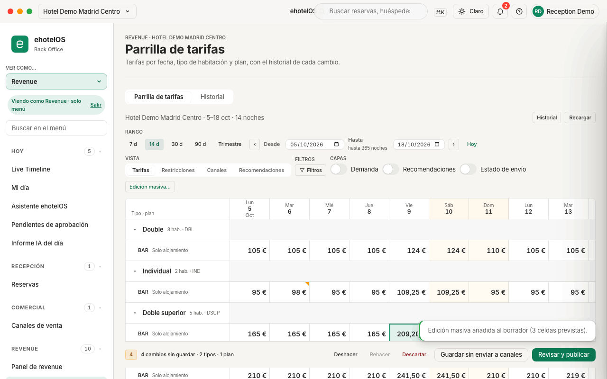
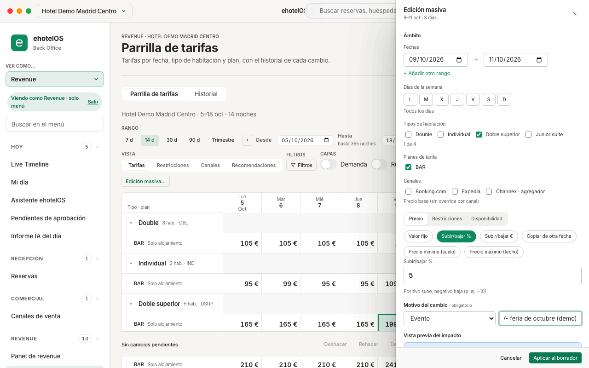
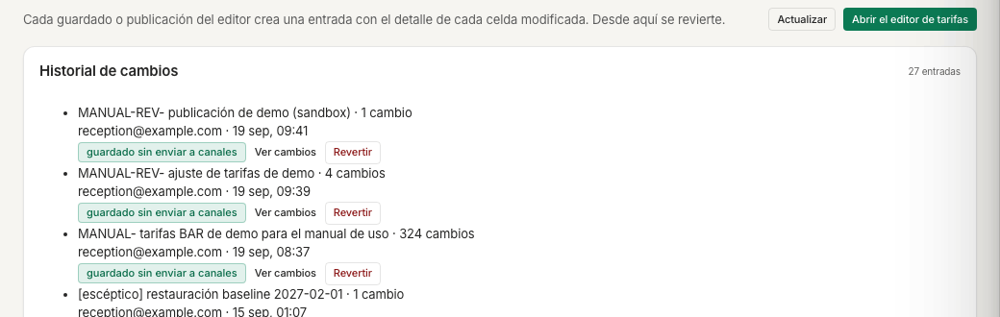
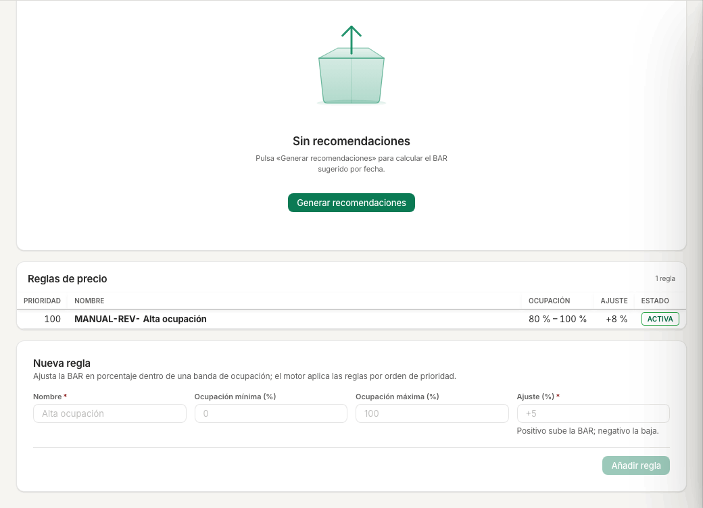
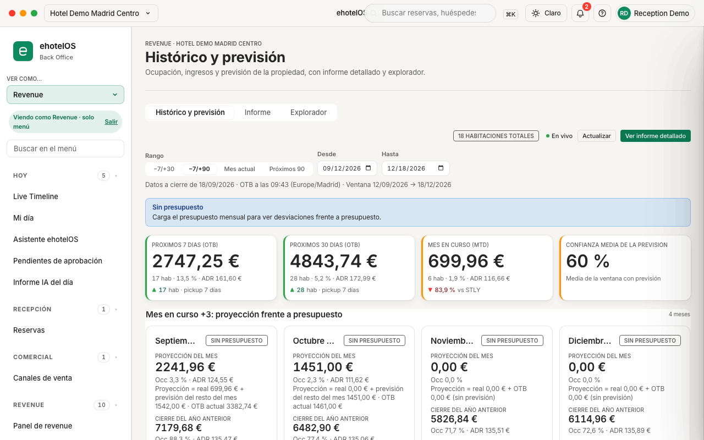
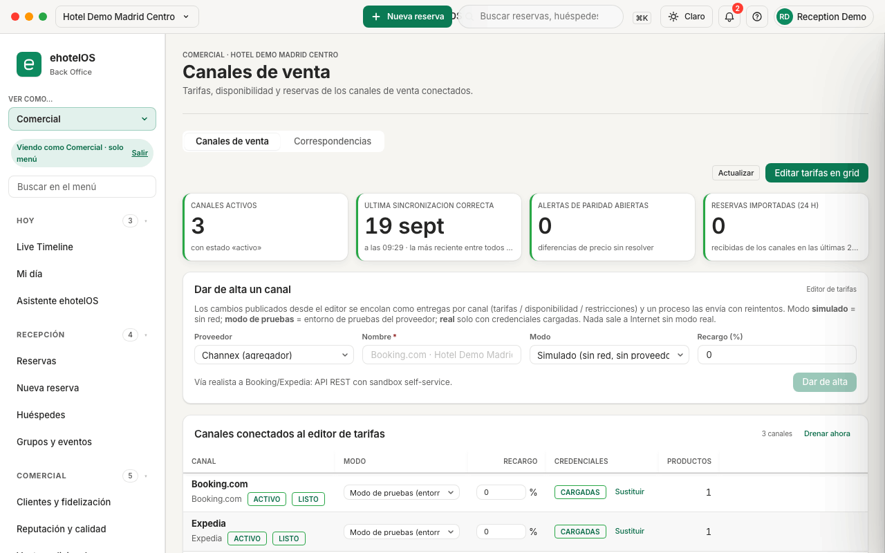
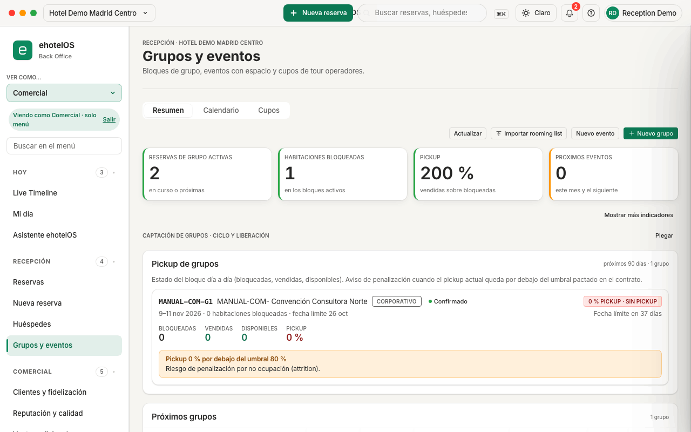
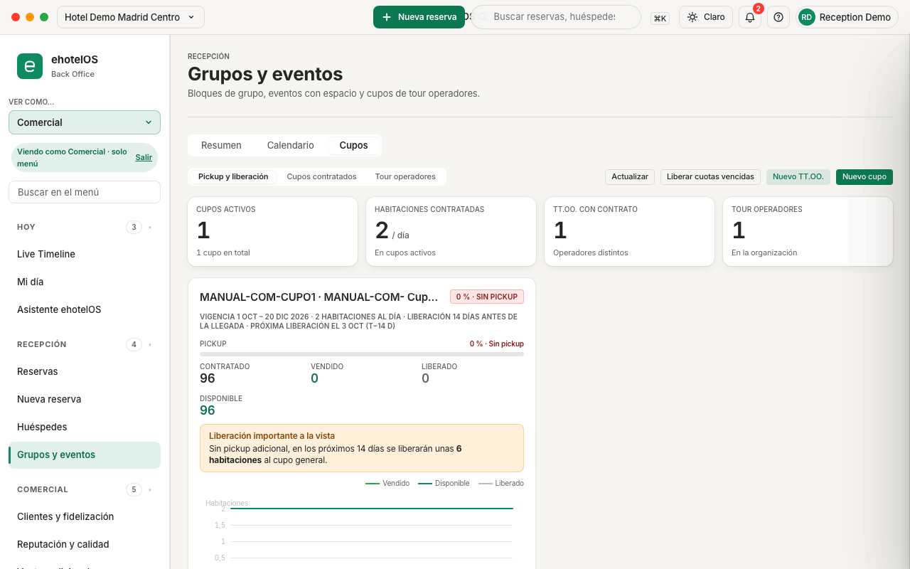
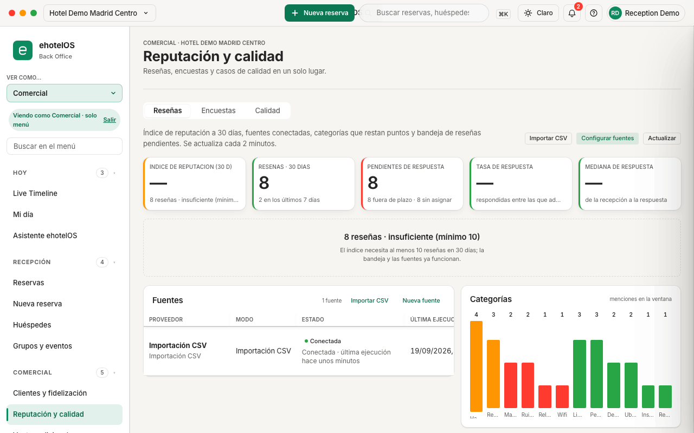
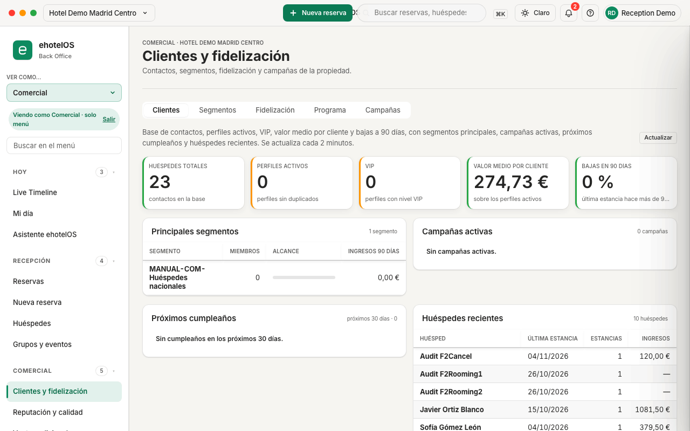

# Guía comercial y de revenue · ehotelOS

Esta guía explica cómo trabajan en ehotelOS el equipo comercial (clientes, grupos y cupos, reputación, ventas, canales) y el de revenue (tarifas y parrilla, planes, reglas y previsión, exportaciones). Tiene dos partes independientes; cada una empieza por lo que verás en tu menú y sigue con las tareas del día a día, paso a paso.

Antes de seguir conviene haber leído [Primeros pasos](00-primeros-pasos.md): cómo entrar, qué es el menú lateral, la búsqueda ⌘K, el vocabulario común de estados y el [glosario de indicadores y términos](00-primeros-pasos.md#glosario-de-indicadores-y-términos) (OTB, pickup, pace, BAR, cut-off, rooming list, attrition, paridad…), que esta guía usa tal como aparecen en las pantallas.

## Cómo están hechas las capturas

- Todas las capturas son de la propiedad de demostración «Hotel Demo Madrid Centro» (19 habitaciones de 4 tipos: Individual, Double, Doble superior y Junior suite; un solo plan de tarifas «BAR · Best Available Rate»). Los huéspedes, empresas, tour operadores, grupos y reseñas que aparecen son ficticios; los creados para esta guía llevan el prefijo «MANUAL-COM-» o «MANUAL-REV-».
- Se han tomado con la cuenta administradora de la demo y el selector «Ver como…» de la barra lateral puesto en «Revenue» (parte 1) o en «Comercial» (parte 2). Ese selector solo cambia el menú que se muestra (aparece el aviso «Viendo como Revenue · solo menú» o «Viendo como Comercial · solo menú», con el botón «Salir»); lo que puedas hacer dentro de cada pantalla depende de la plantilla real de tu usuario. Se pierde al recargar la página.
- Tema claro, ventana de 1280 × 800. Las tarjetas de instrucciones que algunas pantallas muestran arriba («Panel de revenue», «Gestor de canales OTA», «Gestión de grupos y eventos», «Cupos de tour operadores») se han cerrado con la «×» («Cerrar instrucciones») antes de capturar; tú las verás la primera vez que entres.
- Los canales de venta de la demo están en **modo de pruebas**: nada sale a Internet. Las fechas y cifras son las del día de la captura (19 de septiembre de 2026).

> **Nota:** varios botones de esta guía («Nuevo grupo», «Nuevo evento», «Importar rooming list», «Nuevo TT.OO.», «Nuevo cupo», «Nuevo plan», «Nueva política», «Nuevo segmento», «Importar CSV», «Nueva fuente», «Nueva regla» y «Devengar una reserva» de Comisiones…) abren un formulario lateral (un «cajón») que se cierra con «Cancelar», la × o Esc sin guardar nada. Todos se han abierto en la demo al escribir esta guía y se describen tal como son; su botón final solo se ha pulsado donde el texto lo dice (el grupo, el tour operador, el cupo y la importación de reseñas).

---

## Parte 1 · Revenue

### Para quién

- Plantilla **«Revenue corporativo»**: tarifas y parrilla, planes y políticas, reglas y recomendaciones, histórico y previsión, comparativa, competencia, calendario de demanda, reunión de revenue, canales (lectura y correspondencias) e informes con sus exportaciones.
- La plantilla **«Dirección de hotel»** ve las mismas diez entradas de Revenue; su guía es [10 · Dirección](10-direccion.md).

### Qué verás en tu menú

Con la plantilla «Revenue corporativo» el menú lateral tiene **5 categorías · 22 entradas** (lo pone al pie del menú):

| Categoría | Entradas |
|---|---|
| Hoy (5) | Live Timeline · Mi día · Asistente ehotelOS · Pendientes de aprobación · Informe IA del día |
| Recepción (1) | Reservas (solo la pestaña «Lista» y el detalle de cada reserva) |
| Comercial (1) | Canales de venta (pestañas «Canales de venta · Correspondencias») |
| Revenue (10) | Panel de revenue · Parrilla de tarifas · Planes de tarifas · Reglas y recomendaciones · Histórico y previsión · Comparativa · Reunión de revenue · Competencia · Calendario de demanda · Políticas de cancelación |
| Informes (5) | Centro de informes (pestañas «Centro de informes · Exportaciones de revenue») · Analítica · Rentabilidad por habitación · Cartera de propiedades · Rendimiento de canales |

- Al entrar aterrizas en **Mi día › Dirección** (`/hoy/direccion`), la única pestaña de Mi día que ves: KPIs del día («Ocupación», «ADR», «RevPAR», «GOPPAR»), «Pace próximos 30 días», «Pickup 7d», «Mix de canales» y «BAR Recommendations IA».
- No tienes el botón «+ Nueva reserva» de la barra superior ni ves Grupos y eventos, Reputación ni Clientes: eso es de la parte comercial.
- Todas las pantallas de Revenue llevan la cabecera «REVENUE · HOTEL DEMO MADRID CENTRO»: trabajas siempre sobre el hotel activo (arriba a la izquierda).

### Vocabulario de la parrilla

| Término | Qué es |
|---|---|
| **BAR** | La tarifa pública base («Best Available Rate»). En la demo es el único plan; cualquier otro plan se deriva de ella (porcentaje o importe sobre la BAR del día). |
| **Celda** | Un precio para un tipo de habitación, un plan y una noche. Sin precio BAR ese día, ehotelOS no puede vender la habitación a ese plan: la celda sale «sin tarifa». |
| **Borrador** | Los cambios que has hecho en la parrilla y todavía no has guardado. La barra inferior los cuenta («4 cambios sin guardar · 2 tipos · 1 plan»). |
| **Guardar sin enviar a canales** | Escribe las tarifas en ehotelOS (el hotel ya vende el precio nuevo) sin mandarlas a Booking.com, Expedia ni Channex. |
| **Revisar y publicar** | Guarda y, además, encola el envío del precio nuevo a los canales que elijas. |
| **Correspondencia** | El vínculo entre un producto tuyo (tipo de habitación + plan) y los códigos de ese producto en un canal. Sin correspondencia activa, ese producto nunca se publica en ese canal. |
| **Restricciones** | Condiciones de venta de una celda: MÍN (estancia mínima), CTA (cerrado a llegada), CTD (cerrado a salida), CERR (cerrado), STOP (cierre de venta), ANT (antelación). |

### 1. Tarifas y parrilla

**Menú › Revenue › Parrilla de tarifas** (`/revenue/parrilla`). Título «Parrilla de tarifas», subtítulo «Tarifas por fecha, tipo de habitación y plan, con el historial de cada cambio.». La pantalla tiene dos pestañas: «Parrilla de tarifas» e «Historial».

Qué hay en la pantalla, de arriba abajo:

- La línea «Hotel Demo Madrid Centro · 5–18 oct · 14 noches» resume el rango cargado; a la derecha, «Historial» y «Recargar».
- **Rango**: botones «7 d · 14 d · 30 d · 90 d · Trimestre», flechas «‹ ›», campos «Desde» y «Hasta» («hasta 365 noches») y «Hoy». El rango también viaja en la dirección de la pantalla (`/revenue/parrilla?from=2026-10-05&to=2026-10-18`), así que puedes guardarla como favorito.
- **Vista**: «Tarifas» (precios), «Restricciones» (cada celda muestra MÍN, CTA, CTD, CERR, STOP o ANT, o «—» si no tiene ninguna; el precio queda atenuado), «Canales» y «Recomendaciones».
- **Filtros**: al pulsar «Filtros» aparecen «Tipos de habitación» («Todos los tipos»), «Planes» («Todos los planes») y «Precio visto por» («Precio base (sin canal)», «Booking.com (+0 %)», «Expedia (+0 %)», «Channex · agregador (+0 %)»). El precio por canal es el base más el recargo del canal; si eliges un canal, sigues editando el precio base.
- **Capas**: interruptores «Demanda», «Recomendaciones» y «Estado de envío». Con «Estado de envío» aparece el botón «Ver estado por canal» (ver 1.6).
- «**Edición masiva…**» abre la hoja de edición masiva (ver 1.2).
- La **rejilla**: una fila por tipo de habitación («Double · 8 hab. · DBL», «Individual · 2 hab. · IND», «Doble superior · 5 hab. · DSUP», «Junior suite · 3 hab. · JSU») con su plan debajo («BAR · Solo alojamiento») y una columna por noche. Los fines de semana van sombreados. En la demo la BAR es 144 € (Double), 95 € (Individual), 165 € (Doble superior) y 210 € (Junior suite), con un 15 % más los viernes y sábados hasta el 31 de diciembre de 2026.
- La **barra inferior** (fija): contador de cambios («Sin cambios pendientes» o «1 cambio sin guardar · 1 tipo · 1 plan»), «Deshacer», «Rehacer», «Descartar», «Guardar sin enviar a canales» y «Revisar y publicar».

> **Nota:** la parrilla solo muestra precios donde hay una tarifa BAR guardada para ese día. Si en tu hotel ves celdas vacías o «sin tarifa», no es un error de la pantalla: hay que cargar la BAR de esas fechas (con la edición masiva «Valor fijo» sobre el rango) antes de que el hotel pueda vender ese tipo de habitación.

#### 1.1 Cambiar el precio de una celda

1. Haz clic en la celda (por ejemplo, «Individual · BAR» del 6 de octubre). La celda queda seleccionada.
2. Pulsa **F2** o **Intro** para editarla (también puedes empezar a teclear directamente un número, «+», «−» o «=»). Aparece un cuadro con el precio actual y la ayuda «Precio. Escribe 132, +10 % o −5 €».
3. Escribe el precio nuevo («99») o una expresión: «+10 %» sube un 10 %, «−5» baja 5 €.
4. Pulsa **Intro** para confirmar. La celda muestra «99 €» con una marca naranja en la esquina y la barra inferior pasa a «1 cambio sin guardar · 1 tipo · 1 plan». Con **Esc** cancelas la edición.
5. Si te has equivocado, «Deshacer» retira el último cambio y «Descartar» vacía todo el borrador (vuelve a «Sin cambios pendientes»).

**Resultado esperado:** el borrador cuenta tu cambio y la celda queda marcada; todavía no se ha guardado nada.

> **Nota:** para varias celdas seguidas, selecciónalas (clic y Mayús+clic) y pulsa **Ctrl+Intro** (⌘+Intro en Mac): se abre «Edición rápida · n celdas» con el campo «Precio» («Escribe 132, +10 % o −5 € · =BAR−10 % para calcularlo a partir del precio BAR») y las restricciones en tres estados (sin cambio · activar · desactivar): «Cerrado a llegada», «Cerrado a salida», «Cerrado», «Cierre de venta», «Estancia mínima», «Mín. (estancia completa)», «Estancia máxima» y «Más opciones…». Termina con «Aplicar a n celdas».

#### 1.2 Edición masiva con motivo

Para cambiar muchas celdas a la vez (un rango de fechas, varios tipos, solo fines de semana…).

1. Pulsa «**Edición masiva…**». Se abre la hoja «Edición masiva» a la derecha.
2. En **Ámbito** indica las «Fechas» (rango «Desde → Hasta»; «+ Añadir otro rango» para varios), los «Días de la semana» («L M X J V S D»; sin marcar ninguno, «Todos los días»), los «Tipos de habitación» (casillas; la hoja cuenta «1 de 4») y los «Planes de tarifa» («BAR»). La sección «Canales» sirve solo para restricciones por canal: la hoja avisa «Precio base (sin override por canal)».
3. Elige qué cambiar con las pestañas «**Precio**», «**Restricciones**» o «**Disponibilidad**». En «Precio» elige el modo: «Valor fijo», «Subir/bajar %», «Subir/bajar €», «Copiar de otra fecha» («Cada celda toma el precio de ese día para su mismo tipo y plan»), «Precio mínimo (suelo)» o «Precio máximo (techo)», y escribe el valor (en «Subir/bajar %», «Positivo sube, negativo baja (p. ej. −10)»).
4. Rellena el «**Motivo del cambio**» (obligatorio): elige «Evento», «Compset», «Pickup lento», «Corrección», «Temporada» o «Estrategia» y, si quieres, escribe un detalle en el cuadro de texto que hay junto al motivo (no lleva rótulo; la ficha 11 lo llama «Detalle (opcional)»). Hasta que no elijas el motivo, «Aplicar al borrador» sigue apagado.
5. Mira la «**Vista previa del impacto**» (cuántas celdas cambian y cómo quedan) y pulsa «**Aplicar al borrador**».

**Resultado esperado:** aviso «Edición masiva añadida al borrador (3 celdas previstas).» y la barra inferior suma los cambios («4 cambios sin guardar · 2 tipos · 1 plan»). En el ejemplo, la Doble superior del viernes 9 de octubre pasa de 189,75 € a 199,24 € (+5 %). Nada se ha guardado todavía.

**Si algo falla:** el botón «Aplicar al borrador» está apagado hasta que eliges un modo de precio (o una restricción o disponibilidad) **y** un motivo. Si la hoja dice «Define un cambio para ver el impacto», te falta el valor.

#### 1.3 Guardar sin enviar a canales

Guarda el borrador en ehotelOS. El hotel vende ya el precio nuevo; los canales siguen con el anterior hasta que los envíes.

1. Con cambios en el borrador, pulsa «**Guardar sin enviar a canales**».
2. En el cuadro «Motivo del cambio» elige una etiqueta («Corrección», «Temporada»…) o escribe el tuyo en «Motivo*» (el cuadro explica: «El motivo queda en el historial junto al detalle de cada celda modificada. Elige uno o escribe el tuyo.») y pulsa «**Continuar**».

**Resultado esperado:** aviso «Guardado en ehotelOS sin enviar a canales: 4 celdas. El PMS ya vende el valor nuevo; usa «Enviar a canales» cuando quieras actualizarlos.». La barra inferior pasa a «Sin cambios sin guardar · 4 celdas guardadas sin enviar a canales · Enviar a canales · Guardado en ehotelOS: 19 sep, 09:39» y el historial gana una entrada con tu motivo (ver 1.5).

> **Nota:** «Enviar a canales» de la barra inferior manda esas celdas guardadas a los canales que tengan correspondencia para su producto. La cuenta de celdas «guardadas sin enviar» vive en tu navegador: si recargas la página desaparece de la barra (en la demo, tras recargar, la barra vuelve a «Sin cambios pendientes»). Las tarifas guardadas no se pierden: están en el historial y en la parrilla; su estado frente a los canales se consulta en la capa «Estado de envío» (ver 1.6).

#### 1.4 Revisar y publicar (canales en modo de pruebas)

Guarda el borrador **y** encola su envío a los canales.

1. Con cambios en el borrador, pulsa «**Revisar y publicar**».
2. En «Motivo del cambio antes de publicar» elige o escribe el motivo y pulsa «**Continuar**».
3. Se abre el cajón «**Revisar y publicar**» con el resumen («1 celda · 1 tipo · 1 plan · 13 oct»), la lista de cambios por tipo («Junior suite · 1 celda · BAR · Best Available Rate · 13 oct · Precio · 210 €→219 € · Reception Demo») y la sección «**Canales**», con una casilla por canal y el número de celdas que recibiría cada uno («Booking.com · 0 celdas · modo de pruebas», «Expedia · 0 celdas · modo de pruebas», «Channex · agregador · 0 celdas · modo de pruebas»).
4. Marca los canales y pulsa «**Publicar en n canales**». Si no marcas ninguno, el cajón avisa «Sin canales seleccionados: los cambios se guardan en ehotelOS pero no se envían a ningún canal.» y puedes usar «Guardar sin enviar a canales» desde el propio cajón.

**Resultado esperado (con canales marcados):** la publicación crea una entrada «publicado» en el historial y una **entrega** por canal, tipo de dato (tarifas, disponibilidad, restricciones) y noche en el «Log de entregas» de Canales de venta (ver parte 2, tarea 5), con estados «en cola → enviando → confirmada / rechazada / sin respuesta». En modo de pruebas las confirma el simulador local; nada llega al portal real.

> **En construcción:** en la demo solo el producto «Double · BAR» tiene correspondencia con los tres canales. Por eso, al publicar un cambio de Individual, Doble superior o Junior suite, el cajón ofrece «0 celdas» en cada canal y el botón «Publicar en 0 canales» queda apagado: la única salida es «Guardar sin enviar a canales» (es lo que se hizo para esta guía). En tu hotel, antes de publicar comprueba en «Canales de venta › Correspondencias» que cada tipo × plan tiene sus códigos externos y la casilla «Activo» marcada.

#### 1.5 Historial y reversión

**Menú › Revenue › Parrilla de tarifas › pestaña «Historial»** (`/revenue/parrilla/historial`). «Cada guardado o publicación del editor crea una entrada con el detalle de cada celda modificada. Desde aquí se revierte.»

- Cada entrada muestra el motivo y el número de cambios («MANUAL-REV- ajuste de tarifas de demo · 4 cambios»), quién y cuándo («reception@example.com · 19 sep, 09:39») y el estado: «guardado sin enviar a canales», «publicado» (con los canales) o «revertido».
- «**Ver cambios**» despliega el detalle debajo de la entrada, agrupado por tipo y plan («Doble superior · 3 celdas · BAR», «9–10 oct (2) · Precio 189,75 €→199,24 €», «11 oct · Precio 165 €→173,25 €», «Individual · 1 celda · 6 oct · Precio 95 €→99 €»); el botón pasa a «Ocultar».
- «**Revertir**» deshace esa entrada creando una nueva («Reversión de … · revierte la entrada …»). La reversión no toca los canales: si la entrada original se había publicado, las celdas quedan «pendientes de reenvío» y la parrilla te ofrece «Enviar a canales». Si alguien cambió después esas celdas, ehotelOS avisa «La parrilla cambió después de este asiento» y te deja «Forzar reversión».
- «Actualizar» recarga la lista; «Abrir el editor de tarifas» vuelve a la parrilla.

> **Nota:** en la demo verás entradas antiguas con motivos técnicos («[escéptico] …», «[csc-refute] …»): son pruebas automáticas del sistema, no cambios de un compañero.

#### 1.6 Ver el estado de envío a canales

1. En la parrilla activa la capa «**Estado de envío**» y pulsa «**Ver estado por canal**».
2. Se abre «Estado de sincronización» con la leyenda «○ Sin enviar · ◔ Pendiente · ◑ Enviando… · ✓ Confirmado · ↺ Pendiente de reenvío · ✕ Rechazado · ⏱ Sin respuesta (tiempo agotado)», el filtro «Solo errores» y el «Resumen por canal» («Booking.com · modo de pruebas · sin envíos» …) del rango visible.

**Resultado esperado:** para un rango sin publicaciones el panel dice «Sin envíos registrados en el rango.» (es lo que verás en la demo para Individual, Doble superior y Junior suite, que nunca se han publicado); con publicaciones ves, por canal, cuántas celdas están confirmadas, pendientes o rechazadas. El panel tiene además el botón «Enviar pendientes» para las celdas guardadas sin publicar, que en esta guía no se ha podido ejercitar (no hay celdas pendientes en canales con correspondencia).

### 2. Planes de tarifas y políticas de cancelación

**Menú › Revenue › Planes de tarifas** (`/revenue/planes`). «La tarifa pública (BAR) como base y sus variantes derivadas (porcentaje o importe) con sus restricciones de estancia mínima y máxima y de llegada o salida. El precio de cada día se calcula sobre la BAR del día.»

- KPIs «Planes», «Activos» («a la venta»), «Tarifas base» y «Variantes derivadas». Tabla «Planes de tarifas» con «Código · Nombre · Tipo · Plan padre · Derivación · Régimen · Mín. noches · Máx. noches · Cierre a la llegada · Cierre a la salida · Estado». En la demo hay un único plan: «BAR · Best Available Rate · Base · room_only · ACTIVO».
- «**Nuevo plan**» abre el cajón «Nuevo plan tarifario» («La variante hereda el precio de la BAR del día y aplica su derivación.»): «Código*» («BAR, NREF, FLEX, CORP…»), «Nombre*», «Tipo*» («BAR · Tarifa pública (base)», «No reembolsable», «Flexible», «Empresas», «Paquete (PKG)», «Promocional», «Fin de semana»), «Plan padre*» («BAR — Best Available Rate»), «Tipo de derivación» («Porcentaje sobre la BAR (ej. −10)», «Importe sobre la BAR (ej. +5)», «Sin derivación»), «Valor de derivación», «Régimen» («Solo alojamiento (RO)», «Alojamiento y desayuno (BB)», «Media pensión (HB)», «Pensión completa (FB)», «Todo incluido (AI)»), «Plan activo» y las «Restricciones por defecto» («Estancia mínima (noches)», «Estancia máxima (noches)», «Cierre a la llegada (CTA)», «Cierre a la salida (CTD)»); termina con «Crear plan».

> **Nota:** en esta guía no se ha creado ningún plan derivado; la demo sigue con la BAR como único plan.

**Menú › Revenue › Políticas de cancelación** (`/revenue/politicas-cancelacion`). «Ventana de cancelación gratuita, penalización aplicable y, si quieres, penalizaciones progresivas (cuanto más cerca de la entrada, mayor el cargo). El cargo se aplica al folio al cancelar o en el cierre del día.»

- En la demo la lista está vacía: «Sin políticas · Crea la primera política de cancelación para empezar a aplicarla en reservas.».
- «**Nueva política**» abre el cajón con «Código*» («FLEX, SEMI, NREF…»; el código no se cambia una vez creada), «Nombre*», «Descripción», «Horas gratis antes de la llegada» (48 por defecto), los interruptores «Política activa» y «Política por defecto», «Penalización por cancelación (por defecto)» («Primera noche», «Porcentaje del total», «Importe fijo (€)», «Estancia completa», «Sin cargo») con su «Valor (si % o €)», «Penalización por no-show» (mismas opciones) y las «Penalizaciones progresivas» («Añadir ventana»: tramos «Horas antes de la llegada (T−)» y «Penalización (%)»; «Si no hay tramos, se usa la penalización por defecto»); termina con «Crear política».

### 3. Reglas, previsión y análisis

#### 3.1 Reglas y recomendaciones

**Menú › Revenue › Reglas y recomendaciones** (`/revenue/reglas`). «El motor combina la ocupación real, los precios de la competencia y tus reglas para recomendar la tarifa base por fecha. Cada recomendación explica sus factores y nada se aplica sin aprobación; al aplicarla, la tarifa se escribe en la parrilla.»

Añadir una regla de precio (el formulario está en la propia pantalla, no en un cajón):

1. Baja hasta «**Nueva regla**» («Ajusta la BAR en porcentaje dentro de una banda de ocupación; el motor aplica las reglas por orden de prioridad.»).
2. Rellena «Nombre*» («MANUAL-REV- Alta ocupación»), «Ocupación mínima (%)» (80), «Ocupación máxima (%)» (100) y «Ajuste (%)*» (8; «Positivo sube la BAR; negativo la baja.»).
3. Pulsa «**Añadir regla**».

**Resultado esperado:** aviso «Regla creada.»; la tabla «Reglas de precio» la lista con «Prioridad 100 · MANUAL-REV- Alta ocupación · 80 % – 100 % · +8 % · ACTIVA» y el KPI «Reglas activas» pasa a «1 de 1 regla».

Generar recomendaciones:

1. Pulsa «**Generar recomendaciones**» (arriba a la derecha o en la tarjeta «Recomendaciones de BAR»).
2. Revisa las recomendaciones pendientes: cada una explica sus factores y se acepta o rechaza; la vista «Recomendaciones» y la capa «Recomendaciones» de la parrilla las muestran celda a celda.

**Resultado esperado:** aviso «Recomendaciones generadas.» y el KPI «Pendientes · por decidir» con las nuevas.

> **En construcción:** en la demo, con la ocupación actual, «Generar recomendaciones» termina en «Recomendaciones generadas.» pero deja «0 recomendaciones» («Sin recomendaciones · Pulsa «Generar recomendaciones» para calcular el BAR sugerido por fecha.»): sin histórico suficiente ni sondeos de competencia, el motor no propone precios. Las recomendaciones se calculan por reglas y datos, no por un modelo de lenguaje.

#### 3.2 Histórico y previsión

**Menú › Revenue › Histórico y previsión** (`/revenue/historico-prevision`). «Ocupación, ingresos y previsión de la propiedad, con informe detallado y explorador.» Tres pestañas: «Histórico y previsión», «Informe» y «Explorador».

- **Histórico y previsión**: chip «18 habitaciones totales» y «En vivo», «Actualizar», «Ver informe detallado»; ventanas «−7/+30 · −7/+90 · Mes actual · Próximos 90» o «Desde / Hasta»; línea «Datos a cierre de 18/09/2026 · OTB a las 09:43 (Europe/Madrid) · Ventana 12/09/2026 → 18/12/2026»; aviso «Sin presupuesto · Carga el presupuesto mensual para ver desviaciones frente a presupuesto.»; KPIs «Próximos 7 días (OTB)», «Próximos 30 días (OTB)», «Mes en curso (MTD)» y «Confianza media de la previsión»; bloque «Mes en curso +3: proyección frente a presupuesto» (una tarjeta por mes con «Proyección del mes», «Cierre del año anterior» y «Presupuesto»); gráfico y tabla «Ocupación: real frente a previsión» día a día.
- **Informe** (`/revenue/historico-prevision/informe`): la tabla diaria completa («Fecha · Hab · Occ % · ADR · RevPAR · Ingresos · Entr. · Sal. · No-show · OOO · Pickup Δ1D/Δ7D/Δ28D · Prev. … · STLY … · Ppto.»), con subtotales por semana, y los botones «Exportar CSV», «Exportar Excel» e «Imprimir»; «Volver al cuadro» regresa a la pestaña principal.
- **Explorador** (`/revenue/historico-prevision/explorador`): selector «Próximos 30 días · 60 · 90», KPIs «Días con previsión», «Confianza media», «Ocupación media», «ADR medio», «RevPAR medio», «Ingresos previstos (30 d)» y la tabla «Previsión por día» («Fecha · Ocup. prevista · Hab. vendidas · ADR · RevPAR · Ingresos hab. · Confianza · Modelo»).

> **Nota:** en la demo la previsión la calcula un modelo determinista («deterministic-v1», confianza 60 %) a partir de las reservas y la BAR del día; los ingresos y la ocupación son los de las reservas ficticias. Con pocas reservas verás porcentajes extraños en el histórico (por ejemplo, «200 %» un día con dos noches cargadas sobre una habitación): es el dato real de la demo, no un cálculo de tu hotel.

#### 3.3 Comparativa, calendario de demanda y competencia

- **Menú › Revenue › Comparativa** (`/revenue/comparativa`): «Compara el rendimiento de un periodo con el periodo anterior, el mismo periodo del año pasado o un rango a tu elección.» Elige el periodo («Últimos 7 días · Últimos 30 días · Últimos 90 días · Este mes» o «Desde / Hasta») y «Comparar con» («Sin comparación», «Periodo anterior», «Mismo periodo, año anterior», «Periodo personalizado»). Verás «Indicadores del periodo»: «Ocupación», «ADR», «RevPAR», «Ingresos de habitación», «Ingresos totales» y «Habitaciones vendidas», cada uno con «Antes: … · +…» y la nota «Periodo actual: 29 días con datos · comparación: 30 días con datos.».
- **Menú › Revenue › Calendario de demanda** (`/revenue/calendario-demanda`): «Eventos, festivos y periodos de alta demanda que alimentan la previsión y explican los precios.» KPIs «Próximos eventos», «De alto impacto», «Pasados» y el formulario «Nuevo evento de demanda» en la propia pantalla («Nombre*», «Tipo»: «Evento de ciudad · Congreso / feria · Festivo / puente · Evento deportivo · Concierto / espectáculo · Periodo de baja demanda · Otro (manual)», «Impacto esperado»: «Bajo · Medio · Alto», «Inicio*», «Fin*», botón «Añadir evento»). En la demo no hay eventos («Sin eventos de demanda»); en esta guía no se ha creado ninguno.
- **Menú › Revenue › Competencia** (`/revenue/competencia`): «Las tarifas de tus competidores y las alertas de paridad, para decidir tu precio público. Hoy no hay ningún proveedor de sondeo externo conectado: las tarifas se registran a mano o con el sondeo interno y se guardan en tu base de datos.» KPIs «Competidores», «Tarifas sondeadas», «Mediana de mercado», «Alertas de paridad»; formulario «Añadir competidor» en la propia pantalla («Hotel», «Categoría», «Comparabilidad (0–1)»); botón «Ejecutar sondeo»; bloques «Alertas de paridad», «Posición de mercado por fecha» y «Tarifas por competidor (muestra)». En la demo no hay competidores.

#### 3.4 Reunión de revenue

**Menú › Revenue › Reunión de revenue** (`/revenue/reunion`). «Todo lo que necesita la reunión semanal en una pantalla: ritmo de ventas, pickup, precisión de la previsión, competencia, presupuesto frente a previsión y real, recomendaciones pendientes y una calculadora de desplazamiento de grupos.»

Lo que muestra de verdad con los datos de la demo:

- KPIs «OTB 30 días» (28 noches · 4843,75 €), «Pace 90 días» (+28 noches vs. hace 7 días), «Pickup 7 días» (29 noches · 12 reservas · 4987,75 €) y «Precisión de la previsión» (0 % · ADR 75 %).
- «Comp-set (próximos 14 días)»: «0 muestras · Sin tarifas de comp-set. Ejecuta un sondeo en Rate Shopper.» (no hay competidores ni sondeos).
- Tabla «Presupuesto, previsión y real del mes» con las filas «Presupuesto» («—», no hay presupuesto cargado), «Previsión» y «Real» (ocupación, ADR e ingresos de habitación), etiqueta «Real: cierres nocturnos».
- «Recomendaciones de BAR pendientes»: «0 pendientes».
- «Análisis de desplazamiento de grupos» («Evalúa si un grupo compensa frente al transitorio que desplazaría a la tarifa de previsión.»): campos «Entrada», «Salida», «Habitaciones por noche», «Tarifa del grupo (€)» y botón «Analizar». En esta guía no se ha ejecutado ningún análisis.

#### 3.5 Panel de revenue

**Menú › Revenue › Panel de revenue** (`/revenue`). «Ritmo, captación y precisión de la previsión calculados desde las reservas, recomendaciones de precio pendientes y acceso directo a las herramientas de revenue.» Verás «Señales en vivo» («Reservado a 30 días», «Ritmo a 90 días», «Captación 7 días», «Precisión de la previsión (ocupación)»), «Recomendaciones de precio» con «Abrir reglas y recomendaciones», «Configuración de revenue» («Configurar revenue», «Abrir puesta en marcha»: solo dirección y administración) y «Abrir una herramienta» (las diez herramientas del módulo con su estado «Listo»).

### 4. Exportaciones de revenue

**Menú › Informes › Centro de informes › pestaña «Exportaciones de revenue»** (`/informes/exportaciones-revenue`). «Los informes del ritual de revenue se generan bajo demanda con los datos de la propiedad y se descargan al momento: CSV y Excel para trabajar, páginas imprimibles para dirección.» Seis informes agrupados por ritual:

| Ritual | Informe | Parámetros | Botones |
|---|---|---|---|
| Diario (7:00) | Informe diario History & Forecast | «Desde / Hasta» | «Descargar CSV», «Descargar Excel» |
| Diario | Pickup diario (Δ 1/7/28) | «Desde / Hasta» | «Descargar CSV» |
| Diario (8:00) | Flash de dirección (1 página) | ninguno | «PDF (imprimir)» |
| Semanal (miércoles) | Pace por segmento | «Desde / Hasta» | «Descargar Excel» |
| Semanal | Meeting pack de revenue | «Mes» | «PDF (imprimir)» |
| Mensual (día 1) | Cierre mensual día a día | «Mes» | «Descargar Excel», «Descargar CSV» |

1. Ajusta los parámetros del informe («Desde / Hasta» o «Mes»).
2. Pulsa «**Descargar CSV**» (o «Descargar Excel» / «PDF (imprimir)»). El navegador descarga el fichero con el nombre `ehotelos_{hotel}_{informe}_{fecha}` (por ejemplo, el informe diario del 19 de septiembre pesa unos 9,6 KB).
3. El bloque «**Generados en esta sesión**» lista cada fichero («Informe · Fichero · Formato · Hora · Tamaño») con «Volver a descargar». «Esta lista vive solo en la memoria de la pestaña: al recargar la página se vacía.»

**Resultado esperado:** el fichero en tu carpeta de descargas y una fila nueva en «Generados en esta sesión». Convenciones: «CSV es-ES: separador ';' y coma decimal», «Fechas ISO (YYYY-MM-DD) en los datos», «Importes EUR sin símbolo», «Cabecera con hora OTB (Europe/Madrid)». «PDF (imprimir)» descarga una página HTML lista para imprimir o guardar como PDF desde el navegador.

> **En construcción:** en la pestaña «Centro de informes» (`/informes`), el bloque «Exportar informe» con «Tipo de informe» («Reservas · Facturación · Revenue · Propietario») y «Formato» («PDF · CSV · XLSX · JSON») y el botón «Generar exportación» termina hoy con el aviso «Exportación lista: undefined» y no descarga nada. Usa las exportaciones de la pestaña «Exportaciones de revenue» o «Exportar CSV / Exportar Excel» del informe de Histórico y previsión.

---

## Parte 2 · Comercial

### Para quién

- Plantilla **«Comercial»**: clientes y fidelización, reputación y calidad, ventas adicionales y portal del huésped, ventas a empresas, canales de venta, comisiones, grupos, eventos y cupos, reservas y huéspedes, e informes.
- No ves la parrilla, los planes ni las políticas: eso es de «Revenue corporativo» (parte 1). Si necesitas un cambio de tarifa, pídelo a revenue o a dirección.

### Qué verás en tu menú

Con la plantilla «Comercial» el menú lateral tiene **5 categorías · 15 entradas**:

| Categoría | Entradas |
|---|---|
| Hoy (3) | Live Timeline · Mi día · Asistente ehotelOS |
| Recepción (4) | Reservas (pestañas «Lista · Importar» y el detalle de cada reserva) · Nueva reserva · Huéspedes · Grupos y eventos (pestañas «Resumen · Calendario · Cupos») |
| Comercial (5) | Clientes y fidelización (pestañas «Clientes · Segmentos · Fidelización · Programa · Campañas») · Reputación y calidad (pestañas «Reseñas · Encuestas · Calidad») · Ventas adicionales (pestañas «Ventas adicionales · Ofertas · Portal del huésped») · Ventas a empresas · Canales de venta (pestañas «Canales de venta · Correspondencias») |
| Finanzas (1) | Comisiones |
| Informes (2) | Centro de informes · Rendimiento de canales |

- Al entrar aterrizas en **Mi día › Dirección** (`/hoy/direccion`), la única pestaña de Mi día que ves.
- Sí tienes el botón «**+ Nueva reserva**» en la barra superior y puedes abrir la lista de reservas y la ficha de cada huésped («Huéspedes», columnas «Nombre · Documento · Contacto · Empresa · VIP / Fidelización», botón «Nuevo huésped»). Cómo se crea una reserva se explica en [70 · Recepción](70-recepcion.md).

### 5. Canales de venta

**Menú › Comercial › Canales de venta** (`/comercial/canales`). «Tarifas, disponibilidad y reservas de los canales de venta conectados.» Pestañas «Canales de venta» y «Correspondencias»; botón «Editar tarifas en grid» (abre la parrilla, solo si tu plantilla la ve).

Qué hay en la pantalla:

- KPIs «Canales activos» (3, «con estado «activo»»), «Última sincronización correcta», «Alertas de paridad abiertas» y «Reservas importadas (24 h)».
- «**Dar de alta un canal**»: «Proveedor» («Channex (agregador)», «Booking.com (directo)», «Expedia (EQC)», «Airbnb», «Hotelbeds», «Vrbo»), «Nombre*», «Modo» («Simulado (sin red, sin proveedor)», «Modo de pruebas (entorno de pruebas del proveedor)», «Real (producción)»), «Recargo (%)» y el botón «Dar de alta». El bloque lo explica: «Modo simulado = sin red; modo de pruebas = entorno de pruebas del proveedor; real solo con credenciales cargadas. Nada sale a Internet sin modo real.» En esta guía no se ha dado de alta ningún canal.
- «**Canales conectados al editor de tarifas**» (3 canales; botón «Drenar ahora» para forzar el envío de las entregas en cola): una fila por canal con «Canal» (nombre y etiquetas «ACTIVO» / «LISTO»), «Modo» (selector), «Recargo» (%), «Credenciales» («CARGADAS» y «Sustituir»), «Productos» (cuántos tipo × plan tienen correspondencia: 1) y las acciones «**Probar conexión**», «**Correspondencias**», «**Desactivar**» y «**Archivar**». Los canales archivados conservan su historial y reviven con «Dar de alta».
- «**Log de entregas**»: filtros «Canal» («Todos los canales», Booking.com, Expedia, Channex · agregador), «Estado» («Todos los estados», «en cola», «enviando», «enviada», «confirmada», «rechazada», «sin respuesta», «sustituida») y «Desde / Hasta»; tabla «Cuándo · Canal · Tipo (tarifas / disponibilidad / restricciones) · Producto (Double · BAR) · Fecha · Estado · Intentos · Error» con el botón «**Reintentar**» en cada fila y «Cargar más» al final. Una fila rechazada muestra el error del proveedor (en la demo: «402: AmountAfterTax must be between 5 and 50000», una prueba con un importe fuera de rango).
- «**Canales conectados (agregador)**»: una tarjeta por canal con «Última sincronización», «Correspondencias» («0 habitaciones · 0 tarifas»), botones «Probar», «Sincronizar ahora» y «Correspondencias», y el bloque «Preparación del canal» («CONFIGURACIÓN INCOMPLETA» en la demo: modo, credenciales, «Productos mapeados · 1/4 productos (tipo × plan) mapeados (25 %)», última entrega confirmada, adaptador, códigos de producto).

Resolver una entrega rechazada:

1. En «Log de entregas» filtra «Estado» = «rechazada» y lee la columna «Error».
2. Corrige la causa (el precio en la parrilla, la correspondencia del producto…) y pulsa «**Reintentar**» en la fila: la entrega vuelve a «en cola» con los intentos a cero y el siguiente drenaje la envía.

**Resultado esperado:** la fila pasa por «en cola» y «enviando» hasta «confirmada» (en modo de pruebas la confirma el simulador local) o vuelve a «rechazada» con el error si la causa sigue ahí.

> **En construcción:** los tres canales de la demo (Booking.com, Expedia y Channex · agregador) están en «Modo de pruebas»: el simulador local valida la estructura de cada envío, «no sustituye la certificación del proveedor» y nada llega a un portal real. Pasar un canal a «Real (producción)» exige credenciales del proveedor y una decisión de dirección y sistemas (hoy la instancia limita todos los canales a modo de pruebas; la vía realista a Booking y Expedia es Channex). Los botones «Probar», «Sincronizar ahora», «Enviar tarifas», «Enviar disponibilidad», «Enviar restricciones» y «Comprobar paridad» de las tarjetas del agregador son de la primera versión del gestor de canales y no se han recorrido en esta guía.

#### 5.1 Correspondencias

**Menú › Comercial › Canales de venta › pestaña «Correspondencias»** (`/comercial/canales/correspondencias`). «El editor de tarifas solo publica en un canal las celdas cuyo producto (tipo de habitación + plan) tiene aquí una correspondencia activa. Los códigos externos son los identificadores de habitación y de tarifa que ese canal (Booking.com, Channex…) muestra en su extranet.»

1. Elige el canal en el selector de arriba («Booking.com · modo de pruebas», «Expedia · modo de pruebas», «Channex · agregador · modo de pruebas»). El chip «1/4 PRODUCTOS» te dice cuántos productos tienen correspondencia.
2. En la tabla «Correspondencias por producto de Booking.com» rellena, para cada «Tipo de habitación · Plan», el «Código hab. externo», el «Código tarifa externo», el «Modelo» («por día» o «por ocupación») y marca «Activo».
3. Pulsa «**Guardar correspondencias**» («Recuperar las correspondencias anteriores» deshace lo que no hayas guardado).

**Resultado esperado:** la fila muestra «GUARDADA» y el canal cuenta el producto en «Productos». En la demo solo «DBL · Double · BAR» está guardada en los tres canales; por eso las publicaciones de otros tipos ofrecen «0 celdas» (parte 1, tarea 1.4). En esta guía no se ha cambiado ninguna correspondencia.

#### 5.2 Rendimiento de canales y comisiones

- **Menú › Informes › Rendimiento de canales** (`/informes/canales`): «Reparto de ventas por canal, rentabilidad, alertas de paridad y estado de las sincronizaciones de los últimos 30 días. Solo lectura; se actualiza cada 2 minutos.» KPIs «Canales activos», «Alertas de paridad abiertas», «Comisión media», «Reservas · 30 días» («reservas externas importadas») e «Ingresos · 30 días»; bloques «Reparto por canal» («Canal · Reservas · Ingresos · Cuota»), «Cuota de ventas», «Canales más rentables» («La rentabilidad neta por canal aparecerá aquí cuando el pipeline registre el primer snapshot del periodo.»), «Estado de las sincronizaciones» (tareas «Success» / «Failed») y «Alertas de paridad recientes».
- **Menú › Finanzas › Comisiones** (`/finanzas/comisiones`): «La comisión de cada canal de venta y su devengo: se contabiliza sola al emitir la factura o al hacer el check-out (cuenta 629.1 Comisiones de canales contra 410 Acreedores).» Selector de centro («Centro · Hotel Demo Madrid Centro (AMC)»), KPIs «Devengado este mes», «Base de ingresos del mes», «Comisión sobre ingresos», «Pendiente de liquidar» y «Canal con más comisión»; bloques «Desglose por canal», «Reglas de comisión» («Nueva regla») y «Devengos» («Devengar una reserva»). En la demo no hay reglas ni devengos («Añade una regla por canal para empezar a devengar comisiones al facturar.»). «Nueva regla» abre el cajón «Nueva regla» («La regla se aplica a las reservas del canal desde ahora; los devengos ya registrados no cambian.») con «Código del canal*» (ejemplo del campo: «booking»), «Comisión (%)*», «Se aplica sobre*» y «Cuenta de gasto» (629.1), y el botón «Guardar regla». «Devengar una reserva» abre el cajón «Devengar la comisión de una reserva» («Para reservas de canal que no devengaron solas…») con «Identificador de la reserva» (el identificador interno, no el código público), «Canal», «Base (€)» y «Fecha de devengo» (por defecto, la salida de la reserva), y el botón «Devengar y contabilizar», apagado hasta indicar la reserva. En esta guía no se ha creado ninguna regla ni devengado ninguna comisión.

### 6. Grupos, eventos y cupos

**Menú › Recepción › Grupos y eventos** (`/recepcion/grupos`). «Bloques de grupo, eventos con espacio y cupos de tour operadores.» Pestañas «Resumen», «Calendario» y «Cupos».

Qué hay en «Resumen»:

- Botones «Actualizar», «**Importar rooming list**», «**Nuevo evento**» y «**Nuevo grupo**».
- KPIs «Reservas de grupo activas», «Habitaciones bloqueadas», «Pickup» («vendidas sobre bloqueadas») y «Próximos eventos»; «Mostrar más indicadores» añade «Ingresos de restauración del mes».
- «**Pickup de grupos**» (próximos 90 días): una tarjeta por grupo con código, nombre, tipo («CORPORATIVO»), estado («Confirmado»), fechas, «fecha límite», contadores «Bloqueadas · Vendidas · Disponibles · Pickup» y el aviso «Pickup 0 % por debajo del umbral 80 % · Riesgo de penalización por no ocupación (attrition)» cuando el pickup queda por debajo de lo pactado.
- «**Próximos grupos**» («Grupo · Llegada · Salida · Bloqueadas · Vendidas · Pickup») con el menú «**Acciones**» en cada fila: «Bloquear habitaciones», «Crear evento» e «Importar rooming list».
- «Próximos eventos» y «Principales cuentas».

#### 6.1 Crear un grupo

> **Nota:** los pasos siguientes se han ejecutado en la demo: el grupo «MANUAL-COM-G1» existe y su alta se guardó correctamente.

1. Pulsa «**Nuevo grupo**». Se abre el cajón «Nuevo grupo» («Da de alta un bloque de grupo. Los valores por defecto se adaptan al tipo de grupo (boda, MICE, deportivo, corporativo, mayorista…).»).
2. **Identificación**: «Código*» (ehotelOS propone uno, por ejemplo «2026-09-EZI»; puedes cambiarlo: «MANUAL-COM-G1»), «Nombre del grupo*», «Tipo de grupo*» («Corporativo (empresa, convención interna)», «MICE (reuniones, incentivos, congresos)», «SMERF (social, militar, religioso)», «Ocio (circuitos, asociaciones)», «Boda», «Deportivo (equipos)», «Mayorista (TT.OO., bloque puntual)»), «Estado inicial*» («Consulta inicial», «Provisional (pre-bloqueo)», «Confirmado»), «Código de mercado», «Código de origen» y «Asignado a (identificador de usuario)».
3. **Fechas y liberación**: «Llegada*», «Salida*», «Fecha límite (cut-off)» y «Entrega de la rooming list». La entrega de la rooming list debe ser **igual o anterior** a la fecha límite.
4. **Contacto** («Nombre de contacto*», «Cargo», «Correo electrónico», «Teléfono») y **Empresa** («Razón social», «NIF», «Dirección», «Sector»).
5. **Tarifa contratada** («Modelo de tarifa*»: «Tarifa neta» o «Tarifa comisionable», «Comisión», «Tarifa por habitación y noche», «Moneda»), **Penalización por no ocupación (attrition)** («Tipo*»: «Acumulativa (total estancia)», «Por noche», «Sobre los ingresos totales»; «Umbral (%)*» 80; «Penalización (%)*» 100; el bloque «Ejemplo» te calcula el importe), **Facturación y pago** («Método de facturación*»: «Folio maestro (todo a un folio común)», «Separado (alojamiento y extras por separado)», «Individual (cada huésped paga)»; «Método de pago*»; «Depósito (%)»), **Restauración y eventos (F&B)** («Régimen de comidas», «Desayuno incluido en la tarifa», «Cóctel de bienvenida», «Cena de gala incluida»), **España · Específicos** («Aplicar REAV (Régimen Especial de Agencias de Viajes)», «Llegada confidencial») y **Notas internas** («Observaciones»).
6. Pulsa «**Crear grupo**».

**Resultado esperado:** aviso «Grupo «MANUAL-COM- Convención Consultora Norte» creado.»; el grupo aparece en «Pickup de grupos» y en la pestaña «Calendario» como una barra entre su llegada y su salida, con la fecha límite marcada por una línea discontinua.

**Si algo falla:** si la entrega de la rooming list es posterior a la fecha límite, el cajón se queda abierto y muestra el aviso «roomingListDueDate must be on or before cutOffDate.» (en inglés): corrige las fechas y vuelve a pulsar «Crear grupo».

#### 6.2 Calendario y ficha del grupo

**Menú › Recepción › Grupos y eventos › pestaña «Calendario»** (`/recepcion/grupos/calendario`).

1. Elige la ventana («30 días · 90 días · 180 días») y filtra por tipo («Todos los tipos», «Corporativo», «MICE», «SMERF», «Ocio», «Boda», «Deportivo», «Mayorista») y por estado («Todos los estados», «Consulta», «Provisional», «Confirmado»). Los KPIs cuentan «Grupos en el periodo», «Habitaciones bloqueadas», «Pickup global» y «Fechas límite en menos de 14 días».
2. Pulsa la barra de un grupo («MANUAL-COM- Convención Consultora Norte · 0 hab. · 0 %»). Se abre la ficha del grupo con su código y nombre, «Corporativo · 9–11 nov 2026», el estado («Confirmado») y los botones «Cambiar estado», «Crear folio maestro», «Cerrar» y «Editar», con tres pestañas: «Resumen» (identificación, fechas e hitos, contacto, empresa, tarifa contratada, attrition con «Ejemplo», facturación y pago, F&B, específicos de España y notas), «Pickup y bloqueo» (contadores «Bloqueadas · Vendidas · Disponibles · Pickup» y el aviso de attrition) y «Eventos».

> **Nota:** la ficha del grupo es un cajón lateral titulado con el código y el nombre («MANUAL-COM-G1 · MANUAL-COM- Convención Consultora Norte»), subtítulo «Corporativo · 9–11 nov 2026», estado «Confirmado» y las pestañas «Vistas del grupo» («Resumen», «Pickup y bloqueo», «Eventos»); en «Resumen», «Fechas e hitos» muestra «Llegada», «Salida», «Fecha límite (cut-off)» y «Entrega de la rooming list» con sus fechas. Pasada la fecha límite, los grupos provisionales o confirmados se liberan automáticamente cada día.

#### 6.3 Bloquear habitaciones, eventos y rooming list

- «**Bloquear habitaciones**» (menú «Acciones» de la fila del grupo en «Próximos grupos»): reparte las habitaciones por tipo y noche y guarda con «Guardar bloqueo». En la demo, «Próximos grupos» solo lista los grupos que ya tienen habitaciones bloqueadas (el grupo «MANUAL-COM-G1», recién creado y sin bloqueo, no aparece en esa tabla aunque sí en «Pickup de grupos» y en el calendario), así que en esta guía no se ha podido bloquear ninguna habitación desde la pantalla.
- «**Nuevo evento**» (arriba a la derecha) o «Crear evento» (menú «Acciones» de la fila): cajón «Nuevo evento» con «Nombre del evento*», «Tipo de evento*» («Cóctel de bienvenida», «Pausa café», «Cena de gala», «Conferencia», «Boda», «Otro»), «Fecha*», «Hora de inicio*» y «Hora de fin*», «Sala» («Sin asignar» o una sala dada de alta), «Estilo de montaje*» («Teatro (auditorio)», «En U», «Aula», «Banquete (mesas redondas)», «Cóctel (de pie)», «Sala de juntas»), «Asistentes esperados» y «Observaciones internas»; termina con «Crear evento». El evento se asocia al grupo de la fila desde la que lo creas y su fecha debe caer dentro de la estancia de ese grupo; si no, verás «La fecha debe estar dentro de la estancia del grupo (24–26 oct 2026).». En esta guía no se ha creado ningún evento: el botón «Nuevo evento» del resumen asocia el evento al grupo listado en «Próximos grupos», que en la demo es un grupo antiguo de pruebas.
- «**Importar rooming list**»: cajón con «1 · Selecciona el archivo» («Archivo CSV», «Elegir CSV», «Descargar plantilla CSV»), «2 · Plantilla (opcional)» y «3 · Vista previa y validación», y el botón «Importar». Vuelve a importarla si el cliente la cambia.

#### 6.4 Cupos de tour operadores

**Menú › Recepción › Grupos y eventos › pestaña «Cupos»** (`/recepcion/grupos/cupos`). Subpestañas «Pickup y liberación», «Cupos contratados» y «Tour operadores»; botones «Actualizar», «Liberar cuotas vencidas», «Nuevo TT.OO.» y «Nuevo cupo». KPIs «Cupos activos», «Habitaciones contratadas» («/ día»), «TT.OO. con contrato» y «Tour operadores».

> **Nota:** los pasos siguientes se han ejecutado en la demo: el tour operador «MANUAL-COM-TTOO» y el cupo «MANUAL-COM-CUPO1» existen y sus altas se guardaron correctamente.

Dar de alta el tour operador (obligatorio antes del cupo: sin ningún tour operador, «Nuevo cupo» está apagado):

1. Pulsa «**Nuevo TT.OO.**». Cajón «Nuevo tour operador» («Da de alta un tour operador con el que vas a contratar cupos.»).
2. Rellena «Código*» («MANUAL-COM-TTOO»), «Nombre*», «NIF», «Moneda» («EUR · GBP · USD»), «Correo de contacto», «Teléfono», «Comisión por defecto (%)», «Plazo de pago (días)» (30), «Notas» y «Activo».
3. Pulsa «**Crear tour operador**».

**Resultado esperado:** aviso «Tour operador «MANUAL-COM- Viajes Meseta (TT.OO. ficticio)» creado.», el KPI «Tour operadores» pasa a 1 y «Nuevo cupo» se activa.

Contratar un cupo:

1. Pulsa «**Nuevo cupo**». Cajón «Nuevo cupo de tour operador» («Contrata bloques de habitaciones para un periodo. Las no usadas vuelven al cupo general N días antes de la llegada.»).
2. **Identificación**: «Código*» («MANUAL-COM-CUPO1») y «Nombre*» («Si lo dejas vacío se genera con el TT.OO. y el tipo de habitación»).
3. **Modelo contractual**: «Tipo de contraparte*» («Tour operador (TUI, Jet2, FTI…)», «Banco de camas / mayorista (Hotelbeds, Restel…)», «Cuenta corporativa», «OTA con contrato directo») y «Modelo de cupo*» («Cupo flexible (con periodo de liberación)», «Cupo garantizado (sin liberación)», «Venta libre (sin inventario reservado)»). «Flexible: la liberación devuelve lo no vendido. Garantizado: el TT.OO. se compromete al pago.»
4. **Asignación**: «Tour operador*» y «Tipo de habitación*» («DSUP · Doble superior»).
5. **Vigencia y capacidad**: «Desde*», «Hasta*» («Máximo 2 años»), «Hab./día*» (2) y «Liberación (días)» (14; «TUI, Jet2, FTI: estándar 14-21 días en el mercado europeo.»). El bloque «Ciclo de vida del cupo (vista previa)» te explica con tus datos cuándo se libera cada noche.
6. **Tarifa contratada**: «Modelo de tarifa*» («Tarifa neta» / «Tarifa comisionable»), «Comisión (%)», «Tarifa por noche» («Opcional. Si la dejas vacía se factura según el plan de tarifas público.»), «Moneda», «Estado inicial» («Activo» / «Borrador») y «Notas».
7. Pulsa «**Crear cupo**».

**Resultado esperado:** aviso «Cupo «MANUAL-COM- Cupo Viajes Meseta · Doble superior otoño» creado (2 habitaciones al día).». En «Pickup y liberación» aparece la tarjeta del cupo («Vigencia 1 oct – 20 dic 2026 · 2 habitaciones al día · Liberación 14 días antes de la llegada · Próxima liberación el 3 oct (T−14 d)») con «Contratado · Vendido · Liberado · Disponible», el gráfico por noche y el aviso «Liberación importante a la vista» cuando en los próximos 14 días se van a liberar habitaciones sin vender. «Cupos contratados» lo lista («Código · Nombre · Turoperador · Periodo · Hab./día · Liberación · Tarifa · Estado») y «Tour operadores» lista el operador.

- «**Liberar cuotas vencidas**» devuelve de una vez al cupo general todas las noches cuya liberación ya venció y no se vendieron (en esta guía no se ha ejecutado). Cuando una reserva del tour operador entra en el sistema, descuenta del cupo; si se cancela después del corte diario, la habitación vuelve al cupo general, no al del operador.

### 7. Reputación y encuestas

> **Módulo a activar:** «Reputación y calidad» depende del módulo «Reputación y calidad» (`reputation_quality`), que a su vez exige el de conserjería con IA. Si no ves la entrada en el menú, tu hotel no lo tiene activado: se activa en «Menú › Configuración › Módulos e integraciones» (dirección o administración del sistema). En la demo está activo.

**Menú › Comercial › Reputación y calidad** (`/comercial/reputacion`). «Reseñas, encuestas y casos de calidad en un solo lugar.» Pestañas «Reseñas», «Encuestas» y «Calidad».

Qué hay en «Reseñas» («Índice de reputación a 30 días, fuentes conectadas, categorías que restan puntos y bandeja de reseñas pendientes. Se actualiza cada 2 minutos.»):

- Botones «**Importar CSV**», «**Configurar fuentes**» y «Actualizar».
- KPIs «Índice de reputación (30 d)» (sobre 100), «Reseñas · 30 días», «Pendientes de respuesta» («8 fuera de plazo · 8 sin asignar»), «Tasa de respuesta» y «Mediana de respuesta».
- «**Fuentes**» («Proveedor · Modo · Estado · Última ejecución · Peso»; por fuente «Sincronizar ahora», «Importar CSV» y «Editar»; botón «Nueva fuente»).
- «**Categorías**» (menciones en la ventana: Habitación, Recepción y llegada, Mantenimiento, Ruido, Relación calidad-precio, Wifi, Limpieza, Personal, Desayuno, Ubicación, Instalaciones, Restauración; en verde las positivas y en rojo las negativas) y «**Notas sobre 10**» (reparto «8 a 10 · 6 a 8 · 4 a 6 · 2 a 4 · 0 a 2»).
- «**Bandeja**» con los filtros «Abiertas», «Fuera de plazo», «Respondidas» y «Todas» y el selector de fuente.

#### 7.1 Importar reseñas desde un CSV

Es la forma de trabajar cuando el portal no ofrece conexión (hoy, todos salvo Google con autorización): exporta las reseñas desde la extranet del portal y súbelas aquí.

> **Nota:** los pasos siguientes se han ejecutado en la demo con 8 reseñas ficticias (prefijo «MANUAL-COM-R»); la importación funcionó.

1. Prepara un CSV con cabecera. Columnas admitidas: `external_id` (identificador de la reseña en el portal), `date` (obligatoria; `2026-08-14` o `14/08/2026`), `rating` (nota en la escala del portal), `scale_max` (5, 6 o 10), `title`, `body`, `language` (es, en…), `author` (se guarda minimizado, «Nombre A.»), `country` y `url`. Separador «,» o «;». Por ejemplo: `MANUAL-COM-R03,2026-09-06,4,10,"Ruido por la noche","La habitación daba a la calle y no pudimos descansar.",es,"Huésped C.",PT,https://example.com/r/MANUAL-COM-R03`.
2. Pulsa «**Importar CSV**». Cajón «Importar reseñas (CSV)» («Exporta las reseñas desde el portal y súbelas aquí: la importación es idempotente por identificador externo.»).
3. Elige el «Portal de origen*» («Google», «Booking.com», «Expedia», «Tripadvisor», «HolidayCheck», «Importación CSV», «Correo de notificación», «Demo (datos ficticios)»): fija la escala de nota del portal (Booking sobre 10, Google y Tripadvisor sobre 5…). Con «Importación CSV» indica la «Escala por defecto» (10). «Fuente destino» queda en «Fuente CSV del portal (automática)».
4. «Elegir fichero» y pulsa «**Importar**».

**Resultado esperado:** el cajón muestra «Resultado de la importación» con «Creadas · Actualizadas · Duplicadas (ya existían) · Inválidas» y el resumen «8 filas leídas · 8 creadas · 0 actualizadas · 0 duplicadas · 0 inválidas». Al cerrar, la pantalla actualiza los KPIs («Reseñas · 30 días: 8»), la fuente «Importación CSV · Conectada · última ejecución hace unos minutos», las categorías y las notas. Cada reseña se analiza por diccionario (categorías, sentimiento, resumen) y cada nota inferior a 6 abre un caso de calidad (ver 7.3). Repetir el mismo fichero deja «Duplicadas = total»: no se importa dos veces.

> **Nota:** el índice de reputación necesita al menos 10 reseñas en 30 días; con menos verás «8 reseñas · insuficiente (mínimo 10) · El índice necesita al menos 10 reseñas en 30 días; la bandeja y las fuentes ya funcionan.».

#### 7.2 Fuentes, borrador y respuesta

- «**Nueva fuente**» / «**Configurar fuentes**»: cajón con «Portal*», «Modo*» («API oficial», «Correo de notificación», «Importación CSV», «Manual», «Demo»), «Nombre», «Peso en el índice*» (1), «Retención del texto (días)*» (730), «Ubicación en el portal» y «Cuenta en el portal»; el interruptor «Fuente de demostración» y los botones «Cerrar» y «Crear fuente». En la lista de fuentes, la columna «Estado» te dice si la fuente puede trabajar («Conectada», como la de importación CSV) o por qué no: falta autorizar la cuenta de Google o vincular un buzón de correo, el portal no ofrece acceso oficial (Google sin credenciales; Booking.com y Expedia solo lo dan a sus connectivity partners), la última ejecución no trajo datos o dio error.
- Flujo previsto para responder desde la ficha de la reseña: «Asignar a mí», «Cambiar estado» y «Nuevo plazo» para gestionarla; «**Borrador**» abre «Borrador de respuesta» («Revisa el texto antes de usarlo: la respuesta no se publica hasta que la envíes tú.») con el tono «Cordial · Formal · Breve», «Generar borrador» (redactado por reglas mientras no haya un proveedor de IA configurado) y «Usar borrador»; «**Responder**» registra la respuesta y su fecha en ehotelOS; y, como ningún portal admite hoy publicar desde ehotelOS, «**Copiar y abrir portal**» y «**Ya la he publicado en el portal**» cierran el ciclo copiando y pegando la respuesta en la extranet del portal. Aprobar el borrador en «Pendientes de la IA» no publica nada: la publicación es siempre un acto de una persona.

> **En construcción:** hoy la «Bandeja» muestra «0 con este filtro · Sin reseñas pendientes.» con cualquier filtro aunque el KPI cuente «8 pendientes de respuesta» (defecto de la pantalla al leer la lista), así que no hay ninguna fila desde la que abrir la ficha de la reseña. Por eso el flujo de borrador y respuesta no se ha podido recorrer en esta guía y queda descrito según el diseño del módulo. Las reseñas importadas sí están guardadas y analizadas.

#### 7.3 Encuestas y calidad

- **Encuestas** (`/comercial/reputacion/encuestas`): «Encuestas tras la estancia: NPS de los últimos 90 días, tasa de respuesta, distribución de puntuaciones, comentarios recientes y temas más mencionados. Se actualiza cada 5 minutos.» KPIs «NPS · 90 días», «Tasa de respuesta», «Respuestas · 90 días», «Detractores» («puntuación de 6 o menos · requieren seguimiento»); bloques «Promotores, pasivos y detractores», «Distribución de puntuaciones», «Respuestas recientes» y «Temas más mencionados»; botones «Registrar respuesta» y «Nueva encuesta». En la demo no hay encuestas ni respuestas; el envío real de encuestas a los huéspedes está pendiente.
- **Calidad** (`/comercial/reputacion/calidad`): «Casos abiertos, críticos y resueltos, tiempo medio de resolución, reparto por tipo y estado y causas más frecuentes. Se actualiza cada minuto.» KPIs «Casos abiertos», «Críticos abiertos», «SLA incumplido», «Resolución media», «Cerrados en 30 días»; tablas «Casos por tipo», «Casos por estado», «Causas más frecuentes» y la lista «Casos recientes» con «Cambiar estado»; botón «Nuevo caso». Tras la importación de 7.1 verás dos casos abiertos «desde una reseña»: «Reseña negativa · Importación CSV · 4/10» (ALTA) y «Reseña negativa · Importación CSV · 3/10» (URGENTE), con plazo de 48 horas.

### 8. Ventas

#### 8.1 Ventas a empresas

**Menú › Comercial › Ventas a empresas** (`/comercial/ventas-empresas`). «Embudo de ventas a empresas en solo lectura: oportunidades abiertas, valor ponderado, cuentas con más peso y conversión del periodo. Se calcula a partir de las oportunidades y las cuentas y se actualiza cada dos minutos.» KPIs «Oportunidades abiertas», «Valor de la cartera», «Cartera ponderada» («valor × probabilidad»), «Ganadas este mes» y «Tasa de conversión»; bloques «Cartera por fase» («Fase · Número · Embudo · Valor total»), «Principales cuentas» y «Oportunidades recientes» («Oportunidad · Cuenta · Fase · Valor previsto · Probabilidad · Cierre previsto»). Solo lectura: no hay alta de oportunidades desde la pantalla. En la demo hay una oportunidad de pruebas en fase «PROPOSAL» (5000 €, 40 %).

#### 8.2 Ventas adicionales, ofertas y portal del huésped

**Menú › Comercial › Ventas adicionales** (`/comercial/ventas-adicionales`). «Resultados de las ofertas, su catálogo y el portal del huésped.»

- «Ventas adicionales»: KPIs «Ofertas activas», «Ofertas mostradas · 30 días», «Conversiones · 30 días», «Tasa de conversión» e «Ingresos adicionales · 30 días»; bloques «Principales ofertas» y «Compras recientes».
- «Ofertas» (`/comercial/ventas-adicionales/ofertas`): KPIs «Ofertas totales», «Activas» («vendibles ahora mismo») y «Canales»; «Catálogo» y botón «Nueva oferta». En la demo: «Sin ofertas en esta propiedad · Aún no hay ofertas adicionales configuradas. Empieza con un upgrade o un late check-out: son los más rentables. Hasta que exista al menos una oferta activa, el panel de ventas adicionales y el portal del huésped no mostrarán nada.». En esta guía no se ha creado ninguna oferta.
- «Portal del huésped» (`/comercial/ventas-adicionales/portal`; módulo de autoservicio del huésped): «Dirección pública del portal» (el huésped recibe el enlace por correo tras confirmar la reserva), KPI «Conversión de ofertas», y la configuración en la propia pantalla: «Identidad de marca» («Nombre de marca», «Color primario», «URL del logo (PNG / SVG)», «Dominio personalizado»), «Idiomas» (disponibles y por defecto), «Ventanas de check-in y check-out» («Pre check-in abre (h antes llegada)», «Exigir pago en el pre-check-in», «Check-out online activo», «Check-out cierra (h después salida)») y «Funciones visibles para el huésped» («Chat con la recepción», «Ver saldo y cargos del folio», «Descargar factura PDF», «Ofertas y upgrades», «Recomendaciones locales (IA)», «Escanear DNI/Pasaporte (parte de viajeros)», «Firma electrónica del huésped»); botón «Guardar configuración» (no se ha pulsado en esta guía).

#### 8.3 Clientes y fidelización

> **Módulo a activar:** «Clientes y fidelización» depende del módulo de CRM y fidelización (`guest_data_crm_loyalty`). En la demo está activo.

**Menú › Comercial › Clientes y fidelización** (`/comercial/clientes`). «Contactos, segmentos, fidelización y campañas de la propiedad.» Pestañas «Clientes», «Segmentos», «Fidelización», «Programa» y «Campañas».

- **Clientes**: KPIs «Huéspedes totales», «Perfiles activos», «VIP», «Valor medio por cliente» y «Bajas en 90 días»; bloques «Principales segmentos», «Campañas activas», «Próximos cumpleaños» y «Huéspedes recientes» («Huésped · Última estancia · Estancias · Ingresos»). Se actualiza cada 2 minutos.
- **Segmentos** (`/comercial/clientes/segmentos`): «Audiencias para campañas, ofertas personalizadas y exclusiones (por ejemplo, detractores fuera del marketing). Cada segmento se evalúa sobre el perfil y el historial del huésped.» Crear uno (cajón «Nuevo segmento», hoy no visible; se recorrió forzando su visualización): «Nombre*», «Descripción» y los «Criterios» («Todos los criterios deben cumplirse.»): «Campo» («Nacionalidad», «Idioma», «Nivel de fidelización», «Número total de estancias», «Valor de cliente (€)», «Días desde la última estancia», «NPS de la última encuesta», «Canal habitual», «Consentimiento de marketing», «Rango de edad»), «Operador» («=», «en la lista», «>», «≥», «<», «≤», «entre», «contiene», «tiene valor») y «Valor»; «Añadir criterio», «Guardar». **Resultado esperado:** el segmento aparece en la lista con «Editar» y «Pausar» y en «Principales segmentos» de la pestaña Clientes («MANUAL-COM- Huéspedes nacionales · 0 miembros»).
- **Fidelización** (`/comercial/clientes/fidelizacion`): «Miembros activos», «Puntos en circulación», «Canjes · 30 días», «Estancias de miembros», «Miembros por nivel», «Principales miembros», «Altas recientes». Se actualiza cada 5 minutos.
- **Programa** (`/comercial/clientes/programa`): «Programa por niveles y puntos». Formulario en la propia pantalla: «Nombre comercial*», «Puntos por euro gastado», «Valor de un punto (€)», «Caducidad de los puntos (meses)», «Bonificación de cumpleaños (puntos)», «Acumular puntos sobre impuestos», «Acumular puntos sobre restauración y extras»; «Niveles del programa» (Plata, Oro, Platino, Diamante, con «Editar»); botón «Crear programa». En la demo: «Todavía no hay ningún programa de fidelización» (no se ha creado en esta guía).
- **Campañas** (`/comercial/clientes/campanas`): «Cada campaña une un segmento CRM con una plantilla y un canal; el motor de mensajería se encarga del envío, con canal alternativo si el principal falla.» Filtros «Todas las campañas · Borradores · Programadas · Enviadas · Pausadas», botón «Nueva campaña». «Métricas de envío»: «todavía no están disponibles».

> **En construcción:** segmentos, programa de fidelización, membresías y campañas «se guardan por ahora en la memoria del servidor y se pierden al reiniciarlo» (lo dice cada pantalla). Si un día no encuentras el segmento que creaste, es por eso: vuelve a crearlo.

---

## Errores frecuentes

| Qué ves | Por qué pasa | Qué hacer |
|---|---|---|
| Pulsas «Nuevo grupo», «Nuevo cupo», «Importar CSV», «Nuevo plan»… y no pasa nada | El cajón se crea pero queda oculto (defecto de estilo de esta versión) | Espera a la corrección; mientras tanto no se puede hacer el alta desde la pantalla |
| «Aplicar al borrador» apagado en la edición masiva | Falta el modo de precio (o la restricción/disponibilidad) o el motivo obligatorio | Elige «Valor fijo», «Subir/bajar %»…, escribe el valor y elige un «Motivo del cambio» |
| «Publicar en 0 canales» apagado y «Booking.com · 0 celdas» en el cajón «Revisar y publicar» | El producto (tipo × plan) no tiene correspondencia activa en ningún canal | Ve a «Canales de venta › Correspondencias», completa los códigos externos y marca «Activo»; o usa «Guardar sin enviar a canales» |
| «Ninguna celda se aplicó: 1 conflicto … la celda cambió desde que se cargó» | Alguien guardó esa celda después de que abrieras la parrilla | La parrilla recarga el valor actual y conserva tu borrador; revísalo y vuelve a guardar |
| «La parrilla cambió después de este asiento» al revertir | Otras entradas posteriores tocaron esas celdas | «Forzar reversión» si de verdad quieres pisar los valores actuales |
| Celdas vacías o «sin tarifa» en la parrilla | No hay BAR guardada ese día para ese tipo | Carga la BAR del rango con «Edición masiva… › Valor fijo» |
| «Demasiadas peticiones. Reintenta en unos segundos.» / «No hemos podido cargar…» con «Reintentar» | Límite de peticiones por minuto (por ejemplo, abriendo muchas pantallas seguidas) | Espera medio minuto y pulsa «Reintentar» |
| «roomingListDueDate must be on or before cutOffDate.» al crear un grupo | La entrega de la rooming list es posterior a la fecha límite | Pon la entrega de la rooming list en la fecha límite o antes |
| «La fecha debe estar dentro de la estancia del grupo (24–26 oct 2026).» al crear un evento | El evento se asocia al grupo de la fila y su fecha cae fuera de la estancia | Usa una fecha entre la llegada y la salida del grupo, o crea el evento desde la fila del grupo correcto |
| «Nuevo cupo» apagado | No hay ningún tour operador dado de alta | Crea primero el tour operador con «Nuevo TT.OO.» |
| «8 reseñas · insuficiente (mínimo 10)» y el índice en «—» | El índice exige 10 reseñas en 30 días | Importa o conecta más reseñas; la bandeja y los casos funcionan igual |
| «Exportación lista: undefined» en Centro de informes | Defecto de «Generar exportación» | Usa «Exportaciones de revenue» o «Exportar CSV / Excel» del informe de Histórico y previsión |
| La cuenta «n celdas guardadas sin enviar a canales» desaparece de la barra | Se guarda en tu navegador y se pierde al recargar | Las tarifas están guardadas (míralas en «Historial»); consulta su estado en la capa «Estado de envío» › «Ver estado por canal» |

## Qué no hace todavía

- **Canales en modo de pruebas.** Booking.com, Expedia y Channex están conectados contra un simulador local que valida la estructura de cada envío; no hay credenciales reales y la instancia limita el modo a «pruebas». La vía realista a Booking y Expedia es Channex (cuenta de pruebas y clave API que solo puede aportar el hotel). En la demo solo «Double · BAR» tiene correspondencia, así que publicar otros tipos no encola nada.
- **Un solo plan y sin restricciones.** La demo tiene únicamente la BAR, sin planes derivados, políticas de cancelación ni restricciones sembradas (los cajones «Nuevo plan» y «Nueva política» se abren y funcionan; no se ha creado nada).
- **Recomendaciones y previsión por reglas.** No hay proveedor de IA configurado: recomendaciones, borradores de respuesta y análisis de reseñas se calculan por reglas y diccionario. Con los datos de la demo el motor no genera recomendaciones; la previsión es determinista (confianza 60 %) y no hay presupuesto cargado.
- **Competencia y calendario de demanda** sin datos: no hay proveedor externo de sondeo; los competidores, los sondeos y los eventos se registran a mano.
- **Reputación**: fuentes sin credenciales (Google «sin credenciales»; Booking y Expedia «no disponible» salvo como connectivity partner); solo importación CSV, correo de notificaciones o fuente de demostración. La bandeja no lista las reseñas (defecto), así que el borrador y la respuesta no se pueden completar desde la pantalla; la publicación en el portal es siempre manual (copiar y pegar). Sin encuestas enviadas a huéspedes.
- **Clientes y fidelización** (segmentos, programa, membresías, campañas) se guardan en memoria y se pierden al reiniciar el servidor; las métricas de envío de campañas no existen.
- **Ventas a empresas** es solo lectura y **Ofertas** parte vacío; el «Portal del huésped» se configura pero su publicación real depende de la puesta en marcha del hotel.
- **Grupos**: «Bloquear habitaciones» solo aparece en las filas de «Próximos grupos», que en la demo no lista un grupo recién creado sin bloqueo; el resumen de la ficha del grupo muestra las fechas como «—»; «Nuevo evento» del resumen asocia el evento a un grupo que no eliges.
- **Centro de informes › «Generar exportación»** no descarga nada («Exportación lista: undefined»).
- **Comisiones** sin reglas ni devengos en la demo (el cajón «Nueva regla» se abre y funciona; no se ha creado ninguna).

## Ver también

- [00 · Primeros pasos](00-primeros-pasos.md) — acceso, menú lateral y «Ver como…», búsqueda ⌘K, Live Timeline, vocabulario y atajos.
- [10 · Dirección](10-direccion.md) — Mi día de dirección, KPIs, aprobaciones y revenue básico.
- [70 · Recepción](70-recepcion.md) — reservas, huéspedes y Live Timeline (lo que comercial también ve).
- [20 · Administración y contabilidad](20-administracion.md) — facturación, cobros, comisiones y contabilidad.
- [Preguntas frecuentes](faq.md) — mensajes de error habituales y su solución.
- [Fichas rápidas](formacion/fichas/README.md) — una página por tarea clave.
