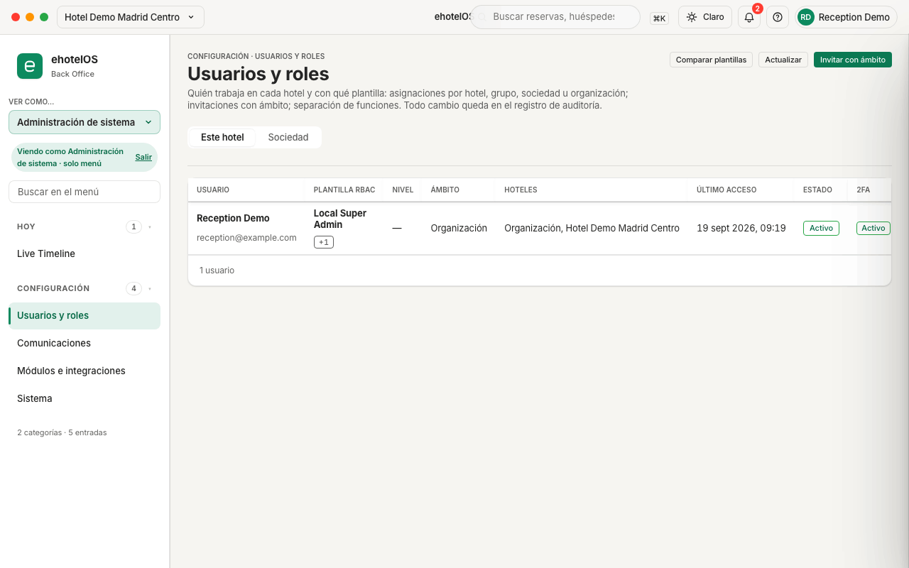
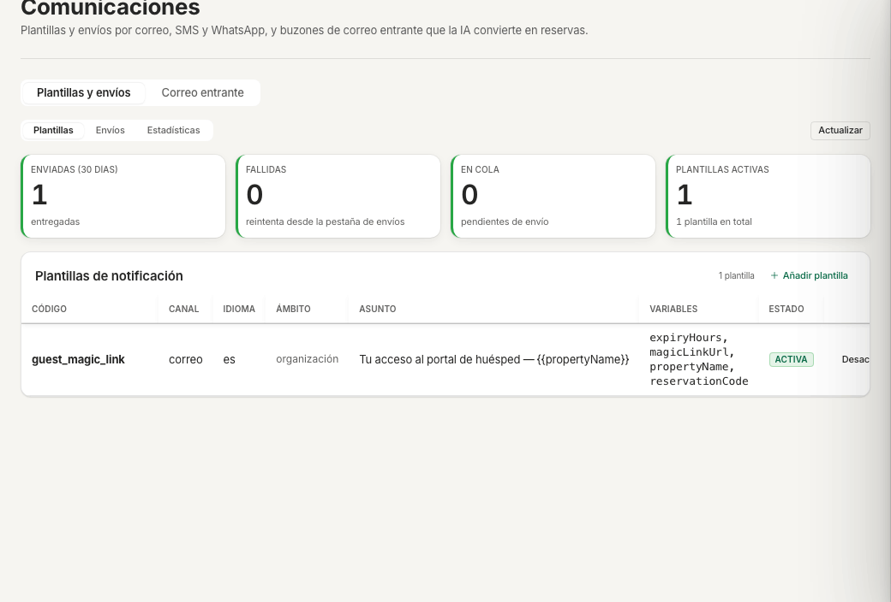
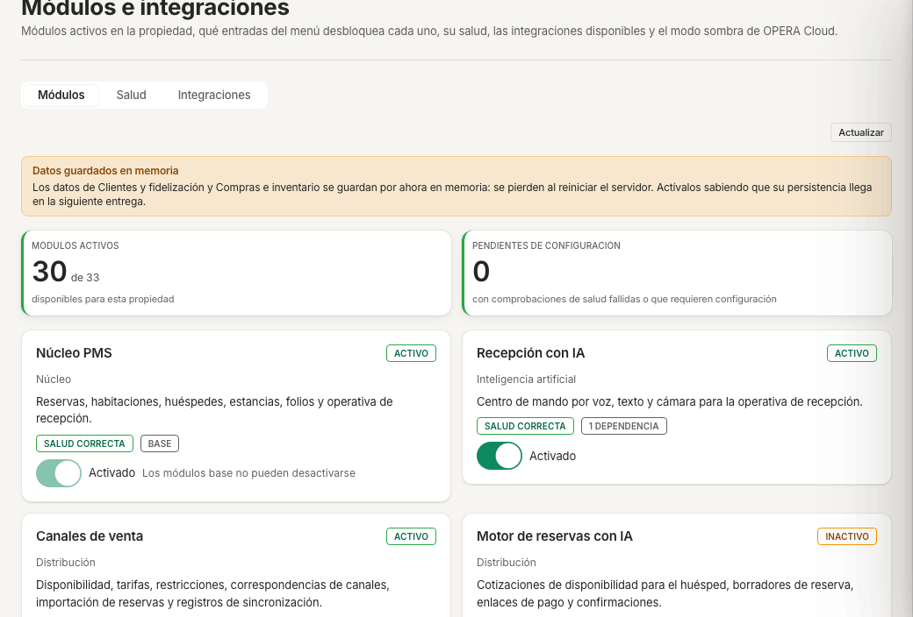
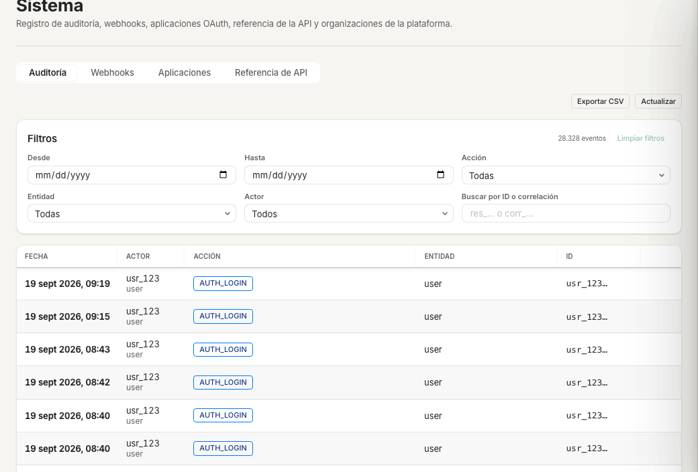
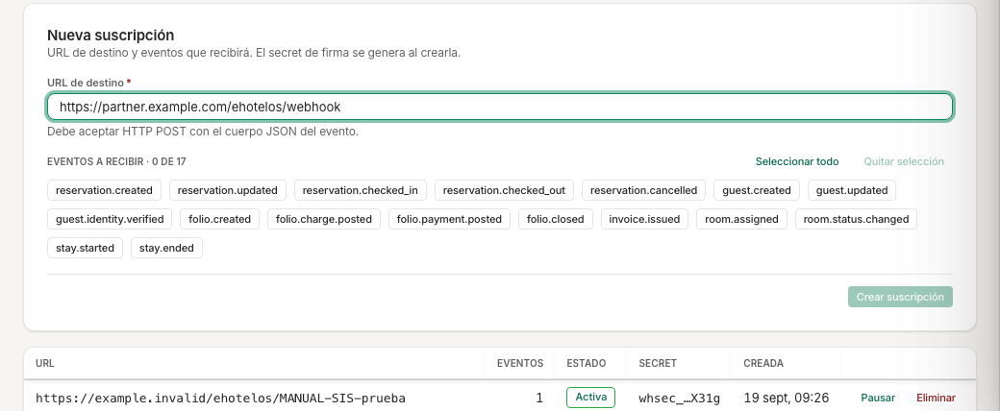
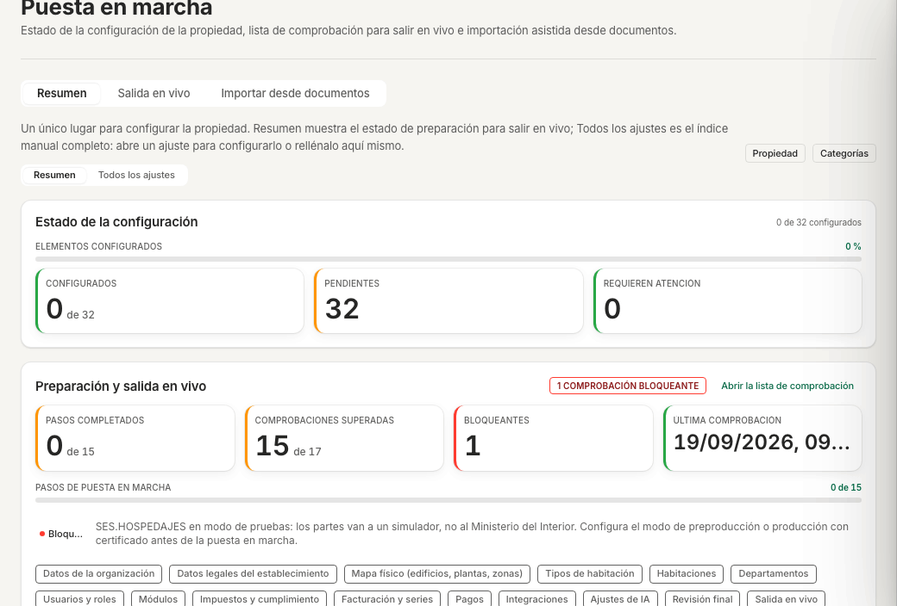

# Guía de administración del sistema · ehotelOS

Esta guía es para la persona que administra ehotelOS dentro de tu organización: da de alta a la gente, decide qué módulos usa cada hotel, vigila el registro de auditoría y conecta ehotelOS con otros sistemas. No toca dinero ni reservas: eso es de recepción, administración y dirección, y el sistema lo impide a propósito (separación de funciones).

Todo lo que describe esta guía se ha recorrido en la aplicación el 19/09/2026 sobre el hotel de demostración. Donde algo no funciona todavía, lo decimos.

## Para quién

| Perfil | Plantilla de rol | Qué hace en esta guía |
|---|---|---|
| **Administración de sistema** (tu organización) | «Administración de sistema» (nivel N7 · Administración central, ámbito organización) | Usuarios y roles, comunicaciones, módulos, integraciones, auditoría, webhooks, aplicaciones, referencia de API. Todo el menú de esta guía menos el apartado 5. |
| **Administrador de plataforma** (el proveedor técnico de ehotelOS) | No es una plantilla: es la cuenta con la que el proveedor opera la plataforma | Además de lo anterior: Puesta en marcha, Modo sombra OPERA, Inteligencia artificial, Estructura societaria y Organizaciones (apartado 5). |
| **Dirección de hotel / Dirección general** | «Dirección de hotel», «Dirección general», «Dirección de operaciones» | Ve Usuarios y roles, Comunicaciones, Módulos e integraciones y Sistema (sin Webhooks ni Aplicaciones), y también Puesta en marcha, Modo sombra OPERA, IA y Estructura societaria. |

Diferencia importante: la plantilla «Administración de sistema» **no tiene ninguna clave financiera ni operativa** (no cobra, no factura, no asienta, no aprueba importes). Si necesitas contabilidad o facturación, eso está en [20-administracion.md](20-administracion.md). Si en tu pantalla aparece el selector «Ver como…» con la opción «Mi menú (administrador)», estás con la cuenta del proveedor, no con la plantilla de tu organización.

## Cómo están hechas las capturas

- Organización de demostración «Grupo Hotelero Demo», hotel «Hotel Demo Madrid Centro», usuario de demo con «Ver como…» = «Administración de sistema» (el badge «Viendo como Administración de sistema · solo menú» aparece en la barra lateral). Las pantallas del apartado 5 se capturan con «Mi menú (administrador)».
- Todos los nombres, correos y datos son ficticios. Tema claro, 1280 × 800 píxeles; las capturas de contenido están recortadas sin la barra lateral ni la cabecera.
- Las capturas se regeneran con la receta del manual (ver [README.md](README.md)) y el lote `img/sistemas/capturas.json`, incluida la del cajón de invitación (`invitar.png`: el trabajo pulsa «Invitar con ámbito» y captura el cajón vacío sin pulsar «Crear invitación»). La de Webhooks (`webhooks.png`) está recortada al formulario y a la tabla, con una dirección de ejemplo escrita en «URL de destino» y sin pulsar «Crear suscripción».

## Qué verás en tu menú

Con la plantilla «Administración de sistema» la barra lateral muestra **2 categorías · 5 entradas** (así lo indica el pie del menú):

| Categoría | Entrada | Pestañas | URL |
|---|---|---|---|
| Hoy | Live Timeline | — | `/hoy/live-timeline` |
| Configuración | Usuarios y roles | — | `/configuracion/usuarios` |
| Configuración | Comunicaciones | «Plantillas y envíos · Correo entrante» | `/configuracion/comunicaciones` |
| Configuración | Módulos e integraciones | «Módulos · Salud · Integraciones» | `/configuracion/modulos` |
| Configuración | Sistema | «Auditoría · Webhooks · Aplicaciones · Referencia de API» | `/configuracion/sistema` |

- Al entrar aterrizas en **Usuarios y roles**.
- **Mi día** no existe para ti: si escribes `/hoy` verás «Sin acceso» con el texto «Tu perfil no tiene permiso para ver esta pantalla. Pide acceso a dirección.» y el botón «Ir a mi página de inicio».
- No tienes el botón «+ Nueva reserva» de la barra superior.
- **Live Timeline** se abre en solo lectura: ves las estancias por habitación con el nombre del huésped, los filtros «ESTADO · CANAL · TIPO» y el buscador, pero no puedes mover ni crear reservas (esas acciones son de recepción). Su manejo está en [00-primeros-pasos.md](00-primeros-pasos.md).

*Menú de «Administración de sistema»: 2 categorías · 5 entradas. Aterrizaje en Usuarios y roles.*

### Solo administrador de plataforma o dirección

Estas pantallas **no están en tu menú**; las describe el apartado 5 para que sepas qué pedir y a quién:

| Pantalla | URL | Quién la ve |
|---|---|---|
| Puesta en marcha | `/configuracion/puesta-en-marcha` | dirección · plataforma · auditoría interna |
| Módulos e integraciones › Modo sombra OPERA | `/configuracion/modulos/modo-sombra` | dirección · plataforma · auditoría interna |
| Inteligencia artificial | `/configuracion/ia` | dirección · plataforma · auditoría interna |
| Estructura societaria | `/configuracion/estructura-societaria` | finanzas · dirección · plataforma · gestión del activo · auditoría interna |
| Sistema › Organizaciones | `/configuracion/sistema/organizaciones` | solo plataforma (lista todas las organizaciones de ehotelOS: nunca se captura ni se comparte) |

## 1. Usuarios y roles

**Menú › Configuración › Usuarios y roles** · `/configuracion/usuarios`

Título «Usuarios y roles». Subtítulo literal: «Quién trabaja en cada hotel y con qué plantilla: asignaciones por hotel, grupo, sociedad u organización; invitaciones con ámbito; separación de funciones. Todo cambio queda en el registro de auditoría.»

Qué hay en la pantalla:

- Botones de cabecera: «Comparar plantillas», «Actualizar», «Invitar con ámbito».
- Pestañas «Este hotel» (personas con asignación en el hotel activo; tabla «Usuarios de este hotel») y «Sociedad» (toda persona con una asignación viva en la organización; tabla «Usuarios de la sociedad»).
- Columnas: «USUARIO · PLANTILLA RBAC · NIVEL · ÁMBITO · HOTELES · ÚLTIMO ACCESO · ESTADO · 2FA · ACCIONES». La columna «PLANTILLA RBAC» muestra la plantilla real del rol, nunca un texto libre; si la persona tiene más asignaciones aparece «+1», «+2»…
- Pie de la tabla: «1 usuario», «12 usuarios»…

En la demo solo hay un usuario (el de demostración, con un rol «Local Super Admin» de organización); en tu hotel verás a toda la plantilla.

### 1.1 Invitar a una persona (recorrido hasta el botón de envío)

1. **Menú › Configuración › Usuarios y roles**.
2. Pulsa «Invitar con ámbito» (arriba a la derecha). Se abre el cajón «Invitar con ámbito» con el texto «La persona recibirá un enlace de un solo uso y quedará asignada al ámbito elegido al aceptarlo.»
3. Rellena la sección **«Persona»**:
   - «Nombre completo» (obligatorio).
   - «Correo electrónico» (obligatorio): será su usuario.
   - «Teléfono» (opcional).
   - «Exigir doble factor (2FA)»: interruptor. Texto de ayuda literal: «Obligatorio para supervisión y niveles superiores (diseño D8).» Para jefaturas, gobernanta, encargado de mantenimiento, dirección y todo lo que esté por encima, déjalo activado.
4. Rellena la sección **«Rol y ámbito»** (texto literal: «Solo puedes asignar roles de nivel igual o inferior al tuyo y dentro de tu ámbito; la API lo comprueba de nuevo.»):
   - «Rol (plantilla)»: la lista muestra los roles de tu organización disponibles para este hotel con su nivel, por ejemplo «Recepción · Operativo (N1)», «Dirección · Dirección de hotel (N3)», «Contabilidad · Administración central (N7)». Solo aparecen los de nivel igual o inferior al tuyo.
   - «Ámbito»: «Hotel», «Grupo de hoteles», «Sociedad» u «Organización». Elige «Hotel» para recepción, pisos, mantenimiento, punto de venta, comercial y dirección de hotel; «Sociedad» u «Organización» para contabilidad, RRHH, cumplimiento, revenue y dirección general.
   - Debajo aparece un campo con el nombre del ámbito elegido («Hotel», «Grupo de hoteles», «Sociedad», «Organización») donde eliges cuál. Solo verás los que están dentro de tu ámbito; si no hay ninguno, el campo dice «No hay ninguno a tu alcance.» o «Sin opciones».
   - «Motivo» (opcional). Ayuda literal: «Queda en el registro de auditoría (ROLE_ASSIGNED).»
   - «Caduca el» (opcional). Ayuda literal: «Asignación temporal (refuerzos, sustituciones): al vencer deja de aplicarse.»
5. Revisa los avisos. Si el cajón pinta «Nivel superior al tuyo» o «Separación de funciones» (con la lista de «Pares incompatibles»), **no deja enviar**: cambia el rol o consulta a dirección.
6. El botón de envío es «Crear invitación» (a su lado, «Cancelar»). En esta guía no lo pulsamos.

*El cajón de invitación: sección «Persona», sección «Rol y ámbito» y botones «Cancelar» / «Crear invitación».*

**Resultado esperado** (al pulsar «Crear invitación» en tu hotel): la pantalla muestra el estado de la entrega, el enlace de invitación con el botón «Copiar enlace», la fecha de caducidad («Caduca el …») y el aviso «El enlace es de un solo uso.» La persona aparece en la tabla con estado de invitación pendiente y, al aceptar, con «Activo». Todo queda en Sistema › Auditoría (acciones «UserInvited» y «ROLE_ASSIGNED»).

> **Nota:** el correo saliente no está configurado en la demo. Como dice la propia ayuda de la aplicación, «Si el correo saliente no está configurado, la confirmación o la invitación te muestran el enlace para que lo entregues tú»: copia el enlace y hazlo llegar a la persona por un canal seguro. En la tabla, la fila de la persona ofrece «Reenviar invitación» si el enlace caducó.

**Si algo falla:**

- «Demasiadas peticiones. Reintenta en unos segundos.» con el botón «Reintentar»: el servidor limita las peticiones por minuto; espera y pulsa «Reintentar» (o «Actualizar»).
- El campo «Rol (plantilla)» dice «Sin roles disponibles»: la lista de roles no cargó (normalmente por el aviso anterior); cierra el cajón con «Cancelar», «Actualizar» y vuelve a abrirlo.
- La API rechaza la invitación aunque el cajón la deje enviar: la persona ya tiene una asignación incompatible (separación de funciones), el nivel o el ámbito exceden el tuyo, o intentas invitarte a ti mismo. Los códigos y su significado están en la sección 1.4.

### 1.2 Las plantillas que puedes invitar

Estas son las etiquetas literales del selector de plantillas, con el nivel, el ámbito por defecto, el menú que ve cada una y la guía del manual que le corresponde. Son **22 plantillas de organización**, que el proveedor materializa por defecto en cada organización, más «Administración de sistema» (la última fila), que se crea a petición cuando la organización quiere delegar la administración: 23 filas en total. La plantilla «Emergencia» existe pero **no se invita**: la abre el sistema en una sesión de emergencia auditada.

| Plantilla | Nivel | Ámbito por defecto | Menú (token) | Guía del manual |
|---|---|---|---|---|
| Recepción | N1 Operativo | Hotel | recepción | [70-recepcion.md](70-recepcion.md) |
| Auditoría nocturna | N1 Operativo | Hotel | recepción | [70-recepcion.md](70-recepcion.md) (Cierre del día) |
| Jefatura de recepción | N2 Supervisión | Hotel | recepción | [70-recepcion.md](70-recepcion.md) |
| Pisos | N1 Operativo | Hotel | pisos | [40-pisos-mantenimiento.md](40-pisos-mantenimiento.md) |
| Gobernanta | N2 Supervisión | Hotel | pisos | [40-pisos-mantenimiento.md](40-pisos-mantenimiento.md) |
| Mantenimiento | N1 Operativo | Hotel | mantenimiento | [40-pisos-mantenimiento.md](40-pisos-mantenimiento.md) |
| Encargado de mantenimiento | N2 Supervisión | Hotel | mantenimiento | [40-pisos-mantenimiento.md](40-pisos-mantenimiento.md) |
| Punto de venta | N1 Operativo | Hotel | punto de venta y F&B | sin guía en esta entrega (exige el módulo «Punto de venta», apagado en la demo) |
| Jefatura de A&B | N2 Supervisión | Hotel | punto de venta y F&B | sin guía en esta entrega |
| Comercial | N1 Operativo | Hotel | comercial | [50-comercial-revenue.md](50-comercial-revenue.md) |
| Administración de hotel | N1 Operativo | Hotel | administración | [20-administracion.md](20-administracion.md) |
| Dirección de hotel | N3 Dirección de hotel | Hotel | dirección | [10-direccion.md](10-direccion.md) |
| Dirección de operaciones | N4 Dirección de operaciones | Grupo de hoteles | dirección | [10-direccion.md](10-direccion.md) |
| Revenue corporativo | N4 Dirección de operaciones | Organización | revenue | [50-comercial-revenue.md](50-comercial-revenue.md) |
| Contabilidad | N7 Administración central | Sociedad | finanzas | [20-administracion.md](20-administracion.md) |
| Dirección financiera | N5 Dirección general | Sociedad | finanzas | [20-administracion.md](20-administracion.md) |
| RRHH y nóminas | N7 Administración central | Sociedad | rrhh | [30-rrhh.md](30-rrhh.md) |
| Cumplimiento | N7 Administración central | Sociedad | finanzas | [20-administracion.md](20-administracion.md) (VeriFactu, modelos, registro de viajeros) |
| Gestión del activo | N7 Administración central | Sociedad | activos | Menú de 4 entradas (Live Timeline, Pendientes de aprobación, Centro de cumplimiento y Estructura societaria; aterriza en Centro de cumplimiento): [20-administracion.md](20-administracion.md) §9.4 (Estructura societaria) y §10.1 (Centro de cumplimiento). No ve «Activos» ni «Inmovilizado»: esas pantallas son de mantenimiento, finanzas y dirección |
| Dirección general | N5 Dirección general | Organización | dirección | [10-direccion.md](10-direccion.md) |
| Propiedad | N6 Propiedad | Organización | propiedad | [10-direccion.md](10-direccion.md) (Panel del propietario) |
| Auditoría interna | N7 Administración central | Organización | auditoría (todo en solo lectura) | esta guía, apartado 4 (Auditoría) y su menú en 4.5 |
| Administración de sistema | N7 Administración central | Organización | sistemas | esta guía |

Reglas que aplica la pantalla y la API:

- Solo asignas roles de nivel **igual o inferior** al tuyo y ámbitos **contenidos** en el tuyo. Nadie se asigna un rol a sí mismo.
- Los permisos de una persona en un hotel son la **unión** de todas sus asignaciones que cubren ese hotel; una persona puede ser Recepción en un hotel y Contabilidad en la sociedad.
- **Doble factor (2FA).** El diseño lo exige a partir del nivel N2 (supervisión) y el interruptor «Exigir doble factor (2FA)» de la invitación deja la marca «2FA: Activo» en la ficha de la persona al aceptar el enlace. **En construcción:** la verificación del segundo factor al iniciar sesión no está activada todavía en la aplicación: hoy una persona con «2FA: Activo» entra solo con su contraseña. Deja el interruptor activado igualmente (la marca quedará lista para cuando se active la verificación) y no cuentes con el doble factor como control de acceso hasta que el proveedor lo confirme.

> **Nota:** en la demo el selector «Rol (plantilla)» ofrece 10 roles (los enlazados al hotel de demostración), no las 22 plantillas de organización. En tu organización aparecen los roles que el proveedor haya materializado (por defecto, las 22 de organización; «Administración de sistema» se añade a petición).

### 1.3 Acciones sobre una persona

Haz clic en la fila de la persona. Se abre un cajón con su ficha: «Estado», «Plantilla principal», «Nivel», «2FA», «Último acceso», «Identificador» y el bloque «Asignaciones» (cada una con su ámbito, hotel y rango, y el estado «Activo»).

Lo que ves en la demo (solo existe tu propio usuario) es la ficha propia: el aviso «Es tu propio usuario · Nadie se concede permisos a sí mismo: pide a otra persona de dirección o de sistemas que cambie tus asignaciones. Aquí solo puedes establecer tu PIN de supervisor.», el bloque «PIN de supervisor» («El PIN autoriza acciones de otros compañeros (anular un tique, aplicar un descuento fuera de tu tramo) sin cederles tu sesión. Establecerlo exige tu contraseña; también puedes hacerlo desde el menú de usuario ("Mi PIN de supervisor").») con el botón «Restablecer PIN» (campos «Tu contraseña» y «Nuevo PIN»), y «Cerrar».

En la ficha de **otra** persona (no reproducible en la demo, que solo tiene un usuario) el cajón añade estas acciones, con la nota literal de la pantalla: «"Cambiar rol" crea primero la asignación nueva y después revoca la anterior del mismo ámbito (si la nueva se rechaza, nada cambia); "Retirar de este hotel" solo revoca las asignaciones de este hotel, nunca el usuario.»

- «Cambiar rol»: otra plantilla en el mismo ámbito; si la nueva se rechaza (nivel, ámbito o separación de funciones), la persona conserva la anterior.
- «Retirar de este hotel»: quita a la persona de este hotel; conserva sus otras asignaciones. Diálogo «¿Retirar a … de este hotel?» con el botón «Retirar».
- «Retirar» junto a una asignación concreta: revoca solo esa («¿Retirar esta asignación?»).
- «Reenviar invitación»: emite un enlace nuevo (el anterior deja de valer).
- «Desactivar usuario»: cierra todas sus sesiones en toda la organización. Diálogo «¿Desactivar a …?» con el botón «Desactivar usuario».

Nada se borra: una revocación es una marca con autor, motivo y fecha, y queda en Auditoría («ROLE_REVOKED», «UserDisabled»).

### 1.4 Separación de funciones y registro de auditoría

- **Pares incompatibles** (ninguna persona puede acumularlos): emitir factura y aprobar su anulación; cobrar y aprobar devoluciones; registrar y aprobar facturas de proveedor; aprobar y pagar; asentar en contabilidad y pagar; conciliar el banco y pagar; preparar y aprobar nóminas; pedir y aprobar (o recepcionar) compras; ejecutar y revisar el cierre del día; y **sistema ≠ finanzas**: quien gestiona roles y permisos no maneja dinero. Si una invitación crea un par, el cajón lo avisa en rojo y la API responde `RBAC_SOD_CONFLICT`.
- **Nadie decide lo que solicitó**: las aprobaciones (reembolsos, descuentos, facturas de proveedor, CAPEX…) exigen solicitante, aprobador y, por encima del tramo T4, un segundo aprobador distintos. Tú no apruebas importes.
- **Códigos que puedes ver** cuando la API rechaza algo: `RBAC_LEVEL_EXCEEDED` (rol de rango superior al tuyo), `RBAC_SCOPE_EXCEEDED` (ámbito fuera del tuyo), `RBAC_SELF_ASSIGNMENT` (concederte algo a ti mismo), `RBAC_BREAK_GLASS_FORBIDDEN` (la plantilla de emergencia no se asigna a personas), `RBAC_SOD_CONFLICT`.
- **PIN de supervisor**: cada supervisora o supervisor fija su PIN desde el menú de usuario (arriba a la derecha) › «Mi PIN de supervisor» (campos «Tu contraseña» y «Nuevo PIN»). Sirve para autorizar en mostrador una acción de un operativo (60 segundos, un solo uso, ligado a esa acción).
- Todo cambio de rol, invitación, aceptación, retirada y desactivación aparece en **Sistema › Auditoría** (apartado 4) con quién, cuándo, desde qué IP y el antes/después.

### 1.5 Comparar plantillas

> **En construcción:** el botón «Comparar plantillas» abre hoy la pantalla de error «Algo ha fallado en la interfaz · El error ya ha sido reportado al equipo. Puedes intentarlo de nuevo.» (detalle técnico «b is not iterable»). Reproducido tres veces el 19/09/2026 con la sesión de demo. Pulsa «Reintentar» para volver a la lista. Mientras se corrige, usa la tabla de plantillas del apartado 1.2 y pide al proveedor la tabla de accesos por departamento (qué puede hacer cada plantilla en cada módulo).

## 2. Comunicaciones

**Menú › Configuración › Comunicaciones** · `/configuracion/comunicaciones`

Título «Comunicaciones». Subtítulo literal: «Plantillas y envíos por correo, SMS y WhatsApp, y buzones de correo entrante que la IA convierte en reservas.» Dos pestañas: «Plantillas y envíos» y «Correo entrante».

### 2.1 Plantillas y envíos

Subpestañas «Plantillas · Envíos · Estadísticas» y botón «Actualizar».

- KPIs: «ENVIADAS (30 DÍAS)» (entregadas), «FALLIDAS» («reintenta desde la pestaña de envíos»), «EN COLA» («pendientes de envío») y «PLANTILLAS ACTIVAS».
- Tabla «Plantillas de notificación» con columnas «CÓDIGO · CANAL · IDIOMA · ÁMBITO · ASUNTO · VARIABLES · ESTADO · ACCIONES» y el botón «Añadir plantilla». En la demo hay una plantilla: `guest_magic_link` (canal «correo», idioma «es», ámbito «organización», asunto «Tu acceso al portal de huésped — {{propertyName}}», variables `expiryHours, magicLinkUrl, propertyName, reservationCode`, estado «ACTIVA»), con la acción «Desactivar».

Pasos para revisar los envíos de los últimos 30 días:

1. **Menú › Configuración › Comunicaciones**, pestaña «Plantillas y envíos».
2. Mira los KPIs: si «FALLIDAS» es mayor que 0, abre la subpestaña «Envíos» y reintenta desde allí.
3. Para dejar de usar una plantilla pulsa «Desactivar» en su fila (en la demo no lo hacemos: es la única plantilla activa).

Para crear o actualizar una plantilla pulsa «Añadir plantilla». Se abre el cajón «Nueva plantilla o actualización» («Una plantilla por código, canal e idioma; guardar con el mismo código la actualiza.») con:

- Sección «Plantilla» («Código que dispara el motor, canal, idioma y ámbito.»): «Código» (obligatorio), «Canal» (correo · SMS · WhatsApp), «Idioma» y «Ámbito» («de esta propiedad» o «predeterminada de la organización»).
- Sección «Contenido» («Variables: {{var}} o {{var | default: "valor"}}. Se admiten rutas con punto como {{guest.name}} (un nivel).»): «Asunto (solo correo y WhatsApp)» y «Cuerpo» (obligatorio). El cuerpo trae un ejemplo con variables como `{{booker_name}}`, `{{invoice_number}}`, `{{invoice_total}}`, `{{currency}}` y `{{property_name}}`.
- Botones «Cancelar» y «Guardar plantilla». En esta guía no guardamos ninguna.

*Plantillas y envíos: KPIs de 30 días y la tabla de plantillas de notificación.*

> **Nota:** el correo saliente no está configurado en la demo, así que los envíos reales (confirmaciones, invitaciones, enlaces al portal del huésped) no salen: la aplicación te muestra el enlace para que lo entregues tú. Configurar el proveedor de correo es tarea del proveedor técnico.

### 2.2 Correo entrante

**Menú › Configuración › Comunicaciones › Correo entrante** · `/configuracion/comunicaciones/correo-entrante`

Aviso de cabecera: «Cada borrador pasa siempre por revisión humana». Texto literal: «Conecta buzones (Gmail, Microsoft 365, IMAP) para que la IA lea los correos entrantes y extraiga reservas. El conector manual te deja pegar un correo y recorrer el mismo flujo sin autorización externa.»

Bloques de la pantalla:

- «Proveedores»: en la demo, «1 de 4 proveedores configurados» («Gmail: no configurado», «Microsoft 365: no configurado», «IMAP: no configurado», «Manual (pegar un correo): configurado»).
- «Buzones conectados»: «0 buzones» en la demo («Aún no hay buzones. Añade uno abajo.»).
- «Añadir buzón»: campo «Proveedor» (Gmail · Microsoft 365 · IMAP · Manual (pegar un correo)) y «Propósito» («Reservas por IA» o «Modo sombra OPERA»). Texto literal: «Gmail y Microsoft 365 abren la autorización externa en el mismo paso; IMAP pide los datos del servidor. El propósito decide qué se hace con cada correo: extraer reservas con IA o entregar los adjuntos al modo sombra de OPERA.» Botón «Iniciar autorización».
- «Probar con un correo pegado»: campos «De (remitente)», «Asunto», «Cuerpo del correo» (obligatorio) y botón «Procesar correo».
- «Bandeja de reservas por correo»: correos en revisión y total (en la demo, «Sin correos procesados»).

Pasos para probar el flujo sin buzón:

1. En «Probar con un correo pegado», pega el texto de una petición de reserva (remitente y asunto son opcionales; el cuerpo, obligatorio).
2. Pulsa «Procesar correo».
3. **Resultado esperado:** el correo aparece en «Bandeja de reservas por correo» como borrador en revisión; una persona de recepción lo revisa antes de que exista ninguna reserva.

**Si algo falla:** con «Proveedor» = Gmail la pantalla avisa «Gmail no está configurado en el servidor · La autorización externa no está disponible, así que este buzón no se puede añadir todavía. Elige otro proveedor o usa el conector manual.» Lo mismo ocurre con Microsoft 365 e IMAP en la demo: la configuración de esos proveedores es del proveedor técnico.

> **En construcción:** sin proveedor de IA configurado (ver apartado 5.4), la extracción de datos del correo se hace por reglas y el borrador puede quedar incompleto; revisar siempre antes de confirmar.

## 3. Módulos e integraciones

**Menú › Configuración › Módulos e integraciones** · `/configuracion/modulos`

Título «Módulos e integraciones». Subtítulo literal: «Módulos activos en la propiedad, qué entradas del menú desbloquea cada uno, su salud, las integraciones disponibles y el modo sombra de OPERA Cloud.» Pestañas para ti: «Módulos · Salud · Integraciones» (la cuarta, «Modo sombra OPERA», solo la ven dirección y plataforma).

### 3.1 Módulos

- Aviso literal en cabecera: «Datos guardados en memoria · Los datos de Clientes y fidelización y Compras e inventario se guardan por ahora en memoria: se pierden al reiniciar el servidor. Actívalos sabiendo que su persistencia llega en la siguiente entrega.»
- KPIs: «MÓDULOS ACTIVOS» (en la demo «30 de 33 · disponibles para esta propiedad») y «PENDIENTES DE CONFIGURACIÓN» («con comprobaciones de salud fallidas o que requieren configuración»).
- Una tarjeta por módulo con: nombre y estado («ACTIVO» / «INACTIVO»), categoría (Núcleo, Inteligencia artificial, Distribución, Huésped, Operaciones, Cumplimiento, Activos, Integraciones…), descripción, «Desbloquea en el menú: …» cuando el módulo añade entradas (por ejemplo «Comercial › Canales de venta»), las etiquetas «SALUD CORRECTA», «BASE» y «n DEPENDENCIAS», y un **interruptor** con el texto «Activado» o «Desactivado». Los módulos base muestran «Los módulos base no pueden desactivarse» y su interruptor va bloqueado.

Ejemplo en la demo: «Punto de venta» está «INACTIVO» («Desbloquea en el menú: Operaciones › Punto de venta», «2 DEPENDENCIAS», interruptor «Desactivado»); por eso el menú de la demo no muestra «Operaciones › Punto de venta». También están inactivos «Motor de reservas con IA» y «Check-in en línea».

Cómo activar o desactivar un módulo (descrito, no ejecutado en la demo):

1. **Menú › Configuración › Módulos e integraciones**, pestaña «Módulos».
2. Localiza la tarjeta y pulsa su interruptor. El servidor comprueba las dependencias (un módulo no se activa sin las suyas ni se desactiva si otro activo depende de él) y la tarjeta cambia a «Activado» / «Desactivado».
3. **Resultado esperado:** la entrada de menú que indica «Desbloquea en el menú: …» aparece o desaparece para todos los perfiles del hotel en la siguiente carga; el cambio queda en Auditoría («ModuleEnabled» / «ModuleDisabled»).

> **Nota:** en el hotel de demostración no actives ni desactives módulos: otros ejercicios de este manual dependen del estado actual (por ejemplo «Punto de venta» apagado).

*Módulos: aviso de datos en memoria, KPIs y tarjetas con su interruptor.*

### 3.2 Salud

**Menú › Configuración › Módulos e integraciones › Salud** · `/configuracion/modulos/salud`

Texto literal: «Estado de configuración y comprobaciones de cada módulo activo. Los módulos se activan y desactivan desde Módulos e integraciones.» Botón «Recalcular todos los activos». KPIs «MÓDULOS ACTIVOS», «CON CONFIGURACIÓN PENDIENTE» («activos con alguna comprobación no superada») y «BLOQUEANTES». Filtros «Activos · Con incidencias · Todos» y tabla «Comprobaciones por módulo» con columnas «MÓDULO · ESTADO · SALUD · COMPROBACIONES · ACCIÓN RECOMENDADA · ACCIONES» y el botón «Recalcular» por fila. En la demo los 30 módulos activos muestran «CORRECTO», «Sin comprobaciones registradas» y «No se requiere ninguna acción.».

Úsala cuando un módulo recién activado no aparezca en el menú o falle: filtra «Con incidencias» y sigue la «ACCIÓN RECOMENDADA».

### 3.3 Integraciones

**Menú › Configuración › Módulos e integraciones › Integraciones** · `/configuracion/modulos/integraciones`

Texto literal: «Aplicaciones certificadas que extienden tu PMS: gestores de canales, herramientas de revenue, llaves digitales, asistentes IA… Cada aplicación pide los permisos (OAuth) que necesita y tú apruebas exactamente qué datos puede leer o escribir.» Filtro por categoría (Channel Manager, Revenue Management, Pagos, Mensajería, Cerraduras inteligentes, Contabilidad, Cumplimiento, Energía, Marketing, CRM, Operaciones, Analítica, Asistentes IA), bloques «Catálogo» y «Aplicaciones instaladas».

> **En construcción:** el catálogo está vacío («0 aplicaciones publicadas»; «Las aplicaciones verificadas aparecerán aquí en cuanto un socio publique. Mientras tanto, puedes crear tu propia aplicación en Configuración › Sistema › Aplicaciones.»). Las integraciones reales de hoy son las de Sistema › Webhooks y Aplicaciones (apartado 4), los canales de venta (guía [50-comercial-revenue.md](50-comercial-revenue.md)) y la importación de Sage 200 (guía [20-administracion.md](20-administracion.md)).

## 4. Seguridad y auditoría (Sistema)

**Menú › Configuración › Sistema** · `/configuracion/sistema`

Título «Sistema». Subtítulo literal: «Registro de auditoría, webhooks, aplicaciones OAuth, referencia de la API y organizaciones de la plataforma.» Pestañas para ti: «Auditoría · Webhooks · Aplicaciones · Referencia de API» («Organizaciones» solo la ve la plataforma).

### 4.1 Auditoría

Es un registro **sellado**: cada evento lleva un hash SHA-256 encadenado al anterior; no se puede editar ni borrar (ni siquiera el proveedor). Si alguien altera un registro, la cadena deja de cuadrar y el estado del sistema lo delata (apartado 6). Cubre configuración, roles, módulos, integraciones, facturación, IA, importaciones y puesta en marcha; también los inicios de sesión («AUTH_LOGIN») y los accesos denegados («ACCESS_DENIED»).

Qué hay en la pantalla:

- Botones «Exportar CSV» y «Actualizar».
- Bloque «Filtros» con el total de eventos (en la demo, «28.328 eventos»), el enlace «Limpiar filtros» y los campos «Desde», «Hasta», «Acción» (lista de todas las acciones registradas: «ROLE_ASSIGNED», «UserInvited», «ModuleEnabled», «INVOICE_ISSUED», «VERIFACTU_SUBMISSION», «WebhookSubscriptionCreated»…), «Entidad» («user», «role», «property_module», «invoice», «reservation»…), «Actor» (usuarios y procesos del sistema) y «Buscar por ID o correlación».
- Tabla «Eventos auditados» con columnas «FECHA · ACTOR · ACCIÓN · ENTIDAD · ID · ACCIONES» (botón «Ver») y paginación «Página 1 de 567 · 50 de 28.328 eventos» con «Anterior» / «Siguiente».

Pasos para investigar quién cambió un rol:

1. **Menú › Configuración › Sistema**, pestaña «Auditoría».
2. En «Acción» elige «ROLE_ASSIGNED» (o «ROLE_REVOKED», «UserInvited», «UserDisabled»); en «Desde» / «Hasta» acota las fechas.
3. Pulsa «Ver» en la fila. Se abre el panel «Detalles del evento» con «Identificador», «Actor», «Tipo de actor» (user o system), «Entidad», «ID de la entidad», «IP», «Hash» y los bloques «Antes» / «Después» con los datos del cambio. Cierra con «Cerrar».
4. Para entregar el resultado a auditoría interna, pulsa «Exportar CSV» con los filtros puestos.

**Resultado esperado:** cada cambio de rol aparece como un evento con el actor, la hora y el detalle; «Limpiar filtros» devuelve la lista completa.

> **Nota:** «Detalles del evento» es un cajón lateral con el subtítulo «<acción> · <fecha y hora>» (por ejemplo «AUTH_LOGIN · 19 sept 2026, 22:26»); se cierra con «Cerrar», la × o Esc. El detalle de cada evento viaja también en el CSV.

*Auditoría: filtros por fecha, acción, entidad y actor, y la tabla de eventos sellados.*

> **Nota:** la cadena es global para toda la plataforma y crece sin parar (miles de eventos al día en un hotel activo): filtra siempre antes de exportar.

### 4.2 Webhooks

**Menú › Configuración › Sistema › Webhooks** · `/configuracion/sistema/webhooks`

Un webhook avisa a otro sistema (tu partner, tu CRM, un panel propio) cuando ocurre algo en ehotelOS. El aviso «Cómo se entregan» de la pantalla lo resume así: cada entrega es un HTTP POST firmado con HMAC-SHA256 sobre el cuerpo, en una cabecera de firma con formato `sha256=…` (la pantalla muestra el nombre técnico exacto de la cabecera, que es el que debe leer tu partner), usando el secret que se muestra una sola vez al crear la suscripción; si la URL no responde 2xx, el sistema reintenta hasta 6 veces (30 s → 6 h); y, literalmente, «Hoy solo "Enviar evento de prueba" genera entregas: los eventos del PMS (reservas, folios, facturas, habitaciones) todavía no se publican automáticamente en las suscripciones.»

Crear una suscripción (recorrido y verificado el 19/09/2026 con una URL de prueba):

1. **Menú › Configuración › Sistema**, pestaña «Webhooks».
2. En «Nueva suscripción», escribe la «URL de destino» (obligatoria; «Debe aceptar HTTP POST con el cuerpo JSON del evento.»).
3. En «EVENTOS A RECIBIR · 0 DE 17» marca los eventos pulsando sus etiquetas (`reservation.created`, `reservation.checked_in`, `invoice.issued`, `room.status.changed`…) o usa «Seleccionar todo» / «Quitar selección». El contador cambia a «1 DE 17», «5 DE 17»…
4. Pulsa «Crear suscripción».
5. **Resultado esperado:** aparece el aviso «Secret generado · Cópialo ahora: no se mostrará de nuevo. El partner lo necesita para verificar la firma.» con el secret, los botones «Copiar» y «Cerrar», y la suscripción entra en la tabla «Suscripciones a eventos» (columnas «URL · EVENTOS · ESTADO · SECRET · CREADA» y acciones «Pausar», «Eliminar») con estado «Activa» y el secret enmascarado (`whsec_…`). Auditoría registra «WebhookSubscriptionCreated».
6. Selecciona la fila para ver el bloque «Entregas» (con la URL, los botones «Enviar evento de prueba» y «Cerrar» y, mientras no hay ninguna, el texto «No hay entregas registradas todavía. Pulsa «Enviar evento de prueba» para validar la URL.») y pulsa «Enviar evento de prueba» para validar la URL. Según el diseño de la pantalla, cada intento aparece con «Evento · Estado (Entregada / Reintentando / Fallida) · HTTP» y sus columnas de fecha y error; en la demo no se ha podido verificar la tabla con datos (ver «En construcción»).

*Webhooks: el formulario «Nueva suscripción» (con una dirección de ejemplo escrita, sin crear nada) y la tabla de suscripciones. Encima del formulario, la pantalla muestra el aviso «Cómo se entregan» con el nombre técnico de la cabecera de firma.*

> **En construcción:** las acciones «Pausar» y «Eliminar» de una suscripción creada desde esta pantalla responden hoy «Error al cargar · Suscripción de webhook no encontrada.» (verificado el 19/09/2026 con la URL de prueba `https://example.invalid/ehotelos/MANUAL-SIS-prueba`, que por ese motivo sigue en la lista de la demo); al seleccionar esa misma fila, la carga de sus entregas también falla (la pantalla queda en «No hay entregas registradas todavía» y el navegador registra un error 404), así que la tabla de entregas no se ha podido ver con datos. Y, como dice el aviso de la pantalla, los eventos del PMS todavía no se publican solos: hoy solo llega el evento de prueba. No des una suscripción por operativa hasta que el proveedor confirme la publicación automática.

### 4.3 Aplicaciones

**Menú › Configuración › Sistema › Aplicaciones** · `/configuracion/sistema/aplicaciones`

Aviso literal «Cómo se autentican»: «Cada aplicación tiene un client_id público y un client_secret que se muestra una sola vez. El API admite Authorization Code con PKCE (S256) y Client Credentials (servidor a servidor); los refresh tokens caducan a los 30 días.»

Formulario «Nueva aplicación» («Nombre, tipo de integración y permisos (scopes) que podrá pedir.»):

- «Nombre de la aplicación» (obligatorio).
- «Tipo» (obligatorio): «Integración servidor a servidor», «Aplicación web (con PKCE)», «Aplicación móvil», «Socio del marketplace».
- «PERMISOS · 0 DE 11»: `reservations.read`, `reservations.write`, `guests.read`, `folios.read`, `folios.write`, `invoices.read`, `rooms.read`, `properties.read`, `webhooks.subscribe`, `messaging.send`, `pms.shadow.ingest` (este último es el que necesita el agente del modo sombra OPERA, apartado 5.2), con «Seleccionar todo» / «Quitar selección».
- Botón «Crear aplicación». **Resultado esperado** (no ejecutado en la demo, porque una aplicación no se puede borrar después): bloque «Credenciales emitidas» con `client_id` y `client_secret` en campos copiables; el secreto solo se ve esta vez. La tabla «Aplicaciones OAuth2» muestra «Nombre · Tipo · Estado (Activa / Suspendida / Revocada) · ID de cliente · Permisos» y la acción de renovar el secreto (diálogo «¿Renovar el secreto de cliente?»).

En la demo no hay aplicaciones («Sin aplicaciones · Crea la primera con el formulario de arriba: nombre, tipo y permisos.»).

### 4.4 Referencia de API

**Menú › Configuración › Sistema › Referencia de API** · `/configuracion/sistema/api`

Lista generada desde el propio código de cada ruta del API, con el permiso que exige y su nivel de riesgo. KPIs «ENDPOINTS» (en la demo 948, 20 categorías), «PÚBLICOS» («sin permiso requerido»), «GET», «POST», «PATCH», «PUT», «DELETE» y «RIESGO ALTO O CRÍTICO». Filtros por categoría (Autenticación, Reservas, Habitaciones, Huéspedes, Folios y facturación, Cumplimiento ES, Revenue Management, Contabilidad, Webhooks…), por método y el buscador «Ruta, descripción o permiso…». Es la referencia que entregas a un integrador junto con su aplicación (4.3): por ejemplo, para saber que `POST /auth/login` es público y que crear una importación de reservas exige `pms.reservation.create` con «RIESGO ALTO».

### 4.5 Si tu plantilla es «Auditoría interna»

La plantilla «Auditoría interna» (nivel N7, ámbito organización) ve casi toda la aplicación **en solo lectura**: al elegirla en «Ver como…» el pie del menú dice «9 categorías · 65 entradas» (66 cuando el módulo «Punto de venta» está activo) y aterriza en **Configuración › Sistema** (`/configuracion/sistema`), la pestaña «Auditoría» del apartado 4.1. Su menú es el de dirección (guía [10-direccion.md](10-direccion.md)) sin «Pendientes de aprobación» (no decide nada) y sin «Usuarios y roles» (no cambia asignaciones), con «Impuestos» fuera de Cumplimiento y con las cinco entradas de esta guía. Para trabajar: filtra y exporta la auditoría (4.1), lee «Salud» de los módulos (3.2), consulta «Referencia de API» (4.4) y usa las guías de cada área para interpretar lo que ves; ningún botón de escritura funcionará con esta plantilla.

## 5. Solo administrador de plataforma o dirección

Estas pantallas no están en el menú de «Administración de sistema». Se describen para que sepas qué existe, qué falta hoy y a quién pedirlo. Capturas hechas con «Mi menú (administrador)».

### 5.1 Puesta en marcha

**Menú › Configuración › Puesta en marcha** · `/configuracion/puesta-en-marcha` · *solo administrador de plataforma o dirección*

Título «Puesta en marcha». Subtítulo literal: «Estado de la configuración de la propiedad, lista de comprobación para salir en vivo e importación asistida desde documentos.» Pestañas «Resumen · Salida en vivo · Importar desde documentos».

**Resumen.** Texto literal: «Un único lugar para configurar la propiedad. Resumen muestra el estado de preparación para salir en vivo; Todos los ajustes es el índice manual completo: abre un ajuste para configurarlo o rellénalo aquí mismo.» Subpestañas «Resumen» / «Todos los ajustes» y accesos «Propiedad», «Categorías». Bloques:

- «Estado de la configuración»: «ELEMENTOS CONFIGURADOS» con los KPIs «CONFIGURADOS», «PENDIENTES», «REQUIEREN ATENCIÓN» (en la demo, «0 de 32 configurados»: el índice manual no se ha ido marcando aunque las comprobaciones automáticas sí pasan).
- «Preparación y salida en vivo»: etiqueta «1 COMPROBACIÓN BLOQUEANTE», enlace «Abrir la lista de comprobación», KPIs «PASOS COMPLETADOS» (0 de 15), «COMPROBACIONES SUPERADAS» (15 de 17), «BLOQUEANTES» (1), «ÚLTIMA COMPROBACIÓN»; la lista de los 15 pasos («Datos de la organización», «Datos legales del establecimiento», «Mapa físico (edificios, plantas, zonas)», «Tipos de habitación», «Habitaciones», «Departamentos», «Usuarios y roles», «Módulos», «Impuestos y cumplimiento», «Facturación y series», «Pagos», «Integraciones», «Ajustes de IA», «Revisión final», «Salida en vivo»).
- «Preparación por área» (10 áreas con «Ver elementos») y «Herramientas guiadas» (5: Propiedad, Habitaciones y espacios, Categorías, Importar desde documentos, Salida en vivo, cada una con «Abrir»).

*Puesta en marcha: estado de la configuración, preparación y salida en vivo con la comprobación bloqueante.*

**Salida en vivo** (`/configuracion/puesta-en-marcha/salida-en-vivo`). Botón «Recalcular preparación» y la «Lista de comprobación» (en la demo, «15 de 17 correctas»). Cada fila dice «Correcto», «Atención» o «Bloqueante», si «bloquea la salida en vivo» o es «recomendado», y ofrece «Revisar» o «Ver estado». Qué falta hoy en la demo:

- **Bloqueante** · «Modo de envío y certificado de SES.HOSPEDAJES»: «SES.HOSPEDAJES en modo de pruebas: los partes van a un simulador, no al Ministerio del Interior. Configura el modo de preproducción o producción con certificado antes de la puesta en marcha.»
- **Atención** · «Datos del software VeriFactu (productor, versión, instalación)»: «Declaración del sistema informático de VeriFactu incompleta (Falta la razón social del productor del software.; Falta el NIF del productor del software (no el del hotel emisor).; Falta el número de instalación asignado por el productor a este despliegue.). En pruebas se envía con valores provisionales.»
- **Correcto pero de pruebas** · «Certificado de firma para la AEAT y el Ministerio del Interior»: «Certificado de plataforma no configurado (VeriFactu / SES.HOSPEDAJES): los envíos a la AEAT y al Ministerio del Interior se firman con una firma de pruebas, válida solo en modo de pruebas.»

Texto literal al pie: «La aprobación de la salida en vivo recalcula todas las comprobaciones y se bloquea si queda alguna bloqueante; si no queda ninguna, fija la fecha de salida en vivo de la propiedad y completa el paso de la puesta en marcha. Las comprobaciones de módulos desactivados pasan automáticamente.»

**Importar desde documentos** (`/configuracion/puesta-en-marcha/importar-documentos`). Texto literal: «Mapeador de propiedad asistido por IA. Mapea tu propiedad desde documentos: sube tu lista de habitaciones, planos o exportaciones (CSV, hoja de cálculo, texto, PDF) y el mapeador propone la estructura completa —edificios, plantas, zonas, tipos de habitación y habitaciones— para que la revises antes de crear nada.» Botones «Elegir documentos», «Descargar CSV de ejemplo», «Mapear con IA»; bloque «Mapa de propiedad propuesto» («Aún no hay propuesta») y «Lo que hay mapeado ahora» con la tabla «HABITACIÓN · PLANTA · TIPO DE HABITACIÓN · ESTADO · VENDIBLE» (en la demo, «4 tipos de habitación · 19 habitaciones»). Los CSV y hojas de cálculo se leen sin IA; «Los PDF e imágenes necesitan un proveedor de visión IA configurado.»

> **Nota:** la propiedad de demostración está **bloqueada** para salir en vivo por el modo de pruebas de SES.Hospedajes; la declaración VeriFactu del software (razón social, NIF y número de instalación del productor) y el certificado de firma los aporta el proveedor técnico. Mientras tanto, el aviso «Faltan 1 comprobación para poner la propiedad en marcha.» (así, con el verbo en plural: es el texto actual de la aplicación) aparece en todas las pantallas; se oculta por sesión con «Ahora no».

### 5.2 Modo sombra OPERA

**Menú › Configuración › Módulos e integraciones › Modo sombra OPERA** · `/configuracion/modulos/modo-sombra` · *solo administrador de plataforma o dirección*

Para hoteles que siguen operando en OPERA Cloud mientras se preparan para cambiar: OPERA sigue siendo el sistema de registro, ehotelOS recibe cada día un corte (feed) con reservas, ingresos y estadísticas, y **nunca escribe en OPERA**. Tres vías: informes programados por correo a un buzón dedicado (Comunicaciones › Correo entrante con propósito «Modo sombra OPERA», apartado 2.2), exports por SFTP con una aplicación (4.3) que tenga el permiso `pms.shadow.ingest`, y la vía manual desde este panel.

Qué hay en el panel:

- KPIs «ÚLTIMO CORTE», «RESERVAS ENLAZADAS», «ALERTAS ABIERTAS», «ÚLTIMO DÍA CONCILIADO» (en la demo «—», 0, 0, «—»: «Ningún corte recibido todavía»).
- Botones «Perfil de mapeo», «Subir fichero de ingresos», «Actualizar»; en el aviso «Esta propiedad todavía no tiene perfil de modo sombra», el botón «Crear perfil de mapeo». Texto literal: «Indica el código de hotel de OPERA de Hotel Demo Madrid Centro, los tipos de habitación y rate codes equivalentes, los transaction codes con su cuenta PGC y la hora a la que llega cada corte. Sin perfil no se ingiere ningún fichero.»
- «Feeds del modo sombra» (columnas «FEED · HORA ESPERADA · ÚLTIMO FICHERO · ESTADO · CREADAS · ACTUALIZADAS · SIN CAMBIOS · ERRORES») y el botón «Subir corte manual».
- «Cortes recientes» con filtros por feed (Llegadas, En casa, Salidas, Cambios de ayer, Ingresos del día, Perfiles, Estadísticas y cuadre, Delta OHIP) y por estado (Recibido, En proceso, Procesado, Parcial, Fallido).
- «Reconciliación del día» con el botón «Consultar» y 13 métricas con las columnas «OPERA», «ehotelOS», «DIFERENCIA» y «ESTADO» (en pantalla las cabeceras van en mayúsculas) (llegadas, salidas, ocupadas, % de ocupación, no-shows, ingresos, impuestos, ADR, RevPAR, transacciones, reservas hechas, cancelaciones); en la demo, «SIN DATO DE OPERA».
- «Alertas del modo sombra» (Abiertas / Resueltas) con los 11 tipos: reserva ausente del corte, conflicto con una reserva creada en ehotelOS, check-in sin habitación válida, transaction code / tipo de habitación / rate code sin mapear, conteos o ingresos que no cuadran, corte no recibido a la hora prevista, cabecera del informe cambiada, fichero o correo sin corte reconocible.
- «Lotes de ingresos diarios» («FECHA DE NEGOCIO · ESTADO · FICHERO · INGRESOS · IMPUESTOS · COBROS · LÍNEAS · ASIENTOS · CONTABILIZADO»).

Orden de trabajo (descrito, no ejecutado):

1. «Crear perfil de mapeo»: código de hotel de OPERA, tipos de habitación y rate codes equivalentes, transaction codes → cuenta PGC y departamento USALI, hora esperada de cada feed.
2. Primer corte por «Subir corte manual» (abre Reservas › Importar con el perfil OPERA y el feed fijados) o «Subir fichero de ingresos».
3. Cada día: revisar «Feeds», «Reconciliación del día» y resolver «Alertas» con motivo.

> **En construcción:** la propiedad de demostración no tiene perfil ni cortes («ÚLTIMO CORTE —»). La operativa real se ha ejercitado con el cliente piloto; el procedimiento completo (prerrequisitos en OPERA, buzón, SFTP, mapeos y alertas) lo entrega el proveedor técnico como procedimiento de puesta en marcha del modo sombra, sin datos del piloto en esta guía. Contabilizar o revertir los ingresos importados es de Contabilidad, no de sistemas.

### 5.3 Sage 200

La importación de asientos desde Sage 200 vive en **Finanzas › Contabilidad › Importar desde Sage 200** y la maneja Contabilidad: ver [20-administracion.md](20-administracion.md). Desde sistemas solo tienes que asegurarte de que la persona tenga la plantilla «Contabilidad» o «Dirección financiera» con ámbito «Sociedad».

### 5.4 Inteligencia artificial

**Menú › Configuración › Inteligencia artificial** · `/configuracion/ia` · *solo administrador de plataforma o dirección*

Título «Inteligencia artificial». Subtítulo literal: «Interruptor y valores por defecto de la IA en esta propiedad, catálogo de herramientas, actividad, gobernanza y alta inicial.» Pestañas «Ajustes · Herramientas · Actividad · Gobernanza · Alta de IA». En «Ajustes»:

- «Preparación de la IA»: en la demo «5 de 6 comprobaciones correctas» con la etiqueta «REQUIERE ATENCIÓN». Correctas: «IA activada», «Aviso de IA al huésped», «Idiomas de voz» (es-ES, en-GB), «Nivel de automatización» («Sugerir y confirmar»), «Presupuesto de IA» («Presupuesto mensual: 25,00 € (gastado 0,00 €)»). Aviso: «Proveedor de IA · Sin modelo configurado: la IA responde por reglas y las funciones de modelo quedan omitidas.»
- «Interruptor principal» («Enciende o apaga todas las funciones de IA de esta propiedad.»).
- «Nivel de automatización por defecto»: «Desactivado», «Sugerir», «Sugerir y confirmar», «Autónomo». Texto del recomendado: «La IA prepara las acciones y solo las ejecuta después de que una persona las confirme. Opción recomendada por defecto.»
- «Aviso de IA al huésped» («Informar al huésped de que interviene la IA es un requisito legal…»), «Idiomas de voz» (8 idiomas seleccionables) y la tabla «Configuración de IA por propiedad» de toda la organización.
- Botones «Descartar cambios» y «Guardar configuración de IA». En esta guía no se guarda nada.

> **En construcción:** sin proveedor de IA configurado (tarea del proveedor técnico), el Asistente, «Dictar (IA)», los mensajes de huéspedes, el Informe IA y los borradores de respuesta funcionan por reglas y sin coste; la pantalla lo avisa en «Preparación de la IA».

### 5.5 Estructura societaria

**Menú › Configuración › Estructura societaria** · `/configuracion/estructura-societaria` · *solo finanzas, dirección o administrador de plataforma*

Título «Estructura societaria». Subtítulo literal: «Quién factura y dónde se trabaja: la sociedad (NIF, razón social, régimen) y sus centros de trabajo, series e instalaciones VeriFactu.» Pestañas «Datos fiscales · Centros · Series y VeriFactu · IVA y ejercicio · Reparto»; botones «Actualizar» y «Añadir centro». En la demo: sociedad «Grupo Hotelero Demo SL», NIF «B12345674» (etiqueta «VÁLIDO»), «Plan contable · PGC de Pymes», «IVA · Trimestral · Régimen general», «VeriFactu · Cadena por centro», «Centros · 2 hoteles · 0 oficinas · 0 otros». Aviso literal: «Una sociedad por organización: "Añadir sociedad" llegará con la fase de grupo.» y «Cambiar el NIF afecta a todas las facturas futuras de 2 centros · Las facturas ya emitidas conservan su NIF y su razón social; las series que numeraron con el NIF anterior se cierran y se abren otras. Nunca se renumera.»

Es una pantalla de finanzas: los detalles (datos fiscales, series, IVA y ejercicio, reparto) están en [20-administracion.md](20-administracion.md). Desde sistemas te interesa porque el **ámbito «Sociedad»** de las invitaciones (1.1) es exactamente esta sociedad y sus centros.

### 5.6 Organizaciones

`/configuracion/sistema/organizaciones` lista **todas** las organizaciones de la plataforma y solo la ve el proveedor. No se captura ni se comparte en ningún manual.

## 6. Copias de seguridad y estado del sistema (`/health`)

**No hay pantalla** de copias de seguridad en ehotelOS. La copia de la base de datos la hace el proveedor técnico en el servidor con su procedimiento de copia, antes de cada cambio de versión y de cualquier carga o refresco de datos. Si necesitas una restauración, pídesela al proveedor con la fecha y hora a la que quieres volver: nunca se hace desde la aplicación.

`/health` tampoco es una pantalla: es una **URL del API** (en la demo, `http://localhost:3000/health`; en producción, la dirección del API que te dé el proveedor) que devuelve un texto JSON. Ábrela en el navegador cuando algo no cargue o antes de avisar al proveedor, y mira:

| Campo | Qué significa | Valor en la demo (19/09/2026) |
|---|---|---|
| `status` | Estado general: `healthy` (bien) o `degraded` (algo falla) | `healthy` |
| `dependencies.postgres` / `dependencies.redis` | Base de datos y caché | `ok` / `ok` |
| `dependencies.objectStorage` | Almacén de ficheros (adjuntos, documentos escaneados) | `unconfigured`: sin configurar en la demo |
| `checks.verifactu` | Modo de envío a la AEAT y declaración del software | `mode=sandbox`; `software.ok=false` con los tres datos que faltan (razón social, NIF y número de instalación del productor) |
| `checks.sesHospedajes` | Modo de envío de partes de viajeros | `mode=sandbox` (simulador) |
| `checks.ai` | Proveedor de IA | `provider=none … reason=not_configured` |
| `checks.audit` | Fallos de persistencia de la cadena de auditoría desde el arranque | `ok (0 fallos de persistencia desde el arranque)`: si no es `ok`, avisa al proveedor antes de que nadie reinicie el servidor |
| `checks.schedulers` | Procesos programados (envíos SES, VeriFactu, cierres) | `leader (…)`: esta instancia los ejecuta |
| `env` | Variables de entorno | `ok (6 avisos)` |

Si `status` no es `healthy`, o `checks.audit` acumula fallos, o `postgres` / `redis` no están `ok`, es una incidencia del proveedor técnico: copia el JSON completo en el aviso.

## Errores frecuentes

| Mensaje o síntoma | Causa | Qué hacer |
|---|---|---|
| «Sin acceso · Tu perfil no tiene permiso para ver esta pantalla. Pide acceso a dirección.» | La URL no está en tu menú (por ejemplo `/hoy`, Puesta en marcha, IA) | Pulsa «Ir a mi página de inicio». Si de verdad la necesitas, pide a dirección otra plantilla o asignación |
| «Error al cargar · Demasiadas peticiones. Reintenta en unos segundos.» | Límite de peticiones por minuto del servidor (p. ej. tras muchas recargas seguidas) | Espera unos segundos y pulsa «Reintentar» o «Actualizar» |
| «Rol (plantilla)» dice «Sin roles disponibles» al invitar | La lista de roles no cargó (normalmente por el límite anterior) | «Cancelar», «Actualizar», abre de nuevo «Invitar con ámbito» |
| Aviso rojo «Nivel superior al tuyo» en el cajón | El rol elegido tiene un rango mayor que el tuyo | Elige un rol de tu nivel o inferior; el de mayor rango lo asigna dirección |
| Aviso rojo «Separación de funciones» con «Pares incompatibles» | La persona ya tiene una asignación incompatible con la nueva | Cambia de rol o retira antes la asignación incompatible (con dirección) |
| «No hay ninguno a tu alcance.» / «Sin opciones» en el campo del ámbito | Intentas asignar un ámbito fuera del tuyo | Elige «Hotel» y uno de tus hoteles, o pide a dirección |
| La persona invitada no recibe el correo | Correo saliente no configurado | Copia el enlace («Copiar enlace») y entrégaselo; si caducó, «Reenviar invitación» |
| «Algo ha fallado en la interfaz … b is not iterable» al pulsar «Comparar plantillas» | Defecto conocido de la pantalla | «Reintentar»; usa la tabla de plantillas de esta guía |
| «Gmail no está configurado en el servidor» (o Microsoft 365 / IMAP) | Proveedor de correo entrante sin credenciales | Usa «Manual (pegar un correo)» y pide la configuración al proveedor técnico |
| «Suscripción de webhook no encontrada.» al pulsar «Pausar» o «Eliminar» | Defecto conocido de Webhooks | Anota el id y pídeselo al proveedor técnico; la suscripción sigue activa |
| El módulo activado no aparece en el menú | Falta una dependencia o la sesión no se ha recargado | Pestaña «Salud», filtro «Con incidencias», sigue la «ACCIÓN RECOMENDADA»; recarga la página |
| «Faltan 1 comprobación para poner la propiedad en marcha.» (aviso permanente) | Salida en vivo bloqueada (SES.Hospedajes en modo de pruebas) | Solo lo resuelve el proveedor técnico con el certificado y el modo real; «Ahora no» lo oculta durante la sesión |

## Qué no hace todavía

- **Correo saliente**: sin proveedor configurado, confirmaciones, invitaciones y enlaces se entregan a mano (la pantalla te da el enlace).
- **Copias de seguridad desde la aplicación**: no existen; las hace el proveedor en el servidor.
- **Presentación telemática a la AEAT**: los modelos se calculan en Cumplimiento › Modelos AEAT con resumen para presentación manual; VeriFactu y SES.Hospedajes están en modo de pruebas hasta que el proveedor cargue certificado y declaración del software.
- **Integración OPERA real**: solo por ficheros (correo, SFTP o manual) y sin cortes en la demo; nunca escribe en OPERA; no hay conexión por API (OHIP).
- **Webhooks**: los eventos del PMS no se publican automáticamente (solo el evento de prueba) y «Pausar» / «Eliminar» fallan.
- **Comparar plantillas**: rompe la interfaz.
- **Correo entrante**: Gmail, Microsoft 365 e IMAP sin configurar; solo el conector manual.
- **Integraciones**: catálogo vacío; sin aplicaciones certificadas de terceros.
- **Inteligencia artificial**: sin proveedor; todo lo «IA» funciona por reglas.
- **Clientes y fidelización** y **Compras e inventario**: datos en memoria, se pierden al reiniciar el servidor.
- **Punto de venta**: módulo apagado en la demo; sin guía en esta entrega.

## Ver también

- [00-primeros-pasos.md](00-primeros-pasos.md) — acceso, menú, «Ver como…», ⌘K, Live Timeline, ayuda in-app.
- [10-direccion.md](10-direccion.md) — lo que dirección ve además de sistemas: Puesta en marcha, IA, Modo sombra OPERA, aprobaciones.
- [20-administracion.md](20-administracion.md) — contabilidad, Sage 200, VeriFactu, estructura societaria.
- [faq.md](faq.md) — preguntas frecuentes y mensajes de error de toda la aplicación.
- [formacion/fichas/README.md](formacion/fichas/README.md) — fichas de una página (entre ellas, «Dar de alta un usuario»).
