# Guía de recepción · ehotelOS

Esta guía es para el personal de recepción de ehotelOS: el puesto de mando del día («Mi día»), las llegadas y el check-in con cobro, las salidas y el check-out con factura, el walk-in, la nueva reserva rápida y completa, la ficha de reserva (cambio de habitación y de fechas, cancelación y no-show, folio y factura), la lista de reservas, los huéspedes y sus partes de viajeros, los mensajes, el turno y el cierre del día, el Live Timeline y los atajos de teclado.

Todo lo que se describe aquí se ha recorrido en la aplicación el 19 de septiembre de 2026 sobre dos hoteles de prueba con datos ficticios; si algo no coincide con lo que ves, mira primero [Qué no hace todavía](#qué-no-hace-todavía) y [Errores frecuentes](#errores-frecuentes).

## Para quién

Para quien trabaja con la plantilla de usuario **«Recepción»**, **«Auditoría nocturna»** o **«Jefatura de recepción»**. Las tres ven el mismo menú que se describe más abajo; lo que cambia entre ellas son los permisos concretos (qué acciones puede confirmar cada una: por ejemplo, forzar un check-in fuera de la ventana o renunciar a una penalización pide un permiso o un PIN de supervisor), no las pantallas. Si tu usuario tiene otra plantilla, tu guía es otra: consulta el [índice del manual](README.md).

## Cómo están hechas las capturas

- Las capturas son de dos hoteles de prueba con reservas y huéspedes **ficticios**: «Hotel UXDAY (prueba)» (organización de prueba de la tanda UX-1, con un plan del día completo: llegadas con y sin habitación, una habitación sucia, saldos pendientes, salidas y alojados) para Mi día, los cajones de check-in, check-out y walk-in, la nueva reserva, la ficha, la lista, los huéspedes, el turno y ⌘K; y «Hotel Demo Madrid Centro» (organización «Grupo Hotelero Demo») para el Live Timeline. Los nombres que verás (Ana Alfa, Pablo Épsilon, Elena Sigma, Lucía Kappa, Raúl Lambda, Clara Zeta, Marc Vidal Puig…) son inventados. En tu hotel verás tus datos, tu nombre de hotel arriba a la izquierda y tu usuario arriba a la derecha.
- Se han tomado con una cuenta que puede gestionar otros perfiles («Dirección UXDAY» y la cuenta de demostración), eligiendo «Recepción» en el selector «Ver como…» de la barra lateral: por eso aparece el aviso «Viendo como Recepción · solo menú» con el botón «Salir». Ese selector solo cambia el menú, no los permisos, y se pierde al recargar la página (F5). Con la plantilla «Recepción» tu menú es directamente el que ves en las capturas, sin el aviso.
- Tema claro (botón «Claro» de la barra superior), ventana de 1280 × 800 píxeles, idioma español. Las tarjetas de instrucciones de cada pantalla y el aviso de puesta en marcha están ocultos en las capturas; en tu hotel puedes cerrarlos con «Cerrar instrucciones» (×) y «Ahora no».
- Las capturas del Hotel UXDAY se hicieron entre las 22:37 y las 22:41 del 19 de septiembre de 2026. Por eso Mi día saluda con «Buenas noches» y la cola de acciones está llena de tarjetas «Posible no-show · <nombre>»: pasadas las 19:00, ehotelOS avisa de cada llegada prevista que todavía no ha hecho check-in (ver [Mi día](#mi-día)).
- **Las cifras del Hotel UXDAY no son las de un hotel recién armado.** Se capturó **sin rearmar** el plan del día, sobre un hotel en el que ya habían corrido las pruebas automáticas de la tanda UX-1, que dejan salidas hechas y alojados de más. Por eso el texto y las capturas dicen «6 llegadas · 17 salidas · 2 sin habitación», «Salen hoy (4 · 13 hechas)», «En el hotel (45)», la cola «Todo · 12», en Turno «23 de 29», «24 de 28» y «20.667,00 €», y en Cierre del día «13 folios abiertos con saldo, 4 salidas sin check-out». Con el hotel **recién armado** (`db:seed:ux-day -- --reset`, ver el [README del manual](README.md)) verás «6 llegadas · 5 salidas · 2 sin habitación», «Salen hoy (5)» (sin «hechas», porque no hay ninguna) y «En el hotel (41)»; las llegadas, los códigos, las habitaciones y los importes de cada tarea sí son los mismos. Si regeneras las capturas después de rearmar, esas cifras cambiarán respecto a este texto: es lo esperado.
- El plan del día de ese hotel es relativo al día en que se siembra («plan del día de UXDAY», nota de cada trabajo en `img/recepcion/capturas.json`): quien regenere las capturas otro día debe volver a sembrarlo antes.
- Los campos de fecha nativos («Llegada» y «Salida» del walk-in y de la nueva reserva, «Ir a la fecha» del Live Timeline) salen en las capturas de esta guía en formato mes/día/año («09/19/2026»): se tomaron antes de que la receta de captura arrancara el navegador en español (desde el 20/09/2026 lo hace, y al regenerarlas saldrán como día/mes/año, igual que en tu navegador). La guía los llama por su valor («hoy», «mañana»), no por ese formato.
- **Ningún botón que escriba se ha pulsado.** En cada tarea se llega hasta el botón de confirmar («Cobrar 128,00 € y hacer check-in», «Cobrar 120,00 € y cerrar», «Check-out de 2 con saldo 0», «Crear y hacer check-in», «Crear reserva», «Mover a la 311», «Cancelar la reserva (penalización 89,00 €)», «Añadir cargo», «Crear borrador», «Cerrar día», los arrastres y las flechas con ⌥ del Live Timeline) y se describe lo que dice la pantalla; el **resultado** de confirmar se toma de las pruebas automáticas de la tanda UX-1 (`apps/admin-web/e2e/`: `quick-checkin.spec.ts`, `quick-checkout.spec.ts`, `frontdesk-cockpit.spec.ts`, `walk-in.spec.ts`, `reservation-create.spec.ts`, `reservation-workspace.spec.ts`, `reservations-list.spec.ts`, `timeline.spec.ts`), que sí lo ejecutan sobre el Hotel UXDAY, y se indica en cada «Resultado esperado». La creación de una reserva desde celdas vacías del Live Timeline se comprobó en la primera versión de esta guía (misma fecha, antes de la fusión de UX-1) y no se ha repetido.
- La lista de capturas de esta guía está en `img/recepcion/capturas.json` y se regenera con la receta `tools/capturas.mjs` (ver el [README del manual](README.md)). Los trabajos del Hotel UXDAY llevan la clave `login: "uxday"` (cuenta de captura de ese hotel) y las esperas, clics, pestañas, textos escritos y el ratón (`hover`, `chip`, `cmdk`) que dejan cada pantalla en el estado de la captura; la receta debe conocer esas claves para regenerarlas. Las de cierre del día y partes de viajeros se reutilizan de las guías de [Dirección](10-direccion.md) y [Administración](20-administracion.md).

## Qué verás en tu menú

Con la plantilla «Recepción» el pie de la barra lateral dice **«9 categorías · 23 entradas»** en el hotel de demostración («Hotel Demo Madrid Centro»), que es el que describe la tabla. El recuento y las entradas de «Operaciones» y «Comercial» **cambian con los módulos que tenga activos tu hotel**: en el Hotel UXDAY de las capturas la cuenta de recepción ve «9 categorías · 22 entradas», con «Operaciones (1) · Punto de venta» y «Comercial (1) · Ventas adicionales» (sin «Seguridad e incidentes» ni «Clientes y fidelización»). Las categorías se pliegan y despliegan con «▾» y el cuadro «Buscar en el menú» filtra las entradas por nombre. En la barra superior tienes el botón verde **«+ Nueva reserva»**, el buscador global «Buscar reservas, huéspedes…» (**⌘K**, Ctrl+K en Windows), el conmutador de tema («Claro»), las notificaciones (campana), la ayuda («?») y tu usuario.

| Categoría | Entradas (dirección) y pestañas |
|---|---|
| **Hoy** (7) | «Live Timeline» (`/hoy/live-timeline`) · «Mi día» (`/hoy`; solo la pestaña «Recepción») · «Asistente ehotelOS» (`/asistente`) · «Turno» (`/hoy/turno`) · «Cierre del día» (`/hoy/cierre-del-dia`) · «Pendientes de aprobación» (`/hoy/pendientes`) · «Pendientes de la IA» (`/hoy/pendientes-ia`) |
| **Recepción** (5) | «Reservas» (`/recepcion/reservas`, abre en «Lista»): pestañas «Lista · Tablero de habitaciones · Importar», y «Detalle · Recorrido» cuando tienes una reserva abierta · «Nueva reserva» (`/recepcion/reservas/nueva`): «Formulario · Dictar (IA)» · «Huéspedes» (`/recepcion/huespedes`): «Listado», y «Ficha · Cronología» cuando abres un huésped · «Mensajes de huéspedes» (`/recepcion/mensajes`) · «Grupos y eventos» (`/recepcion/grupos`): «Resumen · Calendario» (la pestaña «Cupos» es de comercial y dirección) |
| **Operaciones** (1) | «Seguridad e incidentes» (`/operaciones/seguridad`), solo con su módulo activo (en el Hotel UXDAY no está y en su lugar aparece «Punto de venta») |
| **Comercial** (2) | «Clientes y fidelización» (`/comercial/clientes`): «Clientes · Fidelización», solo con su módulo activo (no está en el Hotel UXDAY) · «Ventas adicionales» (`/comercial/ventas-adicionales`): solo la pestaña base (sin «Ofertas» ni «Portal del huésped») |
| **Revenue** (2) | «Planes de tarifas» (`/revenue/planes`) · «Políticas de cancelación» (`/revenue/politicas-cancelacion`) |
| **Finanzas** (1) | «Facturación y cobros» (`/finanzas/facturacion`): «Facturación y cobros · Rectificativas · Enrutamiento de folios», y «Folio» cuando abres un folio |
| **Cumplimiento** (3) | «Bandeja de cumplimiento» (`/cumplimiento/bandeja`) · «Envíos a autoridades» (`/cumplimiento/envios`): «VeriFactu · TicketBAI · IGIC · SES.HOSPEDAJES» · «Registro de viajeros» (`/cumplimiento/registro-viajeros`): «Partes de entrada · SES.Hospedajes» |
| **Informes** (1) | «Centro de informes» (`/informes`) |
| **Configuración** (1) | «Comunicaciones» (`/configuracion/comunicaciones`): solo «Plantillas y envíos» (con las subpestañas «Plantillas · Envíos · Estadísticas») |

> **Módulo a activar:** la entrada «Punto de venta» (TPV, cartas, cierre de caja) también pertenece al menú de recepción, pero solo aparece si la propiedad tiene activado el módulo de punto de venta. En el hotel de demostración está apagado (por eso la tabla no la lista) y en el Hotel UXDAY está activo (por eso sale en sus capturas); el botón «Arqueo de caja» de Turno lleva a su pestaña «Cierre de caja» (ver [Turno y cierre del día](#turno-y-cierre-del-día)). Lo mismo, al revés, pasa con «Seguridad e incidentes» y «Clientes y fidelización»: si su módulo está apagado, la dirección responde «Módulo no activado · Esta función pertenece a un módulo que no está activo en la propiedad.».

> **Nota:** «Ver como…» solo existe para cuentas que pueden gestionar otros perfiles. Si tu cuenta es de recepción no lo verás: tu menú ya es este.

## Mi día

**Menú › Hoy › Mi día** (`/hoy`, atajo **⌥H**). Tu puesto de mando: el resumen del día, las llegadas, salidas y alojados con **una acción por fila**, un panel de detalle que se abre al lado sin salir de la pantalla y la cola de lo que toca ahora. Con la plantilla «Recepción», «Mi día» solo tiene la pestaña «Recepción» (una cuenta de dirección ve también «Operaciones · Dirección · Propietario»).

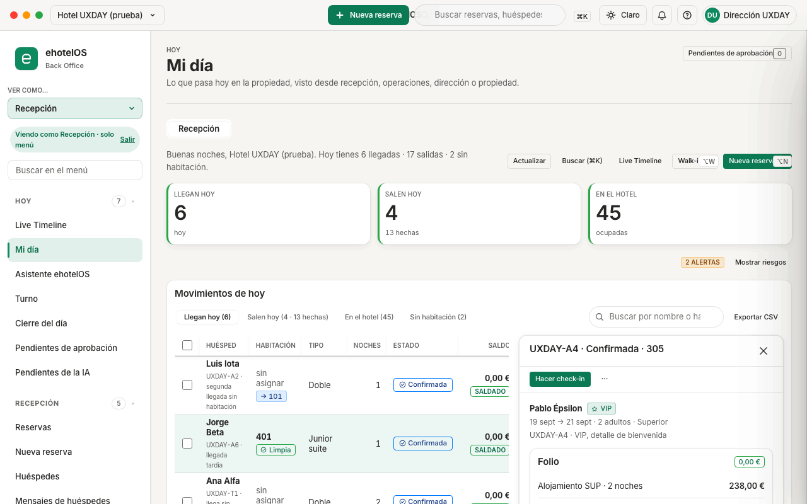

### La pantalla, de arriba abajo

1. **Saludo.** «Buenas noches, Hotel UXDAY (prueba). Hoy tienes 6 llegadas · 17 salidas · 2 sin habitación.» El saludo cambia con la hora («Buenos días», «Buenas tardes», «Buenas noches»); las 17 salidas son las 4 pendientes más las 13 ya hechas.
2. **Botones de cabecera.** «Actualizar» (vuelve a pedir todo), «Buscar (⌘K)», «Live Timeline», «Walk-in» (⌥W) y «Nueva reserva» (⌥N). Los dos últimos muestran su atajo dentro del botón; en la captura el texto queda un poco recortado, es un defecto conocido.
3. **«Indicadores de hoy».** Tres tiles que son botones: «Llegan hoy 6 · hoy», «Salen hoy 4 · 13 hechas» y «En el hotel 45 · ocupadas». Cada tile abre su pestaña en la tabla. A la derecha, «2 alertas» y el botón «Mostrar riesgos»: despliega tres tiles más, sin rótulo visible («Sin habitación 2 · pendiente», «Salidas con retraso 0 · a tiempo», «Saldo pendiente 248,00 € · por cobrar»; el lector de pantalla los anuncia como «Riesgos de hoy»), y el botón pasa a decir «Ocultar riesgos».
4. **«Movimientos de hoy».** La barra «Vista de recepción» con las pestañas «Llegan hoy (6)» · «Salen hoy (4 · 13 hechas)» · «En el hotel (45)» · «Sin habitación (2)», el cuadro «Buscar por nombre o habitación (⌥F)» (filtra la tabla al momento) y «Exportar CSV» (descarga la tabla que estás viendo). Cada pestaña es una tabla:
   - **«Llegadas de hoy»**: Huésped · Habitación · Tipo · Noches · Estado · Saldo · Acciones. El huésped lleva debajo el código y la nota de la reserva («UXDAY-A5 · saldo pendiente al llegar»); «VIP» delante del nombre cuando lo es. La celda de habitación dice «401 Limpia», «110 Sucia» o, si no tiene habitación, «sin asignar → 101» (la candidata que ehotelOS propone: la primera limpia y libre del tipo). El estado es «Confirmada» o «En el hotel»; el saldo, «0,00 € saldado» o «128,00 € pendiente».
   - **«Salidas de hoy»**: Huésped · Habitación · Estado · Saldo · Acciones; el estado es «En el hotel» (pendiente de salir) o «Salida hecha».
   - **«Huéspedes alojados»**: Huésped · Habitación · Sale · Noches restantes · Saldo · Acciones.
   - **«Llegadas sin habitación asignada»**: Huésped · Llegada · Tipo · Habitación · Acciones (las mismas filas que en «Llegadas de hoy» aparecen con «sin asignar → 101»).
5. **La acción de cada fila.** Un solo botón que dice lo que hará: «Hacer check-in» (llegada con habitación limpia), «Check-in en 101» (llegada sin habitación: el cajón se abre con la 101 ya elegida), «Cobrar 120,00 € y cerrar» (salida con saldo), «Hacer check-out» (salida con saldo 0) o «Abrir ficha» (ya alojada o ya salida). Al lado, «⋯» («Más acciones de <nombre>») despliega «Ver folio» · «Cambiar habitación» (o «Asignar habitación» si la llegada no tiene habitación) · «Marcar no-show…» · «Abrir ficha completa».
6. **«Lo siguiente que hay que hacer».** La cola de acciones con el «Filtro de prioridad» («Todo · 12», «Urgente · 11», «Hoy · 1», «Próximo · 0»), los botones «Walk-in» y «Actualizar» (recarga la cola; se recalcula sola cada 30 segundos) y una tarjeta por asunto, con su etiqueta roja cuando es urgente:
   - «Posible no-show · Elena Sigma» («Urgente · Riesgo no-show», «Llegada prevista hoy. Ya pasan de las 19:00 y no ha hecho check-in.», con «Contactar huésped» · «Hacer check-in» · «Marcar no-show»). Aparece **a partir de las 19:00** para cada llegada pendiente; por la mañana no la verás.
   - «Late checkout sin resolver · Hab. 204» («Urgente · Late check-out», «Lucía Kappa debería haber salido. Es tarde y sigue alojado.», «Confirma si autoriza late checkout (puede llevar cargo) o cierra la estancia.», botón «Hacer check-out»).
   - «Incidencia en 310 · Avería: el aire acondicionado de la 310 no enfría» («Abrir incidencia»).
   - «VIP llega hoy · Pablo Épsilon» («Ver perfil»).
7. **Tarjeta «Mi día en recepción».** Cuatro pasos y un «Tip» (mantén ⌥ para ver la letra de cada acción del detalle; la cola se recalcula cada 30 segundos). Ciérrala con «Cerrar instrucciones»: ehotelOS recuerda que la has cerrado en ese navegador.

### Ver el detalle de una fila sin salir

1. Haz clic en cualquier celda de la fila (también en el nombre del huésped, o en la columna «Tipo») o llega a la fila con Tab y pulsa **Intro**.

**Resultado esperado.** A la derecha de la tabla se abre el panel «Detalle de Pablo Épsilon»: cabecera «UXDAY-A4 · Confirmada · 305» con «Cerrar», la barra «Acciones» con la primaria («Hacer check-in») y «⋯», los datos del huésped («VIP · 19 sept → 21 sept · 2 adultos · Superior» y la nota de la reserva), el «Folio» con su importe y la lista «Folio abreviado» («Alojamiento SUP · 2 noches 238,00 €», «Cargos · pagos 238,00 € · 238,00 €», «Saldo 0,00 €») y el botón «Abrir ficha completa». **↑ y ↓** cambian de fila con el panel abierto; **Esc** lo cierra. Con **⌥ mantenido** aparecen las teclas de acceso del panel: **C** = «Hacer check-in», **O** = «Abrir ficha completa».

### Trabajar con varias filas (lote)

1. Marca la casilla «Seleccionar fila n» de cada fila (o «Seleccionar todas las filas visibles» en la cabecera).

**Resultado esperado.** Aparece la barra «Acciones sobre la selección» con «2 filas seleccionadas», «Check-out de 2 con saldo 0», «Imprimir 2 fichas» y «Quitar selección». El check-out en lote solo admite **salidas de hoy con saldo 0** (ver [Salidas y check-out](#salidas-y-check-out)).

## Llegadas y check-in

Registrar la llegada de un huésped con reserva: comprobar sus datos, dejarle una habitación **limpia**, cobrar el saldo si lo hay y encolar el parte de viajeros. Todo ocurre en un cajón lateral que se abre desde Mi día (fila o cola), desde la ficha de la reserva («Hacer check-in») o desde el panel del Live Timeline («Check-in»).

### Check-in de una llegada con habitación limpia (con o sin cobro)

1. En **Menú › Hoy › Mi día**, pestaña «Llegan hoy», localiza la fila (si hace falta, escribe el nombre o la habitación en «Buscar por nombre o habitación (⌥F)») y pulsa **«Hacer check-in»**. En la captura: Elena Sigma, UXDAY-A5, habitación 111, «128,00 € pendiente».
2. Se abre el cajón **«Check-in»** («Elena Sigma · UXDAY-A5», un cronómetro que cuenta desde que se abrió el cajón, «Cerrar») con el formulario en cuatro secciones:
   - **«1 · Huésped»**: nombre, documento («DNI UX000005 · ES») y la nota de la reserva.
   - **«2 · Habitación»**: el estado de la habitación como etiqueta («Limpia»), «Hab. 111 · Planta 1 · Doble» y el desplegable «Cambiar habitación», con «Sin asignar» y las habitaciones limpias y libres («Hab. 101 · planta 1 · Limpia»…).
   - **«3 · Pago»**: la etiqueta «128,00 € pendiente» (o «Saldado»), la lista «Total estancia (2 noches) 178,00 €» · «Pagos hasta ahora 50,00 €» · «Saldo pendiente 128,00 €», el «Modo de cobro» («Cobrar saldo», seleccionado cuando hay saldo · «Cobrar depósito», desactivado si la reserva no tiene política de depósito · «Sin cobro»), el aviso «Se cobrarán 128,00 € al confirmar.» y el «Método» («Tarjeta (datáfono)», «Efectivo», «Transferencia»; también ⌥1 efectivo · ⌥2 tarjeta · ⌥3 transferencia).
   - **«4 · Cumplimiento»**: «Se crean al confirmar», «Sin partes de viajeros todavía: el check-in crea uno por huésped vinculado a la reserva.» y «Al confirmar se encola el parte de viajeros (SES.HOSPEDAJES); aquí verás el resultado real del encolado.». Verás además dos líneas técnicas tal cual («Firma digital aplicada con sello "sig_drawer_checkin".» y «Política de cancelación: FLEX24.»): no tienes que hacer nada con ellas.
3. Revisa habitación y modo de cobro y pulsa el botón del pie, que dice lo que va a hacer: **«Cobrar 128,00 € y hacer check-in»** (o **«Hacer check-in»** si el saldo es 0 y el modo es «Sin cobro»). **Intro** también confirma. «Cancelar» cierra sin cambios.

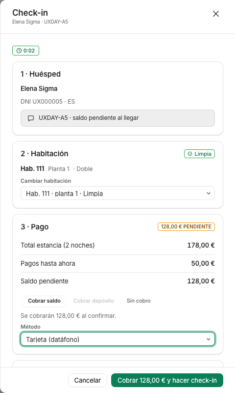

**Resultado esperado** (según `quick-checkin.spec.ts`, no ejecutado en esta guía). La fila pasa a «En el hotel» al momento, el cobro queda registrado en el folio (con tarjeta se anota como cobro: ehotelOS no habla con ningún datáfono), la habitación pasa a «Ocupada» y el parte de viajeros queda encolado (en el hotel de prueba, sin envío SES configurado, el cajón se queda abierto mostrando ese resultado y lo cierras con «Cerrar»). No hay «Deshacer» del check-in.

**Si algo falla.** Si el saldo cambia entre abrir y confirmar, la fila vuelve a su estado y verás el aviso del servidor; pulsa «Actualizar» y repite. El botón está desactivado si la llegada queda fuera de la ventana de check-in del hotel (el día de negocio y el siguiente); un check-in fuera de ventana exige un permiso de modificación y un motivo («Indica el motivo del check-in fuera de ventana.»). Si eliges «Sin asignar» en el desplegable (o la reserva no trae habitación), el pie del cajón dice «Asigna una habitación primero.» y el botón queda desactivado: elige una en «Cambiar habitación». El mensaje «Sin habitación válida para el check-in.» no es de este cajón: lo devuelve Reservas › Importar (la sincronización de reservas) cuando una fila llega como ya alojada sin habitación válida.

### Check-in de una llegada sin habitación

1. En «Llegan hoy» (o en la pestaña «Sin habitación (2)»), la fila muestra «sin asignar → 101» y su botón dice **«Check-in en 101»**: púlsalo.
2. En el cajón, «2 · Habitación» ya trae **«Hab. 101 · Planta 1 · Doble»** (la primera limpia y libre del tipo de la reserva); cambia de habitación en el desplegable si prefieres otra.
3. Pulsa «Hacer check-in» (saldo 0 en el ejemplo).

**Resultado esperado** (`quick-checkin.spec.ts`: dos clics). Reserva alojada en la 101. Desde la cola de Mi día también puedes asignar sin hacer check-in; esa primera asignación **no tiene «Deshacer»** (no hay habitación anterior a la que volver).

> **Nota:** en el panel del Live Timeline una reserva sin habitación tiene el botón «Check-in» **desactivado**; allí hay que pulsar antes «Asignar habitación». En Mi día no hace falta: el cajón asigna y aloja en el mismo paso.

### Check-in cuando la habitación no está lista (sucia)

1. Pulsa «Hacer check-in» en una fila cuya habitación diga «Sucia» (Marta Digamma, UXDAY-A3, «110 Sucia» en la captura).

**Resultado esperado.** «2 · Habitación» muestra la etiqueta «Sucia», «Hab. 110», el aviso **«Sugerencia · La 101 está limpia, libre y es del mismo tipo.»** con el botón **«Cambiar a la 101»**, el desplegable «Cambiar habitación» (la 110 aparece como «Hab. 110 · planta 1 · Sucia») y el interruptor **«Hacer check-in igualmente (la limpieza sigue siendo de pisos; el motivo queda auditado)»**. El botón «Hacer check-in» está **desactivado** y el pie del cajón lo explica: «La habitación no está lista. Cambia de habitación o marca «Hacer check-in igualmente» con un motivo.».

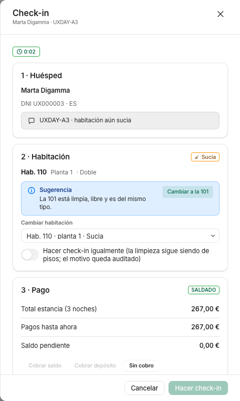

2. Lo normal: pulsa «Cambiar a la 101» (o elige otra limpia) y confirma. La excepción: activa el interruptor, escribe el motivo y confirma; el motivo queda en la auditoría y la limpieza de la 110 sigue en la lista de pisos.

**Si algo falla.** Si no hay ninguna limpia del mismo tipo, la sugerencia no aparece: pide a pisos que marque una limpia (ver [Pisos y mantenimiento](40-pisos-mantenimiento.md)) o usa el interruptor con motivo.

### Llegada con fecha en el pasado

Una reserva nueva con llegada anterior a hoy no se puede crear desde recepción: el formulario avisa «La llegada es anterior a hoy.» y bloquea «Crear reserva»; si se fuerza, el servidor la rechaza («La llegada 2026-09-18 es anterior a hoy (2026-09-19): comprueba las fechas…»). Registrar una llegada pasada exige el permiso de modificar reservas.

## Salidas y check-out

Cerrar la estancia: revisar el folio, cobrar el saldo, decidir la factura y marcar la salida. Desde Mi día (pestaña «Salen hoy»), desde la ficha de la reserva o desde el panel del Live Timeline («Check-out»).

### Check-out con cobro y factura

1. En **Mi día › «Salen hoy (4 · 13 hechas)»**, pulsa el botón de la fila: **«Cobrar 120,00 € y cerrar»** cuando hay saldo (Lucía Kappa, habitación 204) o **«Hacer check-out»** cuando el saldo es 0.
2. Se abre el cajón **«Check-out»** («Lucía Kappa · Hab. 204», cronómetro, «Cerrar») con «Hab. 204 · planta 2» y la etiqueta «En el hotel», y tres secciones:
   - **«1 · Folio»**: la tabla «Líneas del folio» (Concepto · Importe: «Alojamiento DBL · 2 noches 178,00 €», «Minibar 42,00 €») y los «Totales del folio» («Total cargos 220,00 €», «Pagos previos 100,00 €», «Saldo 120,00 €»). Debajo de cada concepto verás su código interno en crudo («room · 2x», «minibar»): es un texto de la aplicación.
   - **«2 · Cobro»**: la etiqueta «Saldo abierto», «Importe a cobrar: 120,00 €», el «Método» («Tarjeta (datáfono)», «Efectivo», «Transferencia») y el interruptor **«Sin cobro ahora (el huésped saldrá con saldo pendiente)»**.
   - **«3 · Salida y factura»**: «La habitación pasará a sucia. Housekeeping recibe la tarea de limpieza de salida.», el selector «Factura» (**«Borrador para Facturación»**, por defecto: «Queda como borrador con los cargos del folio; Facturación la emite.» · **«Emitir ahora con número»**: se emite al cerrar y es irreversible, entra en la cadena VeriFactu del hotel · **«Sin factura»**) y «Factura a» (**«Huésped»**: «Factura simplificada a nombre del huésped; si la reserva tiene comunidad con tasa turística, se incluye como línea exenta.» · **«Empresa»**, con «Razón social» y «NIF»).
3. Pulsa **«Cobrar 120,00 € y cerrar»** (o «Hacer check-out»). Intro también confirma; «Cancelar» cierra sin cambios.

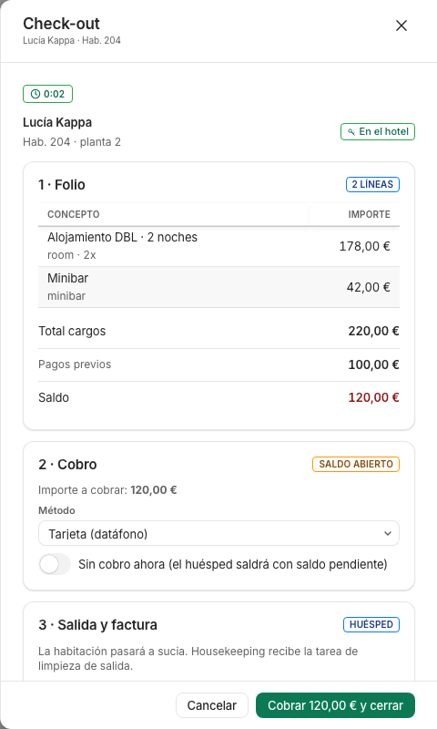

**Resultado esperado** (`quick-checkout.spec.ts`, no ejecutado en esta guía). El cobro se registra, el folio se cierra, la fila pasa a «Salida hecha» y la habitación a «Sucia» con su tarea de limpieza en pisos; con «Emitir ahora con número» el aviso muestra el **número de la factura** emitida, y con el borrador la factura queda para Finanzas › Facturación (ver [Administración](20-administracion.md)). El check-out no se puede deshacer.

**Si algo falla.** Si el servidor detecta saldo que el cajón no tenía, verás el aviso **«Saldo pendiente detectado»** con el importe y tres botones: «Cobrar <importe> y cerrar», «Salir con saldo pendiente» y «Cancelar». Si el folio tiene cargos sin facturar y la factura está en «Sin factura», el cierre del folio se rechaza («El folio tiene n cargos por X € sin facturar: emite la factura … antes de cerrarlo.», con texto técnico): elige «Borrador para Facturación» o «Emitir ahora con número».

### Check-out en lote (salidas con saldo 0)

1. En «Salen hoy», marca las casillas de las filas con «0,00 € saldado» (Sara Eta 206 e Iván Ípsilon 207 en la captura).
2. En la barra «Acciones sobre la selección» pulsa **«Check-out de 2 con saldo 0»**.
3. Confirma en el diálogo «Check-out de 2 con saldo 0»: «Se cerrarán 2 estancias con saldo 0 que salen hoy (la 206, la 207). Las habitaciones pasarán a sucia y el check-out no se puede deshacer.» con «Revisar la selección» y «Check-out de 2 con saldo 0».

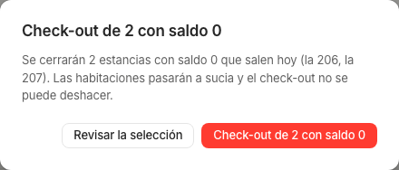

**Resultado esperado** (`frontdesk-cockpit.spec.ts`). Las dos filas pasan a «Salida hecha». Solo entran en el lote salidas de **hoy** con saldo **0**; una salida con saldo se hace fila a fila con «Cobrar … y cerrar».

## Walk-in

Alojar a quien llega **sin reserva** en un solo cajón: fechas, tipo con precio, huésped y cobro, y el check-in en el mismo paso.

1. En **Mi día** pulsa **«Walk-in»** (cabecera o cola) o **⌥W**. Fuera de Mi día, ⌥W abre «Nueva reserva» (ver más abajo).
2. Se abre el cajón **«Walk-in»** («Hoy → mañana · 1 noche», «Cerrar») con el formulario «Alta de walk-in»:
   - **«Estancia»**: «Llegada» (hoy), «Salida» (mañana), el botón «+1 noche» y «Adultos» (1 a 4; por defecto «2 adultos»).
   - **«Tipo y habitación»**: «10 disponibles»; «Tipo» con precio y libres («Doble · 89,00 € · 10 libres», «Superior · 119,00 € · 3 libres», «Junior suite · 159,00 € · 0 libres»), «Precio de la estancia según la tarifa publicada.», y «Habitación» con «Sin asignar (se asigna al llegar)» y las limpias y libres: «10 limpias y libres: la primera va preseleccionada.» («Hab. 101 · Limpia»).
   - **«Huésped»**: «Lo mínimo: nombre y apellido»; «Nombre», «Apellido» y «Documento» («Opcional ahora: el parte de viajeros se completa desde la ficha o el cajón de check-in.»).
   - **«Cobro»**: «89,00 €», el «Modo de cobro» («Cobrar 89,00 €», seleccionado · «Sin cobro»), el «Método» y la nota «El cobro se registra al hacer el check-in, como anticipo del importe de la estancia.». Mientras falte algo, el pie lo dice: «Indica nombre y apellido del huésped.».
3. Escribe nombre y apellido (en la captura, «Sofía» «Ejemplo», inventados) y pulsa **«Crear y hacer check-in»** o **«Solo crear reserva»** (los dos se activan al tener nombre y apellido; Intro confirma).

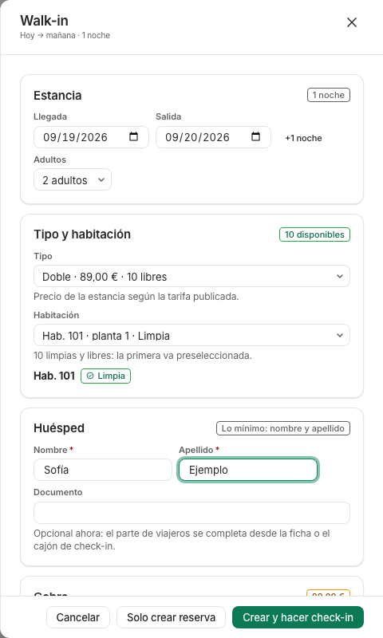

**Resultado esperado** (`walk-in.spec.ts`, no ejecutado en esta guía). Reserva creada con origen «Walk-in», huésped alojado en la habitación elegida y cobro registrado como anticipo. El folio del walk-in **nace sin el cargo de alojamiento**: lo asienta el cierre del día, así que hasta entonces el cobro aparece como anticipo (saldo a favor del huésped).

## Nueva reserva

**Menú › Recepción › Nueva reserva** (`/recepcion/reservas/nueva`), el botón «+ Nueva reserva» de la barra superior, el de Mi día o **⌥N**. La pantalla tiene dos pestañas de sección, «Formulario» y «Dictar (IA)» (convierte una petición escrita en un borrador por reglas, sin modelo de lenguaje), y dentro del formulario dos vistas: **«Rápida»** (por defecto) y **«Completa»** (`?modo=rapida` / `?modo=completa`). La tarjeta «Nueva reserva» resume las dos con un «Tip»: «⌥N abre esta pantalla desde cualquier sitio; mantén ⌥ para ver la letra de cada botón (D depósito · I check-in · C crear)».

### Reserva rápida (una pantalla)

1. Rellena **«Estancia»**: «Llegada» y «Salida» (admiten «+7», «hoy» o «mañana» escritos en el campo), «Adultos», «Tipo de habitación» («Doble · 89,00 €/noche · 10 libres»…) y, si quieres, «−1 noche» / «+1 noche».
2. Rellena **«Huésped»**: «Nombre» y «Apellido» son lo único obligatorio; «Teléfono» y «Correo electrónico» son opcionales. Si el huésped ya tiene ficha, la pantalla la sugiere.
3. Revisa **«Origen y tarifa»**: «Origen de la reserva» (Directo (web / correo) · Teléfono · Correo electrónico · Walk-in · Booking.com · Expedia · Airbnb · Mayorista / TTOO · GDS · Corporativo), «Plan de tarifas» («Sin plan tarifario (tarifa BAR del hotel)» o el plan) y «Precio total (€)» opcional; debajo, el precio en vivo «Cotizado: 89,00 €» y «Total 89,00 € · tarifa publicada».
4. Si factura una empresa, rellena **«Empresa»** («Razón social», «NIF»): la reserva queda con la instrucción «Factura a empresa» y el NIF se recuerda para emitir desde la ficha.
5. En la barra «Crear la reserva» («Total 89,00 € · 1 noche · tarifa publicada») pulsa **«Crear reserva»** (o Intro en cualquier campo), **«Crear y cobrar depósito»** (abre el cobro) o **«Crear y hacer check-in»** (solo con llegada hoy: aloja en la primera limpia y libre del tipo).

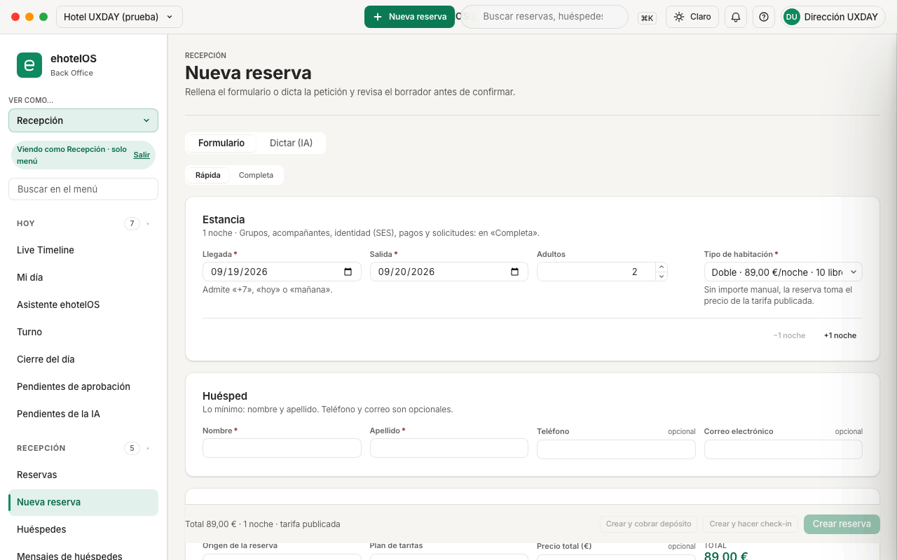

**Resultado esperado** (`reservation-create.spec.ts`, no ejecutado en esta guía). Se crea la reserva con el precio de la tarifa y se abre su ficha («Detalle»).

**Si algo falla.** «Sin disponibilidad para esas fechas y ocupación.» (cambia fechas o tipo); «Sin tarifa publicada para esas noches: indica el importe total.» o «Precio de relleno: alguna noche no tiene tarifa publicada. Indica el importe total para poder crear la reserva.» (escribe «Precio total (€)»); «La llegada es anterior a hoy.» (corrige la fecha).

### Reserva completa (seis pasos)

Pulsa **«Completa»**. La cabecera «Pasos» muestra «1 / 6 · Estancia», una barra de progreso («Paso 1 de 6 · 0,00 € · 1 noche») y la lista «Pasos del asistente»: «1. Estancia · 2. Huéspedes · 3. Tarifa · 4. Origen · 5. Pagos · 6. Solicitudes». El paso «Estancia» tiene «Fecha de llegada», «Fecha de salida», «Noches» (calculadas), tipo, «Habitación asignada» (opcional: «Puede dejarse vacía y asignarse en el check-in.»), «Número de habitaciones», «Adultos», «Niños», «Bebés» y horas previstas; abajo, «Consultar disponibilidad» y «Siguiente», y en el paso 6 «Confirmar y crear reserva» (`reservation-create.spec.ts`). Lo que teclees se conserva al cambiar entre «Rápida» y «Completa». Desde el Live Timeline, al seleccionar celdas vacías de una habitación llegas aquí con habitación, tipo y fechas ya rellenos.

## Ficha de reserva

**Menú › Recepción › Reservas › «Detalle»** (`/recepcion/reservas/<id>`): se abre al pulsar «Abrir ficha» / «Abrir ficha completa» en Mi día o en la lista, «Abrir reserva» en el Live Timeline, o al crear una reserva. La pantalla «Reservas» muestra las pestañas «Lista · Tablero de habitaciones · Detalle · Recorrido · Importar» y, dentro de la ficha, las vistas «Resumen · Folio (1) · Actividad · Huéspedes (2) · Documentos».

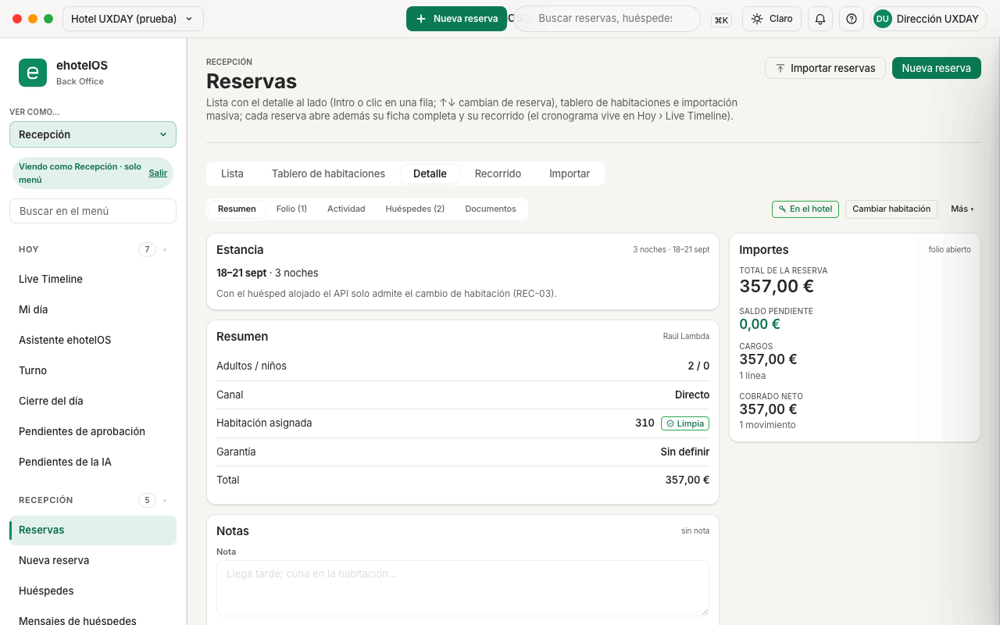

### Acciones de la reserva (una primaria por estado)

El grupo «Acciones de la reserva» lleva el estado como etiqueta y **una sola acción principal** según el estado:

- **Confirmada** (UXDAY-T1 en la demo): «Hacer check-in», «Asignar habitación» y «Más ▾».
- **En el hotel** (UXDAY-T4): «Cambiar habitación» y «Más ▾» (no hay «Check-in» ni «Check-out»: la salida se hace desde Mi día o desde el Live Timeline).

«Más ▾» abre el menú «Más acciones de <código>»: «Cobrar…» · «Devolver…» · «Recorrido del huésped» · «Ficha del huésped» · «Centro de facturación» · «Volver a reservas», y en una reserva confirmada además **«Cancelar reserva…»** y **«Marcar no-show…»** (justo después de «Devolver…»). Con ⌥ mantenido, **C** es la acción principal cuando la hay («Hacer check-in» en una confirmada; una alojada no tiene), **M** es el botón de habitación («Asignar habitación» o «Cambiar habitación») y **P** es «Cobrar…» cuando aparece como botón en la barra (en las reservas de la demo va dentro de «Más ▾» y no tiene letra). «Más ▾» no tiene tecla de acceso: se abre con el ratón o con Tab + Intro, y se cierra con Esc.

### Resumen: fechas, datos, notas e importes

- **«Estancia»**: en una reserva **confirmada**, el formulario «Fechas de la estancia» con «Llegada» y «Salida» (admiten «+7», «−1», «hoy» o «mañana» y confirman con Intro) y los botones «−1 noche» · «+1 noche». En una reserva **alojada** las fechas se muestran como texto («18–21 sept · 3 noches») y la pantalla dice, con este texto de la aplicación: «Con el huésped alojado el API solo admite el cambio de habitación (REC-03).». El cambio de fechas no se ha ejecutado en esta guía.
- **«Resumen»**: «Adultos / niños», «Canal» («Directo»), «Habitación asignada» («310 · Limpia» o «Sin asignar»), «Garantía», «Total».
- **«Notas»**: el formulario «Nota de la reserva» con «Guardar nota» (bloqueado en una reserva alojada: «Con el huésped alojado el API no admite cambios en la reserva salvo la habitación.»).
- **«Importes»** (columna derecha): «folio abierto», «Total de la reserva», «Saldo pendiente», «Cargos» («1 línea»), «Cobrado neto» («1 movimiento»).

### Cambiar de habitación (con «Deshacer»)

1. En una reserva alojada (o confirmada con habitación), pulsa **«Cambiar habitación»**.
2. Bajo el botón se abre el panel «Cambiar habitación»: el desplegable «Habitación» con las limpias y libres, primero las del mismo tipo («311 · Limpia» seleccionada, «312 · Limpia», luego «101 · Doble · Limpia»…; la actual aparece como «310 · Asignada»), el texto «Limpias, libres y sin otra reserva: primero las del mismo tipo. Intro confirma.» y los botones **«Mover a la 311»** y «Cancelar».
3. Elige la habitación y pulsa «Mover a la …» (o Intro).

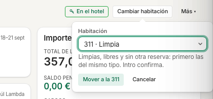

**Resultado esperado** (`reservation-workspace.spec.ts`, no ejecutado en esta guía). El traslado se aplica al momento; aparece un aviso con **«Deshacer»** durante 8 segundos (también **⌘Z** mientras dura) y el foco vuelve a «Cambiar habitación». Deshacer un traslado de un alojado es un traslado nuevo: la habitación intermedia queda sucia con su tarea de limpieza. La **primera** asignación desde la cola de Mi día no tiene «Deshacer». Desde Mi día, «⋯» › «Cambiar habitación» te trae a esta ficha.

### Cancelar o marcar no-show

1. En una reserva confirmada, «Más ▾» › **«Cancelar reserva…»** (o **«Marcar no-show…»**; también «Marcar no-show…» en el «⋯» de Mi día y «Marcar no-show» en la cola y en el panel del Live Timeline).
2. Diálogo **«¿Cancelar la reserva UXDAY-T1?»**: «La reserva dejará de contar en la ocupación. La penalización prevista por su política se carga al folio como línea no sujeta a IVA y, si el saldo queda a cero, el folio se cierra.»; el recuadro de la política («Política «Flexible 24 h» · Penalización prevista de 89,00 € … Plazo gratuito hasta 19 sept 2026, 14:00.»); el campo **«Motivo»** (obligatorio; «Queda en la auditoría de la reserva. Intro confirma.») y el interruptor **«Aplicar la penalización prevista»** (activado: «Se cargarán 89,00 € al folio como línea no sujeta a IVA.»). Botones: «Mantener la reserva» y **«Cancelar la reserva (penalización 89,00 €)»**, desactivado hasta escribir el motivo.
3. El no-show es igual: «¿Marcar UXDAY-T1 como no-show?» («El huésped no se ha presentado: la reserva se cierra, la penalización de no-show prevista por su política se carga al folio…»), motivo (sugerido «No se ha presentado ni ha avisado») y **«Marcar no-show (penalización 89,00 €)»**.

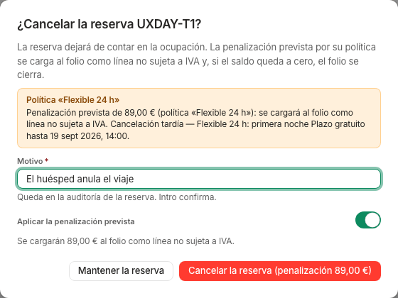

**Resultado esperado** (no ejecutado en esta guía: cancelar y marcar no-show son irreversibles, sin «Deshacer»). La reserva pasa a «Cancelada» o «No-show», la penalización se carga al folio y, si el saldo queda a cero, el folio se cierra. Si desactivas la penalización por encima de tu tramo, la pantalla pide **«Autorizar con PIN de supervisor»**.

**Si algo falla.** «La reserva UXDAY-T1 no se puede pasar a cancelled estando checked_in.» (texto de la aplicación con los estados en inglés): una reserva alojada no se cancela, se hace su check-out. «La reserva … cambió de estado mientras se procesaba (…): vuelve a cargarla.»: otra persona la ha tocado a la vez; pulsa «Actualizar».

### Folio: añadir un cargo (con «Deshacer»)

En la vista **«Folio (1)»**: «Cargos» con la tabla «Cargos del folio» (Descripción · Tipo · Categoría fiscal · Cantidad × precio · Total; «Total cargos 178,00 €») y el formulario **«Añadir cargo»**: «Tipo» (Alojamiento · Noche adicional · Salida tardía · Entrada anticipada · Desayuno · Media pensión · Restaurante · Bar · Servicio de habitaciones · Minibar · Spa · Aparcamiento · Lavandería · Traslado · Extras · Ajuste), «Descripción» (se rellena con el tipo, «Minibar»), «Importe (€)» («Precio bruto, con impuestos. Intro añade el cargo.») y «Categoría fiscal» («Determina el tipo de IVA al facturar; solo las categorías compatibles con el tipo de cargo.»); el botón «Añadir cargo» se activa al escribir el importe. Debajo, «Cobros y devoluciones» («1 movimiento · cobrado neto 178,00 €», botón «Devolver un cobro») e «Importes». Desde ⌘K en la ficha tienes el comando «Añadir cargo en UXDAY-T6».

**Resultado esperado** (`reservation-workspace.spec.ts`, no ejecutado). La línea aparece al momento con un aviso «Deshacer» de 8 segundos: si deshaces, el cargo no llega al servidor; el formulario se vacía para no cargar dos veces.

### Documentos: factura a huésped o a empresa

En la vista **«Documentos»**: «El parte de viajeros se consulta en Cumplimiento › Registro de viajeros. La factura se crea aquí con los cargos del folio y se consulta en Finanzas › Facturación.» y el grupo «Factura desde la reserva» con **«Factura a huésped»** y **«Factura a empresa»**. El diálogo «Factura a empresa · UXDAY-E1» tiene «Factura a» («Huésped» · «Empresa»), «Razón social» (recordada de la reserva: «Empresa UXDAY SL»), «NIF» («Recordado de la última factura a este nombre.» cuando existe), «Factura» («Borrador para Facturación» · «Emitir ahora con número») y los botones «Cancelar» y **«Crear borrador»** (o «Emitir con número»), desactivado sin NIF. Resultado según `reservation-workspace.spec.ts` (no ejecutado): el borrador queda para Facturación; emitir con número devuelve el número real en el aviso y entra en la cadena VeriFactu.

### Huéspedes y actividad

- **«Huéspedes (2)»**: «2 viajeros», la lista «Titular · Adultos · Niños · Reserva a nombre de · Huésped principal · Correo de contacto · Habitación» y la nota «Los acompañantes y el parte de viajeros completo se gestionan en Cumplimiento › Registro de viajeros.».
- **«Actividad»**: la tabla «Actividad de la reserva» (Cuándo · Quién · Acción · Cambios). Algunas filas muestran valores internos en crudo (por ejemplo «Maintenance» o «· open · high» en una incidencia): son textos de la aplicación.

## Lista de reservas

**Menú › Recepción › Reservas** (`/recepcion/reservas/lista`, **⌥R**). La lista mantiene los datos mientras recarga y abre un panel de detalle al lado sin salir.

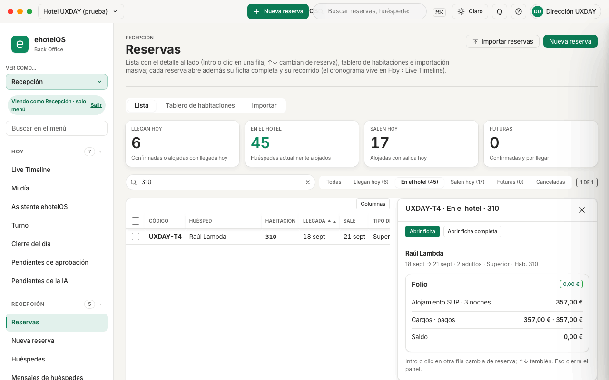

1. Arriba, la tarjeta «Reservas» (cinco pasos y un «Tip»; «Cerrar instrucciones») y el grupo **«Reservas de hoy»** con cuatro tiles-botón: «Llegan hoy 6 · Confirmadas o alojadas con llegada hoy», «En el hotel 45 · Huéspedes actualmente alojados», «Salen hoy 17 · Alojadas con salida hoy», «Futuras 0 · Confirmadas y por llegar».
2. La barra de búsqueda y vistas: el cuadro **«Buscar reservas por nombre, código o habitación»** (⌥F), las «Vistas operativas» **«Todas» · «Llegan hoy (6)»** (por defecto) **· «En el hotel (45)» · «Salen hoy (17)» · «Futuras (0)» · «Canceladas»**, el contador «6 de 6» y el botón **«Columnas»** (diálogo «Columnas de la tabla»: una casilla y «Subir» / «Bajar» por columna; se guarda en tu navegador).
3. La tabla **«Reservas»**: Código · Huésped · Habitación · Llegada · Sale · Tipo de habitación · Origen · Total · Estado · Acciones («Abrir ficha»).

### Buscar por número de habitación

1. Elige la vista donde está la reserva («Todas» o «En el hotel») y escribe el número («310»).

**Resultado esperado.** «1 de 1»: la fila «UXDAY-T4 · Raúl Lambda · 310 · 18 sept · 21 sept · Superior · Directo · 357,00 € · En el hotel». La búsqueda filtra **dentro de la vista**: en «Llegan hoy» el mismo «310» da «0 de 0», porque esa reserva llegó ayer.

### Ver el detalle al lado

1. Haz clic en una celda de la fila (por ejemplo «Superior») o pulsa Intro con la fila enfocada.

**Resultado esperado.** El panel **«Detalle de la reserva UXDAY-T4»**: cabecera «UXDAY-T4 · En el hotel · 310», «Cerrar», la barra «Acciones» («Abrir ficha», «Abrir ficha completa»; en una salida con saldo, «Cobrar 120,00 € y cerrar»), «Raúl Lambda», «18 sept → 21 sept · 2 adultos · Superior · Hab. 310», el «Folio» con la lista «Folio abreviado» y el pie «Intro o clic en otra fila cambia de reserva; ↑↓ también. Esc cierra el panel.» (`reservations-list.spec.ts`). Las casillas de la izquierda permiten lotes (fichas, asignar habitación, «Check-out de n con saldo 0»).

## Huéspedes y partes de viajeros

### Huéspedes

**Menú › Recepción › Huéspedes** (`/recepcion/huespedes`; ⌥F enfoca el buscador). «Perfiles de huésped con su ficha y su cronología de estancias, pagos e incidencias.», el botón **«Nuevo huésped»**, la pestaña «Listado», el cuadro **«Buscar huéspedes por nombre, empresa, email, documento o habitación»** y la tabla **«Huéspedes»** (Nombre · Documento · Contacto · Empresa · VIP / Fidelización · Acciones «Abrir ficha»).

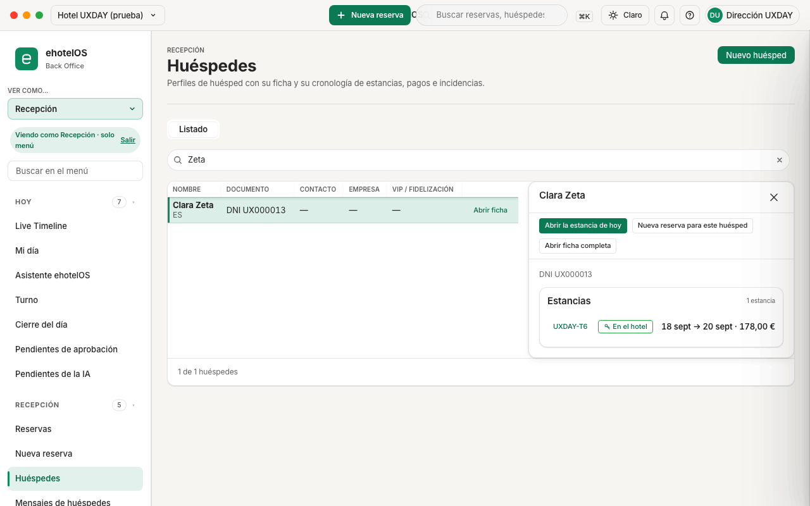

1. Escribe en el buscador («Zeta») y haz clic en cualquier celda de la fila (también en el nombre) o pulsa Intro con la fila enfocada.

**Resultado esperado.** El panel «Detalle de Clara Zeta» con la barra «Acciones» (**«Abrir la estancia de hoy»** · **«Nueva reserva para este huésped»** · **«Abrir ficha completa»**), el documento («DNI UX000013») y «Estancias» («1 estancia»; la lista «Estancias del huésped» con el botón del código «UXDAY-T6», el estado «En el hotel», las fechas y el importe).

2. «Abrir ficha completa» (o «Abrir ficha» en la fila) abre la ficha (`/recepcion/huespedes/<id>`): pestañas «Listado · Ficha · Cronología»; los botones «Abrir la estancia de hoy», «Nueva reserva para este huésped» (abre la reserva rápida con el huésped ya puesto) y «Volver al listado»; el grupo «Resumen del huésped» (Estancias · Valor de vida · VIP · Fidelización) y el grupo con el nombre del huésped: Tratamiento · Nombre · Segundo nombre · Primer apellido · Segundo apellido · Sexo · Fecha de nacimiento · Nacionalidad (ISO) · Idioma preferido · Tipo de documento («DNI», «NIE», «PASSPORT», «TIE»: el pasaporte aparece con su código en inglés) · Nº de documento · Nº de soporte · País de expedición · Caducidad del documento; después, «Contacto» (teléfonos, correo y empresa).

### Partes de viajeros

**Menú › Cumplimiento › Registro de viajeros** (`/cumplimiento/registro-viajeros`). «Partes de entrada de viajeros (RD 933/2021), envío a SES.Hospedajes y a las autoridades, y conservación de los datos.» con las pestañas «Partes de entrada · SES.Hospedajes» (una cuenta de dirección o administración ve además «Autoridades · Conservación»), los botones «Conector SES.Hospedajes», «Bandeja de cumplimiento» y «Actualizar», el grupo **«Estado de los partes de viajeros»** («Aceptados», «Datos incompletos», «En cola», «Rechazados o fallidos») y el formulario **«Crear parte de entrada»** («…el parte se crea y su envío se encola en la misma acción.»: Identificador de la reserva, Nombre, Primer apellido, Segundo apellido, Tipo de documento (DNI · Pasaporte · TIE), Número de documento, Número de soporte (DNI/TIE), Nacionalidad, Fecha de nacimiento, dirección, país, teléfono…).

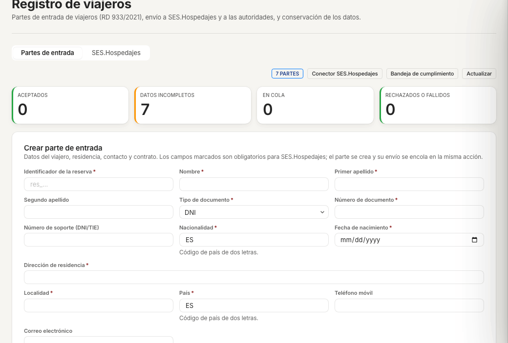

Lo normal en recepción es **no crear partes a mano**: el check-in crea uno por huésped vinculado a la reserva y lo encola (sección «4 · Cumplimiento» del cajón). Aquí vienes a completar los datos que falten («Datos incompletos») y a ver el estado del envío. El procedimiento completo, con la ficha rápida [12 · Parte de viajeros](formacion/fichas/12-parte-de-viajeros.md), está en [Administración](20-administracion.md). En el Hotel UXDAY de las capturas no hay partes («0 partes») porque el envío a SES no está configurado en ese hotel; en el de demostración hay partes en «Datos incompletos». SES.Hospedajes funciona en modo de pruebas.

## Mensajes de huéspedes

**Menú › Recepción › Mensajes de huéspedes** (`/recepcion/mensajes`). «Resumen en vivo de las conversaciones con los huéspedes: cobertura de la IA, tiempo de respuesta, sentimiento y peticiones más frecuentes de los últimos 7 días.» con «Actualizar», el grupo **«Indicadores de mensajería»** («Conversaciones abiertas», «Mensajes · 24 h», «Tiempo medio de respuesta», «Resueltas por la IA»), «Sentimiento del huésped», la tabla «Conversaciones por canal» (Canal · Conversaciones), «Peticiones más frecuentes», la barra «Filtro de conversaciones» (cuadro «Filtrar las conversaciones recientes») y la tabla **«Conversaciones recientes»** (Conversación · Huésped · Canal · Estado · IA · Mensajes · Última actividad). Los borradores de respuesta y la clasificación funcionan hoy **por reglas**, sin modelo de lenguaje, y siempre los confirma una persona. En la tabla verás identificadores internos en crudo («conv_maria», «guest_maria», canal «app») en el hotel de demostración; el Hotel UXDAY no tiene conversaciones («No hay conversaciones que mostrar.»). Sin captura en esta guía.

## Turno y cierre del día

### Turno

**Menú › Hoy › Turno** (`/hoy/turno`). «Productividad del equipo de recepción, caja del día y bloqueos críticos.» con tres botones: «Actualizar», **«Arqueo de caja»** y **«Cerrar el día»** (te lleva a Cierre del día recomprobando las condiciones).

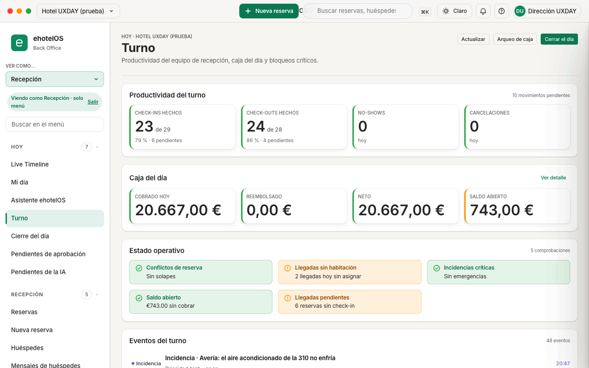

- **«Productividad del turno»**: «Check-ins hechos 23 de 29» («79 % · 6 pendientes»), «Check-outs hechos 24 de 28», «No-shows 0», «Cancelaciones 0»; encima, «10 movimientos pendientes».
- **«Caja del día»** con «Ver detalle»: «Cobrado hoy 20.667,00 €», «Reembolsado 0,00 €», «Neto 20.667,00 €», «Saldo abierto 743,00 €».
- **«Estado operativo»** («5 comprobaciones»): «Conflictos de reserva · Sin solapes», «Llegadas sin habitación · 2 llegadas hoy sin asignar», «Incidencias críticas · Sin emergencias», «Saldo abierto · €743.00 sin cobrar» (así, con el símbolo delante: texto de la aplicación), «Llegadas pendientes · 6 reservas sin check-in».
- **«Eventos del turno»** («48 eventos»): incidencias, check-ins y check-outs con habitación, contacto y hora. La incidencia muestra «Prioridad high · open» en crudo.

> **Módulo a activar:** «Arqueo de caja» abre Menú › Operaciones › Punto de venta › «Cierre de caja» (`/operaciones/tpv/cierre-de-caja`), que solo existe con el módulo de punto de venta activo. En el hotel de demostración está apagado y verás «Módulo no activado · Esta función pertenece a un módulo que no está activo en la propiedad.» con «Ir a mi página de inicio»; en el Hotel UXDAY sí se abre.

### Cierre del día

**Menú › Hoy › Cierre del día** (`/hoy/cierre-del-dia`). «Comprobaciones guiadas antes de cerrar: si algo bloquea, te dice qué arreglar y dónde. Fecha de negocio actual: 19/09/2026.» con «Actualizar».

1. Lee el aviso de cabecera. Si algo bloquea, dice **«No puedes cerrar todavía: 6 llegadas pendientes, 13 folios abiertos con saldo, 4 salidas sin check-out.»** y el botón **«Cerrar día»** está desactivado.
2. Revisa «Resumen de comprobaciones» («Comprobaciones correctas 6 · Avisos 0 · Bloqueos 3») y la lista **«Comprobaciones previas al cierre»** (9): «Llegadas pendientes», «No-shows sin resolver», «Folios abiertos con saldo», «Salidas sin check-out», «Cargos de alojamiento pendientes», «Habitaciones ocupadas marcadas sucias», «Cargos del TPV sin pasar a folio», «Facturas pendientes», «Preautorizaciones sin capturar». Cada bloqueo trae «Ver n elementos» y «Abrir cola operativa» (te lleva a Mi día para resolverlo: check-in, no-show, cobro o check-out).
3. Cuando no queden bloqueos, pulsa «Cerrar día». Debajo, «Historial de cierres» («Todavía no se ha ejecutado ningún cierre del día en esta propiedad.» en el Hotel UXDAY).

**Resultado esperado** (no ejecutado en esta guía). La fecha de negocio avanza un día, se cargan las noches de alojamiento a los folios de los alojados y el cierre queda en el historial. En el hotel de demostración la fecha de negocio va atrasada (14/09/2026) y el aviso ofrece «Cerrar de todos modos»; el procedimiento completo, con la ficha [05 · Cierre del día](formacion/fichas/05-cierre-del-dia.md), está en [Dirección](10-direccion.md).

## Live Timeline

**Menú › Hoy › Live Timeline** (`/hoy/live-timeline`, **⌥T**). Es la primera entrada del menú para todos los perfiles y la vista de conjunto de recepción: las reservas alojadas y las futuras, habitación por habitación, sobre un calendario. Cada **barra** es una estancia, cada **fila** una habitación (agrupadas por tipo) y la fila superior te dice cuántas habitaciones quedan **libres** cada día.

La pantalla se titula «Live Timeline» (con la etiqueta «HOY» encima) y su subtítulo resume lo que puedes hacer en ella:

> «Pasa el ratón por un bloque para ver su ficha rápida, haz clic para abrir el detalle con folio y actividad, y arrastra (o usa ⌥ con las flechas) para mover o redimensionar la estancia: el cambio se aplica al momento y se puede deshacer durante 8 segundos. Solo el check-in, el check-out, cancelar y el no-show piden confirmación.»

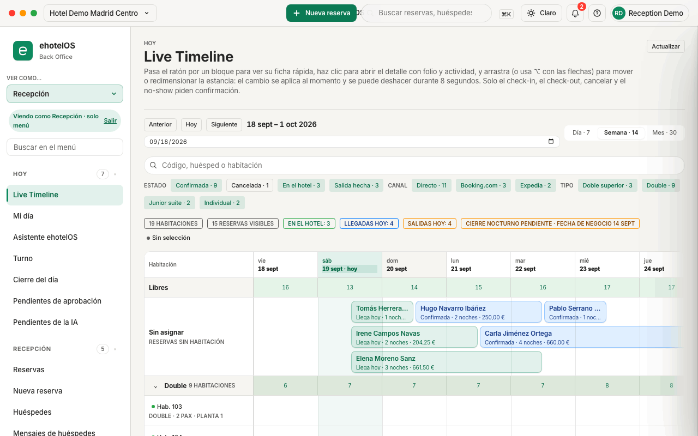

### La pantalla, de arriba abajo

1. **Tarjeta de instrucciones.** La primera vez verás una tarjeta con el título «Live Timeline», una descripción («Reservas en el hotel y proyectadas por habitación en un calendario…»), cinco pasos numerados y un «Tip:» con el significado de los colores («son los mismos colores que en Mi día y en el tablero»). Ciérrala con «Cerrar instrucciones»: ehotelOS recuerda que la has cerrado en ese navegador. En la captura ya está cerrada.
2. **Botón «Actualizar»** (arriba a la derecha): vuelve a cargar habitaciones y reservas sin cambiar el periodo ni los filtros.
3. **Periodo y escala.** «Anterior» · «Hoy» · «Siguiente», el rango que estás viendo («18 sept – 1 oct 2026»), el campo «Ir a la fecha» (el formato depende de tu navegador) y la escala «Día · 7» / «Semana · 14» / «Mes · 30». Al abrir la pantalla estás en «Semana · 14» y el periodo empieza **el día anterior a hoy**, para que veas también las estancias que terminan hoy. Mientras carga un periodo aparece «Cargando periodo…».
4. **Buscador y filtros** (grupo «Filtros del Live Timeline»). El cuadro «Código, huésped o habitación» y tres grupos de chips: «ESTADO» («Confirmada · 9», «Cancelada · 1», «En el hotel · 3», «Salida hecha · 3»), «CANAL» («Directo · 11», «Booking.com · 3», «Expedia · 2») y «TIPO» («Doble superior · 3», «Double · 9», «Junior suite · 2», «Individual · 2»). Cada chip lleva su recuento en el periodo; solo se listan los estados, canales y tipos que existen en él. Cuando hay algo cambiado aparece «Limpiar filtros».
5. **Contadores.** «19 HABITACIONES · 15 RESERVAS VISIBLES · EN EL HOTEL: 3 · LLEGADAS HOY: 4 · SALIDAS HOY: 4» y, a la derecha, «Sin selección» o «Selección: RES-18399 · Marc Vidal Puig» cuando has seleccionado una barra. «EN EL HOTEL» cuenta las reservas alojadas del periodo; «LLEGADAS HOY» las que llegan hoy (confirmadas o ya alojadas); «SALIDAS HOY» las que salen hoy (alojadas o con la salida ya hecha).
6. **Aviso «CIERRE NOCTURNO PENDIENTE · FECHA DE NEGOCIO 14 SEPT».** Aparece cuando la fecha de negocio del hotel va por detrás del día real porque no se ha ejecutado el cierre del día. En ese caso «hoy» en esta pantalla (la columna resaltada, «LLEGADAS HOY», «SALIDAS HOY», los colores «Llega hoy» y «Sale hoy») es **el día real**, la misma regla que usa el check-in.
7. **La parrilla** (región «Live Timeline de reservas por habitación»).
   - Cabecera con un día por columna (día de la semana y fecha); hoy va resaltado con «· hoy» y los fines de semana en fondo gris. La cabecera y la columna «Habitación» se quedan fijas al desplazarte.
   - Fila **«Libres»**: habitaciones libres cada día, sumando todos los tipos; la celda cambia de color cuando quedan pocas (un 20 % o menos de las vendibles) o ninguna.
   - Carril **«Sin asignar» · «RESERVAS SIN HABITACIÓN»**: las reservas del periodo que todavía no tienen habitación. Desde aquí se asignan (ver [Abrir el detalle](#abrir-el-detalle-con-folio-y-actividad)).
   - Una fila de **grupo por tipo de habitación** («Double · 9 HABITACIONES») con las libres de ese tipo por día; el botón «⌄» / «›» pliega o despliega el grupo.
   - Una fila por **habitación**: «Hab. 103 · DOUBLE · 2 PAX · PLANTA 1». El punto de color delante del número es el estado de la habitación (pasa el ratón por él para leerlo): «Limpia», «Sucia», «Inspeccionada», «Ocupada», «Bloqueada» o «Fuera de servicio». Una habitación bloqueada por mantenimiento lleva además la etiqueta «BLOQUEADA» y su carril aparece rayado (la 108 en la demo): no se puede soltar una reserva encima.
   - Las **barras**: nombre del huésped y, debajo, «estado · noches · importe» («En el hotel · 2 noches · 288,00 €», «Llega hoy · 1 noche…», «Sale hoy · 2 noches · 266,00 €»). Empiezan y acaban a media celda, así dos estancias seguidas en la misma habitación no se pisan. Un «‹» delante del nombre indica que la estancia empezó antes del periodo visible (y «›» detrás, que termina después).
   - En hoteles grandes la parrilla solo dibuja las filas que caben en pantalla y va pintando las demás al desplazarte (en el Hotel UXDAY, 60 habitaciones).
8. **Leyenda** al pie: «LLEGA HOY · EN EL HOTEL · SALE HOY · CONFIRMADA · BORRADOR · Salida hecha · NO-SHOW · CANCELADA · BLOQUEADA · MANTENIMIENTO».

### Elegir el periodo

1. Elige la escala: «Día · 7» para ver la semana con más detalle, «Semana · 14» (por defecto) o «Mes · 30» para planificar.
2. Muévete con «Anterior» y «Siguiente» (avanzan o retroceden un periodo completo) o escribe una fecha en «Ir a la fecha».
3. Pulsa «Hoy» para volver al periodo que incluye hoy.

**Resultado esperado.** El rango de la cabecera cambia y los recuentos de los chips y de «RESERVAS VISIBLES» se recalculan para el nuevo periodo. La selección y los filtros se mantienen.

### Encontrar una reserva

1. Escribe en «Código, huésped o habitación» parte del nombre (sin distinguir mayúsculas ni acentos), el código («RES-18399») o el número de habitación («201»); también encuentra por quien hizo la reserva o por la empresa. No hace falta pulsar Intro: la parrilla se filtra al momento y solo quedan las barras que coinciden («1 RESERVA VISIBLE»).
2. O usa los chips, que funcionan como **interruptores encendidos por defecto**: al abrir la pantalla todos los estados, canales y tipos del periodo están activos (salvo «Cancelada», que está apagado), y pulsar un chip **apaga** ese estado, canal o tipo y oculta sus reservas. Para quedarte **solo con las alojadas** apaga «Confirmada · 9» y «Salida hecha · 3» y deja «En el hotel · 3» encendido. Dentro de un grupo, cada chip encendido suma sus reservas (dos canales encendidos = reservas de cualquiera de los dos) y entre grupos se cruzan: una reserva solo se dibuja si su estado, su canal y su tipo están los tres encendidos.
3. Pulsa «Limpiar filtros» (aparece en cuanto cambias algo) para volver al estado inicial: todo encendido y las canceladas ocultas.

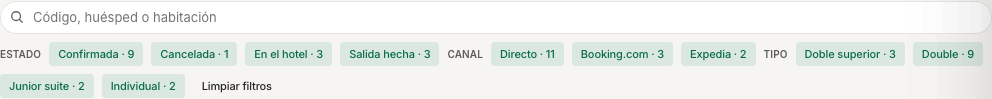

**Resultado esperado.** «RESERVAS VISIBLES» baja según lo que apagues (o sube al encender «Cancelada»); las habitaciones sin coincidencias se quedan vacías. Si apagas todo, ves el aviso «Sin reservas que coincidan» («Ninguna reserva del periodo pasa los filtros o la búsqueda; las habitaciones se muestran vacías.») con el botón «Limpiar filtros».

> **Nota:** «Cancelada · 1» es el único chip **apagado** por defecto, porque las reservas **canceladas** no se dibujan hasta que lo enciendes. Al encenderlo, «RESERVAS VISIBLES» las suma, pero una cancelada que **no tenía habitación asignada** sigue sin dibujarse: el carril «Sin asignar» solo muestra reservas vivas. Para verla, ve a Menú › Recepción › Reservas › «Canceladas».

### Consultar la ficha rápida

1. Pasa el ratón por una barra (o llega a ella con el teclado) sin hacer clic.

**Resultado esperado.** Se abre la tarjeta «Ficha rápida de la reserva» junto a la barra: las iniciales del huésped en el color de su estado, el nombre y el código, tres chips (estado, canal y habitación: «En el hotel» · «BOOKING.COM» · «HAB. 201») y seis datos: «ENTRADA», «SALIDA», «NOCHES», «OCUPACIÓN» («1 ad.», «2 ad. · 1 niño»), «IMPORTE» y «SEGMENTO» («—» si no está informado). Abajo, «HAZ CLIC PARA VER EL DETALLE». En una reserva alojada la tarjeta añade la línea «UNA RESERVA EN CASA SOLO PUEDE CAMBIAR DE HABITACIÓN» (vocabulario antiguo: «en casa» significa «en el hotel»). La ficha rápida no consulta nada al servidor: es inmediata y desaparece al retirar el ratón.

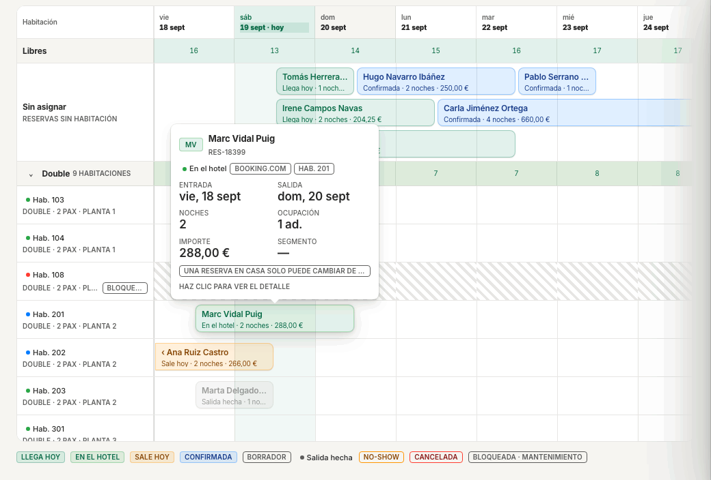

### Abrir el detalle con folio y actividad

1. Haz clic en una barra (o selecciónala y pulsa Intro).

**Resultado esperado.** La barra queda seleccionada (borde marcado, «Selección: RES-18399 · Marc Vidal Puig» arriba) y a la derecha de la parrilla se abre un **panel acoplado** que no tapa el resto: la parrilla sigue viva y puedes cambiar de reserva con las flechas. El panel muestra:

- Cabecera: código («RES-18399»), «Marc Vidal Puig · Hab. 201» (o «Ana Alfa · Sin habitación») y el botón «Cerrar».
- Chips de estado, canal, habitación y noches («EN EL HOTEL» · «BOOKING.COM» · «HAB. 201» · «2 NOCHES»; «Llega hoy · Directo · Sin habitación · 2 noches» en una llegada sin habitación).
- **«Huéspedes»**: «HUÉSPED PRINCIPAL» y «OCUPACIÓN»; si la reserva no tiene huésped, «Sin huésped registrado».
- **«Estancia y folio»**: «ESTADO» («En el hotel», «Confirmada»…), «ENTRADA», «SALIDA», «NOCHES», «TIPO», «HABITACIÓN» («Hab. 201» o «Sin asignar»), «CANAL», «IMPORTE TOTAL», «SALDO PENDIENTE», «COBROS» y «ACTIVIDAD ABIERTA». En la captura el saldo pendiente es «18,00 €» y los cobros «6,50 €»; si la reserva aún no tiene folio, verás «Sin folio».
- **«Actividad reciente»**: los últimos eventos de limpieza, mantenimiento y mensajes de esa reserva («Limpieza · Stayover · ABIERTA»); «Sin actividad» si no hay ninguno.
- **«Ir a»**: «Recorrido del huésped», «Folio y facturación» (abre el folio en Finanzas › Facturación y cobros), «Limpieza», «Mantenimiento» y «Mensajes».
- **«Acciones»**: «Check-in», «Check-out», «Asignar habitación» (o «Cambiar habitación» si ya tiene), «Cancelar reserva», «Marcar no-show» y «Abrir reserva» (la ficha completa). Solo se activan las que tienen sentido para el estado: en una reserva **confirmada sin habitación**, «Check-in» y «Check-out» están desactivados y quedan «Asignar habitación», «Cancelar reserva», «Marcar no-show» y «Abrir reserva»; en una **alojada**, «Check-out», «Cambiar habitación» y «Abrir reserva». El check-in, el check-out, cancelar y el no-show abren su confirmación (los mismos cajones y diálogos de esta guía); asignar y cambiar de habitación se aplican al momento con «Deshacer».

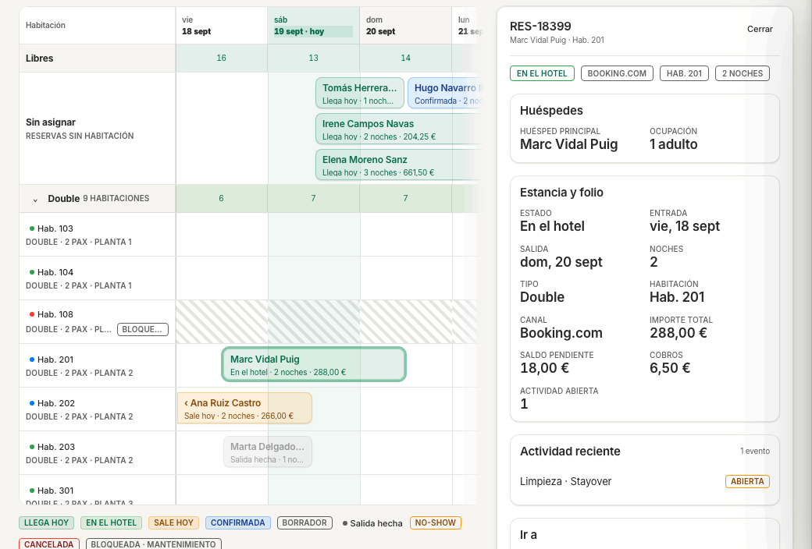

2. Cierra el panel con «Cerrar», con Esc o haciendo clic en otra barra (el panel cambia a esa reserva).

### Mover o redimensionar una estancia (arrastrar o ⌥ con las flechas)

Lo que la pantalla permite hacer, según su subtítulo, la tarjeta de instrucciones y las pruebas automáticas (`timeline.spec.ts`); **no se ha ejecutado** ningún movimiento en esta guía:

- **Mover** una barra a otra habitación (arrastrándola hacia arriba o abajo, o con **⌥↑ / ⌥↓**) o a otras fechas (hacia los lados, o con **⌥← / ⌥→**, un día por pulsación). En tablet, mantén pulsada la barra un instante antes de arrastrar.
- **Cambiar la entrada o la salida** estirando los bordes de la barra (los asideros aparecen en los extremos) o con **⌥⇧← / ⌥⇧→**.
- El cambio **se aplica al momento, sin diálogo**, y aparece un aviso con **«Deshacer»** durante 8 segundos (también **⌘Z** mientras dura). Si lo que has movido es una reserva **alojada**, deshacer es un traslado nuevo: la habitación intermedia queda sucia y con su tarea de limpieza.
- Lo que no se puede hacer, la pantalla lo rechaza al soltar (o al pulsar la tecla) con un mensaje y sin cambiar nada: «Una reserva en casa solo puede cambiar de habitación» (una alojada no cambia de fechas: se hace desde su ficha… donde tampoco: ver [Qué no hace todavía](#qué-no-hace-todavía)), «La reserva está cerrada» (salidas hechas, canceladas y no-show no se mueven), «La habitación está bloqueada por mantenimiento o no es vendible» y «La habitación está ocupada actualmente».
- Para **cancelar un arrastre** antes de soltar, pulsa **Esc**: la barra vuelve a su sitio.

> **Nota:** el Live Timeline no recalcula el precio al mover una reserva de fechas: revisa la tarifa en la ficha de la reserva.

### Crear una reserva desde celdas vacías

1. En la fila de una habitación libre, haz clic en la celda del día de llegada y arrastra hasta la celda del día anterior a la salida (dos celdas = dos noches).
2. Se abre un diálogo con el resumen («Hab. 103 · Double · 20–22 sept · 2 noches») y «Crear reserva» te lleva a Menú › Recepción › Nueva reserva con la habitación, el tipo y las fechas ya rellenos; «Cancelar» (o Esc) no hace nada.

**Resultado esperado.** El diálogo solo prepara el formulario: la reserva no existe hasta que la confirmas allí. Este paso se comprobó en la primera versión de esta guía y no se ha repetido tras la tanda UX-1.

### Atajos de teclado del Live Timeline

Con el foco en una barra (llega con Tab: la barra activa es la única parada de tabulación de la parrilla). Estos siete atajos no figuran en ninguna hoja de la aplicación: el Live Timeline no tiene ayuda «?» propia, el «?» de la barra superior abre el Centro de ayuda general (sin ellos) y la hoja ⌘/ tampoco los incluye. Solo los encuentras en el subtítulo de la pantalla (arrastrar o ⌥ con las flechas) y en esta tabla:

| Teclas | Qué hacen |
|---|---|
| ← → ↑ ↓ | Moverse entre reservas: ← → entre barras de la misma fila, ↑ ↓ a la barra de la fila de arriba o de abajo. La selección y el contador «Selección: …» siguen al foco; las flechas nunca abren el detalle. |
| Intro (o Espacio) | Abrir el detalle de la barra seleccionada (el panel toma el foco para que Tab llegue a sus botones). |
| Esc | Cerrar el detalle o cancelar el arrastre. Un segundo Esc quita la selección («Sin selección»). |
| ⌥← ⌥→ | Mover la estancia un día hacia atrás o hacia delante (sin diálogo, con «Deshacer»). |
| ⌥⇧← ⌥⇧→ | Acortar o alargar la estancia un día (redimensionar). |
| ⌥↑ ⌥↓ | Cambiar a la habitación de arriba o de abajo. |
| ⌘Z | Deshacer el último cambio mientras dura el aviso «Deshacer». |

### Colores y vocabulario de estados

El color de cada barra es su estado. La leyenda al pie de la parrilla y el «Tip» de la tarjeta lo resumen: «llega hoy, en el hotel, sale hoy, confirmada, borrador, no-show o cancelada (las canceladas solo se ven si activas su filtro)». Además del color, los borradores se dibujan con trazo discontinuo, las salidas hechas atenuadas y los no-show punteados y tachados. Es el mismo vocabulario que usan Mi día, la lista y la ficha:

| Estado | Color | Qué significa |
|---|---|---|
| Llega hoy | verde | Confirmada con llegada hoy y sin check-in todavía |
| En el hotel | verde oscuro | Con check-in hecho; solo puede cambiar de habitación |
| Sale hoy | ámbar | Alojada con salida hoy y sin check-out todavía |
| Salida hecha | gris, atenuada | Check-out hecho; no se mueve |
| No-show | ámbar, tachada | No se presentó; no se mueve |
| Cancelada | rojo | Solo se dibuja con el chip «Cancelada» activo; no se mueve |
| Confirmada | azul | Reserva futura confirmada |
| Borrador | gris, discontinua | Reserva sin confirmar |

La leyenda añade «BLOQUEADA · MANTENIMIENTO» para el carril rayado de una habitación bloqueada. Los estados de habitación del punto de color son «Limpia · Inspeccionada · Sucia · Ocupada · Bloqueada · Fuera de servicio»; el detalle está en [Pisos y mantenimiento](40-pisos-mantenimiento.md). Quedan dos restos del vocabulario antiguo, ambos textos de la aplicación: la línea «UNA RESERVA EN CASA SOLO PUEDE CAMBIAR DE HABITACIÓN» de la ficha rápida y el mensaje «Una reserva en casa solo puede cambiar de habitación» al soltar una alojada en otras fechas.

### Alerta de sobreventa

Si algún día del periodo hay más reservas confirmadas o alojadas que habitaciones vendibles de un tipo, encima de la parrilla aparece un aviso rojo «n días con overbooking» con una línea por día y tipo («<día> · <tipo>: n reservas / n vendibles») y el botón «Ir al día», que coloca el periodo sobre esa fecha. Si además dos reservas se solapan en la misma habitación, el aviso lo cuenta («n solapes en la misma habitación»). En la demo no hay sobreventa, así que no aparece en las capturas; en la fila «Libres» y en las filas de grupo, un día en sobreventa se ve con número negativo y fondo rojo.

### Errores frecuentes en el Live Timeline

| Lo que ves | Qué pasa y qué hacer |
|---|---|
| «Sin reservas que coincidan» | Los filtros o la búsqueda no dejan pasar ninguna reserva del periodo. Pulsa «Limpiar filtros». |
| «Sin reservas en este periodo» («No hay reservas que toquen estas fechas…») | No hay reservas en esas fechas. Pulsa «Ir a hoy» o cambia el periodo. |
| «Sin datos para mostrar» | La propiedad no tiene habitaciones cargadas ni reservas en el periodo. Si es un hotel nuevo, faltan las habitaciones (las da de alta dirección en Configuración › Habitaciones y espacios). |
| «No se pudo cargar el Live Timeline» / «No se pudo actualizar el Live Timeline.» | Fallo de red o del servidor. Pulsa «Actualizar»; si persiste, avisa a quien administra ehotelOS. |
| «Datos desactualizados desde <hora>» con «Reintentar» | La última actualización falló y estás viendo datos anteriores. Pulsa «Reintentar». |
| «Tu perfil no puede leer reservas» («Pide acceso a dirección para ver el Live Timeline.») | Tu plantilla no incluye la lectura de reservas. No pasa con «Recepción»; si lo ves, tu usuario tiene otra plantilla. |
| «Nombres de huésped no visibles» y barras con «Huésped no visible» | Tu plantilla no puede leer fichas de huésped. Pide acceso a dirección. |
| Barras con «Huésped pendiente» | Los nombres se están cargando. Espera un momento; si no cambia, «Actualizar». |
| Barras con «Sin huésped» | La reserva no tiene huésped principal registrado. Ábrela y añade el huésped desde su ficha. |
| Al soltar una barra: «Una reserva en casa solo puede cambiar de habitación» | Una reserva alojada no cambia de fechas desde aquí. |
| Al soltar: «La habitación está ocupada actualmente» / «…bloqueada por mantenimiento o no es vendible» / «La reserva está cerrada» | Esa habitación no está disponible o esa reserva ya no se mueve. Elige otra fila o déjala como está. |
| «CIERRE NOCTURNO PENDIENTE · FECHA DE NEGOCIO …» | No es un error: falta ejecutar el cierre del día. Ver [Turno y cierre del día](#turno-y-cierre-del-día). |

## Atajos de teclado

Tres capas: la búsqueda y los comandos con **⌘K**, la navegación con **⌥ + letra** y las **teclas de acceso** que aparecen al mantener ⌥. En Windows y Linux, ⌘ es **Ctrl** y ⌥ es **Alt**. La hoja **«Atajos de teclado»** (**⌘/**, también desde el Centro de ayuda «?») lista todos en ocho secciones: «Global», «Navegación con ⌥», «Teclas de acceso», «Cobro», «Paleta de comandos», «Pestañas de una pantalla», «Recorrido guiado» y «Modo prueba».

### ⌘K: buscar y ejecutar comandos de la pantalla

1. Pulsa **⌘K** (Ctrl+K) o el botón «Abrir la búsqueda (⌘K)» de la barra superior (el cuadro «Buscar reservas, huéspedes…»).

**Resultado esperado.** Se abre la paleta de búsqueda, sin título: un cuadro con el marcador «Buscar reserva, huésped, habitación, factura, pantalla o comando…» (el lector de pantalla lo anuncia como «Buscar (escribe al menos 2 caracteres)» dentro del diálogo «Buscar en la aplicación») y debajo la lista de resultados. **Sin escribir nada**, la primera sección es **«Esta pantalla»**, con los comandos de la página donde estás (en Mi día: «Actualizar recepción», «Walk-in», «Crear reserva», «Buscar por nombre o habitación», «Abrir Live Timeline», cada uno con su atajo), y después las secciones del menú («Hoy», «Recepción»…) y «Acciones» («Abrir el centro de ayuda», «Ver avisos», «Cambiar de propiedad»). ↑ ↓ mueven la selección, Intro abre el resultado o ejecuta el comando, Esc cierra.

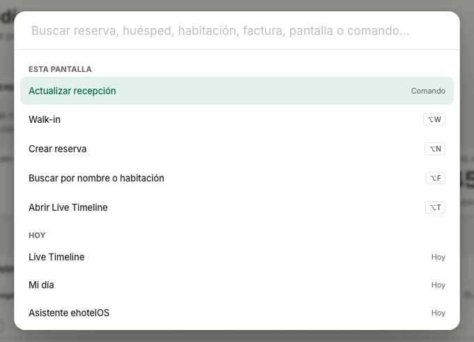

2. Escribe dos letras o más («Zeta»): los resultados se agrupan por «Reservas» («UXDAY-T6 · En el hotel · Clara Zeta · 18 sept → 20 sept · Directo», y debajo la acción «Cobrar UXDAY-T6 · Acción»), «Huéspedes» («Clara Zeta · ES · UX000013»), habitaciones, facturas y pantallas. En la ficha de una reserva, «cargo» ofrece el comando «Añadir cargo en UXDAY-T6».

### ⌥ + letra: ir a una pantalla

| Teclas | Qué hacen |
|---|---|
| ⌥H | Ir a Mi día (`/hoy`) |
| ⌥R | Ir a Reservas (`/recepcion/reservas/lista`) |
| ⌥N | Abrir Nueva reserva (`/recepcion/reservas/nueva`) |
| ⌥T | Abrir el Live Timeline (`/hoy/live-timeline`) |
| ⌥B | Abrir el tablero de habitaciones (`/recepcion/reservas/tablero`) |
| ⌥F | Ir al buscador de la pantalla (Mi día, lista, huéspedes…); si la pantalla no tiene, abre ⌘K |
| ⌥W | Alta de walk-in (en Mi día abre el cajón «Walk-in»; fuera, abre Nueva reserva) |

### ⌥ mantenido: teclas de acceso

Mantén **⌥** pulsada y cada botón con tecla de acceso muestra su letra al lado; ⌥ + esa letra lo ejecuta. Comprobado en esta guía: en el panel de detalle de Mi día, **C** = «Hacer check-in» y **O** = «Abrir ficha completa»; en la ficha de reserva, **C** = la acción principal (si la hay), **M** = «Asignar habitación» / «Cambiar habitación» y **P** = «Cobrar…» cuando aparece como botón («Más ▾» no tiene letra); en Nueva reserva, **D** depósito · **I** check-in · **C** crear. En los cobros, **⌥1** efectivo · **⌥2** tarjeta (datáfono) · **⌥3** transferencia, e **Intro** cobra con el foco en el importe. ⌥ + letra **no actúa mientras el cursor está en un campo de texto** (buscador, notas, importes): sal del campo con Tab o Esc. Con una casilla de selección enfocada sí funciona (comprobado: ⌥W abre el walk-in y ⌥C el check-in del panel).

### Otros atajos generales

**Intro** confirma la acción principal en los campos de una línea de un diálogo o panel (check-in, check-out, walk-in, nueva reserva, cambiar habitación, cancelar, cargo, cobro); **Esc** cierra el panel, diálogo o menú abierto; **⌘,** abre las preferencias de apariencia; en las pestañas de una pantalla, **← →** cambian de pestaña, **Inicio / Fin** van a la primera o última e **Intro / Espacio** la abren. Los atajos generales de la aplicación están en [Primeros pasos](00-primeros-pasos.md).

## Errores frecuentes

Los del Live Timeline están en su [propia tabla](#errores-frecuentes-en-el-live-timeline). Los mensajes generales de la aplicación («Sin acceso», «Demasiadas peticiones», «No se pudo cargar…») están también en las [preguntas frecuentes](faq.md).

| Lo que ves | Qué pasa y qué hacer |
|---|---|
| «La habitación no está lista. Cambia de habitación o marca «Hacer check-in igualmente» con un motivo.» (pie del cajón de check-in, botón desactivado) | La habitación está «Sucia» (o no está limpia). Pulsa «Cambiar a la 101» (la sugerencia), elige otra limpia o activa el interruptor y escribe el motivo. |
| «Indica el motivo del check-in fuera de ventana.» | Estás forzando un check-in fuera de la ventana del hotel (día de negocio y siguiente): hace falta el permiso de modificar reservas y un motivo. Si no lo tienes, pide a dirección o jefatura que lo haga. |
| «Asigna una habitación primero.» (pie del cajón de check-in, botón desactivado) | El desplegable «Cambiar habitación» está en «Sin asignar». Elige una habitación limpia y libre en el desplegable (desde Mi día, «Check-in en 101» ya la trae elegida). |
| «Sin habitación válida para el check-in.» | No sale del cajón de check-in: lo devuelve Reservas › Importar (sincronización de reservas) cuando una fila llega como ya alojada sin habitación válida. La reserva queda «Confirmada»: alójala después desde Mi día. |
| «Saldo pendiente detectado» con «Cobrar <importe> y cerrar» · «Salir con saldo pendiente» · «Cancelar» (cajón de check-out) | El servidor ha encontrado saldo que el cajón no tenía («Saldo pendiente de X € en la reserva …: cobra el saldo o confirma el check-out con saldo pendiente»). Cobra, o deja salir con saldo si el hotel lo permite. |
| «El folio tiene n cargos por X € sin facturar: emite la factura … antes de cerrarlo.» | El folio no se puede cerrar con cargos sin facturar (texto con detalles técnicos). En el check-out elige «Borrador para Facturación» o «Emitir ahora con número»; desde la ficha, «Documentos» › «Factura a huésped» / «Factura a empresa». |
| «La reserva … no se puede pasar a cancelled estando checked_in.» (estados en inglés) | Solo una reserva viva (confirmada) se cancela o se marca no-show; una alojada se cierra con el check-out. |
| «La reserva … cambió de estado mientras se procesaba (…): vuelve a cargarla.» | Otra persona ha actuado sobre la misma reserva. Pulsa «Actualizar» y revisa. |
| «La llegada es anterior a hoy.» (nueva reserva; el servidor añade «La llegada 2026-09-18 es anterior a hoy (2026-09-19): comprueba las fechas…») | Corrige la fecha de llegada. Registrar una llegada pasada exige el permiso de modificar reservas. |
| «Sin disponibilidad para esas fechas y ocupación.» / «Sin tarifa publicada para esas noches: indica el importe total.» / «Precio de relleno: alguna noche no tiene tarifa publicada…» | No hay habitaciones libres del tipo, o no hay tarifa para alguna noche. Cambia fechas o tipo, o escribe «Precio total (€)». |
| «Autorizar con PIN de supervisor» (al renunciar a una penalización, devolver un cobro o anular una factura por encima de tu tramo) | La acción exige aprobación: pide a quien tenga PIN de supervisor que lo escriba en el diálogo. |
| «Módulo no activado · Esta función pertenece a un módulo que no está activo en la propiedad.» | Has entrado en una pantalla de un módulo apagado (por ejemplo «Arqueo de caja» sin punto de venta). Pulsa «Ir a mi página de inicio»; la activación la decide dirección. |
| «No puedes cerrar todavía: n llegadas pendientes, n folios abiertos con saldo, n salidas sin check-out.» | El cierre del día tiene bloqueos. Resuélvelos desde «Abrir cola operativa» (check-in, no-show, cobro, check-out) y vuelve. |
| «Sin acceso» («Tu perfil no tiene permiso para ver esta pantalla. Pide acceso a dirección.») | Tu plantilla no tiene esa pantalla. No pasa con «Recepción» en las pantallas de esta guía. |
| «Demasiadas peticiones. Reintenta en unos segundos.» | Límite de peticiones por usuario. Espera unos segundos y repite; no pulses «Actualizar» en cadena. |

## Qué no hace todavía

Pendientes conocidos con dueño en la tanda UX-1 (`docs/audits/TANDA-UX1-RECEPCION-2026-09-19.md` §9-§10), tal como están hoy:

- **Sin «Deshacer» del check-in.** Tras «Hacer check-in» no hay vuelta atrás desde la pantalla; un error de saldo se corrige con el aviso del servidor. Tampoco tiene «Deshacer» la **primera asignación** de habitación desde la cola de Mi día (sin habitación anterior a la que volver).
- **El folio del walk-in nace sin el cargo de alojamiento**: lo asienta el cierre del día, y hasta entonces el cobro del walk-in figura como «anticipo».
- **Fechas de una reserva alojada.** Ni la ficha ni el Live Timeline permiten cambiar la salida de un huésped alojado («Con el huésped alojado el API solo admite el cambio de habitación (REC-03).»): hoy solo se cambia de habitación.
- **Factura al check-out.** Por defecto queda como «Borrador para Facturación»; «Emitir ahora con número» entra en la cadena VeriFactu del hotel (en los hoteles de prueba, en sandbox).
- **⌥ + letra no actúa mientras el cursor está en un campo de texto** (buscador, notas, importes): sal del campo con Tab o Esc. Con una casilla de selección enfocada sí funciona (comprobado con ⌥W y ⌥C). El menú «Columnas» de la lista no limita su alto ni cambia de lado en pantallas pequeñas.
- **⌘K no tiene «Tarea siguiente» ni «Exportar sesión de prueba»** (existen solo como ⌘⇧T / ⌘⇧E con el modo prueba activo).
- **Cuentas del Hotel UXDAY sin permisos de pisos**: no marcan habitaciones limpias ni bloquean; para esas tareas se usa el hotel de demostración.
- **IA sin modelo de lenguaje.** «Dictar (IA)», «Mensajes de huéspedes», «Pendientes de la IA» y el «Asistente ehotelOS» funcionan por reglas; los borradores los confirma siempre una persona.
- **SES.Hospedajes en modo de pruebas**; el Hotel UXDAY no tiene el envío configurado (el cajón de check-in lo avisa y se queda abierto).
- **Fecha de negocio atrasada en el hotel de demostración** (14/09/2026): «LLEGADAS HOY» y «SALIDAS HOY» se calculan con la fecha real hasta que se ejecuten los cierres pendientes.
- **Textos de la aplicación con jerga que verás tal cual**: «Firma digital aplicada con sello "sig_drawer_checkin".» y «Política de cancelación: FLEX24.» (cajón de check-in); «…el API solo admite el cambio de habitación (REC-03).» y «…el API no admite cambios en la reserva salvo la habitación.» (ficha alojada); «Late checkout sin resolver» y «Late check-out» (cola); «Prioridad high · open» y «Saldo abierto · €743.00 sin cobrar» (Turno); «Maintenance», «· open · high» (Actividad de la reserva); «room · 2x», «minibar» (líneas del folio en el check-out); «PASSPORT» (tipo de documento); «conv_maria», «guest_maria», «app» (Mensajes); «UNA RESERVA EN CASA SOLO PUEDE CAMBIAR DE HABITACIÓN» (ficha rápida) y «Una reserva en casa solo puede cambiar de habitación» (Live Timeline); «cancelled», «checked_in» en el mensaje de estado no válido; el cronómetro «0:02» de los cajones; los botones «Walk-in ⌥W» y «Nueva reserva ⌥N» de Mi día ligeramente recortados.
- **Módulos y pestañas que no ves con «Recepción»:** «Punto de venta» (módulo a activar: «Arqueo de caja» acaba en «Módulo no activado»), «Cupos» de Grupos y eventos, «Ofertas» y «Portal del huésped» de Ventas adicionales, y la pestaña «Correo entrante» de Comunicaciones.
- **«Ver como…»** es solo para cuentas administradoras y no cambia permisos: sirve para ver el menú de un perfil, no para actuar como él.

## Ver también

- [Primeros pasos](00-primeros-pasos.md) — acceso, menú y «Ver como…», ⌘K, cambiar de hotel, ayuda in-app, vocabulario y atajos.
- [Pisos y mantenimiento](40-pisos-mantenimiento.md) — estados de habitación, tareas de limpieza y partes de mantenimiento que ves desde «Limpieza» y «Mantenimiento» en el panel del Live Timeline y en la cola de Mi día.
- [Administración y contabilidad](20-administracion.md) — folios, cobros, facturas, VeriFactu y partes de viajeros.
- [Dirección](10-direccion.md) — cierre del día y Mi día de dirección.
- [Comercial y revenue](50-comercial-revenue.md) — planes de tarifas, políticas de cancelación, grupos y cupos, canales.
- [Preguntas frecuentes](faq.md) — mensajes de error habituales y su solución.
- [Fichas rápidas](formacion/fichas/README.md) — una página por tarea: entrada de huésped, salida y cobro, nueva reserva, cambio de habitación, cierre del día, parte de viajeros.
