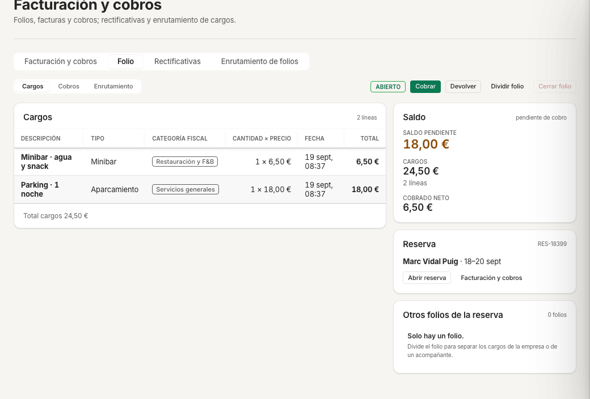

# Ficha · Salida y cobro (check-out) · ehotelOS

> **Provisional (UX-1):** se completa en DOC-2 tras la tanda UX-1 (que cambia estas pantallas hoy)

**Perfil:** Recepción · Jefatura de recepción (plantillas «Recepción», «Jefatura de recepción»); el cobro y la factura también los hace «Administración de hotel».

## Objetivo

Cerrar la estancia de un huésped alojado: revisar los cargos del folio, cobrar el saldo pendiente, emitir la factura si el huésped la pide y marcar la salida para que la habitación pase a pisos.

## Antes de empezar

- El huésped está «En el hotel» («ALOJADA» en la lista) y sale hoy («Sale hoy» en el Live Timeline; «Check-out pendiente · Hab. 202» en Mi día).
- Sabes cómo va a pagar: en la demo solo funcionan «Efectivo», «Tarjeta (datáfono)» y «Transferencia» («Tarjeta en línea» y «Enlace de pago» avisan «pasarela no configurada»).
- Si el cliente necesita factura completa, tienes su NIF y su razón social.

## Pantalla de partida

- **Menú › Hoy › Mi día** (`/hoy`): la acción «CHECK-OUT PENDIENTE · Check-out pendiente · Hab. 202» con el botón «Hacer check-out» (si el folio está saldado dice «Folio saldado. Pulsa para hacer check-out.»), y la lista «Salidas (n)».
- **Menú › Recepción › Reservas** (`/recepcion/reservas/lista`), pestaña «Salen hoy (n)» › reserva › «Detalle» (`/recepcion/reservas/:id`): el bloque «Importes» muestra «TOTAL DE LA RESERVA», «SALDO PENDIENTE», «CARGOS» y «COBRADO NETO» con los botones «Cobrar» y «Devolver»; la acción «Check-out» cierra la estancia; «Centro de facturación» abre Finanzas.
- **Menú › Finanzas › Facturación y cobros** (`/finanzas/facturacion`): elige la reserva en «Folio de la reserva», revisa «Cargos (n)» y «Cobros (n)», pulsa «Registrar pago» y crea la factura desde «Borrador de factura» (ficha [07 · Emitir una factura](07-emitir-factura.md)). «Abrir folio» muestra el folio completo con «Cobrar», «Devolver», «Dividir folio» y «Cerrar folio».

## Resultado esperado

- «SALDO PENDIENTE» del folio en «0,00 €» y el cobro en «Cobros (n)» (y en «Tesorería › Últimos cobros»).
- La reserva pasa a «Salida hecha» («Salida» en el Live Timeline, «salida» en el buscador de facturación) y la habitación queda «Sucia» con la tarea «Salida (limpieza)» en el tablero de pisos.
- Si has emitido factura, aparece en «Emitidas (n)» / «Pagadas (n)» con su número («FAC-2026-…» o «SIM-2026-…») y su envío en «Cumplimiento › Envíos a autoridades».

## Si algo falla

| Lo que ves | Qué hacer |
|---|---|
| El check-out no se completa porque queda saldo | Cobra primero («Cobrar» / «Registrar pago») o regulariza el cargo; ehotelOS no cierra una estancia con saldo pendiente. |
| «Tarjeta en línea y enlace de pago no disponibles: pasarela no configurada.» | No hay proveedor de pagos conectado: usa efectivo, datáfono o transferencia. |
| «Devolver» pide un PIN | La devolución supera tu tramo: un supervisor presente la autoriza con «Mi PIN de supervisor». |

## Más detalle

- [70 · Recepción](../../70-recepcion.md) — capítulo «Check-out y cobro» (se completa en DOC-2).
- [20 · Administración](../../20-administracion.md) — capítulos 5 (facturación) y 6.1 (registrar un cobro en el folio).
