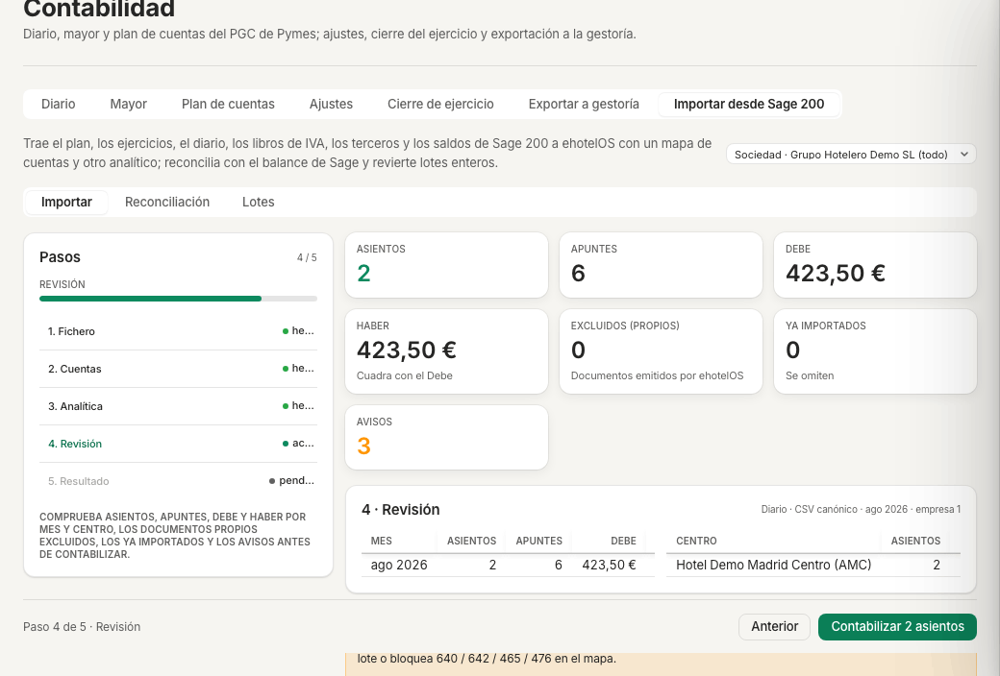

# Ficha · Importar desde Sage 200 · ehotelOS

**Perfil:** Contabilidad · Dirección financiera (plantillas «Contabilidad», «Dirección financiera»; menú «Finanzas»). «Administración de hotel» no ve «Contabilidad».

## Antes de empezar

- El fichero exportado de Sage 200 del periodo que vas a traer: el Excel del «Diario del mes con «Enviar a Excel» y desglose analítico», el CSV de asientos de 60 columnas o un CSV con la plantilla canónica. Un lote por mes o trimestre; «.xlsx · .csv · .txt · .json», máximo 20 MB, 250.000 filas y 20.000 asientos por lote; el XML «Datos contables» todavía no se admite.
- El balance de sumas y saldos de Sage del mismo periodo, si quieres reconciliar al contabilizar.
- La conformidad de la gestoría: los asientos importados entran en el diario de la sociedad con numeración propia.

> **Nota:** en el hotel de demostración recorre el asistente solo hasta la revisión y **no contabilices** ningún lote (la demo se usa en pruebas automáticas que comparan sus asientos).

## Pasos

1. Abre **Menú › Finanzas › Contabilidad** (`/finanzas/contabilidad`) y la pestaña «Importar desde Sage 200» (`/finanzas/contabilidad/importar-sage200`). La cabecera dice «FINANZAS · GRUPO HOTELERO DEMO SL» (el lote se contabiliza en la sociedad). Subpestañas «Importar · Reconciliación · Lotes»; asistente «1. Fichero · 2. Cuentas · 3. Analítica · 4. Revisión · 5. Resultado».
2. En «1 · Fichero» elige el «Tipo de lote»: «Plan de cuentas», «Ejercicios y apertura», «Diario», «Libros de IVA», «Clientes y proveedores» o «Sumas y saldos por periodo». Para los asientos del mes, «Diario».
3. Si preparas el fichero a mano, pulsa «Descargar plantilla canónica» (CSV con separador «;», UTF-8 con BOM; cabeceras `empresa;ejercicio;asiento;fecha;periodo;cuenta;debe;haber;concepto;documento;…;tipo_factura`).
4. Pulsa «Elegir fichero de Sage 200» y selecciona el fichero. El análisis es automático y el asistente pasa a «Paso 2 de 5: Cuentas».
5. **2 · Cuentas.** Resuelve cada cuenta de Sage sin mapear: cuenta existente del plan, subcuenta nueva, agrupar el tercero en 4300 / 400 / 410 o bloquear. Desmarca «Solo pendientes» para revisar el mapa completo; «Guardar mapa» conserva tus decisiones para los lotes siguientes; «Aplicar y continuar» avanza.
6. **3 · Analítica.** Elige la «Dimensión del centro de trabajo» («Canal · Delegación · Departamento · Sección · Proyecto») que identifica el hotel, la «Dimensión del centro de coste» (departamento USALI) y qué hacer con los «Apuntes de gasto o ingreso sin analítica» («Bloquear el lote hasta asignar centro», «Imputar a la oficina central», «Imputar a <hotel>»). «Aplicar y continuar».
7. **4 · Revisión.** Comprueba «ASIENTOS», «APUNTES», «DEBE», «HABER» («Cuadra con el Debe»), «EXCLUIDOS (PROPIOS)», «YA IMPORTADOS» y «AVISOS», las tablas «Asientos por mes» y «Asientos por centro», el bloque «Antes de contabilizar» y las «Opciones del lote» (casilla «Balance de sumas y saldos de Sage del mismo periodo» y «Notas del lote»).
8. Pulsa «Contabilizar n asientos» (solo en tu sociedad). Pasas a «5 · Resultado» con el resumen por asiento y, si marcaste el balance, la reconciliación.
9. Comprueba el lote en la subpestaña «Lotes» (desde ahí se revierte entero) y los asientos en «Diario» con origen «Diario importado de Sage 200»; «Reconciliación» compara Sage con el diario por cuenta y periodo.

## Resultado esperado

- Los asientos aparecen en «Contabilidad › Diario» con origen «Diario importado de Sage 200» y el número de Sage en la referencia; la numeración de ehotelOS queda intercalada (lo avisa «Antes de contabilizar»).
- «Lotes» lista el lote con su periodo y su resultado; en la demo sigue diciendo «Todavía no hay lotes importados desde Sage 200.».

> **En construcción:** los pasos 8 y 9 no se han ejecutado en la demo (contabilizar escribe en el diario); los pasos 1 a 7 se han recorrido con un CSV ficticio de dos asientos (guía 20, capítulo 3).

## Si algo falla

| Lo que ves | Qué hacer |
|---|---|
| El paso 2 muestra «n cuentas pendientes» | Resuélvelas una a una (cuenta existente, subcuenta nueva, agrupar o bloquear) antes de «Aplicar y continuar». |
| «EXCLUIDOS (PROPIOS)» o «YA IMPORTADOS» mayor que 0 en la revisión | Son facturas que ehotelOS ya emitió (se omiten para no duplicarlas) o un mes que ya se importó; no es un error. |
| El fichero no se acepta (XML, más de 20 MB o de 20.000 asientos) | Exporta a Excel o CSV y trocea por meses; para volúmenes mayores, la herramienta de línea de comandos del proveedor técnico. |

## Más detalle

- [20 · Administración](../../20-administracion.md) — capítulo 3 «Importar desde Sage 200» (con el CSV de ejemplo) y capítulo 2 (diario y anulaciones).
