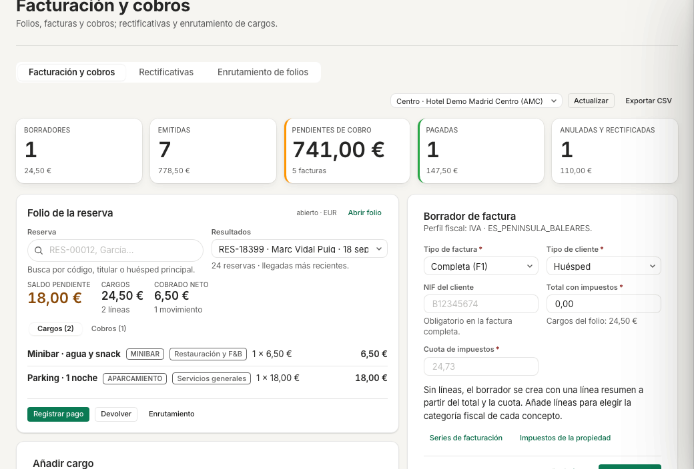

# Ficha · Emitir una factura · ehotelOS

**Perfil:** Administración de hotel · Contabilidad · Dirección financiera (plantillas «Administración de hotel», «Contabilidad», «Dirección financiera»); recepción también ve «Facturación y cobros».

## Antes de empezar

- La reserva y su folio con todos los cargos (alojamiento, minibar, aparcamiento…). Si falta alguno, se añade antes de facturar.
- Para una factura completa (F1): el NIF y la razón social del cliente. Para una simplificada (F2) basta el huésped.
- VeriFactu en la demo está en **modo de pruebas**: la factura recibe huella y QR, pero el envío se marca «SIMULADO · NO ENVIADO». Emitir consume un número de serie: en la demo no emitas salvo que te lo pidan.

## Pasos

1. Abre **Menú › Finanzas › Facturación y cobros** (`/finanzas/facturacion`) y comprueba el centro («Centro · Hotel Demo Madrid Centro (AMC)»). Arriba ves «BORRADORES», «EMITIDAS», «PENDIENTES DE COBRO», «PAGADAS» y «ANULADAS Y RECTIFICADAS».
2. En «Folio de la reserva», escribe en «Reserva» el código, el titular o el huésped (por ejemplo `RES-18399`) y elige la reserva en «Resultados» («Elige una reserva»).
3. Revisa «SALDO PENDIENTE», «CARGOS» y «COBRADO NETO» y las listas «Cargos (n)» y «Cobros (n)». Si falta un cargo, usa «Añadir cargo» («Tipo*», «Concepto*», «Categoría fiscal*», «Cantidad*», «Precio bruto*» con impuestos incluidos). «Abrir folio» muestra el folio completo (`/finanzas/facturacion/folios/<id del folio>`) con «Cobrar», «Devolver», «Dividir folio» y «Cerrar folio».
4. Si queda saldo, cóbralo: «Registrar pago» abre la ventana «Cobrar · Reserva RES-…» con «Importe*», «Método*» («Efectivo», «Tarjeta (datáfono)», «Tarjeta en línea», «Transferencia», «Enlace de pago», «Otro») y «Referencia»; pulsa «Cobrar».
5. En «Borrador de factura» («Perfil fiscal: IVA · ES_PENINSULA_BALEARES.») elige «Tipo de factura*» («Completa (F1)» o «Simplificada (F2)») y «Tipo de cliente*» («Huésped», «Empresa», «Agencia»); en la completa rellena «NIF del cliente».
6. Si el folio mezcla tipos de IVA (minibar al 10 %, aparcamiento al 21 %), pulsa «Añadir línea» por cada concepto con su «Categoría fiscal»; si todo va a un tipo, basta «Total con impuestos*» y «Cuota de impuestos*». Pulsa «Crear borrador»: aviso «Borrador creado (24,50 €). Emítelo desde su detalle.» y «Borradores (1)».
7. En la lista «Borradores (n)» pulsa «Ver detalle»: la ficha muestra «Sociedad emisora», «Establecimiento», «Cliente», «Líneas de la factura», «Desglose de impuestos», «Total factura» y los botones «Cerrar» y «Emitir factura». El borrador no tiene número ni huella: aún puedes corregirlo.
8. Pulsa «Emitir factura». La emisión asigna el número de la serie del centro («FAC-2026-…» completa, «SIM-2026-…» simplificada), congela las líneas del folio, calcula la huella VeriFactu y contabiliza el asiento en la misma operación.
9. En el detalle de la factura emitida usa «Descargar PDF» (lleva el código QR de VeriFactu) o «Enviar por correo». Una factura emitida no se edita: para corregirla, «Rectificar»; para anularla, «Anular» con motivo.

## Resultado esperado

- La factura aparece en «Emitidas (n)» y en «Pendientes (n)» o «Pagadas (n)» según el cobro, con estado, número y «HUELLA VERIFACTU».
- En **Menú › Cumplimiento › Envíos a autoridades** (`/cumplimiento/envios`), pestaña «VeriFactu», la fila de la factura está «ACEPTADO» (en la demo, con la marca «SIMULADO · NO ENVIADO»).
- En «Contabilidad › Diario» aparece el asiento «Factura emitida» (4300 contra 705.x y 477.x).

> **En construcción:** a 19/09/2026 la ficha que abre «Ver detalle» en el paso 7 (la que tiene «Emitir factura») es un panel lateral que se abre pero **no se ve en pantalla** por el defecto de estilo de los cajones laterales; hasta que se corrija, la emisión no se puede completar desde la pantalla: pídela al proveedor técnico. La ventana «Cobrar» del paso 4 sí se ve y funciona (comprobado en la demo). Los pasos 8 y 9 no se han ejecutado en la demo: se describen según la pantalla y la guía de administración.

## Si algo falla

| Lo que ves | Qué hacer |
|---|---|
| «El tipo impositivo implícito (17,85 %) no es un tipo de IVA válido (21 o 10 %). Indica las líneas con su tipo o categoría, o ajusta el total y los impuestos.» | El folio mezcla tipos de IVA: pulsa «Añadir línea» y da a cada concepto su «Categoría fiscal». |
| «No se pudo cargar el folio» · «Folio no encontrado.» | Has usado el id de la reserva en la dirección: entra siempre por «Abrir folio» o desde el detalle de la reserva. |
| «TAX_NOT_CONFIGURED» al emitir | Faltan tipos vigentes en «Cumplimiento › Impuestos» para alojamiento, restauración y servicios generales: los revisa Cumplimiento o Dirección financiera. |

## Más detalle

- [20 · Administración](../../20-administracion.md) — capítulos 5 «Facturación y VeriFactu» (borrador, emisión, rectificativas, envíos) y 6.1 «Registrar un cobro en el folio».
