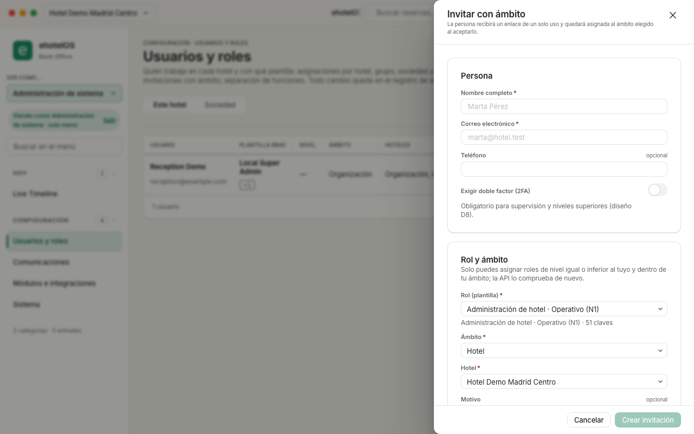

# Ficha · Dar de alta un usuario · ehotelOS

**Perfil:** Administración de sistema (plantilla «Administración de sistema») y dirección («Dirección de hotel», «Dirección de operaciones», «Dirección general»). Solo puedes asignar plantillas de nivel igual o inferior al tuyo y dentro de tu ámbito.

## Antes de empezar

- Nombre completo y correo electrónico de la persona (el correo será su usuario).
- La plantilla que le corresponde («Recepción», «Pisos», «Contabilidad»…) y el ámbito: «Hotel» para recepción, pisos, mantenimiento, punto de venta, comercial y dirección de hotel; «Sociedad» u «Organización» para contabilidad, RRHH, cumplimiento, revenue y dirección general. La tabla de plantillas (22 de organización más «Administración de sistema») está en la guía de sistemas.
- Un canal seguro para entregarle el enlace si el correo saliente no está configurado (en la demo no lo está).

## Pasos

1. Abre **Menú › Configuración › Usuarios y roles** (`/configuracion/usuarios`). Subtítulo: «Quién trabaja en cada hotel y con qué plantilla: asignaciones por hotel, grupo, sociedad u organización; invitaciones con ámbito; separación de funciones. Todo cambio queda en el registro de auditoría.».
2. Comprueba en las pestañas «Este hotel» y «Sociedad» que la persona no existe ya (tabla «USUARIO · PLANTILLA RBAC · NIVEL · ÁMBITO · HOTELES · ÚLTIMO ACCESO · ESTADO · 2FA»).
3. Pulsa «Invitar con ámbito» (arriba a la derecha). Se abre el cajón «Invitar con ámbito» («La persona recibirá un enlace de un solo uso y quedará asignada al ámbito elegido al aceptarlo.»).
4. Rellena «Persona»: «Nombre completo*», «Correo electrónico*», «Teléfono» (opcional) y el interruptor «Exigir doble factor (2FA)» («Deja la marca “2FA: Activo” en la ficha para cuando se active la verificación del segundo factor; hoy el acceso no la exige.»): déjalo activado para jefaturas, gobernanta, encargado de mantenimiento y dirección. Decisión del 19/09/2026: la marca **no es un control de acceso** (la aplicación no pide un segundo factor al entrar); no la presentes como tal a la persona.
5. Rellena «Rol y ámbito» («Solo puedes asignar roles de nivel igual o inferior al tuyo y dentro de tu ámbito; la API lo comprueba de nuevo.»): «Rol (plantilla)*» (por ejemplo «Recepción · Operativo (N1)», «Dirección · Dirección de hotel (N3)», «Contabilidad · Administración central (N7)»), «Ámbito*» («Hotel», «Grupo de hoteles», «Sociedad», «Organización») y, debajo, el campo con el nombre del ámbito («Hotel*»: elige tu hotel). «Motivo» y «Caduca el» son opcionales («Asignación temporal (refuerzos, sustituciones): al vencer deja de aplicarse.»).
6. Lee los avisos del cajón: si aparece «Nivel superior al tuyo» o «Separación de funciones» con «Pares incompatibles», no deja enviar; cambia la plantilla o consulta a dirección.
7. Pulsa «Crear invitación» («Cancelar» cierra sin enviar).
8. Entrega el enlace: la pantalla muestra el estado de la entrega, el enlace con «Copiar enlace», «Caduca el …» y el aviso «El enlace es de un solo uso.». Si el correo saliente no está configurado, cópialo y hazlo llegar a la persona por un canal seguro.

## Resultado esperado

- La persona aparece en la tabla con la invitación pendiente y, cuando acepta el enlace, con estado «Activo» y su «PLANTILLA RBAC».
- En **Menú › Configuración › Sistema › Auditoría** (`/configuracion/sistema`) quedan los eventos «UserInvited» y «ROLE_ASSIGNED» con tu usuario como actor.

> **Nota:** el paso 7 no se ha ejecutado en la demo (no se envía ninguna invitación): el resultado está descrito según la pantalla y la guía de sistemas.

> **Nota:** sobre el doble factor no hay nada «en construcción»: la decisión (19/09/2026) es que «Exigir doble factor (2FA)» deja la marca «2FA: Activo» en la ficha sin exigir el segundo factor al entrar (guía de sistemas, apartado 1.2, regla «Doble factor»).

## Si algo falla

| Lo que ves | Qué hacer |
|---|---|
| «Rol (plantilla)» dice «Sin roles disponibles» | La lista no cargó (normalmente por «Demasiadas peticiones»): «Cancelar», «Actualizar» y vuelve a abrir «Invitar con ámbito». |
| Aviso rojo «Nivel superior al tuyo» o «Separación de funciones» («Pares incompatibles») | Elige una plantilla de tu nivel o inferior; si la persona ya tiene una asignación incompatible (por ejemplo cobrar y aprobar devoluciones), retírala antes con dirección. |
| La persona no recibe el correo · «No hay ninguno a tu alcance.» en el campo del ámbito | Copia el enlace con «Copiar enlace» y entrégaselo (si caducó, «Reenviar invitación» en su fila). Si el ámbito no ofrece opciones, elige «Hotel» y uno de tus hoteles o pide a dirección. |

## Más detalle

- [60 · Sistemas](../../60-sistemas.md) — capítulo 1 «Usuarios y roles»: invitación paso a paso, las plantillas con su nivel y ámbito, acciones sobre una persona, separación de funciones y códigos de rechazo.
