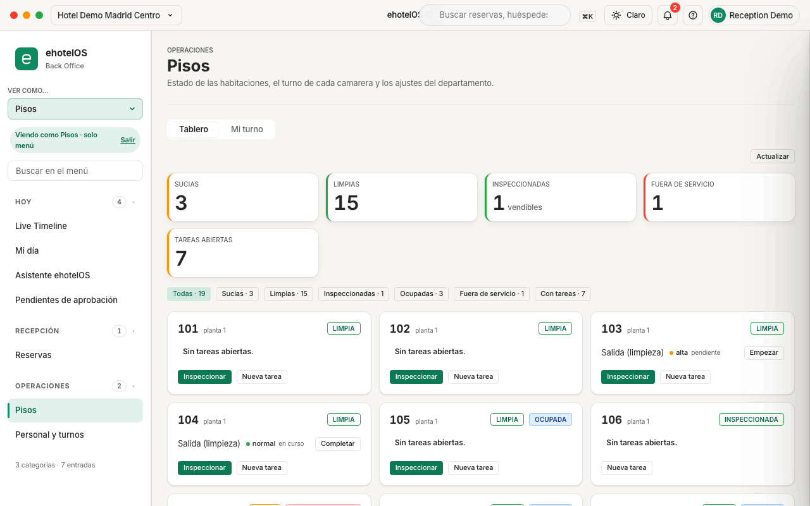

# Ficha · Habitación limpia e inspeccionada · ehotelOS

**Perfil:** Pisos · Gobernanta (plantillas «Pisos», «Gobernanta»). Las dos pueden marcar limpia e inspeccionar; que inspeccione solo la gobernanta es una norma de tu hotel.

## Antes de empezar

- La habitación está «SUCIA» en el tablero (toda salida la deja sucia y crea la tarea «Salida (limpieza)»).
- Sabes si está «OCUPADA»: marcarla limpia no la libera; solo la salida del huésped lo hace.
- Si vas a trabajar desde el móvil o la tablet, usa la pestaña «Mi turno»; desde el ordenador, el «Tablero».

## Pasos

1. Abre **Menú › Operaciones › Pisos** (`/operaciones/pisos`), pestaña «Tablero». Arriba, los indicadores «SUCIAS», «LIMPIAS», «INSPECCIONADAS» (vendibles), «FUERA DE SERVICIO» y «TAREAS ABIERTAS»; debajo, los filtros «Todas · n», «Sucias · n», «Limpias · n», «Inspeccionadas · n», «Ocupadas · n», «Fuera de servicio · n» y «Con tareas · n».
2. Pulsa «Sucias · n» y localiza la tarjeta de la habitación (número, planta, etiqueta «SUCIA» y sus tareas abiertas).
3. Si la tarjeta tiene una tarea («Salida (limpieza) · alta · pendiente»), pulsa «Empezar» al comenzar (pasa a «en curso») y «Completar» al terminar (desaparece de la tarjeta). Los avisos dicen «Tarea empezar.» y «Tarea completar.».
4. Pulsa «Marcar limpia». Aviso «Habitación 305 marcada limpia.»; la etiqueta pasa a «LIMPIA», «SUCIAS» baja y «LIMPIAS» sube.
5. La gobernanta revisa la habitación y pulsa «Inspeccionar» en la misma tarjeta. Aviso «Habitación 206 inspeccionada.»; etiqueta «INSPECCIONADA» y la tarjeta ya no ofrece ni «Marcar limpia» ni «Inspeccionar».
6. Desde el móvil, en **Menú › Operaciones › Pisos › «Mi turno»** (`/operaciones/pisos/mi-turno`) haz lo mismo con los botones grandes de la tarjeta: «Iniciar» (aviso «Hab. 203 → En limpieza», etiqueta «EN LIMPIEZA»), «Limpia» («Hab. 203 → Limpia») e «Inspeccionada» («Hab. 203 → Inspeccionada»). «Reportar» abre el parte de avería para mantenimiento.
7. Comprueba el resultado en **Menú › Recepción › Reservas › «Tablero de habitaciones»** (`/recepcion/reservas/tablero`): la habitación aparece como «Lista».

## Resultado esperado

- La tarjeta pasa de «SUCIA» a «LIMPIA» y a «INSPECCIONADA»; «INSPECCIONADAS (vendibles)» sube en uno y «TAREAS ABIERTAS» baja si has completado la tarea.
- Recepción ve la habitación «Lista» en el Tablero de habitaciones y en el selector «Habitación» del detalle de la reserva («106 · inspected»).
- Una habitación ocupada queda «LIMPIA» + «OCUPADA»: sigue con su huésped hasta el check-out.

## Si algo falla

| Lo que ves | Qué hacer |
|---|---|
| No aparece «Inspeccionar» (o «Inspeccionada» en Mi turno) | La habitación sigue sucia: márcala limpia primero. ehotelOS no deja inspeccionar una habitación sucia. |
| La habitación sigue en Mi turno con «Tarea pendiente · departure_clean» aunque está inspeccionada | «Limpia» e «Inspeccionada» cambian la habitación, no cierran la tarea: pulsa «Completar» en la tarjeta del tablero. |
| Aviso rojo «No se pudo completar la acción.» | Pulsa «Actualizar» y repite: otra persona ha cambiado la habitación antes que tú, o está bloqueada por mantenimiento (ficha [10](10-parte-de-mantenimiento.md)). |

> **En construcción:** el botón «Nueva tarea» de la tarjeta abre un cajón lateral que hoy no se muestra en pantalla (defecto de estilo); crear tareas nuevas desde el tablero no funciona hasta que se corrija. Marcar limpia, inspeccionar, empezar y completar sí funcionan.

## Más detalle

- [40 · Pisos y mantenimiento](../../40-pisos-mantenimiento.md) — parte 1: vocabulario de estados, tareas 1 (tablero), 3 (Mi turno), 4 (la inspección: quién y cuándo) y 6 (Tablero de habitaciones de recepción).
