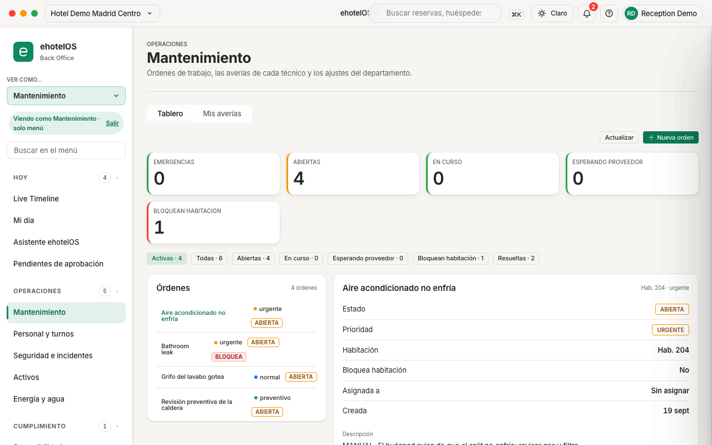

# Ficha · Parte de mantenimiento (orden de trabajo) · ehotelOS

**Perfil:** Mantenimiento · Encargado de mantenimiento (plantillas «Mantenimiento», «Encargado de mantenimiento»). Bloquear una habitación es del encargado o de dirección, no del técnico.

## Antes de empezar

- Qué pasa, en qué habitación (el número tal como existe en el hotel) y con qué prioridad: «emergencia», «urgente», «normal» o «preventivo».
- Si la avería impide vender la habitación, la decisión de bloquearla (fuera de servicio) hasta resolverla.
- Los partes que pisos reporta desde «Mi turno» ya llegan solos al tablero como «Hab. 203: <texto>» con prioridad normal.

## Pasos

1. Abre **Menú › Operaciones › Mantenimiento** (`/operaciones/mantenimiento`), pestaña «Tablero». Indicadores «EMERGENCIAS», «ABIERTAS», «EN CURSO», «ESPERANDO PROVEEDOR» y «BLOQUEAN HABITACIÓN»; filtros «Activas · n», «Todas · n», «Abiertas · n», «En curso · n», «Esperando proveedor · n», «Bloquean habitación · n» y «Resueltas · n».
2. Pulsa «Nueva orden» (arriba a la derecha). En el cajón «Nueva orden de trabajo» («Se crea abierta; asígnala o bloquea la habitación desde su ficha.») rellena «Título*» (ejemplo del campo: «Fuga en el baño»), «Habitación» (opcional, «Ej.: 108»), «Prioridad» («emergencia», «urgente», «normal», «preventivo»), «Descripción» y, si procede, el interruptor «Bloquea la habitación (fuera de servicio)». Pulsa «Crear orden»: aviso «Orden creada.» y la orden entra en la lista como «ABIERTA».
3. En la lista «Órdenes», pulsa la orden para abrir su ficha a la derecha: «Estado», «Prioridad», «Habitación» («Hab. 301»), «Bloquea habitación» («No» / «Sí (fuera de servicio)»), «Asignada a» («Sin asignar»), «Creada» y «Descripción».
4. Para tomarla, elige «En curso» en el desplegable «Estado» («Abierta», «Asignada», «En curso», «Esperando proveedor»; «El cambio se guarda al elegirlo.»). Aviso «Estado actualizado.». Desde el móvil, en la pestaña «Mis averías» (`/operaciones/mantenimiento/mis-averias`) es el botón «Tomar», que además te la asigna («Asignada a <tu nombre>»).
5. Si la habitación no se puede vender mientras la arreglas, pulsa «Bloquear habitación» al pie de la ficha. Aviso «Habitación bloqueada.»; la ficha pasa a «Bloquea habitación: Sí (fuera de servicio)», la fila muestra «BLOQUEA» y «BLOQUEAN HABITACIÓN» sube en uno. Pisos ve la habitación «FUERA DE SERVICIO · NO VENDIBLE» y recepción no puede asignarla.
6. Anota lo que has hecho: en «Mis averías», botón «Nota» (cajón «Añadir nota» → «Guardar nota»; la nota se añade a la descripción con fecha y hora). En el tablero no hay campo de notas.
7. Pulsa «Resolver» en la ficha (o «Resuelta» en «Mis averías»). Aviso «Orden resuelta.»: la orden sale de «Activas» y pasa a «Resueltas · n». Si bloqueaba la habitación, ehotelOS la libera y la deja «SUCIA» para que pisos la repase e inspeccione antes de venderla (ficha [09](09-habitacion-limpia-e-inspeccionada.md)).

## Resultado esperado

- La orden recorre «ABIERTA» → «EN CURSO» → «Resuelta» y los indicadores cambian a la vez («ABIERTAS» baja, «EN CURSO» sube, «Resueltas · n» la recoge al final).
- Mientras bloquea, la habitación está «Fuera de servicio» en el Tablero de habitaciones de recepción y en el tablero de pisos; al resolver, vuelve a «SUCIA» sin «NO VENDIBLE».
- Dirección ve la orden en Mi día › «Operaciones» («Órdenes de trabajo (n)») y recepción como acción «INCIDENCIA» en Mi día.

> **En construcción:** solo falta el selector de técnico: en la ficha del tablero no hay un desplegable de persona y elegir «En curso» en «Estado» (paso 4) no rellena «Asignada a». Sí lo hace el botón «Tomar» de «Mis averías»: pasa la orden a «En curso» y la asigna a quien la toma («Asignada a <tu nombre>»; guía 40, tarea 10). Los cajones «Nueva orden» (paso 2) y «Añadir nota» (paso 6) se han abierto en la demo sin crear nada; cambiar el estado, bloquear y resolver desde la ficha están comprobados en la guía 40 con una orden ficticia de la 305.

## Si algo falla

| Lo que ves | Qué hacer |
|---|---|
| Error de permiso al bloquear («requiere: ai.high_risk.confirm» o «Blocking a room requires manager or maintenance lead confirmation.») | Tu plantilla es «Mantenimiento» (técnico): pide al encargado o a dirección que bloquee la habitación o que cambie tu plantilla. |
| «La orden de trabajo no está vinculada a ninguna habitación.» / la ficha dice «Habitación: —» | Creaste la orden sin número de habitación o con uno que no existe: no se puede bloquear nada. Resuélvela y crea otra con el número correcto. |
| «La orden ya está resuelta.» / «La habitación ya está bloqueada por esta orden.» | Otra persona se adelantó: pulsa «Actualizar». |

## Más detalle

- [40 · Pisos y mantenimiento](../../40-pisos-mantenimiento.md) — parte 2: vocabulario de estados y prioridades, tarea 8 (tablero), tarea 9 (crear, tomar, anotar, bloquear y resolver) y tarea 10 (Mis averías).
