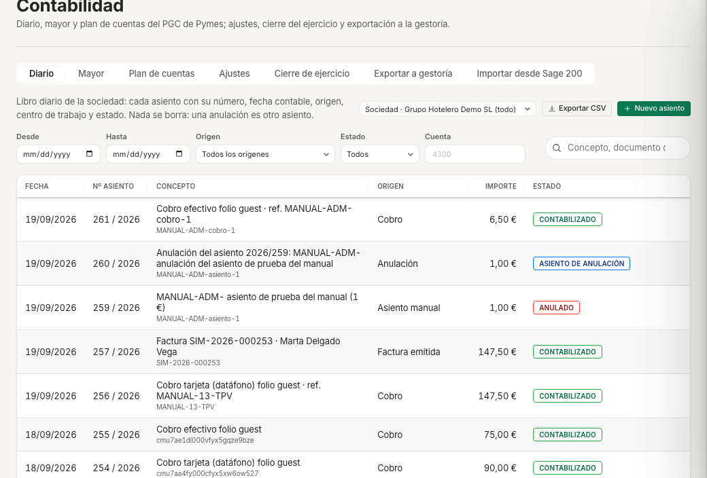

# Ficha · Exportar a la gestoría · ehotelOS

**Perfil:** Contabilidad · Dirección financiera (plantillas «Contabilidad» y «Dirección financiera»; menú «Finanzas»; en la demo, «Ver como…» = «Finanzas»). «Administración de hotel» no ve «Contabilidad».

## Antes de empezar

- Qué formato importa la gestoría: el «CSV universal de asientos» lo lee cualquier programa contable; el «Diario compatible ContaPlus / Sage 50» hay que validarlo con ella antes de la primera importación real; el enlace A3 no está disponible.
- El periodo (mes o trimestre) con sus asientos contabilizados: los borradores no salen y las parejas de anulación salen enteras.
- La exportación se lleva por sociedad (un solo NIF para los dos centros); solo puedes acotar los asientos a un centro.

> **Nota:** en el hotel de demostración el ejercicio A10 del plan sí genera el fichero: la exportación no toca el diario, solo queda en el historial.

## Pasos

1. Abre **Menú › Finanzas › Contabilidad** (`/finanzas/contabilidad`) y la pestaña «Exportar a gestoría» (`/finanzas/contabilidad/exportar-gestoria`): «Asientos y libros de IVA de la sociedad en el formato que importa la gestoría; cada fichero queda en el historial para descargarlo de nuevo.». El «Ámbito» está bloqueado en «Sociedad · Grupo Hotelero Demo SL (todo)».
2. En «Nueva exportación» elige el «Formato*»:
   - «CSV universal de asientos» (por defecto): «Una fila por línea de asiento; separador «;», UTF-8 con BOM, fecha DD/MM/AAAA, coma decimal.», etiqueta «FORMATO ESTABLE · 10 columnas: fecha · asiento · cuenta · concepto · debe · haber · documento · nif · base · iva».
   - «Libros registro de IVA (CSV)»: «Facturas emitidas, recibidas y bienes de inversión del periodo (RD 1619/2012), una fila por documento y tipo impositivo.», 18 columnas.
   - «Diario compatible ContaPlus / Sage 50»: las 11 columnas del diario de ContaPlus (ASIEN, FECHA, SUBCTA…); aparece «Longitud de subcuenta» (8 por defecto: las cuentas se rellenan con ceros) y el aviso «Diseño de registro por validar · Antes de la primera importación real, envía un fichero de prueba a la gestoría y confirma la longitud de subcuenta, la codificación y el separador decimal.».
   - «A3 (enlace contable) (no disponible)» sale apagado.
3. Elige el «Centro de trabajo»: «Toda la sociedad» (por defecto), «Hotel Demo Madrid Centro (AMC) · Hotel» o «Hotel Demo Tenerife Sur (ATS) · Hotel». «Sin centro se exportan los asientos de toda la sociedad; con centro, solo los suyos (los libros de IVA siguen siendo de la sociedad).».
4. Ajusta «Desde*» y «Hasta*»: vienen rellenos con el trimestre anterior; pon el mes o el trimestre que pide la gestoría.
5. Pulsa «Generar y descargar» (también desde ⌘K › «Esta pantalla» › «Generar exportación para la gestoría»). El navegador descarga el fichero y aparece «Exportación generada: <fichero> (n filas).».
6. Comprueba el «Historial»: cada fichero queda con «Generada», «Formato» (y su nombre), «Periodo», «Filas», «Tamaño» y «Validación» («Formato estable» o «Validar con la gestoría») para descargarlo de nuevo. En la demo dice «Aún no hay exportaciones».

## Resultado esperado

- Un fichero descargado con las filas del periodo y del centro elegidos, y una fila nueva en «Historial»; puedes repetir la exportación las veces que haga falta (el diario no cambia).
- El fichero cuadra con «Diario» filtrado por las mismas fechas y el mismo ámbito: los asientos anulados y sus reversos van ambos; los borradores no.

> **En construcción:** en el recorrido de esta ficha no se ha pulsado «Generar y descargar» (escribe en el historial); el aviso y la fila del historial están descritos según la pantalla y la guía de administración. El formato A3 sigue sin implementarse.

## Si algo falla

| Lo que ves | Qué hacer |
|---|---|
| «Ese formato de exportación aún no está disponible: usa el CSV universal de asientos.» | Has pedido el enlace A3: genera el «CSV universal de asientos» y que la gestoría lo importe con su asistente. |
| «No se pudo generar la exportación.» · «No se pudo descargar el fichero.» | Pulsa de nuevo; si persiste, avisa a sistemas (el servidor no responde o el navegador bloquea la descarga). |
| El fichero llega con 0 filas | En ese periodo y centro no hay asientos contabilizados: comprueba «Diario» con las mismas fechas y el mismo «Ámbito». |
| La gestoría no consigue importar el «Diario compatible ContaPlus / Sage 50» | Revisa con ella la «Longitud de subcuenta», la codificación y el separador decimal; mientras tanto, entrega el CSV universal. |
| «Tu perfil solo ve las finanzas de sus centros: elige un centro en «Ámbito» o pide a dirección el permiso «Finanzas de toda la sociedad».» | Tu plantilla no ve toda la sociedad: pide a sistemas «Contabilidad» o «Dirección financiera». |

## Más detalle

- [20 · Administración](../../20-administracion.md#93-exportar-a-la-gestoría) — capítulo 9.3 «Exportar a la gestoría».
- [Plan de formación](../plan-de-formacion.md) — sesión A-3 y ejercicio A10. La exportación de nóminas es otra pantalla: ficha [15 · Nómina del mes](15-nomina-del-mes.md).
